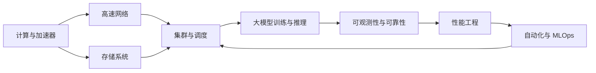

# AI Infra 技术模块学习地图

这套博客不按“岗位职责”拆文章，也不把所有内容硬套进
“GPU 计算 → 显存 → NVLink → 网卡 → 存储 → 调度”六个词中。

更合适的方式是先分别掌握独立技术栈，再通过综合实战理解它们如何协同：



文章采用三层结构：

1. **基础模块**：学习一项技术本身的概念、原理、部署、监控和排障。
2. **模块内实战**：在同一个技术栈内完成可验证的实验。
3. **跨模块串联**：追踪一个请求、模型或训练任务经过的完整路径。

这样学习完以后，不只是记住一条链路，而是能根据场景自由组合 Ceph、NFS、
本地 NVMe、RoCE、InfiniBand、Kubernetes、Volcano、vLLM 等不同方案。

---

## 1. 计算与加速器模块

### 学习目标

- 理解 CPU、GPU、NPU 的分工。
- 理解 SM、Tensor Core、HBM、PCIe、NUMA、NVLink、NVSwitch。
- 能解释模型权重、激活值和 KV Cache 为什么占用显存。
- 能从硬件拓扑判断进程、GPU、网卡和 CPU 的合理绑定关系。

### 已有内容

- [GPU 基础知识：从计算核心到显存](../foundations/compute/gpu/01-GPU%20基础知识：从计算核心到显存.md)
- [HBM 显存原理](../foundations/compute/gpu/02-HBM显存原理：容量、带宽与访问效率.md)
- [GPU 服务器硬件拓扑与 NUMA](../foundations/compute/gpu/03-GPU%20服务器硬件拓扑与%20NUMA.md)
- [CPU 与 GPU 之间的数据搬运](../foundations/compute/gpu/04-CPU与GPU之间的数据搬运.md)
- [NVLink 与 NVSwitch 原理](../foundations/compute/gpu/05-NVLink与NVSwitch原理.md)
- [PCIe 基本架构](../foundations/compute/pcie/PCIe总线学习（一）基本架构.md)

### 还需补充

| 优先级 | 文章 | 验收结果 |
| --- | --- | --- |
| P1 | CUDA 执行模型与 Kernel 性能基础 | 能解释 warp、occupancy、memory coalescing |
| P1 | GPU Roofline 模型 | 能判断算力受限还是显存带宽受限 |
| P1 | NUMA、PCIe 与中断亲和性实验 | 能完成 GPU/NIC/CPU 拓扑检查 |

---

## 2. 网络模块

网络模块不是只介绍“网卡”，而是从 Linux 协议栈一路学习到 AI 集群高速互联。

### 子技术栈

```text
Linux 网络基础
  ├─ Ethernet / ARP / VLAN / MTU
  ├─ IPv4 / 路由 / ECMP
  ├─ TCP / UDP / Socket / 拥塞控制
  ├─ Namespace / veth / bridge / CNI
  ├─ 数据中心 Leaf-Spine
  ├─ RDMA Verbs
  ├─ InfiniBand
  ├─ RoCEv2 / PFC / ECN
  └─ NCCL / GPUDirect RDMA
```

### 已有内容

- [传统网络从零到精通学习路线](../foundations/networking/traditional/00-传统网络从零到精通学习路线.md)
- [Linux 高性能网络详解](../foundations/networking/linux-high-performance/linux高性能网络详解读书笔记（一）.md)
- [RDMA 技术概述](../foundations/networking/rdma/RDMA技术详解（一）：RDMA概述.md)
- [InfiniBand、RoCE 与 GPU 集群网络](../foundations/networking/ai-cluster/01-InfiniBand、RoCE%20与%20GPU%20集群网络.md)
- [GPUDirect RDMA 原理与实践](../foundations/networking/ai-cluster/02-GPUDirect-RDMA原理与实践.md)
- [NCCL 通信原理与常见问题](../ai-systems/training/distributed/05-NCCL%20通信原理与常见问题.md)
- [NCCL Timeout 排查流程](../platform/gpu-cluster/troubleshooting/07-NCCL%20Timeout%20排查流程.md)

### 还需补充

| 优先级 | 文章 | 验收结果 |
| --- | --- | --- |
| P1 | Linux 收发包路径与队列 | 能从应用追到 Socket、qdisc、NIC ring |
| P1 | RoCE 无损网络配置与验证 | 能验证 PFC、ECN、拥塞和丢包 |
| P1 | NCCL 拓扑文件与算法选择 | 能分析 ring/tree、channel 和跨机路径 |
| P1 | AI 网络指标、压测与故障注入 | 能使用 iperf3、ib_write_bw、nccl-tests |

---

## 3. 存储模块

存储模块下面可以同时学习 Ceph、NFS、对象存储和本地 NVMe。
重点不是“哪一种最好”，而是理解每种技术的语义、数据路径和适用边界。

### 子技术栈

```text
存储基础
  ├─ 块、文件、对象三种接口
  ├─ 页缓存、Direct I/O、mmap、AIO/io_uring
  ├─ 本地盘、RAID、LVM、NVMe
  ├─ NFS
  │   ├─ RPC、挂载、缓存与一致性
  │   ├─ 高可用与性能调优
  │   └─ Kubernetes NFS CSI
  ├─ Ceph
  │   ├─ RADOS、PG、CRUSH
  │   ├─ RBD、CephFS、RGW
  │   └─ ceph-csi、运维与排障
  ├─ S3 兼容对象存储与模型仓库
  ├─ 并行文件系统
  └─ 本地缓存、模型分发与冷启动
```

### 已有内容

- [Ceph 从零基础到生产运维学习路线](../foundations/storage/ceph/00-Ceph学习路线.md)
- [NFS 在 AI 集群中的使用与性能分析](../foundations/storage/nfs/01-NFS在AI集群中的使用与性能分析.md)
- [Ceph 三种接口在 AI 集群中的选型](../foundations/storage/ceph/PartIX-AI场景/30-AI集群中的Ceph接口选型.md)
- [对象存储与模型仓库设计](../foundations/storage/ai-workloads/04-对象存储与模型仓库设计.md)
- [本地 NVMe 与 Local PV 实践](../foundations/storage/ai-workloads/03-本地NVMe与Local-PV实践.md)
- [Kubernetes CSI 挂载链路与故障排查](../foundations/storage/ai-workloads/05-Kubernetes-CSI挂载链路与故障排查.md)
- [模型文件从存储加载到 GPU 显存的完整路径](../projects/end-to-end/02-模型文件从存储加载到GPU显存的完整路径.md)

### 还需补充

| 优先级 | 文章 | 验收结果 |
| --- | --- | --- |
| P1 | Linux I/O 栈：VFS、页缓存与块层 | 能解释一次 read 如何到达磁盘 |
| P1 | NFS 从零部署、HA、监控与故障排查系列 | 能独立部署并分析 stale handle、延迟和吞吐 |
| P1 | S3 Multipart、Range GET 与模型下载优化 | 能设计并行下载与完整性校验 |
| P2 | Lustre / BeeGFS / JuiceFS 技术对比 | 能按训练、推理、Checkpoint 场景选型 |

---

## 4. Kubernetes 与调度模块

调度模块负责回答两个问题：

1. 工作负载为什么被放到这台机器？
2. GPU、CPU、网卡、存储和拓扑条件如何同时满足？

### 已有内容

- [Kubernetes 学习路线](../platform/kubernetes/00-Kubernetes学习路线.md)
- [Kubernetes 如何识别和管理 GPU](../platform/gpu-cluster/device-runtime/01-Kubernetes%20如何识别和管理%20GPU.md)
- [GPU 节点标签与调度策略](../platform/gpu-cluster/scheduling-sharing/01-Kubernetes%20GPU%20节点标签与调度策略.md)
- [Volcano GPU 调度器入门](../platform/gpu-cluster/scheduling-sharing/04-Volcano%20GPU%20调度器入门.md)
- [Gang Scheduling](../platform/gpu-cluster/scheduling-sharing/06-Gang%20Scheduling%20在分布式训练中的作用.md)
- [GPU 集群拓扑感知调度](../platform/gpu-cluster/scheduling-sharing/12-GPU%20集群拓扑感知调度.md)
- [GPU、网卡、存储联合拓扑调度](../projects/end-to-end/05-GPU网卡存储联合拓扑调度.md)
- [Kubernetes DRA 概念与核心 API](../platform/gpu-cluster/dra/01-Kubernetes%20DRA%20概念与核心%20API（v1.35+）.md)

### 还需补充

| 优先级 | 文章 | 验收结果 |
| --- | --- | --- |
| P1 | Kueue 队列、配额与准入控制 | 能管理多租户训练和推理任务 |
| P1 | 队列感知推理自动扩缩容 | 能根据 waiting、TTFT 而非仅 GPU 利用率扩容 |
| P1 | 多集群算力调度与故障域 | 能解释配额、数据位置和跨集群流量约束 |

---

## 5. 大模型训练与推理模块

这一模块学习请求进入模型服务以后，框架如何调度 GPU、显存和通信资源。

### 学习顺序

```text
Transformer 推理基础
  → Tokenization
  → Prefill / Decode
  → KV Cache
  → PagedAttention
  → Continuous Batching
  → TP / PP / DP / EP
  → vLLM / Triton / KServe
  → Gateway / 路由 / 限流
  → 扩缩容 / 发布 / 回滚
```

### 已有内容

- [vLLM 整体代码架构](../ai-systems/inference/vllm/vLLM学习笔记（一）整体代码架构.md)
- [vLLM 调度器策略](../ai-systems/inference/vllm/vLLM学习笔记（三）vLLM调度器策略.md)
- [vLLM Tensor Parallel 多卡部署](../ai-systems/inference/serving/03-vLLM%20Tensor%20Parallel%20多卡部署.md)
- [大模型推理服务性能指标设计](../ai-systems/inference/serving/06-大模型推理服务性能指标设计.md)
- [大模型冷启动优化](../foundations/storage/ai-workloads/07-大模型冷启动优化.md)

### 本批已补与后续内容

| 文章 | 技术重点 |
| --- | --- |
| [推理请求从 HTTP 到首个 Token 的完整生命周期](../ai-systems/inference/vllm/07-推理请求从HTTP到首个Token的完整生命周期.md) | API Server、Tokenizer、Scheduler、Worker、流式返回 |
| [Prefill、Decode 与 KV Cache 资源模型](../ai-systems/inference/vllm/08-Prefill-Decode与KV-Cache资源模型.md) | 算力、带宽、显存和延迟之间的关系 |
| [Continuous Batching 与 Chunked Prefill](../ai-systems/inference/vllm/09-Continuous-Batching与Chunked-Prefill.md) | 调度预算、吞吐与尾延迟 |
| [TP、PP、DP、EP 与 MoE 推理并行策略](../ai-systems/inference/vllm/10-TP-PP-DP-EP与MoE推理并行策略.md) | 通信量、拓扑和故障域 |
| [推理网关、准入控制与过载保护](../ai-systems/inference/vllm/11-推理网关准入控制与过载保护.md) | 排队、Token 配额、超时、重试、路由和降级 |
| KServe、vLLM 与 Triton 生产架构 | 控制面、数据面、扩缩容和发布 |

---

## 6. 可观测性与可靠性模块

可靠性文章放在“可观测性”模块中，因为 SLO、错误预算和事件响应都必须建立在
指标、日志和 Trace 的证据之上。

### 已有内容

- [可观测性本章导读](../platform/kubernetes/K8s学习-PartII-可观测性/00-本章导读.md)
- [OpenTelemetry](../platform/kubernetes/K8s学习-PartII-可观测性/08-OpenTelemetry.md)
- [DCGM Exporter GPU 指标](../engineering/observability/gpu/01-DCGM%20Exporter%20GPU%20监控指标详解.md)
- [Prometheus GPU 告警策略](../engineering/observability/gpu/02-Prometheus%20GPU%20告警策略设计.md)
- [业务指标与 GPU 指标关联分析](../engineering/observability/gpu/05-大模型业务指标与%20GPU%20指标关联分析.md)

### 本批已补

| 文章 | 技术重点 |
| --- | --- |
| [LLM 服务 SLI、SLO 与 SLA 工程化](../engineering/reliability/01-LLM服务SLI-SLO-SLA工程化.md) | good/valid events、TTFT、TPOT、可用性边界 |
| [Error Budget 与多窗口燃烧率告警](../engineering/reliability/02-Error-Budget与多窗口燃烧率告警.md) | PromQL、recording rules、低流量处理 |
| [AI 平台事件响应、证据链与 RCA](../engineering/reliability/03-AI平台事件响应证据链与RCA.md) | 请求到 GPU/NIC/存储的关联分析 |
| [Toil 量化与安全自动修复](../engineering/reliability/04-Toil量化与安全自动修复.md) | 幂等、限速、审批、验证和回滚 |

---

## 7. 性能工程模块

性能工程不是“看 GPU 利用率”，而是建立可重复的测量、定位和验证过程。

### 本批已补

| 文章 | 技术重点 |
| --- | --- |
| [Linux perf、strace 与火焰图](../engineering/performance/01-Linux-perf-strace与火焰图.md) | CPU、系统调用、锁竞争、上下文切换 |
| [eBPF 与 bpftrace 网络和 I/O 分析](../engineering/performance/02-eBPF与bpftrace网络和IO分析.md) | 内核路径、延迟分布和低开销观测 |
| [Nsight Systems 端到端时间线分析](../engineering/performance/03-Nsight-Systems端到端时间线分析.md) | CPU、CUDA、NCCL、I/O 的时间关联 |
| [Nsight Compute CUDA Kernel 分析](../engineering/performance/04-Nsight-Compute-CUDA-Kernel分析.md) | Occupancy、Memory Throughput、Warp Stall |
| [PyTorch Profiler 训练与推理分析](../engineering/performance/05-PyTorch-Profiler训练与推理分析.md) | Operator、CUDA Kernel、Memory Timeline |
| [LLM 压测、容量曲线与成本模型](../engineering/performance/06-LLM压测容量曲线与成本模型.md) | TTFT/TPOT/QPS/token/s/并发/单请求成本 |

---

## 8. 自动化工程与 MLOps

这两部分是相邻但独立的技术模块：

- **自动化工程**放在工程栏目，学习如何构建 CLI、API Client、Go 常驻服务和 Kubernetes Controller。
- **MLOps**放在云原生 AI 栏目，学习模型实验、制品、血缘、评测和发布生命周期。

### 自动化工程模块

| 文章 | 技术重点 |
| --- | --- |
| [自动化工程学习路线](../engineering/automation/00-自动化工程学习路线.md) | 脚本、CLI、服务和 Controller 的技术边界 |
| [Python CLI 与可测试命令行工程](../engineering/automation/01-Python-CLI与可测试命令行工程.md) | 配置、退出码、依赖注入、超时、测试与安全 |
| [Python 调用 Kubernetes 与 Prometheus API](../engineering/automation/02-Python调用Kubernetes与Prometheus-API.md) | 分页、List/Watch、ResourceVersion、PromQL 和证据关联 |
| [Go Context、并发与可靠 HTTP 客户端](../engineering/automation/03-Go-Context并发与可靠HTTP客户端.md) | 取消传播、有界并发、连接池、重试和优雅退出 |
| [client-go Informer、Workqueue 与 Controller](../engineering/automation/04-client-go-Informer-Workqueue与Controller.md) | 缓存、队列、幂等 Reconcile、限速和故障恢复 |
| [AI Infra 诊断工具综合项目](../engineering/automation/05-AI-Infra诊断工具综合项目.md) | Kubernetes、GPU、网络、存储和指标的只读证据工具 |

### MLOps 模块

| 文章 | 技术重点 |
| --- | --- |
| [MLOps 学习路线](../ai-systems/mlops/00-MLOps学习路线.md) | 可复现、可追溯、可评测和可回滚的生命周期 |
| [MLflow 实验追踪、模型注册与制品血缘](../ai-systems/mlops/01-MLflow实验追踪模型注册与制品血缘.md) | Run、Backend Store、Artifact Store、Registry、Alias 和不可变坐标 |
| [模型评测门禁与版本晋级](../ai-systems/mlops/02-模型评测门禁与版本晋级.md) | 质量、安全、性能、兼容性、三值门禁和晋级状态机 |
| [Pipeline、GitOps、Canary、Shadow 与回滚](../ai-systems/mlops/03-Pipeline-GitOps-Canary-Shadow与回滚.md) | Argo Workflows、Argo CD、渐进式流量、在线分析和完整发布单元回滚 |

---

## 9. 跨模块串联文章

基础模块学完后，用下面的文章把知识串起来：

- [一个 GPU Pod 从提交到开始计算经历了什么](../projects/end-to-end/01-一个GPU-Pod从提交到开始计算经历了什么.md)
- [模型文件从存储加载到 GPU 显存的完整路径](../projects/end-to-end/02-模型文件从存储加载到GPU显存的完整路径.md)
- [单机八卡训练的完整路径](../projects/end-to-end/03-单机八卡训练的完整路径.md)
- [多机训练的完整路径](../projects/end-to-end/04-多机训练的完整路径.md)
- [GPU、网卡、存储联合拓扑调度](../projects/end-to-end/05-GPU网卡存储联合拓扑调度.md)

后续还需补充三篇综合实战：

1. **一次 LLM 请求的全链路**：网关 → 调度 → 模型实例 → GPU → 流式返回。
2. **一次模型冷启动的全链路**：对象存储/Ceph/NFS → 节点缓存 → 页缓存 → HBM。
3. **一次性能下降的联合排查**：SLO 告警 → Trace → 排队 → GPU/NIC/存储瓶颈。

---

## 10. 面向岗位学习时如何确定优先级

如果目标是 AI Infra SRE，建议按下面顺序补齐：

| 阶段 | 模块 | 原因 |
| --- | --- | --- |
| P0-1 | 可观测性与可靠性 | 先能定义服务质量、告警并处理事故 |
| P0-2 | 大模型推理 | 理解所运维服务的执行链路与瓶颈 |
| P0-3 | 性能工程 | 能用工具证明瓶颈，而不是凭经验猜 |
| P0-4 | 自动化与 MLOps | 把部署、诊断、发布和修复工程化 |
| P1 | 网络、存储、调度进阶 | 在已有基础上补充生产深度 |

模块优先级只决定学习先后，不改变博客的技术分类。比如错误预算文章归
“可观测性与可靠性”，不会因为面试岗位是 AI Infra SRE 就单独搬到岗位专栏。

## 11. 每个模块的完成标准

一个模块不能只读完概念文章，至少要留下四类成果：

1. 一张自己能讲清楚的架构或数据路径图。
2. 一套可复现的部署或实验配置。
3. 一组监控指标、压测结果与验收阈值。
4. 一份故障注入、定位证据和修复记录。

做到这四点，面试时才能把“了解某技术”变成“能够部署、分析、使用和排障”。
