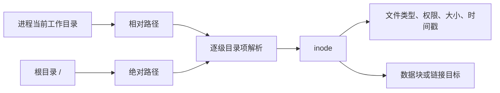

# 文件与目录命令导读

文件命令操作的不是一个抽象的“文件名”，而是路径解析、目录项、inode、链接、权限和文件系统状态。开始背参数前，先建立对象关系：



## 1. 六个容易混淆的概念

### 1.1 当前工作目录

每个进程都有自己的当前工作目录。相对路径从这里开始解析；`pwd` 用于显示它。

### 1.2 路径不是文件本身

路径是找到对象的过程。重命名或移动同一文件系统中的文件，通常改变的是目录项，不是复制全部数据。

### 1.3 `.`、`..` 与隐藏文件

- `.`：当前目录。
- `..`：父目录。
- 名称以 `.` 开头的普通目录项默认被很多工具隐藏，但它们不是特殊文件类型。

### 1.4 inode 与目录项

目录项把文件名映射到 inode。硬链接是多个目录项指向同一个 inode；符号链接保存另一条路径。

### 1.5 三种主要时间戳

- `atime`：最后访问时间。
- `mtime`：文件内容最后修改时间。
- `ctime`：inode 状态最后变化时间，不能用 `touch` 任意设置。

文件系统还可能支持 birth time，但并非所有文件系统和工具都提供。

### 1.6 权限与 umask

创建文件或目录时，应用请求的模式还会受到 `umask`、默认 ACL、SELinux/SMACK 和父目录属性影响。看到最终权限时不能只看命令参数。

## 2. 已完成命令的关系

| 命令 | 安全级别 | 主要作用 |
|---|---|---|
| `pwd` | `[R]` | 显示进程当前工作目录 |
| `ls` | `[R]` | 列出目录项和文件元数据 |
| `mkdir` | `[W]` | 创建目录 |
| `rmdir` | `[D]` | 删除空目录 |
| `touch` | `[W]` | 创建空文件或修改时间戳 |
| `mktemp` | `[W]` | 无竞态地创建临时对象 |
| `cd` | `[W]` | 修改当前 Shell 的工作目录 |
| `cp` | `[W]/[D]` | 复制内容、目录树、链接和属性 |
| `mv` | `[W]/[D]` | 重命名或跨文件系统复制后删除 |
| `rm` | `[D]` | 删除文件或目录树 |
| `ln` | `[W]/[D]` | 创建硬链接、符号链接或替换已有目标 |
| `stat` | `[R]` | 查询 inode、时间、设备与文件系统状态 |
| `readlink` | `[R]` | 读取符号链接保存的目标字符串或规范化路径 |
| `realpath` | `[R]` | 按存在性与链接策略规范化路径 |
| `basename` | `[R]` | 提取路径末段并可删除精确后缀 |
| `dirname` | `[R]` | 提取路径的目录部分 |
| `find` | `[R]/[W]/[D]` | 遍历目录树、计算表达式并输出、执行或删除 |
| `install` | `[W]/[D]` | 复制文件、创建目录并设置部署属性 |
| `unlink` | `[D]` | 删除一个非目录路径的目录项 |
| `file` | `[R]` | 根据元数据、magic 和内容启发式识别文件类型 |

## 3. 安全实验目录

不要直接在业务目录实验创建和删除命令。使用 `mktemp` 建立隔离目录：

```bash
lab_dir=$(mktemp -d) || exit 1
printf '实验目录：%s\n' "$lab_dir"
cd -- "$lab_dir" || exit 1
```

实验完成后先确认解析结果，再删除：

```bash
realpath -- "$lab_dir"
find "$lab_dir" -maxdepth 2 -print
rm -rf -- "$lab_dir"
```

最后一条是破坏性命令。只能在已经确认是本次临时目录、变量非空且路径精确时执行；`rm` 的完整安全模型会在后续独立文章说明。

## 4. 推荐顺序

1. 用 `pwd` 理解逻辑路径与物理路径。
2. 用 `ls` 理解目录项、隐藏项、排序与长格式元数据。
3. 用 `mkdir` 学会递归创建和权限控制。
4. 用 `rmdir` 理解“只删除空目录”的安全边界。
5. 用 `touch` 理解 atime、mtime、ctime。
6. 用 `mktemp` 理解临时文件竞态和安全脚本。
7. 用 `cd` 理解工作目录属于进程状态。
8. 用 `cp` 区分普通副本、Reflink、硬链接和属性复制。
9. 用 `mv` 区分原子 rename 与跨文件系统复制删除。
10. 用 `rm` 建立删除前目标、挂载和恢复检查。
11. 用 `ln` 理解 inode、硬链接计数和链接路径。
12. 用 `stat` 对前面所有操作进行精确验证。
13. 用 `readlink` 区分链接保存的文本与最终解析对象。
14. 用 `realpath` 理解存在性、逻辑/物理解析和路径安全边界。
15. 用 `basename` 与 `dirname` 掌握纯字符串路径拆分及任意名称协议。
16. 用 `find` 建立目录遍历、布尔表达式、NUL 输出和动作竞态模型。
17. 用 `install` 理解构建部署中的复制、mode、owner、上下文与非事务边界。
18. 用 `unlink` 从目录项和打开 inode 角度重新理解删除。
19. 用 `file` 理解文件格式识别、MIME、magic 数据库和不可信输入风险。

## 5. 本章验收

- 能解释相对路径从哪里开始解析。
- 能区分目录项、inode、硬链接与符号链接。
- 能解释 atime、mtime、ctime 的区别。
- 能说明 `umask` 为什么会改变创建结果。
- 能在隔离目录中完成实验并安全清理。
- 能安全遍历任意文件名，并解释 `find` 表达式的优先级和副作用。
- 能区分路径字符串、路径解析结果、文件类型推断与可信安全校验。
