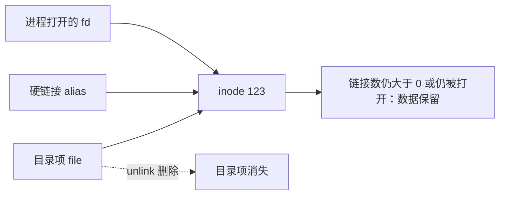

# unlink 命令详解：删除单个目录项

`unlink` 调用删除链接的语义，一次只处理一个名称。它删除的是目录项对 inode 的引用，不是“立刻擦除磁盘数据”。当硬链接计数归零且没有进程继续打开该 inode 时，文件系统才可以回收数据块。

## 1. 命令档案

| 项目 | 内容 |
|---|---|
| 实现 | GNU coreutils |
| 文档基线 | GNU coreutils 9.11 |
| 安全级别 | `[D]`，破坏性删除 |
| 主要对象 | 一个非目录路径对应的目录项 |

```bash
type -a unlink
env unlink --version
env unlink --help
```

## 2. 完整语法与全部参数

```text
unlink FILE
```

GNU `unlink` 恰好接受一个操作数，且永远不删除目录。全部选项只有：

| 参数 | 作用 |
|---|---|
| `--help` | 显示帮助并退出 |
| `--version` | 显示版本并退出 |

它没有 `-f`、`-i`、`-r`、`--preserve-root` 或 `--` 的通用批量语义。要删除恰好名为 `--help` 的文件，使用带路径分量的名称：

```bash
unlink ./--help
```

## 3. 删除发生了什么



```bash
printf 'data\n' > original
ln original alias
stat -c '%d:%i links=%h' original alias
unlink original
cat alias
```

删除 `original` 后，`alias` 仍指向同一个 inode。

## 4. 符号链接行为

```bash
ln -s target link
unlink link
```

删除的是 `link` 本身，不会跟随并删除 `target`。但脚本在检查到删除之间仍可能遭遇目录项被替换；对于普通 `unlink`，最终删除的是调用时该路径名对应的目录项。

## 5. 已删除但空间未释放

进程打开文件后，即使名称被删除，文件描述符仍引用 inode：

```bash
lsof +L1
```

日志文件“删了但磁盘不降”的典型排查：

1. 用 `df` 判断文件系统已用空间。
2. 用 `du` 统计仍可遍历的目录项。
3. 若 `df` 高而 `du` 低，检查 `lsof +L1`。
4. 让进程正常 reopen/rotate 或重启对应服务，避免粗暴终止错误进程。

不要尝试通过 `/proc/PID/fd/N` 随意截断生产文件，先确认业务、日志轮转和恢复策略。

## 6. 权限与保护

删除文件通常要求对父目录有写和搜索权限，不一定要求对文件本身有写权限。还可能受以下因素阻止：

- sticky bit：如 `/tmp` 中通常只能删除自己拥有的条目。
- immutable/append-only 属性。
- SELinux/AppArmor 等安全策略。
- 只读挂载和文件系统错误状态。
- NFS 服务端权限、root squash、缓存和网络故障。

```bash
namei -l -- /path/to/file
lsattr -- /path/to/file
findmnt -T -- /path/to/file
```

这些是后续模块的命令；此处先建立“删除权限主要取决于父目录”的模型。

## 7. `unlink` 与 `rm`

| 能力 | `unlink` | `rm` |
|---|---|---|
| 一次多个文件 | 否 | 是 |
| 递归目录 | 否 | `-r/-R` |
| 交互确认 | 否 | `-i/-I` |
| 强制忽略不存在 | 否 | `-f` |
| 根目录保护 | 不涉及递归目录 | `--preserve-root` |
| 适合表达“精确删除一个非目录名称” | 是 | 是，但功能更多 |

更少参数不代表自动安全。`unlink "$var"` 若变量指向错误路径，仍会精确删除错误对象。

## 8. 安全执行模板

```bash
target=/srv/app/cache/one.tmp
test -n "$target" || exit 1
case $target in
  /srv/app/cache/*) ;;
  *) printf 'refuse: %q\n' "$target" >&2; exit 1 ;;
esac
stat -- "$target" || exit 1
unlink "$target"
```

这适用于受控目录的低风险脚本，但 `stat` 与 `unlink` 之间仍有 TOCTOU。安全敏感程序应使用目录文件描述符和 `unlinkat(2)` 等接口建立更强约束。

## 9. 退出状态与排查

| 状态 | 含义 |
|---|---|
| `0` | 目录项成功删除 |
| 非 `0` | 参数错误或删除失败 |

常见错误：目标不存在、目标是目录、父目录无权限、只读文件系统、sticky bit、immutable 属性、路径分量不是目录。

删除成功不保证磁盘介质立即持久化，也不表示数据不可恢复；持久性由文件系统日志、缓存、存储设备和同步策略共同决定。

## 10. 动手实验

1. 创建两个硬链接，逐次 unlink 并观察链接计数。
2. 打开文件描述符后 unlink，通过 `/proc/$$/fd` 继续读取。
3. 删除符号链接，证明目标保留。
4. 尝试删除目录，记录退出码。
5. 在 sticky 目录中用不同用户验证删除规则。
6. 比较 `df`、`du` 和 `lsof +L1` 对打开后已删除文件的观察。

## 11. 掌握标准

- 能说明 unlink 删除的是目录项而不是立即擦盘。
- 能解释硬链接与打开文件为什么延迟空间回收。
- 能列出 GNU `unlink` 的全部选项和单操作数限制。
- 能解释删除权限与父目录、sticky bit 的关系。
- 能定位“文件已删但空间未释放”。

## 12. 官方参考 {/* #官方参考 */}

- [GNU coreutils 9.11：unlink invocation](https://www.gnu.org/software/coreutils/manual/html_node/unlink-invocation.html)
- [Linux unlink(2)](https://man7.org/linux/man-pages/man2/unlink.2.html)
- [Linux unlinkat(2)](https://man7.org/linux/man-pages/man2/unlinkat.2.html)

上一篇：[`install` 命令详解](./18-install命令详解.md)

下一篇：[`file` 命令详解](./20-file命令详解.md)
