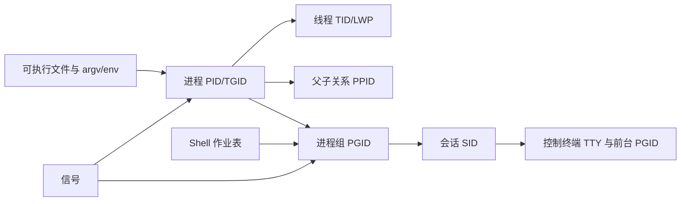

# 进程、线程、作业控制与信号命令导读

Linux 中“程序”是磁盘上的可执行内容，“进程”是带地址空间和资源的运行实例，“线程”是内核调度实体。Shell 的“作业”则是一条 pipeline 对应的 process group；它不是 systemd unit、Kubernetes Job 或调度平台任务。



## 1. 必须先分清的标识

| 标识 | 含义 | 常用证据 |
|---|---|---|
| PID/TGID | 用户空间通常所说的进程 ID/线程组 ID | `ps -o pid,tgid`、`/proc/PID` |
| TID/LWP | 单个内核线程 ID | `ps -L`、`/proc/PID/task/TID` |
| PPID | 创建/收养当前进程的父进程 | `ps -o ppid`、`pstree` |
| PGID | 同一作业/pipeline 的进程组 | `ps -o pgid,tpgid` |
| SID | 会话 ID，连接若干 process groups | `ps -o sid` |
| TTY | 控制终端 | `ps -o tty`、`tty` |
| jobspec | 当前交互 Shell 私有的 `%1/%+/%-` | `jobs -l` |

PID 可复用；“先查 PID，再过一段时间发送信号”存在命中另一个新进程的风险。现代工具可能利用 pidfd 缩小竞态，但脚本仍应优先由服务管理器、父进程或稳定 cgroup 控制生命周期。

## 2. 进程状态不是健康状态

| 状态 | 含义 | 排障方向 |
|---|---|---|
| `R` | 正在 CPU 运行或位于 run queue | CPU/调度竞争，结合采样指标 |
| `S` | 可中断睡眠 | 等待事件很常见，不等于卡死 |
| `D` | 不可中断睡眠，常为内核 I/O 等待 | 块设备、网络文件系统、驱动、内核栈 |
| `T/t` | 作业控制停止/调试器停止 | `SIGSTOP/SIGTSTP`、ptrace、前后台关系 |
| `Z` | 已退出但父进程未 wait/reap | 修复父进程；对 zombie 发 KILL 无效 |
| `I` | 空闲内核线程 | 通常不是业务故障 |

`ps` 是一次快照，不是时间序列；`%CPU` 常是进程生命周期平均值。进程存在、状态为 `S` 或端口已监听，都不能单独证明服务健康。

## 3. 命令清单

| 阶段 | 命令 | 学习目标 |
|---|---|---|
| 观察与定位 | `ps`、`pgrep`、`pidof`、`pstree` | 选择进程、定制字段、观察线程/树与命名边界 |
| Shell 作业 | `jobs`、`bg`、`fg`、`disown`、`wait` | 理解 jobspec、process group、TTY 和父进程回收 |
| 信号与等待 | `kill`、`pkill`、`killall`、`pidwait` | 精确选目标、优雅终止、信号升级与 pidfd 等待 |
| 调度优先级 | `nice`、`renice` | 理解 niceness 只影响普通 CPU 调度权重 |
| 生命周期包装 | `nohup`、`setsid`、`timeout`、`sleep` | 处理 SIGHUP、session/TTY、期限和退避 |

`top`、`free`、`vmstat` 等已进入 [CPU、内存、负载与 procfs](../05-cpu-memory-load-proc/00-CPU内存负载与procfs命令导读.md)；`taskset/chrt` 已进入[内核、硬件拓扑与中断命令模块](../08-kernel-hardware-topology/00-内核硬件拓扑与中断命令导读.md)；systemd 服务生命周期由独立模块讲解。

## 4. 信号处理的基本原则

信号是异步通知，不是远程函数调用。默认动作可能是忽略、停止、继续、终止或 core dump；进程可以捕获/阻塞部分信号，但 `SIGKILL` 与 `SIGSTOP` 不能捕获、阻塞或忽略。

推荐终止顺序：停止新流量/任务 → 采集线程栈、日志和资源证据 → 发送应用约定或 `SIGTERM` → 在明确超时内观察 → 必要时 `SIGKILL` → 验证数据、子进程、端口和资源均已收敛。`kill -9` 不能执行 finally、flush、checkpoint 和临时文件清理。

## 5. 安全实验环境

```bash
lab_dir=$(mktemp -d) || exit 1
cd -- "$lab_dir" || exit 1
sleep 300 &
lab_pid=$!
printf 'pid=%s\n' "$lab_pid"
ps -o pid,ppid,pgid,sid,tty,stat,etime,comm,args -p "$lab_pid"
```

只向自己创建的 `lab_pid` 发信号。实验结束先 `kill -TERM "$lab_pid"`，再 `wait "$lab_pid"`；不要用模糊名称、root 或 `killall` 在共享机器练习。

## 6. 生产操作检查表

- 目标是否由 PID、启动时间、UID、cgroup、namespace 和 command line 多条件确认？
- 是否先保存日志、线程栈、打开文件、网络连接和调度状态？
- 操作一个线程、一个 PID、整个 process group、session，还是服务/cgroup？
- 默认信号、应用处理器、grace period、升级条件与回滚是否明确？
- 进程是否由 systemd/Kubernetes/supervisor 管理，会不会立刻被拉起？
- 是否存在 PID namespace，宿主机 PID 与容器 PID 是否对应？
- wrapper 的退出码能否区分目标失败、超时、信号和 wrapper 自身失败？

## 7. 模块验收标准

- 能从 PID/TID/PPID/PGID/SID/TTY 解释一条 pipeline 的作业控制。
- 能定制 `ps` 字段并区分 `comm`、`args`、可执行路径和线程名。
- 能说明 `Z` 无法被 kill、`D` 不一定响应 TERM/KILL 的原因。
- 能用精确筛选和退出码安全发送信号，避免 `ps | grep | awk | kill` 竞态链。
- 能区分 niceness、实时调度、CPU affinity 和 cgroup CPU 权重。
- 能选择 Shell `wait`、`pidwait`、systemd/Kubernetes 生命周期控制，而不是轮询猜测。

## 8. 官方参考 {/* #官方参考 */}

- [Linux proc(5)](https://man7.org/linux/man-pages/man5/proc.5.html)
- [Linux signal(7)](https://man7.org/linux/man-pages/man7/signal.7.html)
- [Linux credentials(7)](https://man7.org/linux/man-pages/man7/credentials.7.html)
- [GNU Bash Job Control](https://www.gnu.org/software/bash/manual/html_node/Job-Control.html)

下一篇：[`ps` 命令详解](./01-ps命令详解.md)
