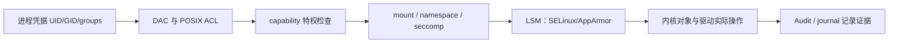

# LSM、capabilities 与审计命令导读

Linux 的一次访问不是只执行 `rwx` 判断。进程凭据、DAC/ACL、capability、mount/namespace、LSM 策略和资源本身状态都可能参与；Audit 负责记录选定的安全事件，但通常不是“允许/拒绝”的那一层。



任何一层拒绝都可能表现为 `Permission denied` 或 `Operation not permitted`。正确排障不是“先 chmod 777、关 SELinux”，而是确认哪个主体对哪个对象请求什么权限、哪一层拒绝、证据是否完整、最小修复是什么。

## 1. 六类机制不要混淆

| 机制 | 核心对象 | 主要作用 | 典型命令 |
|---|---|---|---|
| DAC/ACL | UID/GID/mode/ACL | 文件自主访问控制 | `id`、`namei`、`getfacl` |
| SELinux | source/target context、class、permission、policy | label-based MAC | `sestatus`、`restorecon`、`semanage` |
| AppArmor | profile attachment、路径/资源规则 | profile/path-based LSM | `aa-status`、`apparmor_parser` |
| capabilities | per-thread sets、file xattr、bounding/ambient | 拆分传统 root 特权 | `getcap`、`setcap`、`capsh` |
| seccomp | syscall number/argument filter | 缩小系统调用面 | 后续容器/性能模块 |
| Audit | rule、syscall/LSM/user records、serial event | 证据与合规追踪 | `auditctl`、`ausearch`、`aureport` |

SELinux 与 AppArmor 都通过 Linux Security Module 框架实现，但策略语言和对象模型不同；常见发行版主要启用其一。现代内核可堆叠部分 LSM，先检查实际启用列表，不能仅凭安装了工具判断。

```bash
cat /sys/kernel/security/lsm 2>/dev/null
grep -E '^(SELINUX|SELINUXTYPE)=' /etc/selinux/config 2>/dev/null
aa-status 2>/dev/null
```

## 2. SELinux 的决策模型

安全上下文常写成：

```text
user:role:type:level
system_u:system_r:httpd_t:s0
system_u:object_r:httpd_sys_content_t:s0
```

生产服务器最常遇到的是 Type Enforcement：source domain（如 `httpd_t`）访问 target type（如 `httpd_sys_content_t`）的某个 object class（如 `file`），请求 `read/open` 等 permission，策略决定 allow/deny。MLS/MCS level/range 可能进一步限制。

```text
主体进程 httpd_t
  + 目标文件类型 httpd_sys_content_t
  + class=file
  + permission={ open read getattr }
  + 当前 policy/boolean
  → allow 或 AVC denial
```

文件 `chcon` 改的是当前 xattr；持久期望标签通常来自 file-context policy，由 `semanage fcontext` 管理，再由 `restorecon` 应用。只 `chcon` 的结果可能在 relabel/restorecon 后消失。

## 3. AppArmor 的决策模型

AppArmor profile 通常按 executable 附着，使用路径和资源规则约束文件、网络、capability、mount、signal、ptrace、DBus 等。profile 可在 enforce 模式拒绝并记录，complain 模式通常记录本会拒绝的行为但不强制（显式 deny 等规则存在例外）。

```text
程序 exec
  → profile 是否 attach
  → 当前 namespace 中 profile mode
  → 路径解析/规则与请求权限匹配
  → allow、deny 或 complain 记录
```

移动/硬链接/mount namespace、deleted path、变量/abstraction 和执行转换会影响路径策略。不能只看到文件路径“相同”就断言规则相同。

## 4. capability 五类集合

| 集合 | 含义 |
|---|---|
| Permitted (P) | 线程可转入 Effective 的上限集合 |
| Effective (E) | 当前特权检查实际使用 |
| Inheritable (I) | exec 继承计算中的候选集合 |
| Bounding (B) | 此进程树通过 exec 能获得 capability 的上界 |
| Ambient (A) | 非特权程序 exec 时可保留的 capability；受 P/I 约束 |

文件 capability xattr 参与 `execve()` 后的新 P/E 计算。容器 root 仍受 bounding set、user namespace、LSM、seccomp 和挂载限制；给二进制 `cap_sys_admin+ep` 几乎等同提供巨大攻击面，不是“比 root 安全”的自动结论。

## 5. Audit 事件不是一行

一次内核 audit event 可能由同一 `msg=audit(seconds:serial)` 关联的多条 record 组成：

```text
SYSCALL：系统调用、成功/失败、进程和身份
PATH/CWD：路径组件与工作目录
PROCTITLE/EXECVE：命令标题/参数
AVC/USER_AVC：SELinux 等 LSM 拒绝
USER_LOGIN/USER_AUTH：用户空间可信应用事件
CONFIG_CHANGE：规则/配置变化
```

原始记录可能交错，使用 `ausearch` 按 serial 组装，不要单纯 `grep audit.log` 后漏掉 PATH 或把不同事件拼在一起。`auid/loginuid` 表示最初登录身份，`uid/euid` 是当前凭据，二者回答不同问题。

## 6. 命令清单

| 领域 | 命令 | 核心用途 |
|---|---|---|
| SELinux 状态 | `getenforce`、`sestatus`、`setenforce` | 当前模式、策略和临时 enforcement |
| SELinux 标签 | `chcon`、`restorecon`、`semanage` | 临时标签、按策略恢复、持久本地定制 |
| SELinux boolean | `getsebool`、`setsebool` | 查询和修改条件策略开关 |
| AppArmor | `aa-status`、`apparmor_parser`、`aa-enforce`、`aa-complain` | 状态、profile 编译装载、模式切换 |
| capabilities | `getcap`、`setcap`、`capsh` | 文件 capability、进程集合与受限 shell |
| Audit | `auditctl`、`augenrules`、`ausearch`、`aureport` | 内核规则、持久加载、事件查询与报表 |

所有放宽 enforcement/profile/capability/audit rule 的操作都属于安全状态变更。生产环境必须有变更单、精确目标、短窗口、证据保存、回滚与安全团队审阅。

## 7. 标准拒绝排障流程

```bash
date -Ins
id
ps -eZ 2>/dev/null | grep -F '<process>'
ls -lZ /path/to/object 2>/dev/null
getcap /path/to/program 2>/dev/null
ausearch -m AVC,USER_AVC,SELINUX_ERR -ts recent -i 2>/dev/null
journalctl -k --since '-10 min' --no-pager
```

1. 固定时间、boot ID、容器/namespace、可执行文件和调用参数。
2. 用 `namei/getfacl/findmnt` 排除 DAC/ACL/只读挂载。
3. 检查进程 domain/profile/capability sets 和目标 context。
4. 从 audit/journal 找完整 denial，而非只看应用最后一行。
5. 比较策略期望：默认标签、boolean、profile、服务架构是否匹配。
6. 优先修正错误标签/路径/配置；只有业务确有合理新权限时才修改策略。
7. 重现最小请求，确认 denial 消失且没有扩大无关访问。

不要用“临时 permissive 后能工作”直接证明 SELinux 是根因：模式变化也会改变时序和多条拒绝的表现；它最多是诊断信号，仍需从 AVC 的 source/target/class/perm 建立因果。

## 8. 容器与 Kubernetes 边界

- SELinux MCS label 可隔离容器，即使两个容器使用相同 type。
- AppArmor profile 通常由 runtime 在容器 init exec 时附着；节点必须加载相应 profile。
- OCI capability add/drop 不能突破宿主 bounding set、user namespace 和 LSM。
- 容器内通常不能管理宿主 audit rules；audit 记录中的 PID/UID/path 可能是宿主视角。
- privileged 容器会显著扩大 capability/device/mount 面，但仍不保证绕过所有 LSM。

排障必须写清：命令在节点还是容器执行，ID/路径是哪个 namespace 视角，策略由操作系统、容器 runtime 还是 Kubernetes 安全上下文注入。

## 9. 安全实验环境

使用可快照 VM，分别选择 SELinux 主机和 AppArmor 主机；不要在同一台生产主机为了学习切换 LSM。创建专用测试用户、目录、二进制、profile 和 audit key，所有规则带统一前缀并准备删除命令。

实验前保存：

```bash
uname -a
cat /sys/kernel/security/lsm
sestatus 2>/dev/null || true
aa-status 2>/dev/null || true
auditctl -s 2>/dev/null || true
auditctl -l 2>/dev/null || true
```

不要把 `setenforce 0`、`aa-complain`、删除 file capabilities 或 `auditctl -D` 当成普通排障起手式；它们会扩大攻击面或删除其他团队的监控规则。

## 10. 模块验收标准

- 能画出 DAC/ACL、capability、LSM、seccomp、Audit 的职责边界。
- 能读取 SELinux context/AVC，并区分 `chcon` 临时修改与 file-context 持久规则。
- 能解释 AppArmor profile attachment、enforce/complain 和路径语义。
- 能解释 P/E/I/B/A 集合、file capability 与 exec 转换。
- 能编写带 key、arch、syscall/field 过滤和退出清理的 audit 规则。
- 能按 serial 组装 audit event，并区分 auid、uid、euid、ses 与 subj。
- 能在不全局关闭安全机制的前提下完成“复现 → 定位 → 最小修复 → 验证 → 回滚”。

## 11. 官方参考 {/* #官方参考 */}

- [SELinux userspace](https://github.com/SELinuxProject/selinux)
- [AppArmor documentation](https://apparmor-documentation-c38b15.gitlab.io/documentation/)
- [Linux capabilities(7)](https://man7.org/linux/man-pages/man7/capabilities.7.html)
- [Linux Audit userspace](https://github.com/linux-audit/audit-userspace)
- [Linux Security Module documentation](https://docs.kernel.org/admin-guide/LSM/)

下一篇：[`getenforce` 命令详解](./01-getenforce命令详解.md)
