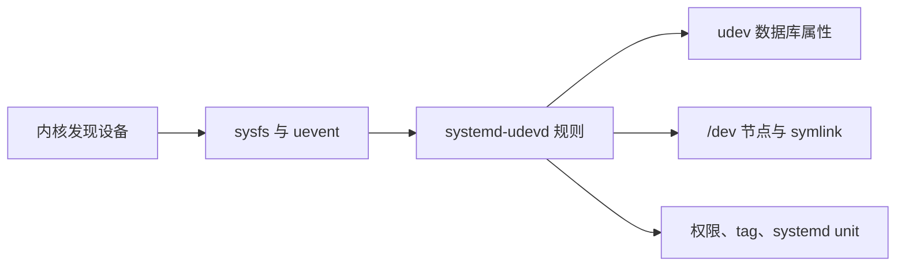

# udevadm 命令详解：从内核事件到设备节点与稳定命名

`udevadm` 查询 udev 数据库、观察 kernel uevent 与规则处理、验证/模拟规则、重放事件并控制 `systemd-udevd`。它连接了 `/sys` 内核设备与 `/dev` 节点、稳定 symlink、权限、标签和 systemd device unit。

## 1. 对象链



`udevadm` 不能让内核枚举一个不存在的 PCI function，也不能替代驱动 probe。

## 2. 顶层语法和参数

```text
udevadm [-d|--debug] [-V|--version] [-h|--help] COMMAND ...
```

版本差异很大：下表覆盖当前 systemd 的命令族，新参数在旧发行版可能不存在，务必先运行 `udevadm COMMAND --help`。

## 3. 全部子命令总览

| 子命令 | 作用 | 是否改变状态 |
|---|---|---|
| `info` | 查询 udev 数据库、sysfs 链和属性 | 通常只读；`--cleanup-db` 会改数据库 |
| `monitor` | 监听 kernel/udev 事件 | 否 |
| `test` / `test-builtin` | 模拟规则或内建命令并打印结果 | 主要用于预测，但部分 built-in/程序可能访问系统，仍在测试机验证 |
| `verify` | 校验规则语法、语义和风格 | 否 |
| `cat` | 按 udev 搜索/优先级显示规则或配置 | 否 |
| `trigger` | 向设备重放合成事件 | **是** |
| `settle` | 等待当前 udev 队列清空 | 否，但常是脆弱全局同步 |
| `control` | 改 daemon 日志、队列、配置 | **是** |
| `wait` | 等待指定设备初始化/移除 | 否 |
| `lock` | 锁定块设备后执行命令 | 执行的命令可能改变磁盘 |

## 4. `info`：查询与规则取材

```bash
udevadm info /dev/nvme0n1
udevadm info --query=property --name=/dev/nvme0n1
udevadm info --attribute-walk /sys/class/net/eth0
```

参数族：

- `-q/--query=TYPE`：`name|symlink|path|property|all`；`--property=NAME,...` 限字段，`--value` 只给值；
- `-p/--path=DEVPATH`、`-n/--name=FILE`：旧式目标参数，现也可直接给 `/sys`、`/dev`、device ID 或 `.device` unit；
- `-r/--root`：名称/symlink 使用绝对路径；
- `-a/--attribute-walk`：沿父链输出可用于规则匹配的 sysfs 属性；`-t/--tree`：sysfs 树；
- `-x/--export`、`-P/--export-prefix=NAME`：shell 风格键值输出；
- `-d/--device-id-of-file=FILE`：文件所在设备的 major/minor；
- `-e/--export-db`：导出数据库；`-c/--cleanup-db`：清理数据库；
- `-w[SECONDS]/--wait-for-initialization[=SECONDS]`：等待初始化；
- export-db 过滤：`--subsystem-match/--subsystem-nomatch`、`--attr-match/--attr-nomatch`、`--property-match`、`--tag-match`、`--sysname-match`、`--name-match`、`--parent-match`、`--initialized-match/--initialized-nomatch`；
- `--json=short|pretty|off`、`--no-pager`。

规则匹配只能在**同一父节点**组合多个 `ATTRS{}`，不要把 attribute-walk 不同段的属性误拼为同一设备。

## 5. `monitor`：分清 kernel 与 udev 阶段

```bash
sudo udevadm monitor --kernel --udev --property
sudo udevadm monitor -s block
```

全部参数：`-k/--kernel`、`-u/--udev`、`-p/--property`、`-s/--subsystem-match=SUBSYSTEM[/DEVTYPE]`、`-t/--tag-match=TAG`。

- 只有 kernel 事件：daemon/规则处理可能卡住；
- kernel 与 udev 都有但没有节点：规则、devtmpfs、权限或命名问题；
- 完全无事件：回到总线枚举、驱动和日志层。

## 6. `test`、`test-builtin`、`verify` 与 `cat`

```bash
sudo udevadm test --action=add /sys/class/net/eth0
udevadm test /dev/nvme0n1 --json=pretty
udevadm test-builtin net_id /sys/class/net/eth0
udevadm verify /etc/udev/rules.d/70-demo.rules
udevadm cat 70-demo.rules
```

- `test`：`-a/--action=ACTION`、`-N/--resolve-names=early|late|never`、`-D/--extra-rules-dir=DIR`、`-v/--verbose`、`--json=MODE`；
- `test-builtin`：`-a/--action=ACTION`；
- `verify`：`-N/--resolve-names=...`、`--root=PATH`、`--no-summary`、`--no-style`；
- `cat`：`--root=PATH`、`--tldr`、`--config`。

修改规则的安全顺序：verify → test → `udevadm control --reload` → 只对目标设备 trigger → monitor/属性验证。reload 不会自动重放现有设备。

## 7. `trigger`：过滤后再重放

```bash
sudo udevadm trigger --dry-run --verbose --subsystem-match=net
sudo udevadm trigger --action=change --settle /sys/class/net/eth0
```

全部参数族：

- `-v/--verbose`、`-n/--dry-run`、`-q/--quiet`；
- `-t/--type=all|devices|subsystems`、`-c/--action=ACTION`；
- `--prioritized-subsystem=LIST`；
- `-s/--subsystem-match`、`-S/--subsystem-nomatch`；
- `-a/--attr-match`、`-A/--attr-nomatch`、`-p/--property-match`；
- `-g/--tag-match`、`-y/--sysname-match`、`--name-match`、`-b/--parent-match`；
- `--initialized-match/--initialized-nomatch`、`--include-parents`；
- `-w/--settle`、`--uuid`、`--wait-daemon[=SECONDS]`。

全机 trigger 会重跑规则、重命名/改权限、启动 helper，并冲击设备密集节点。总是先 `--dry-run --verbose`，再限定 subsystem 与 syspath。

## 8. `settle` 与 `control`

`settle`：`-t/--timeout=SECONDS`、`-E/--exit-if-exists=FILE`。它等待**全局当前队列**，可能被不相关热插拔拖住；现代自动化优先 `trigger --settle` 或 `wait` 指定设备。

`control` 的全部控制项：

- `-e/--exit`；
- `-l/--log-level=LEVEL`、`--trace=BOOL`、`--revert`；
- `-s/--stop-exec-queue`、`-S/--start-exec-queue`；
- `-R/--reload`；
- `-p/--property=KEY=value`、`-m/--children-max=VALUE`；
- `--ping`、`-t/--timeout=SECONDS`、`--load-credentials`。

停止执行队列后若忘记恢复，会让设备初始化持续堆积；变更脚本必须用 finally/trap 恢复。

## 9. `wait` 与 `lock`

```bash
udevadm wait --timeout=30 /dev/disk/by-id/ID
udevadm wait --removed --timeout=30 /sys/class/block/sdb
sudo udevadm lock --device=/dev/sdb1 --timeout=30s COMMAND
```

- `wait`：`-t/--timeout=SECONDS`、`--initialized=BOOL`、`--removed`、`--settle`；
- `lock`：`-d/--device=DEVICE`、`-b/--backing=PATH`、`-t/--timeout=SECS`、`-p/--print`。

`lock` 会把分区归一到 whole-disk 并排序加 advisory lock，避免 udev 在分区/文件系统元数据只写了一半时探测；但仅对遵守该锁协议的程序有效。

## 10. 官方参考

- [systemd：udevadm(8)](https://man7.org/linux/man-pages/man8/udevadm.8.html)
- [systemd：udev(7)](https://man7.org/linux/man-pages/man7/udev.7.html)

下一篇：[numactl 命令详解](./14-numactl命令详解.md)。
