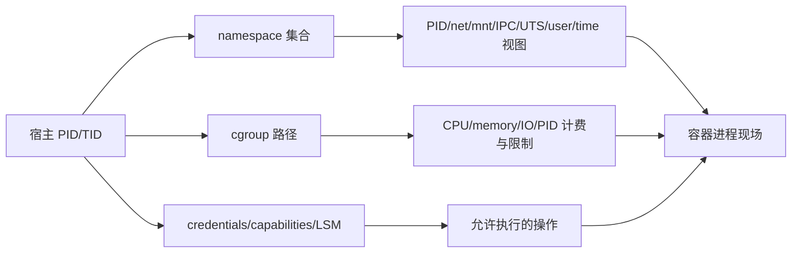

# Namespace、cgroup 与容器现场命令导读

容器不是一种特殊进程类型。它通常是普通 Linux 进程叠加 namespace 视图、cgroup 资源边界、capability/LSM/seccomp 权限边界和独立 rootfs。排障时最危险的错误，是把“容器内看见的值”当宿主机全局事实，或者以为进入一个 namespace 就自动进入了同一 cgroup、rootfs 和安全上下文。



## 1. 四套边界必须分别确认

| 边界 | 回答的问题 | 主要证据 |
|---|---|---|
| namespace | 进程看见哪些 PID、mount、network、IPC、hostname、UID/time 视图 | `/proc/PID/ns/*`、`lsns` |
| cgroup | 进程属于哪个资源域，受到什么限制和计费 | `/proc/PID/cgroup`、cgroupfs、systemd |
| root/cwd | `/` 与相对路径究竟解析到哪里 | `/proc/PID/root`、`/proc/PID/cwd`、mountinfo |
| credentials/security | UID/GID 映射、capability、LSM、seccomp 是否允许操作 | `status`、`uid_map`、`setpriv`、安全模块 |

`nsenter --all` 不会自然复制目标进程环境变量、cwd、root、cgroup 和 SELinux context；这些需要显式选择，并理解权限影响。

## 2. 本批 19 个命令

| 阶段 | 命令 | 学习目标 |
|---|---|---|
| namespace 盘点与进入 | `lsns`、`nsenter`、`unshare` | 识别 namespace inode/owner/parent，安全创建或进入现场 |
| user namespace 与权限 | `newuidmap`、`newgidmap`、`setpriv` | 理解 subordinate ID、一次性映射、capability 与 no_new_privs |
| rootfs 切换 | `chroot`、`pivot_root`、`switch_root` | 区分路径视图、mount namespace 和启动期根切换 |
| IPC 证据 | `ipcs` | 在正确 IPC namespace 中检查共享内存、队列与信号量 |
| systemd cgroup 视图 | `systemd-cgls`、`systemd-cgtop`、`machinectl` | 从 unit/machine 回到进程集合、资源计费与容器注册 |
| libcgroup 工具 | `cgcreate`、`cgexec`、`cgclassify`、`cgget`、`cgset`、`cgdelete` | 维护遗留 cgroup v1/兼容环境，并认识 systemd/v2 边界 |

容器 runtime 命令不重复写：[`crictl`](../../../cloud-native/kubernetes/commands/11-crictl命令详解.md)、[`ctr`](../../../cloud-native/kubernetes/commands/12-ctr命令详解.md)、[`nerdctl`](../../../cloud-native/kubernetes/commands/13-nerdctl命令详解.md)、[`docker`](../../../cloud-native/kubernetes/commands/14-docker命令详解.md)、[`podman`](../../../cloud-native/kubernetes/commands/15-podman命令详解.md)和[`runc`](../../../cloud-native/kubernetes/commands/16-runc命令详解.md)直接复用。网络 namespace 继续复用网络模块的 `ip netns`，挂载复用存储模块的 `findmnt/mount/umount`。

## 3. namespace 身份是 inode，不是名称

```bash
readlink /proc/self/ns/mnt
readlink /proc/PID/ns/mnt
lsns -p PID -o NS,TYPE,PATH,NPROCS,PID,COMMAND
```

同一类型 symlink 显示相同 inode，表示两个进程引用同一 namespace instance。PID namespace 还有 `pid` 与 `pid_for_children`；time namespace 同理。持久 namespace 可以由 bind mount 持有，即使没有成员进程；旧版 `lsns` 可能无法发现无进程的持久对象。

## 4. PID 1 语义

PID namespace 中的 PID 1 负责回收孤儿，并对信号有特殊处理。用 `unshare --pid` 时，新 namespace 只影响后代；通常需要 `--fork --mount-proc`，让子进程成为 namespace PID 1 并挂载匹配视图的 procfs。否则容器内 `ps` 可能仍读到外层 `/proc`。

## 5. user namespace 的“root”

```text
inside UID 0 --uid_map--> host UID 1000
```

namespace 内 UID 0 只在该 user namespace 及其拥有的子 namespace 中拥有 capability，不等于宿主初始 user namespace 的 root。`uid_map/gid_map` 只能按规则写一次；非特权 GID 映射通常必须先禁止 `setgroups`。subuid/subgid 分配范围是安全资源，重叠或错误委派会破坏隔离假设。

## 6. cgroup v2 对象模型

```text
cgroup tree
  ├─ cgroup.procs / cgroup.threads
  ├─ cgroup.controllers / cgroup.subtree_control
  ├─ cpu.max / cpu.weight / cpu.stat
  ├─ memory.current / memory.max / memory.events / memory.pressure
  ├─ io.stat / io.max / io.pressure
  └─ pids.current / pids.max / pids.events
```

v2 是统一层级，遵守 no-internal-process 等规则；controller 必须在父级 `cgroup.subtree_control` 委派给子级。读取 `memory.max` 只看到配置，是否发生 OOM 要看 `memory.events`，延迟压力看 PSI。CPU quota 限的是时间预算，不等于 CPU affinity；cpuset 与 `cpu.max` 必须分别看。

## 7. systemd 管理主机不要直接抢写 cgroupfs

systemd 把 service、scope、slice 和 machine 映射为 cgroup。直接用 libcgroup 或手工 mkdir/write 修改 systemd 管理的子树，可能被 manager 覆盖或造成所有权冲突。现代主机优先 unit resource properties、`systemd-run --scope` 或受控 delegation；libcgroup 工具主要用于遗留 v1、明确委派子树或非 systemd 环境。

## 8. 安全进入容器现场

```bash
pid=TARGET_HOST_PID
readlink /proc/$pid/exe
cat /proc/$pid/cgroup
lsns -p "$pid"
sudo nsenter -t "$pid" -m -u -i -n -p -- /bin/sh
```

进入前记录 PID 启动时间、runtime/container ID、namespace inode 和 cgroup，避免 PID 重用。只进入所需 namespace；带 `-U` 进入 user namespace、`-c` 加入 cgroup、`-r` 切 root、`-e` 复制环境会扩大语义和风险。现场命令仍可能修改容器或宿主共享对象。

## 9. 资源故障证据链

```bash
cat /proc/PID/cgroup
cat /sys/fs/cgroup/PATH/memory.current
cat /sys/fs/cgroup/PATH/memory.max
cat /sys/fs/cgroup/PATH/memory.events
cat /sys/fs/cgroup/PATH/cpu.stat
cat /sys/fs/cgroup/PATH/io.stat
cat /sys/fs/cgroup/PATH/pids.events
```

| 现象 | 关键证据 |
|---|---|
| Pod OOM、宿主仍有空闲 | `memory.events` 的 `oom/oom_kill`、limit 与 working set |
| CPU 利用率不高但延迟抖动 | `cpu.stat` 的 throttled 时间、PSI、run queue |
| fork 失败 | `pids.current/max/events` 与 RLIMIT_NPROC |
| IO 慢 | `io.stat/io.pressure`、块设备与应用 latency |
| 容器内命令看不到目标 | PID/mount namespace 与 procfs 挂载是否匹配 |

## 10. 实验与验收

在一次性 VM 中完成：创建 user+UTS+mount+PID namespace；比较内外 UID/PID/hostname/procfs；用 `nsenter` 分别只进 net、mnt 和全部 namespace；创建受控 cgroup v2 子树或 systemd scope，制造低强度 CPU/memory/pids 限制并观察 events；最后清理所有 bind mount、进程和 cgroup。

掌握标准：能从一个宿主 PID 还原 namespace、rootfs、cgroup 和 credentials；能解释 UID 0、PID 1、cgroup namespace 与资源限制的真实边界；能在不破坏 systemd 管理权的前提下进入现场、采证和退出。

## 11. 官方参考

- [Linux namespaces(7)](https://man7.org/linux/man-pages/man7/namespaces.7.html)
- [Linux cgroup v2](https://docs.kernel.org/admin-guide/cgroup-v2.html)
- [systemd Control Group APIs](https://systemd.io/CONTROL_GROUP_INTERFACE/)

从下一篇 [`lsns`](./01-lsns命令详解.md)开始。
