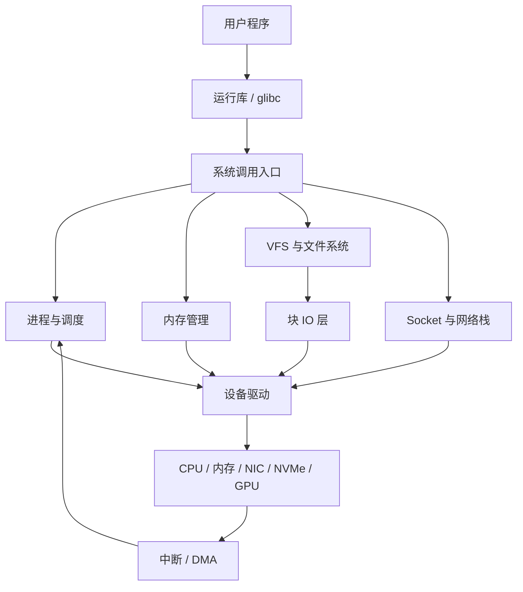

# Linux 系统原理学习路线

这套文章不以背诵内核结构体为目标，而是围绕“一个动作在系统中经历了什么”建立模型。源码用于确认边界和顺序，命令用于观察对象，实验用于验证推断。

## 1. 全局地图



图中的箭头是控制或数据路径，不表示所有请求都按同一方式同步执行。Page Cache、DMA、异步 IO、软中断和内核线程都会改变调用者与实际工作之间的时间关系。

## 2. 学习阶段

| 阶段 | 模块 | 建立的能力 |
|---|---|---|
| 第一阶段 | 内核架构、启动、进程调度、内存管理 | 看懂后续所有子系统共同使用的对象和执行环境 |
| 第二阶段 | VFS、文件系统、块 IO、网络栈 | 追踪数据从应用到设备的完整路径 |
| 第三阶段 | 中断并发、设备驱动、容器隔离、安全 | 理解多核、硬件与资源边界 |
| 第四阶段 | 可观测性、性能、可靠性、源码实验 | 用运行证据验证机制并处理复杂故障 |

## 3. 已发布文章

### 3.1 内核执行基础 {/* #第一阶段内核执行基础 */}

- [内核架构导读](./01-kernel-architecture/00-内核架构导读.md)
- [系统启动导读](./02-boot-system/00-Linux系统启动导读.md)
- [进程与调度导读](./03-process-scheduling/00-进程与调度导读.md)
- [内存管理导读](./04-memory-management/00-Linux内存管理导读.md)

### 3.2 数据从应用到设备 {/* #第二阶段数据从应用到设备 */}

- [文件系统与 VFS 导读](./05-filesystem-vfs/00-文件系统与VFS导读.md)
- [块设备与 Linux IO 导读](./06-block-io/00-块设备与Linux-IO导读.md)
- [Linux 网络栈导读](./07-network-stack/00-Linux网络栈导读.md)

## 4. 阅读源码的约束

文章引用源码时给出子系统、文件和函数名，而不是依赖容易变化的行号。需要先确认正在运行的内核配置和发行版补丁：

```bash
uname -a
cat /etc/os-release
zcat /proc/config.gz 2>/dev/null | head
grep -E 'CONFIG_(PREEMPT|NUMA|CGROUP|TRANSPARENT_HUGEPAGE)=' /boot/config-"$(uname -r)" 2>/dev/null
```

`/proc/config.gz` 或 `/boot/config-*` 不存在，不代表某项功能一定关闭；发行版可能把配置放在其他位置。源码路径解释“标准内核如何实现”，运行时接口才是当前系统的证据。

## 5. 掌握标准

完成第一阶段后，应能独立解释：

- CPU 如何从用户态进入内核态并返回。
- 固件如何把控制权交给内核，内核如何启动第一个用户态进程。
- `fork`、`execve`、调度、上下文切换和进程状态怎样衔接。
- 虚拟地址如何映射到物理页，缺页、回收、Swap 和 OOM 为什么发生。
- `top`、`vmstat`、`pidstat`、`free`、PSI 等输出分别在观察什么，而不是只记阈值。

## 6. 官方资料

- [Linux 6.6 内核文档](https://docs.kernel.org/6.6/)
- [Linux 内核源码](https://git.kernel.org/pub/scm/linux/kernel/git/stable/linux.git/tree/?h=v6.6)
- [Linux 内核管理指南](https://docs.kernel.org/6.6/admin-guide/)

下一篇：[内核架构导读](./01-kernel-architecture/00-内核架构导读.md)
