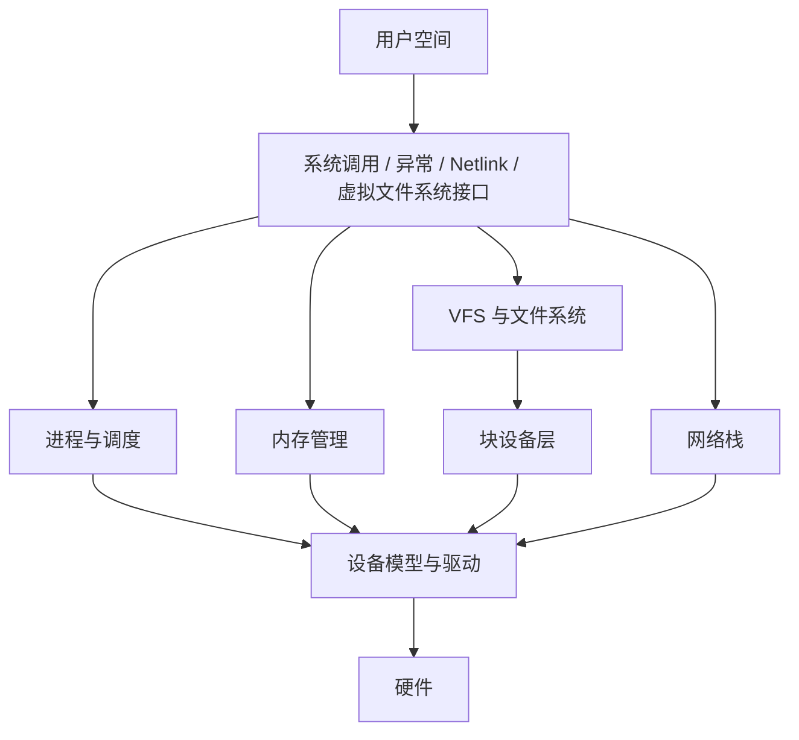

# Linux 内核架构导读：先建立一张不会混乱的系统地图

理解 Linux 内核，首先要区分四件事：谁在执行、管理什么对象、数据走哪条路径、当前证据来自哪里。很多误解都来自把“进程”“程序”“内核线程”“系统调用”和“CPU 上正在执行的指令”混成一件事。

## 1. Linux 系统不只有内核

一台可用的 Linux 服务器通常包括：

```text
应用程序和运维工具
        ↓
Shell、运行库、语言运行时
        ↓
系统调用接口
        ↓
Linux 内核
        ↓
固件、CPU、内存和外设
```

Linux 严格来说是内核。发行版还提供 glibc、systemd、包管理器、Shell、GNU 工具、安装程序和安全策略。`ps`、`systemctl`、`ip` 都运行在用户态，它们通过系统调用、Netlink、procfs、sysfs 等接口获取或改变内核状态。

## 2. 三种执行环境

| 环境 | 是否代表普通进程执行 | 能否睡眠 | 典型工作 |
|---|---:|---:|---|
| 用户态 | 是 | 可以 | 应用逻辑、运行库、Shell |
| 进程上下文中的内核态 | 是 | 通常可以，但取决于锁和上下文 | 系统调用、缺页异常 |
| 中断/软中断上下文 | 不一定 | 硬中断不可睡眠，软中断也受严格限制 | 设备通知、网络收包后半部 |

“进入内核态”不等于“切换到另一个进程”。系统调用通常还是当前线程在运行，只是 CPU 权限级别、栈和执行地址发生变化。只有调度器决定换出当前任务时，才发生任务上下文切换。

## 3. 内核主要子系统



这些边界并不绝对。例如发送文件可以同时经过 VFS、Page Cache、Socket 和网卡驱动；内存回收可能触发文件页回写；GPU 驱动会同时使用进程地址空间、DMA 和 IOMMU。

## 4. 内核围绕对象工作

| 对象 | 代表什么 | 常见关联 |
|---|---|---|
| `task_struct` | 一个可调度任务 | PID、状态、调度实体、信号、凭证 |
| `mm_struct` | 用户虚拟地址空间 | VMA、页表、堆和栈 |
| `files_struct` | 进程文件描述符表 | `struct file` |
| `struct file` | 一次打开实例 | 当前偏移、访问模式、文件操作表 |
| `inode` | 文件系统中的对象元数据 | 类型、权限、大小、数据块映射 |
| `dentry` | 路径名到 inode 的缓存关系 | 父目录、名称、inode |
| `socket` / `sock` | 用户接口与协议状态 | TCP 状态、队列、缓存 |
| `sk_buff` | 网络数据包在内核中的主要表示 | 协议头、数据区、设备和路由 |
| `struct page` / folio | 物理内存页或成组页的管理表示 | 页缓存、匿名内存、回收状态 |

对象往往被多个主体共享，生命周期通过引用计数、RCU、锁或所有权规则管理。看到“文件描述符 3”时，不能把整数 3 当成文件本身；它只是当前进程文件表中的索引。

## 5. 控制路径和数据路径

控制路径负责创建、配置或调度对象，例如 `openat()`、`bind()`、`mmap()`。数据路径传输真正的数据，例如 `read()`、`sendmsg()`、DMA 收包。一次操作通常同时包含两者：

```text
openat("model.bin")         控制路径：解析名称并创建打开实例
        ↓
read(fd, buffer, size)       数据路径：把文件内容送入进程缓冲区
```

性能优化不能只看 API 数量。数据是否命中 Page Cache、是否触发缺页、是否复制、是否等待设备以及在哪个 NUMA Node 上完成，都会改变成本。

## 6. 四类用户空间接口

| 接口 | 示例 | 特点 |
|---|---|---|
| 系统调用 | `read`、`mmap`、`clone` | 稳定的用户态 ABI |
| 虚拟文件系统 | `/proc/meminfo`、`/sys/devices` | 以文件形式暴露运行状态 |
| Netlink/ioctl | 路由、网卡、设备控制 | 结构化消息或设备专用控制 |
| 跟踪接口 | tracepoint、perf event、eBPF | 观察事件和性能，必须控制开销 |

内核内部函数不是用户态 ABI。发行版可以在不改变系统调用行为的情况下调整内部实现，因此排障时既要理解源码，也不能把某个内部函数名当作永久契约。

## 7. 观察当前系统

```bash
uname -r
cat /proc/version
cat /proc/cmdline
cat /proc/self/status | sed -n '1,25p'
cat /proc/self/maps | sed -n '1,12p'
mount | grep -E ' on /(proc|sys|dev) '
```

这些输出分别回答内核版本与构建信息、启动参数、当前进程对象、虚拟内存映射和虚拟文件系统挂载。它们只能描述当前观察点；容器中的 `/proc` 可能受 PID Namespace 和 cgroup 影响。

## 8. 常见误解

- 内核不是一个始终独立运行的普通进程。
- 系统调用不是向“内核进程”发送 RPC。
- 进入内核态不必然发生进程上下文切换。
- CPU 利用率中的 `system` 时间不等于所有内核工作；中断还可能计入 `irq`、`softirq`。
- `/proc` 大多是内核动态生成的视图，不是磁盘上的普通文本文件。
- 内核源码中的结构体不等于用户空间看到的所有统计口径。

## 9. 掌握标准

能够画出用户程序、系统调用、内核子系统、驱动和硬件之间的关系；能够区分执行上下文与进程切换；看到一个指标时，先追问它来自哪个内核对象、哪个 Namespace 和哪个采样窗口。

## 10. 练习与答案

**问题 1：应用调用 `read()` 时，是否一定发生进程切换？**

答案：不一定。CPU 会从用户态进入内核态，但仍可能由同一线程继续执行；只有等待数据、时间片耗尽或被更高优先级任务抢占等情况触发调度时，才会切换任务。

**问题 2：为什么不能把 `/proc/PID/fd/3` 直接理解成 inode？**

答案：`3` 是文件描述符表索引，先指向 `struct file` 打开实例，再由它关联 dentry 和 inode。同一个 inode 可以有多个打开实例，每个实例可以有不同文件偏移和标志。

下一篇：[Linux、内核与发行版](./01-Linux内核与发行版.md)
