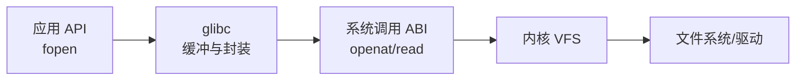

# Linux、内核与发行版：系统中每一层由谁负责

“Linux 版本是多少”可能在问内核、发行版、glibc 或容器镜像。它们相互配合但版本独立，排障时必须明确故障属于哪一层。

## 1. 一台服务器由哪些部分组成

| 层次 | 代表组件 | 主要职责 |
|---|---|---|
| 固件 | BIOS/UEFI、BMC 固件 | 初始化硬件并选择引导项 |
| Bootloader | GRUB、systemd-boot | 装载内核、initramfs 和启动参数 |
| Linux 内核 | `vmlinuz-*`、内核模块 | 调度、内存、文件、网络、驱动与隔离 |
| 运行库 | glibc、musl、libstdc++ | 封装系统调用并提供语言运行环境 |
| 基础用户空间 | systemd、Bash、coreutils、iproute2 | 启动服务并管理系统 |
| 发行版 | RHEL、Rocky、Ubuntu、openEuler、麒麟 | 选择、构建、测试和维护组件组合 |
| 应用环境 | Python、JVM、容器镜像 | 业务运行时和依赖 |

发行版内核的版本字符串较旧，不代表没有新功能。厂商常把安全修复、驱动或功能补丁回移到长期维护内核，所以应查看发行版 changelog、配置和运行接口。

## 2. API、ABI 和内核内部实现

- API 是源代码层面的调用约定，例如 glibc 提供的 `fopen()`。
- 用户态 ABI 包括系统调用号、寄存器传参、ELF 格式等二进制约定。
- 内核内部接口服务于内核子系统和模块，通常不承诺跨版本稳定。

glibc 的 `fopen()` 不是系统调用。它在用户态管理缓冲，最终通过 `openat()`、`read()`、`write()` 等系统调用请求内核。静态链接程序也不是“不使用内核”，它只是把用户态库代码打进自己的 ELF。



## 3. 内核模块是不是用户程序

内核模块是运行在内核地址空间中的可装载代码，拥有内核权限。模块崩溃可能破坏整个系统；普通用户程序崩溃通常只影响自己的进程。模块必须与目标内核的配置、符号版本和 ABI 兼容。

```bash
uname -r
modinfo nvidia 2>/dev/null | sed -n '1,12p'
cat /proc/sys/kernel/tainted
```

第三方 GPU、NPU、网卡和存储驱动经常使“同一发行版版本”出现完全不同的内核运行路径。排查必须记录驱动、固件和模块参数，而不只记录 OS 名称。

## 4. 容器共享什么

容器镜像携带用户空间文件，但容器进程使用宿主机内核：

```text
容器 A：Ubuntu 用户空间 ┐
容器 B：Rocky 用户空间  ├→ 同一个宿主机 Linux 内核
容器 C：精简镜像        ┘
```

因此：

- 容器中的 `/etc/os-release` 描述镜像用户空间，不是宿主机内核。
- `uname -r` 通常显示宿主机内核。
- 镜像里的 glibc 和应用架构必须能使用宿主机提供的系统调用 ABI。
- 内核缺少驱动、cgroup 或 Namespace 能力时，换镜像无法补齐。

## 5. 如何建立版本清单

```bash
uname -a
cat /etc/os-release
ldd --version | head -1
systemd --version | head -1
getconf GNU_LIBC_VERSION 2>/dev/null
cat /proc/cmdline
```

示例判读：

```text
Linux 5.14.0-427.el9.x86_64 ...
NAME="Rocky Linux"
VERSION="9.4 (Blue Onyx)"
ldd (GNU libc) 2.34
```

这里至少包含三个独立版本：发行版 9.4、发行版维护的 5.14 内核、glibc 2.34。不能用其中一个替代全部环境信息。

## 6. 常见故障边界

| 现象 | 优先确认的层次 |
|---|---|
| `GLIBC_2.xx not found` | 应用与用户态运行库 |
| `Exec format error` | ELF 架构、解释器或镜像平台 |
| 驱动模块加载时报 unknown symbol | 模块与内核构建/符号兼容性 |
| 容器中看不到 GPU | 宿主机驱动、设备节点、Runtime 和权限 |
| systemd Unit 启动失败 | 用户空间服务管理与应用 |
| Kernel Panic | 内核、驱动或硬件 |

## 7. 练习与答案

**问题：容器镜像是 Ubuntu，宿主机是 Rocky Linux，容器使用哪个内核？**

答案：使用 Rocky Linux 宿主机正在运行的内核。镜像提供 Ubuntu 用户空间文件和库。虚拟机则通常有自己的客体内核，这是容器与虚拟机的重要差异。

**问题：`uname -r` 相同就能认定两台机器行为完全一致吗？**

答案：不能。内核配置、厂商补丁、模块、固件、启动参数、硬件和 sysctl 都可能不同。

下一篇：[用户态、内核态与系统调用](./02-用户态内核态与系统调用.md)
