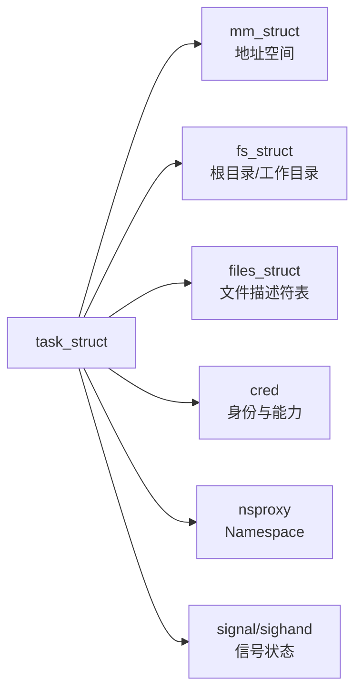

# 内核源码、核心对象与用户接口：怎样阅读而不迷路

从源码根目录逐文件阅读几乎一定会迷路。更有效的方法是选定一个可观察动作，沿“入口—核心对象—子系统操作—返回/完成”追踪，并在运行系统中验证。

## 1. 源码目录地图

| 目录 | 主要内容 |
|---|---|
| `arch/` | CPU 架构相关入口、页表、异常和启动 |
| `kernel/` | 调度、信号、时间、同步等核心机制 |
| `mm/` | 页表、分配、回收、Swap、slab |
| `fs/` | VFS、具体文件系统和通用文件操作 |
| `net/` | Socket、TCP/IP、Netfilter 等网络栈 |
| `block/` | 通用块层和多队列框架 |
| `drivers/` | 各类设备驱动 |
| `include/` | 公共头文件、数据结构和 UAPI |
| `init/` | 内核启动和初始化 |
| `security/` | LSM、安全模块和策略钩子 |
| `tools/` | perf、BPF、自测试等用户态工具 |

目录只是导航。一个功能往往跨多个目录，例如一次 NVMe 读取会经过系统调用、VFS、文件系统、页缓存、块层、NVMe 驱动和中断完成路径。

## 2. 从对象生命周期阅读

阅读一个结构体时至少回答：

1. 谁创建它。
2. 谁持有引用。
3. 哪些锁保护字段。
4. 在什么上下文访问。
5. 何时释放。
6. 用户空间能从哪里看到它。

以进程相关对象为例：



`fork` 时这些对象可能复制，也可能因 `clone` 标志而共享。只说“子进程复制父进程”过于粗糙，必须说明复制的是页表、引用还是实际物理页。

## 3. procfs 和 sysfs 的差别

- procfs 以进程和内核运行状态为主，也保留大量历史形成的系统接口。
- sysfs 主要呈现 kobject、设备模型、驱动、总线和属性层次。
- debugfs 面向调试，接口不保证稳定，不应被业务程序当成稳定 ABI。
- tracefs 提供 ftrace、tracepoint、kprobe 等跟踪控制接口。

```bash
findmnt -t proc,sysfs,debugfs,tracefs
readlink -f /sys/class/net/eth0/device 2>/dev/null
ls -l /proc/self/fd | head
```

一个 `/sys/class/net/eth0/device` 链接可以把逻辑网卡类设备关联到 PCIe 设备层次；`/proc/self/fd` 则展示当前进程文件描述符的符号链接视图。

## 4. 源码符号与运行证据对应

| 想理解的问题 | 源码入口 | 运行证据 |
|---|---|---|
| 当前任务是什么 | `task_struct`、`current` | `/proc/PID/status`、`ps` |
| 地址空间如何组织 | `mm_struct`、`vm_area_struct` | `/proc/PID/maps`、`smaps` |
| 文件怎样打开 | `do_sys_openat2()`、`path_openat()` | `strace openat`、`/proc/PID/fd` |
| 调度为何延迟 | `schedule()`、调度类 | `perf sched`、调度 tracepoint |
| 页面为何被回收 | `shrink_node()` 等回收路径 | `/proc/vmstat`、PSI、mm tracepoint |

函数名会演化，概念和用户态 ABI 更稳定。文章应标注内核基线，不能把某版本函数名写成永远不变的事实。

## 5. 一条可复用的阅读路线

以 `read()` 为例：

1. 用 `strace` 确认真实系统调用和参数。
2. 从架构系统调用表定位入口。
3. 跟到 `ksys_read()` 和 `vfs_read()`。
4. 识别 `struct file` 与 `file_operations`。
5. 判断实际文件系统是否走 Page Cache。
6. 用 tracepoint/perf 验证是否缺页、阻塞或访问块设备。
7. 用返回值和 errno 对照失败分支。

源码回答“可能走哪些路径”，运行证据回答“这一次实际走了哪条路径”。

## 6. 不要这样读源码

- 不固定版本，混合引用多个时代的函数。
- 只看调用图，不看对象状态和并发保护。
- 看到函数名相同就假设语义完全相同。
- 只阅读成功路径，不看错误、回滚和资源释放。
- 根据源码推测线上路径，却不采集 tracepoint、计数器或日志验证。

## 7. 练习与答案

**问题：为什么 sysfs 中许多目录是符号链接？**

答案：同一个设备同时属于总线、设备、驱动和 class 等不同逻辑视图。符号链接让这些视图关联到同一设备对象，而不需要复制状态。

**问题：源码显示某函数可能调用块层，能否断定一次 `read()` 一定访问磁盘？**

答案：不能。数据可能已在 Page Cache 中；还要结合缺页、块 IO tracepoint、设备计数等运行证据。

下一篇：[一次 read 的完整路径](./05-一次read的完整路径.md)
