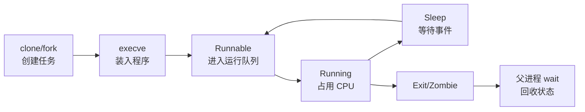

# 进程与调度导读：Linux 怎样组织和运行任务

用户看到的是“一个服务进程”，调度器看到的则是一组可调度任务。Linux 用统一的任务结构表示进程和线程，通过资源共享关系形成线程组，通过每 CPU 运行队列决定下一刻由谁执行。

## 1. 主线



调度器处理的是“谁现在可以运行”；等待 IO、锁、定时器或消息的任务不应占着 CPU 空转。事件到达后，内核唤醒任务并放回某个 CPU 的运行队列。

## 2. 必须区分的概念

| 概念 | 内核视角 |
|---|---|
| 程序 | 磁盘上的 ELF、脚本或其他可执行内容 |
| 进程 | 拥有独立资源视图的运行实例 |
| 线程 | 与同组任务共享地址空间等资源的可调度任务 |
| PID | 当前 PID Namespace 中看到的任务 ID |
| TGID | 线程组 ID，通常等于主线程 PID |
| 运行队列 | 某 CPU 上等待获得执行机会的任务集合 |
| 上下文切换 | CPU 从一个任务的执行现场切到另一个任务 |

Linux 内核并不维护两套完全分离的“进程结构”和“线程结构”。每个线程都有自己的 `task_struct`，共享哪些资源由创建时的 clone 标志决定。

## 3. 从创建到退出

1. `fork/clone` 创建新的任务关系。
2. `execve` 用新程序替换当前任务的用户地址空间。
3. 调度器让 runnable 任务获得 CPU。
4. 系统调用、缺页、锁和 IO 会使任务睡眠或再次 runnable。
5. 信号改变控制流或终止任务。
6. `exit` 释放大部分资源并保留退出状态。
7. 父进程 `wait` 后，僵尸记录才被完全回收。

## 4. 观察对象而不是只看百分比

```bash
ps -eLo pid,tid,tgid,ppid,psr,cls,rtprio,pri,ni,stat,wchan:24,comm
cat /proc/<PID>/status
cat /proc/<PID>/sched
taskset -pc <PID>
```

`psr` 是任务最近运行的 CPU，不等于固定绑定；`wchan` 是睡眠位置的符号提示，不是完整调用栈；容器内 PID 和宿主机 PID 可能不同。

## 5. 后续文章

1. [进程、线程与 task_struct](./01-进程线程与task_struct.md)
2. [fork、clone 与 Copy-on-Write](./02-fork-clone与Copy-on-Write.md)
3. [execve、ELF 与动态链接](./03-execve-ELF与动态链接.md)
4. [进程状态、退出与僵尸进程](./04-进程状态退出与僵尸进程.md)
5. [Linux 信号机制](./05-Linux信号机制.md)
6. [上下文切换与调度延迟](./06-上下文切换与调度延迟.md)
7. [CFS、EEVDF 与实时调度](./07-CFS-EEVDF与实时调度.md)
8. [SMP、CPU 亲和性与 cgroup CPU](./08-SMP亲和性与cgroup-CPU.md)

## 6. 掌握标准

能解释 PID/TID/TGID；能区分用户态/内核态切换与任务上下文切换；能从任务状态、运行队列、调度等待、配额 throttling 和 PSI 判断 CPU 延迟，而不是把 load 高直接等同于 CPU 100%。

下一篇：[进程、线程与 task_struct](./01-进程线程与task_struct.md)
