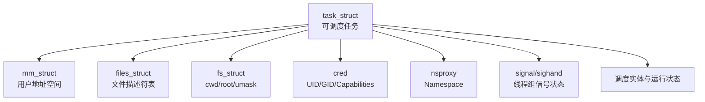

# 进程、线程与 taskstruct：Linux 实际调度的是什么

Linux 调度器的基本对象是任务。一个多线程进程包含多个 `task_struct`；每个线程可以独立睡眠、唤醒、绑定 CPU 和被调度，只是与同组线程共享地址空间等资源。

## 1. 一个任务关联哪些资源



线程通常共享 `mm_struct`、文件描述符表和信号处理设置，但每个线程有自己的寄存器现场、内核栈、调度状态、信号掩码和线程局部存储。

## 2. PID、TID 和 TGID

在用户空间常把 `getpid()` 返回值叫 PID。内核任务模型中：

- 每个线程有一个唯一任务 ID，可由 `gettid()` 获得。
- 同一进程的所有线程具有相同 TGID。
- 主线程的任务 ID 等于 TGID。
- `ps` 默认按进程聚合，`ps -L` 或 `top -H` 才展开线程。

```bash
ps -eLo pid,tid,tgid,nlwp,psr,stat,comm | head
ls /proc/<PID>/task
```

`/proc/PID/task/` 下每个目录对应一个线程。线程数很大时，内存、调度和 `/proc` 遍历成本都可能上升。

## 3. 父子关系与线程组不是同一关系

父进程关系用于退出通知、资源统计和孤儿进程托管；线程组表达共享进程语义。一个任务同时拥有：

- `real_parent` 等父子关系。
- `group_leader` 线程组关系。
- 进程组和 Session，用于 Shell 作业控制和终端信号。
- PID Namespace 中的多级 PID 映射。

所以 `pstree` 展示的树不能完整表达线程组、cgroup 和 Namespace。

## 4. 内核线程

内核线程也用 `task_struct` 调度，但通常没有普通用户地址空间，执行内核函数。例如 `kthreadd`、`kworker/*`、`ksoftirqd/*`。方括号形式的 `ps` 名称常提示内核线程，但显示格式不是安全边界。

内核工作可能：

- 直接记在发起系统调用的进程 `system` CPU 时间中。
- 在中断/软中断上下文中执行。
- 被延后到 kworker 或专用内核线程。

只按进程 CPU 排名可能漏掉第三类之外的系统级压力。

## 5. Namespace 中的 PID

同一任务在嵌套 PID Namespace 中可以拥有多个 PID。容器内看到 PID 1，宿主机上可能是 PID 48231。

```bash
grep -E '^(Pid|Tgid|NSpid|PPid|Threads):' /proc/<PID>/status
```

示例：

```text
Tgid:   48231
Pid:    48231
PPid:   47900
NSpid:  48231  1
Threads: 16
```

`NSpid` 从外层到内层展示该任务在各 PID Namespace 的编号。字段可用性与内核版本和挂载选项有关。

## 6. 生命周期和引用

任务退出后并非立即消失。内核释放地址空间等大部分资源，但保留 PID、退出码和资源统计，等待父进程读取。调试工具看到某对象，不代表它仍能运行；引用计数和 RCU 还可能让内核对象在逻辑删除后延迟释放。

## 7. 常见误解

- “一个 PID 只能用一个 CPU”只对单线程任务在某一瞬间成立；多线程进程可以并行使用多个 CPU。
- “线程比进程没有任何隔离”不准确；线程仍有独立调度实体、栈和信号掩码。
- “容器里的 PID 1 就是宿主机 PID 1”错误，它只是该 PID Namespace 的第一个任务。
- “kworker CPU 高就是 kworker 自身业务”错误，它常在代替驱动或其他内核子系统执行延后工作。

## 8. 练习与答案

**问题：为什么一个进程 CPU 可以显示 350%？**

答案：工具可能把同一线程组多个线程的 CPU 时间求和，以单个逻辑 CPU 为 100%；350% 表示采样期平均约占用 3.5 个逻辑 CPU。

**问题：两个线程共享地址空间，为什么还需要独立 task_struct？**

答案：它们需要独立被调度、保存寄存器/栈、睡眠和唤醒，并可拥有不同亲和性、调度优先级和信号掩码。

下一篇：[fork、clone 与 Copy-on-Write](./02-fork-clone与Copy-on-Write.md)
