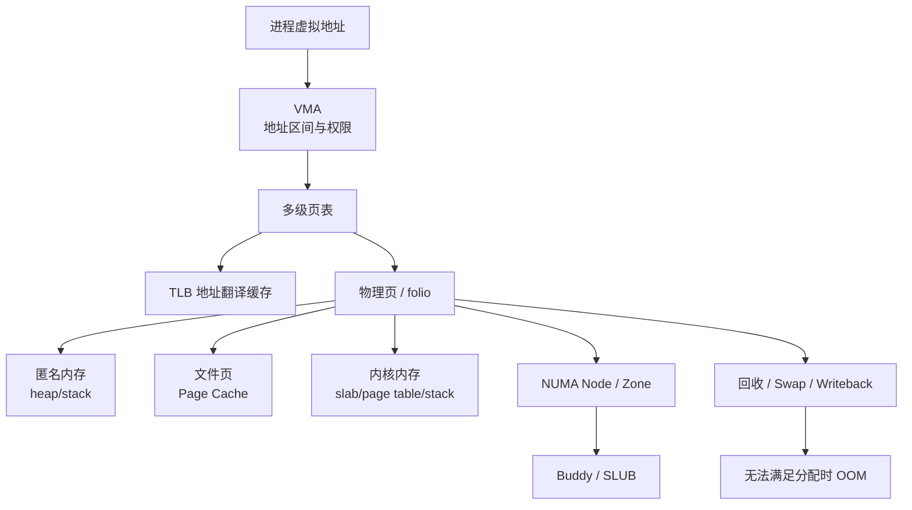

# Linux 内存管理导读：从虚拟地址到物理页、回收与 OOM

内存排障最常见的错误，是把“虚拟地址”“已驻留物理页”“文件缓存”“cgroup 记账”和“设备显存”当成同一资源。Linux 内存管理的核心，是在有限物理页上为进程、内核和设备建立可隔离、可回收、可迁移的映射。

## 1. 全局地图



## 2. 三条主线

### 2.1 地址翻译 {/* #地址翻译 */}

```text
虚拟地址 → VMA 权限 → 页表 → TLB → 物理地址
```

映射不存在或权限不符时触发 Page Fault，由内核决定分配页、执行 Copy-on-Write、从文件/Swap 读入，还是向进程发送错误信号。

### 2.2 物理页管理 {/* #物理页管理 */}

```text
NUMA Node → Zone → 空闲页伙伴系统 → slab/页表/用户页/Page Cache
```

“还有空闲内存”不代表一定能满足连续页、指定 NUMA 节点、DMA Zone 或 HugePage 请求。

### 2.3 压力与回收 {/* #压力与回收 */}

```text
低水位 → kswapd 后台回收
分配路径缺页 → Direct Reclaim
文件脏页 → Writeback
匿名页 → 保留或换出 Swap
仍无法满足 → OOM 决策
```

## 3. 文章顺序

1. [虚拟地址、页表、TLB 与缺页异常](./01-虚拟地址页表TLB与缺页异常.md)
2. [进程地址空间、brk、mmap 与 malloc](./02-进程地址空间-brk-mmap与malloc.md)
3. [物理内存、Zone、Buddy 与 SLUB](./03-物理内存-Zone-Buddy与SLUB.md)
4. [Page Cache、mmap 与共享内存](./04-Page-Cache-mmap与共享内存.md)
5. [内存回收、Swap 与抖动](./05-内存回收-Swap与抖动.md)
6. [HugePage、THP、碎片与 Compaction](./06-HugePage-THP碎片与Compaction.md)
7. [NUMA 内存局部性](./07-NUMA内存局部性.md)
8. [cgroup 内存与 OOM](./08-cgroup内存与OOM.md)
9. [Linux 内存指标与故障排查](./09-Linux内存指标与故障排查.md)

## 4. 五个观察口径

| 口径 | 典型接口 | 回答的问题 |
|---|---|---|
| 系统物理内存 | `/proc/meminfo`、`free` | 全机 RAM 如何分布 |
| VM 活动 | `/proc/vmstat`、`vmstat` | 缺页、回收、换页是否发生 |
| 进程映射 | `/proc/PID/smaps*` | 一个进程哪些映射驻留或共享 |
| cgroup 记账 | `memory.current/stat/events` | 容器/Pod 边界内的使用和压力 |
| NUMA 分布 | `/proc/PID/numa_maps`、`numastat` | 页面位于哪个 Node、是否远端访问 |

这些数字不能随意相加。进程 RSS 会重复计算共享页，Page Cache 可同时被多个进程使用，cgroup 还可能包含内核内存和文件页。

## 5. 掌握标准

完成后应能解释：

- 为什么 VIRT 很大但 RSS 很小。
- 为什么 `MemFree` 很低仍可能健康。
- Minor Fault、Major Fault、COW 和 Swap-in 的区别。
- 为什么宿主机有内存，容器仍然 OOM。
- 为什么物理内存总量足够，大页或连续内存仍申请失败。
- 为什么 CPU 低、磁盘正常，请求仍因 Direct Reclaim 出现长尾。

下一篇：[虚拟地址、页表、TLB 与缺页异常](./01-虚拟地址页表TLB与缺页异常.md)
