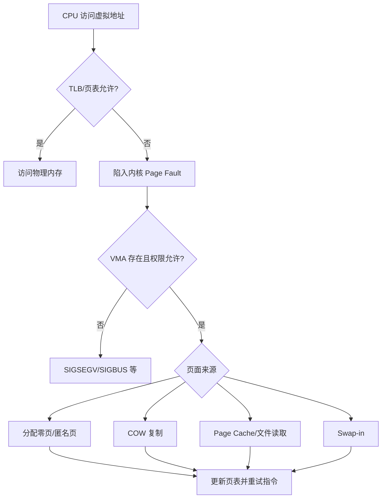

# 虚拟地址、页表、TLB 与缺页异常：CPU 怎样找到真正的内存

进程读写的是虚拟地址。CPU 的 MMU 根据当前地址空间的页表把它翻译成物理地址，并在 TLB 中缓存近期翻译。内核负责创建页表、处理缺页并保证不同进程隔离。

## 1. 为什么要有虚拟地址

虚拟内存提供：

- 每个进程独立、连续的地址视图。
- 页级读、写、执行权限。
- 按需分配，保留地址不必立即占物理页。
- 同一物理页映射到多个地址，实现共享库和共享内存。
- 文件映射、COW、Swap 和 NUMA 迁移的统一基础。

虚拟地址空间大小由 CPU 架构和内核配置决定，不等于机器安装的 RAM。

## 2. VMA 与页表分工

`vm_area_struct` 描述一段连续虚拟地址的高层语义：范围、权限、匿名或文件来源等。页表描述具体虚拟页到物理页的映射和硬件权限。

```text
mm_struct
├── VMA A：代码，r-x，文件映射
├── VMA B：数据，rw-，文件/匿名
├── VMA C：堆，rw-，匿名
├── VMA D：共享库
└── VMA E：栈，rw-，匿名

虚拟地址
→ 找到所属 VMA 并检查语义权限
→ 多级页表定位 PTE
→ 物理页帧 + 页内偏移
```

VMA 存在不代表每个页面都已经驻留，也不代表页表项已经建立。

## 3. 多级页表为什么存在

如果为巨大虚拟地址空间建立一张完全展开的线性表，会浪费大量内存。多级页表只为实际使用的地址范围分配中间层。具体层数、页大小和条目格式依架构及配置变化。

以常见 4 KiB 基础页为例，虚拟地址可概念性拆成多个页表索引和 12 位页内偏移。不要把 4 KiB 当成所有架构唯一页大小。

## 4. TLB 为什么关键

每次内存访问都走多级页表会增加多次内存读取。TLB 缓存虚拟页到物理页的近期翻译：

- TLB hit：快速得到翻译。
- TLB miss：硬件或软件遍历页表后填充 TLB。
- 页表无有效映射/权限不符：触发 Page Fault。

任务切换、修改页表、迁移页面时需要维护 TLB 一致性。多核上的 TLB shootdown 会通过跨 CPU 通知使旧翻译失效，大规模映射变化可能形成性能成本。

## 5. Page Fault 的处理



Minor Fault 一般不需要等待目标页面从块设备读入，例如零页、已有 Page Cache 或 COW 映射；Major Fault 通常需要存储 IO。两者都可能有明显 CPU 成本，Minor 不等于免费。

## 6. 权限与 NX

页表项和 VMA 共同表达读写执行权限。典型代码段可读可执行但不可写，数据段可读写但不可执行。W^X、安全模块和硬件 NX 能降低把数据页直接作为代码执行的风险，但 JIT 等场景需要受控地改变映射权限。

## 7. 如何观察

```bash
cat /proc/<PID>/maps
grep -E '^(Rss|Pss|Anonymous|AnonHugePages|Private|Shared)_' /proc/<PID>/smaps_rollup
pidstat -r -p <PID> 1
perf stat -e page-faults,minor-faults,major-faults -p <PID> -- sleep 10
```

示例 `maps`：

```text
55d8c1c00000-55d8c1c21000 r--p 00000000 08:02 1234 /usr/bin/example
55d8c1c21000-55d8c1d00000 r-xp 00021000 08:02 1234 /usr/bin/example
7f1a84000000-7f1a84200000 rw-p 00000000 00:00 0
```

地址范围是虚拟地址；权限最后的 `p/s` 表示 private/shared 映射语义，不是当前页面是否实际被多个进程共享。

## 8. 常见误解

- Page Fault 不等于程序错误。
- TLB miss 不等于 Page Fault；页表可能有效。
- VIRT 大不等于物理内存占用大。
- Major Fault 多不一定是 Swap，也可能是文件页从存储读入。
- 页表本身也占用物理内存，大量稀疏映射并非完全无成本。

## 9. 练习与答案

**问题：进程第一次写刚分配的匿名内存，为什么可能产生 Minor Fault？**

答案：地址范围已合法，但物理页可能尚未分配。首次写触发缺页，内核分配清零页并建立页表，不需要从磁盘读取，因此通常计为 Minor Fault。

**问题：TLB miss 后一定进入内核吗？**

答案：不一定。很多架构由硬件完成页表遍历并填充 TLB；只有映射缺失、权限错误或特定架构需要软件处理时才进入相应异常路径。

下一篇：[进程地址空间、brk、mmap 与 malloc](./02-进程地址空间-brk-mmap与malloc.md)
