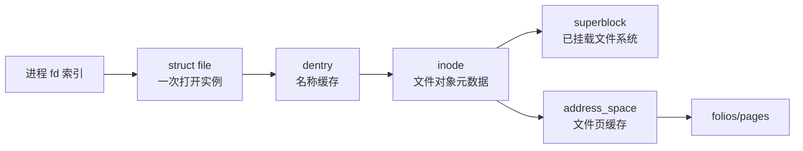

# VFS 核心对象：superblock、inode、dentry、file 与 addressspace

VFS 让同一套 `open/read/write/stat` 接口适用于本地磁盘、内存文件系统和网络文件系统。统一的不是底层存储实现，而是对象模型和操作表。

## 1. 对象关系



### 1.1 superblock {/* #superblock */}

代表一个已挂载文件系统实例的全局状态，包括块大小、根 dentry、文件系统操作、标志和底层设备/远端上下文。它不等于磁盘分区本身。

### 1.2 inode {/* #inode */}

表示文件系统对象，保存类型、权限、所有者、大小、时间戳、链接计数和数据映射相关信息。文件名不保存在 inode 中；目录项负责名称关联。

### 1.3 dentry {/* #dentry */}

把一个名称与父目录和 inode 关联，并组成目录层次缓存。Negative dentry 可以缓存“此名称不存在”，避免每次失败查找都访问底层文件系统。

### 1.4 struct file {/* #struct-file */}

表示一次打开的文件描述，包含访问模式、当前偏移、标志和文件操作表。两个独立 `open` 通常得到不同实例；fork 或 `dup` 可以让多个 fd 共享同一实例和偏移。

### 1.5 address_space {/* #addressspace */}

把文件偏移与 Page Cache folio 关联，并跟踪 Dirty/Writeback 状态。名称中的 address space 不是进程 `mm_struct` 用户地址空间。

## 2. 操作表实现多态

VFS 根据对象的操作表调用具体实现：

- `file_operations`：read_iter、write_iter、mmap、fsync 等。
- `inode_operations`：lookup、create、link、rename、permission 等。
- `super_operations`：sync_fs、statfs、evict_inode 等。
- `address_space_operations`：read_folio、writepages、dirty_folio 等。

普通文件、目录、Socket、设备节点和 procfs 文件虽然都能拥有 fd，后续操作表可以完全不同。

## 3. 对象为什么不能立即释放

对象可能同时被进程 fd、当前工作目录、Mount、Page Cache、内核路径和异步 IO 引用。Linux 通过引用计数、锁和 RCU 协调生命周期。

删除文件名后：

```text
unlink 移除 dentry/降低链接计数
→ 已打开 struct file 仍持有引用
→ inode 和数据仍可被访问
→ 最后引用关闭后才具备最终回收条件
```

## 4. 同一个“文件”的多个身份

在同一挂载视图中，设备号与 inode 号常用于标识文件系统对象：

```bash
stat -c 'dev=%D inode=%i links=%h size=%s' /path/to/file
```

但它不是跨快照、OverlayFS、网络服务端重建或所有文件系统永久稳定的全局 ID。绑定挂载和 Namespace 还可能让同一对象在不同路径出现。

## 5. 缓存不是重复对象

- dcache 缓存路径名称解析结果。
- inode cache 缓存文件对象元数据。
- Page Cache 缓存文件内容。

清除其中一类缓存不等于清除其他类。它们受内存回收和对象引用影响，不能为追求“看起来 free 多”在生产中随意清除。

## 6. 源码阅读入口

以固定内核基线阅读：

| 对象/路径 | 主要位置 |
|---|---|
| VFS 对象定义 | `include/linux/fs.h`、`include/linux/dcache.h` |
| 打开路径 | `fs/open.c`、`fs/namei.c` |
| 读写通用层 | `fs/read_write.c` |
| Page Cache 文件映射 | `mm/filemap.c` |

具体文件系统会在 `fs/ext4/`、`fs/xfs/` 等目录实现操作表。

## 7. 练习与答案

**问题：两个文件名可以对应同一个 inode 吗？**

答案：可以，同一文件系统中的硬链接让多个 dentry 名称引用同一 inode。符号链接则有自己的 inode，内容保存目标路径。

**问题：为什么两个 fd 的数字都为 3，却可能是不同文件？**

答案：fd 是各进程自己的文件描述符表索引，只有结合进程上下文才能解释。

下一篇：[路径解析、dcache 与符号链接](./02-路径解析-dcache与符号链接.md)
