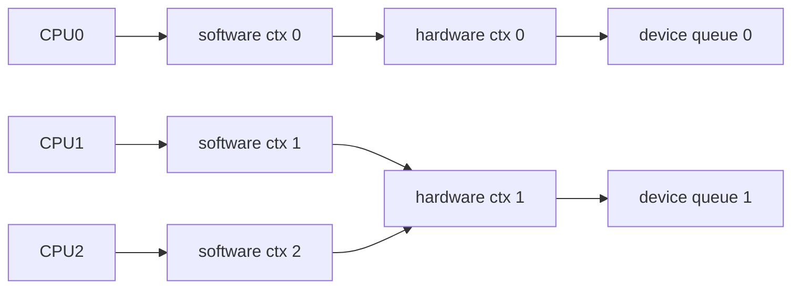

# bio、request 与 blk-mq：现代 Linux 块层怎样组织请求

文件系统或裸块路径需要表达“把这些内存段与设备上的这些逻辑块进行读写”。`bio` 负责描述块 IO，块层可把兼容 bio 合并成 request，再通过 blk-mq 分发给驱动。

## 1. bio 表达什么

概念上，一个 bio 包含：

- 目标块设备。
- 起始扇区和操作类型。
- 一组指向内存页/folio 片段的向量。
- 标志、优先级和完成回调。

一个逻辑请求的数据缓冲区不必在物理内存连续，scatter-gather 能让设备通过多个 DMA 段传输。

## 2. request 的作用

块层可以把相邻、方向一致且满足限制的 bio 合并为 request，减少设备命令和固定开销。request 还承载 tag、超时、调度和驱动私有信息。

不是所有 bio 都会合并，设备最大扇区数、段数量、对齐、flush/FUA 边界和调度策略都会限制合并。

## 3. blk-mq 的两级队列



- Software staging context 尽量靠近提交 CPU，降低共享锁竞争。
- Hardware dispatch context 对应驱动/设备可并行提交队列。
- 映射不是固定一 CPU 一硬件队列；取决于设备队列数、CPU 拓扑和驱动。

## 4. Tag 和队列深度

驱动用 tag 标识在途 request，并在完成时找到对应请求。可用 tag 数限制队列中能同时在途的请求数量。tag 耗尽时，上层会等待或重新排队。

更深队列可提高并行设备吞吐，却也可能增加排队延迟。低延迟服务和离线吞吐任务的最佳深度不同。

## 5. Plug 与合并

内核可短暂 plug 一批请求，在 flush 时合并后提交，以减少小 IO 开销。应用看到多个 write/read 不意味着设备逐条收到同样形状命令。

## 6. 完成路径

```text
驱动提交 request
→ 设备执行并 DMA
→ 中断或轮询取得 completion
→ 驱动按 tag 找回 request
→ blk-mq 完成 request
→ 逐层完成 bio
→ 解锁页面/结束 Direct IO/唤醒任务
```

完成可能在中断、软中断或延后上下文中继续处理，具体驱动和模式不同。

## 7. 观察 sysfs

```bash
cat /sys/block/DEVICE/queue/nr_requests
cat /sys/block/DEVICE/queue/nr_hw_queues 2>/dev/null
cat /sys/block/DEVICE/queue/max_sectors_kb
cat /sys/block/DEVICE/queue/max_segments
cat /sys/block/DEVICE/queue/scheduler
```

这些是当前块设备暴露的上限/配置，不等于设备内部真实全部能力；虚拟设备还可能继承或组合下层限制。

## 8. 练习与答案

**问题：一个 bio 是否一定对应一个设备命令？**

答案：不一定。多个 bio 可合并进一个 request，一个 bio 也可能因设备限制被拆分，虚拟块层还会重新映射到多个下层 IO。

**问题：把队列深度调得越大是否越好？**

答案：不是。深度可以增加并行度和吞吐，也会增加排队和尾延迟，并可能压垮共享后端。

下一篇：[IO 合并、队列深度与调度器](./03-IO合并队列深度与调度器.md)
