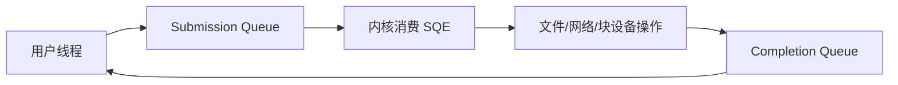

# 同步、异步 I/O 与 iouring：提交、等待和完成如何分离

“非阻塞”和“异步”不是同义词。非阻塞调用要求当前无法完成时尽快返回；异步 IO 则把提交和完成分开，调用者稍后从完成事件取得结果。

## 1. 四种概念

| 概念 | 核心问题 |
|---|---|
| 阻塞 | 当前线程是否睡眠等待条件 |
| 非阻塞 | 条件未满足时是否立即返回 EAGAIN/部分结果 |
| 同步 | 调用返回时操作完成边界如何定义 |
| 异步 | 是否先提交，稍后独立获得 completion |

普通文件设置 `O_NONBLOCK` 往往不会让磁盘 IO 变成真正异步；Socket、pipe 等有清晰的“当前无数据”非阻塞语义。

## 2. 线程池不等于内核异步

应用可以把阻塞 read/write 交给线程池，让主线程不阻塞。这是有效工程模型，但内核看到的仍是工作线程执行同步系统调用。线程栈、调度和上下文切换是其成本。

## 3. Linux AIO

传统 Linux native AIO 接口主要在 Direct IO 等路径中使用，Buffered IO 支持和语义受版本/文件系统限制。应用不能仅看到 AIO API 就假设所有操作都异步下发。

## 4. io_uring 基本结构

用户空间和内核共享环形队列，批量提交/收割可减少系统调用和数据结构转换。SQE 描述操作，CQE 返回用户数据标识、结果和 flags。

## 5. 并非所有操作都完全无阻塞

io_uring 可以直接走异步能力，也可能把某些可能阻塞的操作交给内核工作线程。是否发生取决于操作类型、文件系统、flags 和内核版本。

固定文件、固定缓冲区可减少每次注册/查找/映射成本，但会 pin 资源，增加生命周期和内存管理责任。

## 6. SQPOLL 与 IOPOLL

- SQPOLL：由内核线程轮询提交队列，减少提交系统调用，但持续消耗 CPU 并涉及权限/亲和性。
- IOPOLL：对支持的存储路径轮询完成，适合特定低延迟 Direct IO 场景，同样消耗 CPU。

它们不是通用加速开关，应以尾延迟、CPU 成本和隔离为依据。

## 7. 顺序、取消和错误

异步系统最难的不是提交，而是生命周期：

- 多操作之间是否允许乱序。
- 超时与取消是否真正阻止底层操作。
- 缓冲区在完成前是否仍有效。
- fd 关闭/复用与在途请求如何协调。
- 部分完成和重试如何处理。
- 进程退出时资源如何清理。

## 8. 练习与答案

**问题：把同步 read 放入线程池，主线程不阻塞，算异步吗？**

答案：从应用架构看提交者获得异步效果；从内核 IO 接口看，工作线程仍执行阻塞同步调用。分析时必须说明观察层次。

**问题：io_uring 是否保证所有文件操作都不使用工作线程？**

答案：不保证。某些路径缺少真正异步能力或可能阻塞时，内核可能使用辅助工作线程，取决于版本和操作。

下一篇：[SCSI、SATA 与 NVMe](./06-SCSI-SATA与NVMe.md)
