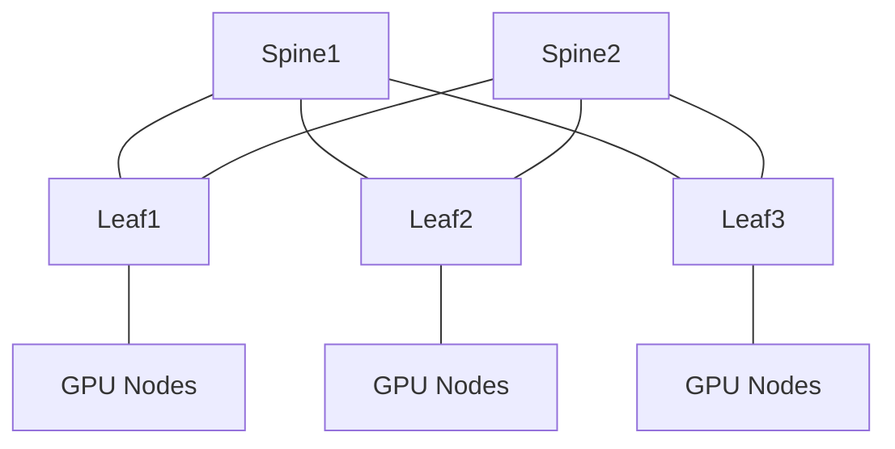

# AI Fabric 拓扑与容量计算

“2 Spine + 4 Leaf”只是拓扑形状，不是容量设计。AI Fabric 必须从节点 NIC 数量、端口速率、
并行策略、通信局部性和故障后剩余容量推导。

## 1. 三种常见网络平面

| 平面 | 主要流量 | 设计关注点 |
|---|---|---|
| Compute Fabric | NCCL/RDMA Collective | 低抖动、全局带宽、GPU/NIC 亲和 |
| Storage Fabric | Checkpoint、Dataset、模型分发 | 吞吐、突发、存储端汇聚 |
| Management/In-Band | SSH、K8s、监控、镜像 | 可达性、安全、故障独立 |

可以物理隔离，也可以共享物理 Fabric 后用 VRF/QoS 隔离。选择要基于带宽、故障域、
安全和运维复杂度，不是“AI 集群一定三张网”。

## 2. 从服务器下联开始

假设：

```text
每节点 8 GPU
每节点 8 × 400G Compute NIC
每个 Rail 一张 NIC
每 Leaf 接入 8 个节点的同一 Rail
```

单 Leaf 下联总带宽：

```text
8 × 400G = 3.2T
```

若要求该 Leaf 在正常状态 1:1 无收敛，上行总有效带宽至少与 3.2T 同量级。
具体端口数还受 SerDes、Breakout、编码和设备能力约束。

## 3. 收敛比

```text
收敛比 = 下联总带宽 / 上联总带宽
```

示例：

```text
下联 3.2T，上联 3.2T → 1:1
下联 3.2T，上联 1.6T → 2:1
```

1:1 只表示端口容量不收敛，不保证：

- 所有流量均匀哈希；
- Spine 数和上行都健康；
- NIC、PCIe 和 GPU 能产生足够流量；
- 对端没有 Incast；
- 队列不拥塞；
- Collective 的 Rank 映射合理。

## 4. 二分带宽

把 Fabric 节点分成两半，跨越切面的总可用带宽称为 Bisection Bandwidth。

全局 AllReduce、All-to-All 更依赖二分带宽；强局部性的 TP/PP 映射可能减少跨切面流量。

估算步骤：

1. 根据 Rank Mapping 生成通信矩阵；
2. 统计跨 Rack、跨 Pod、跨 Rail 的字节；
3. 对每个时间窗口而非全作业平均计算；
4. 映射到 Spine/上联；
5. 加入单链路/单 Spine 故障场景；
6. 检查 P99 而不只看平均。

## 5. Clos/Fat-Tree

两层 Clos：



规模更大时增加 Super-Spine、Core 或多 Pod 层次。每增加层级都会增加跳数、成本和可能的
拥塞位置，也提高扩展规模。

## 6. 端口计算

Leaf 端口：

```text
Server-facing ports + Uplinks + MLAG/Peer（若有）+ Reserved ports
```

Spine 端口：

```text
每个 Leaf 至少一条到该 Spine 的链路 × Leaf 数
```

若使用 64×400G 交换机，不能简单假设 32 下联 + 32 上联就是最终方案。还要考虑：

- 每服务器 NIC/Rail 数；
- 每 Leaf接多少节点；
- Breakout；
- 故障后带宽；
- 线缆长度和光模块；
- 管理/边界端口；
- 扩容预留；
- 交换芯片内部 Buffer 与 Port Group。

## 7. 故障后容量

正常 1:1 不代表故障后仍 1:1。

例如 Leaf 有 8×400G 上联到 8 台 Spine：

```text
正常上行：3.2T
单 Spine/单上联故障：2.8T
故障后收敛比：3.2 / 2.8 ≈ 1.14:1
```

需要定义：

- 故障时是否允许性能降级；
- 最大允许 Step Time 增幅；
- 是否暂停新作业；
- 是否将受影响节点 Drain；
- 恢复时如何防止流量瞬间回切。

## 8. ECMP 与熵

多路径容量只有在流量能分散时才可用。检查：

- 哈希字段是否包含 RoCEv2 UDP 源端口/QP 熵；
- 同一 QP 是否保持有序；
- 多个 Channel/QP 是否分散；
- 是否存在 Hash Polarization；
- 链路速率是否一致；
- 路由是否只安装了部分下一跳。

平均每条链路 50% 不能排除某一时间窗内一条链路 100%、另一条 0%。

## 9. Compute 与 Storage 共网

Checkpoint 可能在 Step 边界产生大吞吐，模型分发可能在作业启动时形成 Incast/Outcast。

若共网：

- 建立独立流量类别；
- 计算同时发生的最坏时间窗；
- 防止存储流进入 RDMA Lossless Queue；
- 对存储端汇聚链路单独做容量；
- 用真实工作负载验证，而非只跑 NCCL。

存储协议与数据语义进入[存储模块](../../../storage/00-存储技术学习路线.md)继续学习。

## 10. 容量设计表

```text
GPU 节点数:
GPU/节点:
NIC/节点:
NIC 速率:
Rail 数:
Leaf 数:
节点/Leaf/Rail:
Leaf 下联:
Leaf 上联:
正常收敛比:
N-1 收敛比:
二分带宽:
最坏 Collective:
允许性能降级:
扩容目标:
```

## 11. 验证

1. 用实际线缆表和 LLDP 验证拓扑。
2. 检查所有链路 Speed/Width/MTU。
3. 用多对多 perftest 验证 ECMP。
4. 用 AllReduce 和 All-to-All 验证不同通信矩阵。
5. 断开单上联，测 N-1 带宽与 Step Time。
6. 同时运行 Checkpoint 流量，验证隔离。
7. 保存每条上联利用率和队列水位分布。

## 12. 掌握标准

能从 128/1024/更大 GPU 规模推导服务器 NIC、Leaf/Spine 端口和正常/N-1 容量；
能解释为什么端口 1:1 仍可能出现热点，并用通信矩阵和链路时间序列证明。
