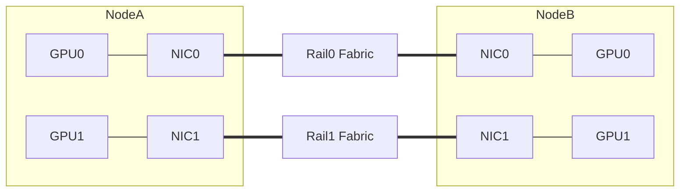

# Rail-Optimized 与 Multi-Rail

多 Rail 不是“服务器插多张网卡”。Rail 是从 GPU/NIC 亲和、服务器端口、Leaf、Spine 到
远端同类端口的一条逻辑/物理通信平面。

## 1. Rail 的目标

假设每节点 8 GPU、8 NIC：

```text
GPU0 ↔ NIC0 ↔ Rail0
GPU1 ↔ NIC1 ↔ Rail1
...
GPU7 ↔ NIC7 ↔ Rail7
```

理想情况下，同一 Local GPU Index 的跨节点通信走对应 Rail，减少节点内跨 PCIe/NVLink
转发并并行使用多张 NIC。

## 2. Rail-Optimized 拓扑



Rail 可以使用完全独立交换机，也可以共享部分 Spine/机框。必须明确共享组件，否则不能宣称
“Rail 故障独立”。

## 3. 两种常见设计

### 独立 Rail

- 每个 Rail 有独立 Leaf/Spine；
- 故障隔离清晰；
- 线缆和交换机数量多；
- 跨 Rail 通信需要节点内或专门网关路径。

### 统一 Fabric 中的多端口

- 多 NIC 接入同一 Clos；
- 路由与运维更统一；
- 共享故障域更大；
- 必须防止多 NIC 哈希到相同瓶颈。

选择要结合规模、成本、容错和 NCCL 拓扑支持。

## 4. Rank Mapping

建立映射：

```text
Global Rank
→ Node
→ Local Rank
→ GPU PCI BDF
→ Preferred NIC PCI BDF
→ RDMA Device/Port
→ Rail
→ Leaf Port
```

如果 Local Rank 与 GPU/NIC 枚举在节点间不一致，逻辑 Rail 可能交叉。节点验收必须校验硬件
一致性，而不是假设所有服务器编号相同。

## 5. NCCL 与 HCA 选择

NCCL 可以使用多个 HCA/Channel，具体选择随版本、拓扑和插件变化。

验证：

- NCCL 日志列出哪些 HCA；
- 每个 Rail 实际有流量；
- GPU/NIC 距离符合设计；
- 单 Rail/多 Rail 性能差异；
- 禁用一条 Rail 后是否按预期失败或降级。

不要只用 `NCCL_IB_HCA=mlx5_0,mlx5_1...` 强制全部设备。先解决持久命名、拓扑和自动发现。

## 6. 带宽聚合的边界

理论聚合：

```text
总 NIC 线速 = Rail 数 × 单 Rail 线速
```

实际瓶颈可能是：

- GPU HBM/通信 Kernel；
- NVLink/NVSwitch；
- PCIe Switch 上行；
- 单 Root Complex；
- CPU/NUMA；
- NCCL Channel；
- Leaf/Spine 端口；
- 远端 GPU/NIC；
- Collective 本身的数据分布。

双 Rail 不增速时，先找共享瓶颈，不要直接判定“NCCL 没有用双网卡”。

## 7. Rail 内与跨 Rail

严格 Rail-Optimized 设计希望同 Rail 端点直接通信。但 Collective Rank 映射、故障绕行或
不规则工作负载可能产生跨 Rail 需求。

必须明确：

- Fabric 是否允许跨 Rail 路由；
- 跨 Rail 经哪里转发；
- 是否会形成带宽更低的瓶颈；
- 故障时是否允许跨 Rail 兜底；
- 兜底会不会扩散拥塞。

## 8. 故障语义

一条 Rail 故障可能导致：

- 作业立即失败，由训练框架重启；
- NCCL 使用其他 HCA 继续但性能下降；
- 部分 Rank Timeout；
- 流量集中到剩余 Rail，引发二次拥塞；
- 新作业仍被调度到坏节点。

设计时定义：

```text
发现时间
作业行为
节点是否隔离
剩余容量
自动恢复条件
是否允许无感回切
```

## 9. 布线和身份

每条线缆记录：

```text
Node / NIC PCI / Port
→ Cable ID
→ Leaf / Port
→ Rail
→ Speed / Optic
```

自动检查：

- 同一节点两张 NIC 是否误接同一 Rail；
- Rail0 是否接到预期 Leaf Group；
- 端口速率和 FEC 是否一致；
- Node Label/资源名是否与物理 Rail 一致；
- 换卡后 PCI BDF/接口名是否变化。

## 10. 实验

1. 建立 2 节点、2 GPU、2 NIC、2 Rail 映射。
2. 单独测试每条 Rail 的 Host/GPU RDMA。
3. 同时运行两 Rail，检查带宽和每 Rail 分布。
4. 交换其中一台节点的 NIC 接线，验证自动检查发现错误。
5. 断开 Rail0，观察 NCCL、训练和监控。
6. 测故障后 Rail1 队列、ECN、PFC 和 Step Time。
7. 恢复 Rail0，观察是否抖动或无序回切。

## 11. 掌握标准

能够画出任意 Rank 的物理 Rail；能区分多 NIC、Multi-Rail 和真正的故障独立；
能解释双 Rail 性能不翻倍的可能瓶颈，并设计 Rail 故障后的容量和作业处置。
