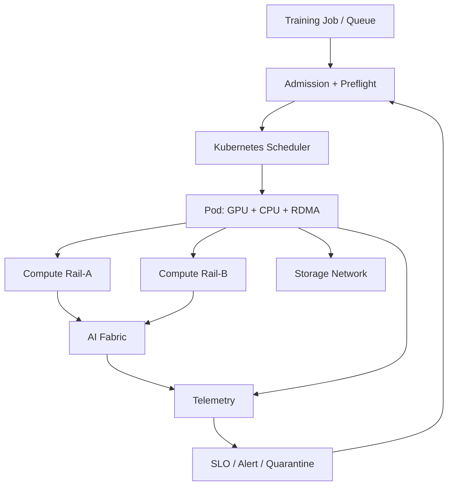

# 生产级 AI 集群网络综合项目

本项目验收整套 AI 组网课程。最终交付不是一份交换机配置，而是一套从训练需求到
网络交付、观测、故障隔离和变更回滚的系统。

## 1. 场景

建设一个小型训练平台：

- 8 台 GPU 节点，每台 8 GPU；
- 每台 2 或更多 RDMA NIC，双 Rail；
- RoCEv2 或 InfiniBand Fabric；
- Kubernetes；
- GPU Operator 与网络组件；
- 共享 RDMA 和 SR-IOV 任选其一作为主路径，并说明选择；
- 支持 DP、TP 和一个 MoE All-to-All 测试；
- Compute、Storage、Management 路径边界明确。

硬件不足时可缩小节点/GPU 数，但所有设计表和故障域仍按可扩展方案完成。

## 2. 需求

### 功能

- Pod 获得 GPU、CPU、Memory、RDMA NIC 和两张辅助网络；
- Rank 使用预期 GPU/NIC/Rail；
- NCCL 使用 RDMA/GDR；
- 训练/测试跨 Node 工作；
- Storage 不进入错误 Lossless Queue；
- 网络相关异常能阻止新作业进入坏节点。

### 可靠性

- 单上联故障不丢失 Fabric 可达；
- 单 Rail 故障行为有明确定义；
- 单坏节点在目标时间内 Quarantine；
- 变更按故障域 Canary；
- Telemetry 缺失状态为 Unknown；
- 有回滚和证据。

## 3. 架构交付



文档包含：

- 物理/逻辑拓扑；
- Rail 与故障域；
- IP/GID/LID/PKey/VLAN；
- 路由和 MTU；
- QoS/PFC/ECN/SL/VL；
- Kubernetes Resource/NAD；
- GPU/NIC/NUMA；
- 安全边界；
- 容量和 SLO。

## 4. Source of Truth

每节点记录：

```yaml
node: gpu-node-01
topology_class: 8gpu-dual-numa-dual-rail
gpus:
  - uuid: GPU-...
    pci: "0000:31:00.0"
    numa: 0
nics:
  - pci: "0000:5e:00.0"
    rdma: mlx5_0
    netdev: ens5f0np0
    numa: 0
    rail: rail-a
    switch_port: leaf-a1/1
```

自动对账实际 BDF、Link、Resource 和线缆。

## 5. Kubernetes 交付

必须验证：

- 默认 CNI；
- Multus；
- 每 Rail NAD；
- RDMA Shared 或 SR-IOV Device Plugin；
- GPU Device Plugin；
- Topology Manager/CPU Manager；
- Resource Request；
- Pod 内接口、Route、RDMA Device；
- GPU/NIC/CPU NUMA；
- Namespace/RBAC/NetworkPolicy 边界。

所有 Manifest 固定版本和 Digest，并说明当前支持矩阵。

## 6. 分层基线

```text
PCIe/NVLink
→ Host Memory RDMA
→ GPU Memory RDMA
→ 单机 NCCL
→ 双机 NCCL
→ 8 节点 NCCL
→ DP/TP/All-to-All 工作负载
```

消息矩阵：

- 小/中/大消息；
- AllReduce/AllGather/ReduceScatter/All-to-All；
- 单 Rail/双 Rail；
- 正常/N-1；
- 单作业/多作业；
- Checkpoint 并发。

保存 P50/P95/P99、`algbw/busbw`、每 Rail 和队列计数。

## 7. Preflight 与 Admission

实现：

```text
Node Static Check
→ Rail RDMA Check
→ GDR Check
→ NCCL Check
→ Topology Hash
→ Ready/Degraded/Quarantined/Unknown
→ Scheduler/Queue Admission
```

故意让一个节点 NIC 降速，证明：

- Preflight 发现；
- 状态在 TTL 内更新；
- 新作业不再选择；
- 修复并连续通过后恢复。

## 8. 观测

统一 Run ID 和时间线：

- Job/Pod/Rank；
- GPU/NVLink/PCIe；
- NIC/RDMA；
- Switch Port/Queue；
- PFC/ECN/CNP；
- NCCL；
- Step Time；
- Change Event。

大盘至少支持 Job、Node、Rail 三种下钻。

## 9. 故障演练

必须完成：

1. NCCL 错选默认/管理网；
2. GID/Netdev 映射错误；
3. GPU/NIC 跨 NUMA；
4. 单链路 MTU 不一致；
5. 单 ECMP 上联断开；
6. 单 Rail 失效；
7. ECN Profile 不生效；
8. PFC Priority 一跳不一致；
9. 接收节点降速形成拥塞树；
10. SR-IOV VF/共享资源耗尽；
11. Multus/IPAM 创建失败；
12. Telemetry 中断；
13. Driver Canary 回归；
14. NCCL Timeout 的首个坏 Rank；
15. Storage 流误入 Lossless Queue。

每个故障要有最早信号、根因层、恢复和防复发。

## 10. 安全变更

选择一项真实变更，例如 NIC Driver 或 ECN Threshold：

```text
PR/审批
→ 静态验证
→ 实验集群
→ 单节点/单 Rail Canary
→ Host/GPU RDMA
→ NCCL
→ 小训练作业
→ 观察
→ 分故障域扩大
```

故意触发停止条件，验证不会继续。

## 11. 容量与 SLO

定义：

- 正常/N-1/N-Rail 容量；
- 节点/Leaf/Spine/Rail 故障影响；
- RDMA/GDR/NCCL 可用性；
- 同类基线性能 SLI；
- PFC Storm/RDMA Retry；
- 故障隔离时间；
- 网络相关失败 GPU Hours；
- Change Success/Unknown。

让作业队列在故障后根据剩余容量做 Admission。

## 12. 仓库

```text
ai-network-platform/
├── architecture/
├── source-of-truth/
├── kubernetes/
├── fabric/
├── qos/
├── preflight/
├── telemetry/
├── baselines/
├── runbooks/
├── failure-drills/
├── changes/
└── slo/
```

## 13. 最终答辩

- 为什么多 Rail 不等于带宽线性相加？
- 为什么 PFC Frame 非零不一定是故障，持续 Pause 却很危险？
- 为什么 Pod 有 VF 仍可能没有可用 RDMA？
- Scheduler 和 Topology Manager 分别解决什么？
- 如何证明 NCCL 使用 GDR 和预期 Rail？
- 如何从 Step P99 找到拥塞树根部？
- 单 Rail 故障后为什么可能要拒绝新作业？
- Driver 回滚后为什么还要重跑 Host/GPU RDMA 和 NCCL？

能用项目数据、配置、日志和故障演练回答，才算具备生产级 AI 集群网络能力。

## 后续串联

- [GPU 网卡存储联合拓扑调度](../../../projects/ai-infra-end-to-end/05-GPU网卡存储联合拓扑调度.md)
- [NCCL Timeout 排查流程](../../../gpu/cluster/troubleshooting/07-NCCL%20Timeout%20排查流程.md)
- [存储技术学习路线](../../../storage/00-存储技术学习路线.md)
