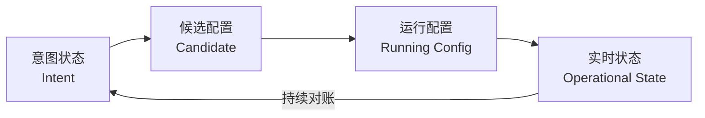

# 网络自动化架构与安全边界

自动化可以把一次正确操作扩展到一千台设备，也能把一个错误在一分钟内扩散到一千台设备。生产级自动化的第一课不是语法，而是**控制故障半径**。

## 1. 区分四种状态



| 状态 | 例子 | 来源 |
|---|---|---|
| 意图状态 | Leaf1 属于 Tenant-A，VNI=10100 | NetBox/Git/业务系统 |
| 候选配置 | 模板渲染后准备提交的配置 | 自动化流水线 |
| 运行配置 | 设备当前保存和使用的配置 | 设备配置库 |
| 实时状态 | BGP 是否 Established、接口是否丢包 | 设备运行数据 |

配置下发成功，只证明候选配置可能进入了运行配置，不能证明实时状态符合意图。

## 2. 幂等与收敛

**幂等**意味着对相同目标重复执行，不应不断产生新变化。

```text
目标：VLAN 100 的描述为 web
第一次：创建或修改
第二次：无变化
```

但真实网络还需要**收敛**：如果有人手工把描述改为 `test`，系统下一次对账能检测偏差，并按策略告警或恢复到 `web`。

需要明确每个字段的所有权：

- 自动化独占：检测到漂移可自动修复；
- 共享管理：检测后需要人工确认；
- 只读观察：系统不得修改；
- 临时豁免：必须有过期时间和负责人。

## 3. 一个安全执行器的生命周期

```text
读取意图
→ 校验 Schema 与业务约束
→ 获取设备基线和版本
→ 生成候选配置与差异
→ 静态/语义验证
→ 人工审批
→ 小批量执行
→ 每台设备立即验证
→ 达到停止条件则终止
→ 全部通过后扩大批次
→ 保存证据并持续观察
```

### 3.1 变更前护栏 {/* #变更前护栏 */}

- 输入必须通过类型、范围、唯一性和引用完整性校验；
- 候选配置必须能解析；
- 禁止删除管理地址、认证、唯一上联等关键对象；
- 设置允许变更的设备集合和命令集合；
- 计算差异规模，超过阈值需要更高级别审批；
- 验证备份可读且能恢复。

### 3.2 执行中护栏 {/* #执行中护栏 */}

- 设置连接超时、命令超时和总任务截止时间；
- 限制并发，按故障域分批；
- 同一设备使用互斥锁，避免两个任务同时改配置；
- 每个步骤生成关联 ID和审计日志；
- 重试只用于明确可安全重试的操作；
- 任何停止条件触发后不再开始新设备。

### 3.3 变更后护栏 {/* #变更后护栏 */}

- 关键邻居、路由、接口、可达性和业务 SLI 必须通过；
- 观察窗口应覆盖协议收敛和典型连接周期；
- 失败要区分自动回滚、人工回滚和停止等待；
- 回滚后也必须重新验证，不能把“执行了回滚命令”当成功。

## 4. 为什么不能盲目重试

读取类任务通常可安全重试；配置类任务要判断操作是否幂等。

危险例子：

```text
第一次提交已经生效，但客户端因超时没收到响应
客户端认为失败并再次执行“追加一条 ACL”
结果出现重复项或顺序变化
```

改进方法：

- 优先使用声明式资源模型；
- 给任务和变更设置唯一 ID；
- 重试前重新读取实际状态；
- 使用设备支持的 candidate/commit confirmed/事务能力；
- 明确哪些失败状态需要人工判定。

## 5. 灰度必须按故障域设计

错误方式：随机选择 10% 的设备。

更合理的批次：

```text
实验设备
→ 单个非关键 Leaf
→ 一个机架中的一台冗余设备
→ 单可用区小批次
→ 多可用区逐批
```

同一冗余对不能同时进入首批。每批要有独立观察和停止条件。

示例停止条件：

```text
BGP 邻居下降 > 0
关键前缀减少 > 1%
接口丢包增量 > 阈值
业务成功率下降 > 0.5%
单台执行时间超过基线 3 倍
```

## 6. 凭据和权限

- 机器身份与个人身份分离；
- 凭据存放在 Secret Manager/Vault，不进 Git、日志和命令行参数；
- 只读巡检账号不能获得配置权限；
- 生产写权限按设备、命令、时间窗口最小化；
- 所有敏感输出在日志中脱敏；
- 定期轮换，离职和角色变化后立即撤销；
- 自动化平台本身也要有高可用、补丁和审计。

## 7. 失败语义

任务结果不能只有成功/失败两个值。至少区分：

```text
PLANNED      已生成计划，未执行
SKIPPED      不满足前置条件
CHANGED      配置有变化且验证通过
UNCHANGED    已符合意图
FAILED_SAFE  失败但未改变设备
FAILED_DIRTY 失败且设备状态可能部分改变
ROLLED_BACK  已回滚并验证
UNKNOWN      无法确认最终状态，必须人工处理
```

其中 `UNKNOWN` 最危险：网络可能已经改变，只是控制端不知道结果。

### 7.1 响应丢失时，不能从超时倒推未执行

设执行器读到配置版本 v10，生成把 NTP 源改为 A 的计划，提交后连接超时。至少存在三种真实状态：命令没到设备、设备仅应用部分命令、设备已全部应用但响应丢失。

因此超时应先进入 UNKNOWN，而不是自动返回 FAILED_SAFE。重新读取时，将实际配置与 v10、目标候选及变更日志对照：仍是基线才考虑重新计划；已等于目标则继续验证运行状态；部分改变或有他人新修改则不能简单重发旧计划。

任务 ID 用于关联证据，不自动提供 Exactly Once（恰好一次执行）。只有接收端真的保存并识别幂等键、定义其有效期和结果查询语义，重复请求才可能被去重。设备不支持时，应依靠读取、差异计算和明确的未知状态处理。

### 7.2 设备锁、版本检查和失效执行者

同一设备锁可以避免协作执行器同时写，但锁到期后旧执行器可能仍在运行。若设备不校验新的所有权代数，旧执行者仍可继续发送命令；一把控制端分布式锁并不能天然阻止它。

可采用设备原生 datastore lock、可用的版本前置条件、单写入通道与任务截止检查等组合。基线 Hash 也只是发现漂移的证据，若比较 Hash 和实际写入之间没有原子约束，仍存在检查后被修改的窗口。相关条件写入思想见 [HTTP 条件请求](https://www.rfc-editor.org/rfc/rfc9110.html#section-13)，设备事务见 [NETCONF](https://www.rfc-editor.org/rfc/rfc6241.html)。

### 7.3 多设备协调为什么需要中间状态设计

给两端增加一个新 VLAN，如果 A 成功、B 失败，单台原子提交并不能让两台一起恢复。变更计划需要定义允许的中间状态和依赖：例如先使承载路径具备新 VLAN 能力，再开放相应接入，最后移除旧路径。

增加、切换和删除的顺序由具体协议决定，这不是通用的三步配置脚本。补偿操作也不一定等于恢复备份：期间他人增加的合法配置、动态会话和已经撤销的路由都不能凭一个文件恢复全部历史。

“停止任务”只是不再调度后续动作，不等于远端在途命令取消，更不等于回滚。执行器应区分尚未开始、已发送、已确认、运行验证中和未知结果，防止报告比设备实际状态更乐观。

## 8. 最小实践

先做一个完全只读的巡检系统：

1. 读取 3 台实验设备的接口和 BGP 状态；
2. 把原始输出、结构化结果和时间戳分别保存；
3. 为每个设备设置独立超时；
4. 一台设备不可达时，其他设备继续；
5. 最终报告要区分“检查失败”和“检查发现异常”；
6. 日志中不得出现密码或 Token。

满足以上要求后，再进入批量写配置。

## 9. 掌握标准

面对“给 500 台交换机增加一条 NTP 配置”，你应先问：

- 谁是 Source of Truth？
- 如何计算差异？
- 哪些设备先做，故障域怎么隔离？
- 设备超时后最终状态未知怎么办？
- 通过什么实时状态判断成功？
- 什么条件停止，如何回滚？
- 凭据和审计如何处理？

### 9.1 场景参考答案

500 台设备的 NTP 增量应来自版本化的意图和设备清单，逐台读取已管理字段并计算差异；按冗余关系确定批次，避免同一冗余对并发修改。下发超时先重新判定设备状态，不盲目追加；读取同步源、偏差与可信状态验证结果，而非只看配置里出现 IP。

停止条件应关联实际故障域与验证失败；回滚只恢复本次拥有的字段或通过设备支持且验证过的事务撤回，并再次检查状态。凭据与原始输出分级保存，报告关联意图版本、设备版本、操作 ID 和结果。这个答案依赖执行器实现，不是 Ansible 或 SSH 自动附带的保证。

### 9.2 思考与解答

**超时后为什么不能直接再次执行？**

设备可能已经生效，重复写入可能改变顺序或重复创建对象，应先读取状态消除结果不确定性。

**每台设备都有事务，十台设备的变更就是原子的吗？**

不是，事务边界通常止于单设备。需要设计跨设备中间状态、依赖及补偿。

**分布式锁过期后，旧执行器就必然失去写权限吗？**

不一定。除非实际写入端也强制校验所有权，否则旧执行者可能继续写。

**幂等是不是意味着没有风险？**

不是。错误目标也可以稳定地幂等收敛；正确意图、变更范围与运行验证仍不可缺少。
