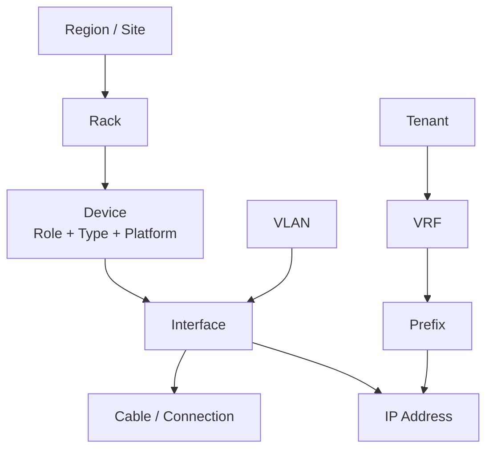

# NetBox 与网络 Source of Truth

Source of Truth（SoT）不是“把设备配置备份进数据库”，而是保存**网络应该是什么样子**。设备、监控和扫描结果描述“现在是什么样子”，二者通过对账发现漂移。

## 1. 先定义真相的所有权

一个常见分工：

| 数据 | 权威来源 |
|---|---|
| 站点、机柜、设备角色 | NetBox DCIM |
| Prefix、IP、VLAN、VRF | NetBox IPAM |
| 业务与租户关系 | CMDB/业务系统，引用到 NetBox |
| 配置模板与策略代码 | Git |
| 设备运行配置 | 设备自身，作为 Actual State |
| 接口流量和协议状态 | Telemetry/监控系统 |
| 密码和 Token | Secret Manager |

不要让同一字段同时由 NetBox、Excel、Git 和设备 CLI 都能修改却没有优先级。

## 2. NetBox 的对象关系



模型要回答业务问题，而不是单纯“把字段都填满”：

- 这个 IP 属于哪个环境和租户？
- 这个 Leaf 的两条上联终止在哪里？
- 哪个 VRF 可以导入某个前缀？
- 这个设备由哪个团队维护？
- 这个临时地址何时回收？

## 3. 地址生命周期

可以为资源定义以下概念生命周期；它混合了容器、分配阶段与释放动作，**不是 NetBox 各模型都内置的同一组 status 枚举**。实际应按对象类型和版本映射到原生状态、自定义字段或业务记录：

```text
Container/Pool
→ Reserved
→ Planned
→ Active
→ Deprecated
→ Released
```

分配 IP 时校验：

- Prefix 属于正确 VRF；
- 地址未被占用；
- 网络、广播、网关和保留地址规则；
- 站点和租户匹配；
- 双栈关系；
- 临时资源有到期时间。

扫描网络后自动把“看到的地址”写成 Active 会污染 SoT。扫描结果应作为发现事实，经过匹配和审批后再变更意图。

## 4. 从 NetBox 生成设备配置

数据流：

```text
NetBox API
→ 读取设备、接口、IP、VLAN、VRF
→ Pydantic/JSON Schema 校验
→ 转为统一 Intent Model
→ Jinja/资源模块渲染
→ 差异与语义验证
→ 审批和发布
```

不要让 Jinja 模板直接包含大量业务判断。复杂规则应在 Intent Model 层计算并测试，模板只负责表现。

API 读取示意：

```python
import pynetbox

nb = pynetbox.api("https://netbox.example", token="FROM_SECRET_STORE")

leafs = nb.dcim.devices.filter(
    site="dc1",
    role="leaf",
    status="active",
)

for leaf in leafs:
    print(leaf.name, leaf.primary_ip4)
```

Token 不应硬编码；示例中的字符串只是表达来源。

## 5. 对账而不是单向覆盖

对账结果至少分为：

| 类型 | 示例 | 动作 |
|---|---|---|
| In Sync | 描述和地址一致 | 无操作 |
| Intended Only | SoT 有接口，设备不存在 | 阻止发布并调查 |
| Actual Only | 设备有未知 VLAN | 告警或审批纳管 |
| Mismatch | MTU、描述、VLAN 不同 | 按字段所有权处理 |
| Unknown | 采集失败 | 不得判为一致 |

流程：

```text
读取 SoT 快照
→ 读取设备实际状态
→ 规范化
→ 计算差异
→ 应用所有权策略
→ 告警/工单/自动修复
→ 记录结果和证据
```

## 6. 数据质量规则

至少自动检查：

- 设备名、序列号和管理 IP 唯一；
- 活跃设备必须有站点、角色、平台和负责人；
- 生产上联必须有对端连接；
- Prefix 不得在同一 VRF 中意外重叠；
- VLAN/VNI/RT 满足编号规范；
- 设备状态为 Decommissioned 后不得仍持有活跃 IP；
- 自定义字段有类型、枚举和说明；
- Webhook/自动化不会形成循环更新。

## 7. 变更工作流

NetBox 直接编辑方便，但生产意图变更仍需要审计：

1. 用户提交业务需求；
2. 系统校验地址和对象关系；
3. 生成变更预览；
4. 审批后更新 SoT；
5. 触发配置流水线；
6. 发布成功后更新变更状态；
7. 失败时 SoT 与设备可能暂时不一致，必须明确标记并修复。

更严格的环境可把 Intent 放入 Git，经 Pull Request 审批后同步到 NetBox。

## 8. 实验

在 NetBox 建模第二阶段的 2 Spine + 4 Leaf Fabric：

- 站点、机柜、设备角色和平台；
- 所有 P2P 接口及线缆；
- Loopback、P2P Prefix；
- 3 个 Tenant、VRF、VLAN、L2VNI/L3VNI；
- Border Leaf 外部连接；
- 负责人、生命周期和变更 ID。

编写只读程序导出每台设备的统一 Intent JSON，并检查：

- 地址重复；
- 缺少对端；
- 租户 VNI 冲突；
- 活跃设备缺管理 IP；
- 退役设备仍占用地址。

## 9. 掌握标准

你应能明确解释：

- 哪些数据属于意图，哪些属于实时状态；
- 每个字段由哪个系统负责；
- 为什么扫描结果不能直接覆盖 SoT；
- 发布失败时怎样处理 SoT 与设备不一致；
- 如何通过 Schema、唯一约束、生命周期和对账维持数据可信度。

### 9.1 逻辑归属不一定是数据库外键

Prefix 包含某个 IP 的关系可以由地址族、VRF 和前缀范围推导，不等于 IP 对象必须直接保存唯一的父 Prefix 外键。一个 `/16` 容器下再有 `/24`，同一地址落入多层包含范围完全合理。

VRF 用来区分路由上下文，Tenant 是归属信息，VLAN 是二层标识，三者不是同一个隔离开关。给对象设置 Tenant 不会自动下发防火墙；在 SoT 填 RT 也不代表设备已导入对应路由。

线缆模型同样要区分接口、前后面板与实际连通路径；物理相邻不保证 BGP 已建立，LLDP 观测和路由状态是实际证据。NetBox 模型的角色是保存意图及基础设施关系，不能替代实时转发模型。

### 9.2 唯一性需要带路由域与对象范围

两个不同 VRF 可以合法拥有同一个 `10.0.0.1/24`。同一 VRF 中父 `/16` 包含子 `/24` 是合法规划；两份独立分配意图占用同一地址或同一用途边界，才可能是冲突。

NetBox 对 VRF 可配置 `enforce_unique`，全局空间有相应配置选项，不能假设默认设置就禁止所有重复。唯一前缀也不表示禁止父子嵌套。具体行为见 [VRF 模型](https://netbox.readthedocs.io/en/stable/models/ipam/vrf/)。

校验规则应区分重复值、合法包含、错误归属和跨上下文复用。设备名称、管理 IP 等约束也要写明范围，不能让规则无意禁止虚拟设备或隔离管理域的合法模型。

### 9.3 两个自动化任务同时分配地址会怎样

任务 A、B 都先 GET 空闲列表，都看到 `.10`，随后分别创建。这是典型“先检查再使用”的竞争窗口，GET 结果不能当成预留凭证。

应使用目标版本提供且语义明确的服务端分配接口或受约束事务，配合唯一性规则、请求关联 ID 与冲突重试。不能假定给客户端加一把锁就覆盖了人工界面及所有其他客户端，也不能未经核对就声称某个 API 在所有版本都原子。

调用超时后先按分配请求记录或对象条件查询结果，防止实际已创建却又分配第二个地址。外部 DNS、设备下发和 NetBox 写入之间也不构成一个默认分布式事务。API 能力以 [目标实例的 API 文档](https://netbox.readthedocs.io/en/stable/integrations/rest-api/) 为准。

### 9.4 快照与 Webhook 不代表全局顺序

分别分页读取设备、接口和 IP 时，后台可能正在变化。一次生成若混合不同时间的对象，可能得到“设备已退役，IP 仍 active”的不一致组合。发布应使用可追溯快照或明确的读取版本／时间边界，并在执行前重新检查关键约束。

Webhook 应被当作需要重新取数的变更提示。处理器需考虑重复、延迟、失败与顺序，不能只按事件到达顺序覆盖状态；写回自己触发的同字段更新还可能形成循环。为事件处理定义去重、所有权与最新状态对账，而不是假设通知等于可靠状态复制。

### 9.5 实验参考答案与思考解答

2 Spine + 4 Leaf 模型应能从每个上联追到对端接口，并在正确 VRF 下查到 Loopback/P2P 地址。VLAN、VNI、RT 依业务映射校验，而非数值相同就视为一致。未配置管理 IP 的 active 设备、悬空对端、未经允许的 VNI 复用应被标记，退役时还要确认设备已停止使用地址再释放。

**同一 VRF 的 /16 与内部 /24 是重叠错误吗？**

不必然，是常见的容器与子网包含关系。需检查对象用途及实际分配，不能禁止所有包含。

**给 IP 设置 Tenant，设备就自动具备租户隔离了吗？**

没有，归属字段不是转发策略，仍需生成并验证 VRF、VLAN、路由和安全配置。

**GET 空闲地址成功就能保证创建时仍空闲吗？**

不能，中间可能被其他客户端占用。需要服务端约束、原子分配语义或明确冲突处理。

**收到一条旧 Webhook，要不要立即覆盖 SoT？**

不应。应读取当前状态，检查事件关联与字段所有权，避免旧事件倒灌或循环写入。

## 10. 参考资料 {/* #参考资料 */}

- [NetBox 官方文档](https://netbox.readthedocs.io/en/stable/)
- [NetBox REST API 文档](https://netbox.readthedocs.io/en/stable/integrations/rest-api/)
- [NetBox Custom Validation 文档](https://netbox.readthedocs.io/en/stable/customization/custom-validation/)
