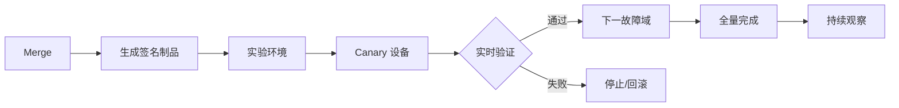

# 网络 GitOps 与变更验证

网络 GitOps 的核心不是“把配置放进 Git”，而是让每次意图变化都经过：

```text
可审查的差异
→ 自动验证
→ 明确审批
→ 可控发布
→ 实时验收
→ 可追踪回滚
```

## 1. 仓库应该保存什么

```text
network-intent/
├── inventory/
│   ├── sites.yml
│   ├── devices.yml
│   └── links.yml
├── intent/
│   ├── tenants.yml
│   ├── routing.yml
│   └── security.yml
├── schemas/
├── templates/
├── policies/
├── tests/
│   ├── unit/
│   ├── topology/
│   └── reachability/
├── pipelines/
└── docs/
```

不应提交：

- 明文密码、私钥和 API Token；
- 包含敏感数据的完整设备输出；
- 每次生成却没有审查价值的巨大临时文件；
- 不可重现来源的手工配置副本。

## 2. Pull Request 是变更单

PR 至少说明：

```text
为什么变
影响哪些站点、设备、租户和流量
预期配置差异
验证计划
灰度批次
停止条件
回滚条件和步骤
维护窗口与负责人
```

CODEOWNERS 可要求路由、安全、平台等不同所有者审批各自路径。紧急变更可以缩短流程，但不能取消事后证据和复盘。

## 3. CI 的五层验证

### 3.1 文件和 Schema

- YAML/JSON 可解析；
- 必填字段、类型和枚举；
- IP、ASN、VLAN、VNI 范围；
- 唯一性和引用完整性；
- 无明文 Secret。

### 3.2 业务约束

- 同一 VRF 中 Prefix 不意外重叠；
- 冗余设备不使用相同 Router ID；
- RT 导入导出符合租户矩阵；
- 生产设备至少有两个独立上联；
- 边界只发布允许前缀；
- ACL 不出现危险的无条件放行。

### 3.3 模板渲染与语法

- 所有目标设备都能生成候选配置；
- 使用对应平台解析器检查语法；
- 配置顺序稳定，相同输入生成相同输出；
- Diff 只包含预期对象；
- 变更行数和删除数量不超过阈值。

### 3.4 拓扑和语义验证

静态分析工具可以基于配置构建网络快照，检查：

- BGP/OSPF 会话是否能建立；
- 路由是否可达；
- 流量是否被 ACL 允许或拒绝；
- 是否出现环路、黑洞或错误默认路由；
- 新旧快照的行为差异。

Batfish Python API 的典型思路：

```python
from pybatfish.client.session import Session

bf = Session(host="batfish")
bf.set_network("fabric")
bf.init_snapshot("snapshot/new", name="candidate", overwrite=True)

answer = bf.q.bgpSessionCompatibility().answer()
print(answer.frame())
```

具体 Query、厂商语法支持和结果字段以当前官方文档为准。静态分析也不能模拟所有硬件 Bug 和实时状态。

### 3.5 策略即代码

把高价值不变量写成测试：

```text
管理网永远不能从租户网访问
Tenant-A 与 Tenant-B 永远隔离
所有 Leaf 都有两条到 RR 的控制面路径
默认路由只能从批准的边界节点进入
数据库端口只允许应用子网
```

测试应表达业务行为，而不是绑定某一行厂商 CLI。

## 4. CD 不是“CI 绿了就全网下发”

安全发布：



发布输入必须与 CI 审核的是同一 Commit 和同一构建制品，不能在发布阶段重新读取变化中的外部数据并生成另一份配置。

## 5. 变更前后快照

基线：

- Running Config Hash；
- BGP/OSPF 邻居；
- 路由和前缀计数；
- 关键路径探测；
- 接口状态、丢包、错误；
- 业务 SLI。

变更后用相同方法采集，并区分：

- 预期变化；
- 无关变化；
- 协议自然波动；
- 明确回归。

## 6. 回滚的现实限制

Git Revert 只回滚仓库意图，不会自动回滚设备。完整回滚需要：

1. 确认当前设备状态；
2. 生成或选择反向配置；
3. 防止覆盖变更期间的其他合法修改；
4. 按故障域执行；
5. 验证路由和业务恢复；
6. 让 SoT、Git 和设备再次一致。

某些故障适合“向前修复”而非还原，例如旧配置本身已经不再安全。Runbook 要提前定义。

## 7. 实验

为第二阶段 Fabric 建立 GitOps 流水线：

1. `tenants.yml` 新增 Tenant-D；
2. Schema 检查 VNI、RT、Prefix；
3. 生成 4 台 Leaf 候选配置；
4. 检查只有目标 Leaf发生变化；
5. 用静态分析验证 Tenant-D 可达自身服务、不能访问其他租户；
6. 合并后只发布一台 Canary Leaf；
7. 验证 EVPN 路由、VNI、测试流；
8. 扩大到冗余对的另一台；
9. 故意制造错误 RT，证明 CI 或发布后验证会阻止扩散；
10. 保存审计证据。

## 8. 掌握标准

你应能让一次网络变更做到：

- 任何人都能看到意图和差异；
- 自动检查结构、语法、拓扑和业务不变量；
- 审核内容与实际发布制品一致；
- 失败只影响一个可控故障域；
- 能从 Commit 找到设备命令、执行日志和验证结果；
- 回滚后 SoT、Git、配置和实时状态重新一致。

## 参考资料

- [Batfish 官方文档](https://batfish.readthedocs.io/en/latest/)
- [Batfish Configuration Analysis Queries](https://batfish.readthedocs.io/en/latest/notebooks/linked/configProperties.html)
- [GitHub Actions 文档](https://docs.github.com/actions)
