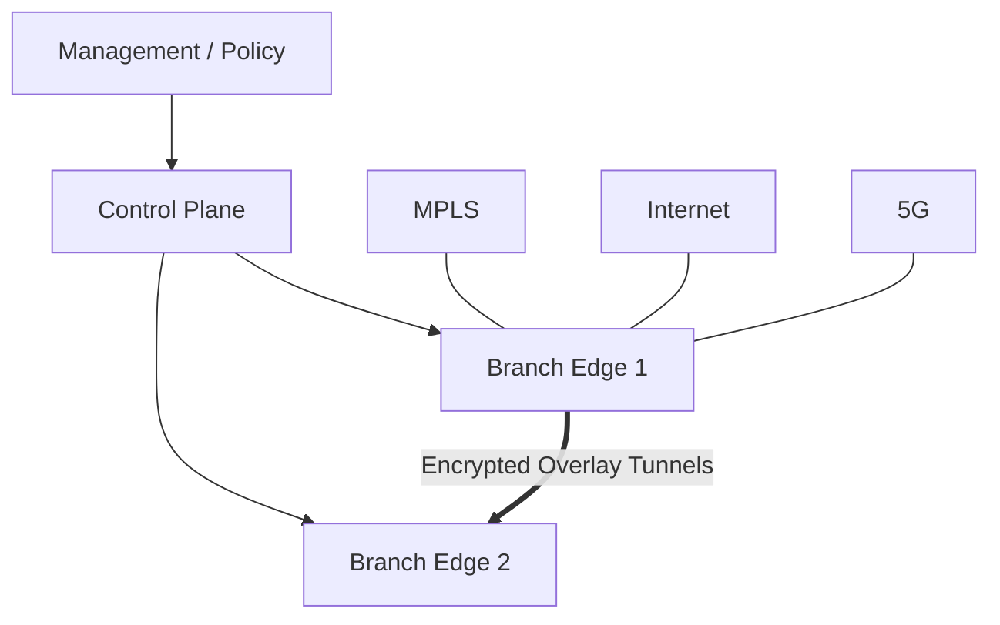

# SD-WAN 架构、应用选路与排障

SD-WAN 把多种 Underlay 链路抽象为受集中策略控制的 Overlay。它减少逐设备配置，但没有消除路由、NAT、MTU、加密和故障域。

## 1. 三个平面

| 平面 | 作用 | 典型组件 |
|---|---|---|
| 管理平面 | 设备生命周期、模板、策略、可视化 | Controller/Manager |
| 控制平面 | 身份、拓扑、路由和策略分发 | Control Nodes |
| 数据平面 | 建隧道并转发业务 | Branch/Edge |

有些产品合并组件，名字也不同。分析时始终映射回这三个职责。

管理平面回答“期望设备执行什么”，控制平面传播“哪些端点与业务前缀可达”，数据平面执行“这个包此刻走哪里”。集中控制不代表把每个业务包送往控制器询问一次。



### 1.1 从启动到能够转发，至少有三类身份

Edge 先通过底层地址、路由、DNS 和时间等条件找到控制系统，再完成设备身份与租户归属验证，获得相应配置、路由与安全材料，最后建立可用数据路径。

这里至少要区分：

- 设备身份：这台 Edge 是否获准加入相应组织。
- 传输端点：其他设备通过什么地址、端口或隧道定位它。
- 业务身份／分段：这份客户端流量属于哪个业务域，允许访问什么。

更换 WAN 地址不必意味着设备身份变化；同一设备管理着多个 Segment，也不表示它们自动互通。设备上线与某个用户业务获准转发是不同状态。

## 2. Underlay 与 Overlay

Underlay 负责 Edge 端点之间的 IP 可达，Overlay 通常使用 IPsec 等隧道。

排障必须区分：

```text
Underlay：WAN 接口地址、默认路由、DNS/NTP、NAT、运营商可达
Overlay：身份认证、隧道、路由发布、分段、业务策略
```

控制器可达但数据隧道失败，或隧道 Up 但业务路由未发布，都是不同层的问题。

### 2.1 外层路由和内层路由分别指向谁

```text
内层：客户端地址 → 业务服务器地址，按业务 Segment 的路由与策略处理
外层：本地 Edge 的传输地址 → 远端 Edge／安全服务地址，按 Underlay 交付
```

把业务默认路由指向中心站点，不应让控制器连接或隧道对端的外层地址也递归依赖这条尚未建立的隧道。管理路径、传输 VRF 与业务 VRF 是否分离要看架构，但最终都需要消除循环依赖。

隧道还需要处理 NAT 映射、认证与密钥期限、封装尺寸。NAT-T 只帮助相应 UDP 封装穿过地址转换，不保证任意两种 NAT 组合都能直接互通；数据路径可能还需要 Hub 或其他中转。基础机制见 [IPsec 选路与 NAT 穿越](../security/ipsec/03-IPsec选路NAT穿越与路径MTU.md)。

### 2.2 Full Mesh 和 Hub-and-Spoke 的状态代价

N 个站点全互联，有 `N × (N - 1) / 2` 个无向站点对。若每端有两条 Underlay，并要求每个站点对的四种传输组合都存在，则 5 个站点就有 `10 × 4 = 40` 组候选传输连接。

这个例子说明的是状态数量，不是所有产品都固定创建 40 条 IPsec 隧道；单向 SA、按需建隧道、动态路径和控制机制会改变实际对象数。

Hub-and-Spoke 可以减少分支间关系，但分支互访可能经 Hub 绕行，Hub 的带宽、出口和故障域随之重要。动态直连可以折中，但首次建立路径的开销和策略状态仍需计算。

## 3. 应用感知选路

策略通常按应用、用户、站点或网段选择路径：

```text
语音：低时延、低抖动链路
ERP：优先 MPLS，Internet 备份
Office/SaaS：本地互联网出口
备份：低成本链路和低优先级
```

SLA 探测指标：

- 丢包；
- 时延；
- 抖动；
- 可用性；
- 某些实现增加 MOS 或应用体验。

### 3.1 应用名是分类结果，不是数据包自带的可靠标签

设备可能使用五元组、端口、DNS/域名信息、DPI 或其他能力识别应用。加密流量与首包信息不足会限制分类精度，所以有的会话先走默认策略，识别后才进入应用策略。

之后是否迁移既有流、何时迁移，以及是否保持 NAT/安全状态，依赖实现。不能只在控制台配置一个应用名，就假设第一包开始已经准确识别且能够无代价切换。

### 3.2 路径选择先过滤资格，再比较偏好

从概念上，一条候选路径至少要满足：

```text
存在所需目的路由
 ∩ 属于允许的业务 Segment 与出口范围
 ∩ Underlay／数据隧道可用
 ∩ 满足应用的安全或服务链约束
 ∩ 满足当前适用的质量条件
```

在有效候选中，再按业务偏好、成本、权重或负载等规则选择。厂商策略实际顺序不同，但“没有资格的路径不能只因延迟更低就被选中”是理解模型的关键。

假设语音策略要求测量口径一致的时延不高于 80 ms、丢包不高于 1%，并且同时满足：

| 路径 | 时延 | 丢包 | 结果 |
| --- | --- | --- | --- |
| A | 40 ms | 2% | 丢包超限，不满足该质量条件 |
| B | 65 ms | 0.1% | 两项均满足，可以成为候选 |

此时 B 比 A 更适合该策略，不能仅按时延最小选 A。若 B 也超限，策略必须定义是拒绝、选择尽力而为路径，还是使用特定备用服务；不存在所有产品统一的“自动选最好”答案。

### 3.3 SLA 测量值到底代表哪段路径

需要说明探测起点、终点、方向、包尺寸、优先级和统计窗口。Edge 间隧道探测不覆盖用户 Wi-Fi、远端 LAN、应用服务处理和数据库依赖。

RTT 是往返时延；单向时延需要相应测量机制与时间条件，不能直接把 RTT 除二就认定两方向相同。Jitter 也有不同统计定义，两个界面都写“抖动”不证明口径一致。

主动探测发送专用样本，被动测量观察真实业务；二者反映的对象与采样偏差不同。有些产品利用 BFD 相关通道做隧道质量统计，但基础 BFD 活性协议不因此自动等于完整 SLA 系统。例子见 [Cisco BFD 与应用选路的关系](https://www.cisco.com/c/en/us/support/docs/routers/sd-wan/221604-understand-bfd-protocol-relationship-wit.html)。

### 3.4 平均值和滑动窗口怎样掩盖短时异常

假设 60 秒窗口中只有 1 秒发生严重丢包，长期平均可能仍很低，但那一秒足以打断语音。反过来，单个样本偶然异常也不足以说明整条链路持续不可用。

窗口、采样频率、连续超限次数和统计量共同决定检测灵敏度，不是简单把阈值调小即可。实际应用感知路由中的质量分类可参考 [Cisco AAR SLA 说明](https://www.cisco.com/c/en/us/td/docs/routers/sdwan/26x-later/policies/policies-configuration-guide/AAR/sla-aar.html)。

### 3.5 防止路径振荡 {/* #防止路径振荡 */}

如果阈值为 50 ms，链路在 49～51 ms 波动，可能频繁切换。需要：

- 进入和退出使用不同阈值；
- 连续多个探测窗口才判定；
- 最小保持时间；
- 恢复后延迟回切；
- 对瞬时异常和持续异常使用不同策略。

迟滞的例子是持续超过某个上界才离开当前路径，恢复到更低下界并保持一定时间才允许回来。还需要明确“没有合格替代路径”时是否维持现状，避免在两条都不合格的路径间来回迁移。

### 3.6 路径好，不等于队列没有延迟

QoS 的分类、标记、排队与整形影响包在本地什么时候发出；应用选路决定可以走哪个传输路径，二者不是替代关系。

例如某出口前面已排队 100,000 字节，有效服务速率为 20 Mbit/s，仅这部分排队工作量就对应约 `100000 × 8 / 20000000 = 40 ms`。链路传播时延可能很低，本地队列仍能让应用超标。

DSCP 标记只是向节点表达处理类别，运营商可能重标记或使用不同队列。SD-WAN 不会因为设置了高优先级就创造更多物理带宽。

### 3.7 复制、FEC 和聚合分别付出什么代价

这里的 FEC 是 Forward Error Correction（前向纠错），不是 MPLS 中的 Forwarding Equivalence Class（转发等价类）。前者利用冗余数据恢复丢失，后者把接受相同转发处理的报文归为一类；相同缩写不能跨场景混用。

| 能力 | 主要思路 | 代价与边界 |
| --- | --- | --- |
| 包复制 | 在不同路径发送副本，由支持的对端去重 | 消耗额外带宽；共同故障域会削弱收益 |
| FEC | 添加冗余编码以恢复一定范围内的丢失 | 冗余、编码计算与恢复等待；不能修复任意丢包 |
| 多流分担 | 把不同流分到不同传输路径 | 单流不必获得总带宽，需要足够流量分布 |
| 支持重排的多路径传输 | 把同一流拆到不同路径并在对端处理顺序 | 需要对应机制、缓存与时延预算 |

这些是不同产品可能提供的增强能力，不是购买 SD-WAN 后必然同时具备。两条路径标注不同运营商，也可能共享入楼光缆、电源或上游汇聚节点，不能把名称不同视为故障独立。

## 4. 路由与分段

集中控制仍要处理：

- 站点 Prefix 如何发布；
- Hub-and-Spoke 还是 Full Mesh；
- 不同业务 VPN/Segment 如何隔离；
- 分支默认路由走本地还是中心；
- 汇总是否造成黑洞；
- 数据中心和云路由怎样重分发；
- 最大前缀和环路保护。

集中策略会在许多站点生成本地状态。控制系统显示新版本，不证明每台 Edge 已接收、验证并安装完成；路由版本、策略版本和数据面就绪程度可能暂时不同。

### 4.1 Segment 不是给流量贴一个名字

Segment 通常映射到独立路由与策略上下文，解决相同设备上不同业务的可达范围。它与外层传输颜色、链路类型或运营商标识不同。

业务 A 可以通过多个 Underlay 到达远端同一业务域；一条 Underlay 也可以承载多个互相隔离的 Segment。跨 Segment 访问需要明确的路由泄漏和安全规则，不能仅凭隧道共用设备就默认互通。

### 4.2 路由选择与服务链

策略可能要求先经过防火墙、代理或安全云服务，再到达目的。最短传播路径未必是被允许的数据路径；安全服务不可用时，允许绕过还是必须阻断，需要由业务安全策略定义。

集中控制交换站点路由不等于取代所有本地 OSPF/BGP。边界仍要协调路由来源、优先级、汇总与重分发，防止同一前缀在 Overlay 和外部网络之间反复回灌。

## 5. 本地互联网出口

Direct Internet Access 可以减少 SaaS 回绕时延，但安全边界也从中心机房分散到各分支。

必须设计：

- DNS 和 Web 安全；
- 本地防火墙；
- SaaS 身份与零信任策略；
- 日志集中；
- 公网 NAT 地址；
- 云安全服务/SASE 故障时的回退；
- 分支是否允许绕过安全检查。

## 6. 常见故障

### 6.1 Edge 无法上线 {/* #edge-无法上线 */}

检查：

1. WAN 口地址、默认路由和 DNS；
2. 系统时间与证书有效期；
3. NAT/防火墙是否允许控制和数据端口；
4. 设备身份、序列号、租户归属；
5. 控制器证书链和授权；
6. MTU 与分片。

### 6.2 隧道 Up 但业务不通 {/* #隧道-up-但业务不通 */}

检查：

- 目标 Prefix 是否发布和安装；
- Segment/VPN 是否相同；
- 应用策略是否把流量送到错误路径；
- 安全策略/NAT；
- 回程路径；
- 隧道内 MTU；
- LAN 侧 VLAN、路由和 DHCP。

### 6.3 没有切换到备线 {/* #没有切换到备线 */}

检查：

- SLA 探测目标是否真正代表业务路径；
- 失败指标是否超过阈值和持续窗口；
- 备线是否满足策略；
- 备线隧道是否预先建立；
- NAT 会话能否跨路径保留；
- 应用是否能承受连接重建。

### 6.4 控制器断连后，现有会话与新状态分别怎样

Edge 可能继续使用已安装路由、策略和现有密钥转发，也可能按产品或安全策略进入受限状态。必须区分：

| 对象 | 暂时继续工作的条件 | 后续风险 |
| --- | --- | --- |
| 已有路由与 FIB | 本地仍保留有效候选与可用下一跳 | 拓扑变化无法及时反映，旧路由过期 |
| 已有数据隧道 | 两端数据可达，现有密钥与关联仍有效 | Rekey、认证或新隧道依赖不能满足 |
| 新站点／新策略 | 相应控制服务仍可用，或实现支持受限自治 | 无法加入或无法获得最新授权 |

能够维持几分钟不证明可以无限期离线工作；反过来，管理界面不可用也不代表所有数据立即中断。

### 6.5 路径切换为什么仍可能断开 TCP

在 Overlay 内更换外层传输路径，有机会保留客户端内层地址与业务五元组，但仍需正确的密钥、序号、防重放、重排和数据状态衔接。

本地互联网出口切换则可能改变对外 NAT IP 或端口，远端看到的连接身份随之变化。另一个出口就算用了相同公网地址，没有原映射和会话状态也未必能继续旧连接。

因此，比较“新连接首个成功时间”和“旧连接是否持续传输”非常重要。某些应用或传输协议支持迁移与重连，但它们有自己的前提，不能归为 SD-WAN 的无条件能力。

## 7. 排障顺序

```text
固定失败应用和五元组
→ 检查 LAN 接入
→ 检查 Underlay 每条链路
→ 检查控制器连接与身份
→ 检查 Overlay 隧道
→ 检查路由与 Segment
→ 检查应用/SLA 策略
→ 检查安全、NAT、MTU
→ 检查完整回程
```

## 8. 设计与演练

为 20 个分支设计：

- MPLS + Internet 双 Underlay；
- 语音、ERP、SaaS、备份四类业务；
- ERP 通过双数据中心；
- SaaS 本地出口；
- 每类业务的 SLA、主备、回切和安全策略；
- 控制器不可达时的生存行为。

演练：

1. 主链路硬 Down；
2. 主链路不 Down 但 10% 丢包；
3. DNS 不可达；
4. 控制器不可达；
5. 隧道 MTU 不足；
6. 错误全局策略；
7. 双数据中心单侧 Prefix 撤销。

记录业务丢包、切换时间、会话重建和回切稳定性。

## 9. 思考与解答

**隧道时延 10 ms，为什么用户 API 仍然要 500 ms？**

探测只覆盖其起止端之间的路径，用户接入、队列、服务器处理和其他依赖不一定在测量范围内。还需确认时延统计口径与真实业务一致。

**两条线路都不满足 SLA，系统一定断流吗？**

不一定，取决于明确的失败策略：可以拒绝、使用尽力而为路径或转向指定备用服务。不能在没有策略定义时推断统一行为。

**改走另一运营商后，新连接正常而旧连接超时，是否证明切换没成功？**

不一定。新数据路径可能已成功，但旧 NAT 身份、会话和序号状态无法延续。路径恢复与连接连续性需要分别衡量。

**控制器不承载数据，所以它断开完全没有影响吗？**

不是。现有状态可能暂时维持，但新路由、策略、站点、重新认证或密钥更新可能依赖控制服务。

**复制两份数据，能保证吞吐翻倍吗？**

不能。复制的目标通常是提高交付机会或降低尾延迟，额外副本消耗带宽；有效应用吞吐甚至可能下降。

## 10. 掌握标准

你应能把任意厂商 SD-WAN 产品映射为管理、控制、数据平面；能区分 Underlay、隧道、路由、策略和应用故障；能用 SLA 设计稳定切换，并说明集中控制怎样通过灰度与护栏避免全网事故。

继续对照 [BGP 路由策略](../routing-switching/07-BGP原理策略与双出口实验.md)、[MPLS L3VPN](../routing-switching/09-MPLS-VRF与L3VPN.md)与 [IPsec](../security/ipsec/00-IPsec学习路线.md)，分别理解路径传播、逻辑隔离和报文保护，避免将产品界面的一个“VPN”字段等同于所有底层机制。
