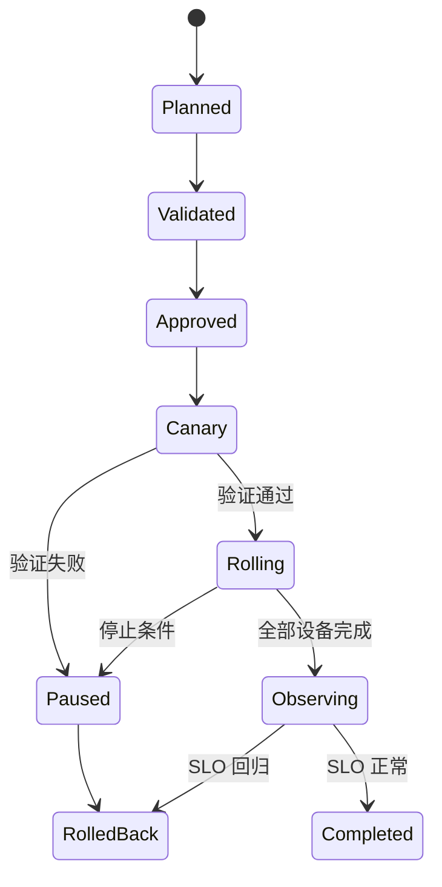

# 网络自动化闭环综合项目

本项目把前三阶段串成完整能力：把第二阶段的 Fabric 从“手工可运行”升级为“意图可管理、变更可验证、发布可控制、故障可回滚”。

## 1. 项目目标

实现“新增租户网络”流水线：

```text
业务请求
→ NetBox/Intent
→ Pull Request
→ Schema 与业务约束
→ 生成候选配置
→ 静态与可达性验证
→ 审批
→ Canary 发布
→ 运行状态与业务验证
→ 扩大批次
→ 持续观测与审计
```

目标变更：

- 新增 Tenant-D；
- Web 子网 `10.40.10.0/24`；
- App 子网 `10.40.20.0/24`；
- L2VNI 与 L3VNI 按规则分配；
- Web 可以访问 App 的指定端口；
- Tenant-D 不能访问其他租户；
- 仅允许通过 Border Leaf 访问指定外部前缀。

## 2. 系统组件

| 组件 | 职责 |
|---|---|
| NetBox | 设备、接口、地址、租户、VLAN、VRF 的意图 |
| Git | 策略、Schema、模板、测试、审批历史 |
| Python | Intent 归一化、规则校验、报告 |
| Batfish/静态分析 | 配置和可达性语义验证 |
| Ansible/Nornir | 分批发布与实时采集 |
| Telemetry | 邻居、路由、接口和业务 SLI |
| Secret Store | 凭据和短期 Token |

不要求第一次就搭建复杂平台，但每项职责必须有明确实现。

## 3. 仓库结构

```text
network-platform/
├── intent/
├── schemas/
├── src/
│   ├── normalize/
│   ├── validate/
│   ├── render/
│   ├── deploy/
│   └── reconcile/
├── templates/
├── tests/
│   ├── unit/
│   ├── fixtures/
│   ├── policy/
│   └── integration/
├── pipeline/
├── runbooks/
└── reports/
```

## 4. 阶段一：意图和数据质量

定义 Tenant Schema：

```yaml
name: Tenant-D
vrf: tenant-d
l3vni: 50004
route_targets:
  import: ["65000:50004"]
  export: ["65000:50004"]
networks:
  - name: web
    prefix: 10.40.10.0/24
    vlan: 410
    l2vni: 10410
  - name: app
    prefix: 10.40.20.0/24
    vlan: 420
    l2vni: 10420
```

自动检查：

- Prefix、VLAN、VNI、RT 唯一；
- CIDR 合法且不重叠；
- L2VNI 与 VLAN 命名规则；
- VRF 引用存在；
- 目标 Leaf角色正确；
- 外部路由满足 Prefix Allowlist；
- 所有临时资源有到期时间。

## 5. 阶段二：候选配置与验证

输出每台设备：

```text
candidate/<commit>/<device>.cfg
diff/<commit>/<device>.diff
manifest/<commit>.json
```

Manifest 包含：

- Commit SHA；
- SoT 快照版本；
- 模板版本；
- 目标设备；
- 配置 Hash；
- 生成时间；
- 审批和变更 ID。

验证层次：

1. YAML/JSON 与 Schema；
2. Python 单元测试；
3. 模板渲染确定性；
4. 厂商配置语法；
5. BGP/EVPN 会话兼容性；
6. 租户可达和隔离不变量；
7. Diff 删除量与影响范围；
8. 禁止管理平面和边界危险变更。

## 6. 阶段三：安全发布状态机



批次示例：

```text
Batch 0：实验 Fabric
Batch 1：一台非关键 Leaf
Batch 2：同站点另一个冗余对中的一台
Batch 3：各故障域逐台
Batch 4：剩余设备
```

同一冗余对不在同一首批。

## 7. 每台设备的验证

### Pre-check

- 管理连接；
- 当前配置 Hash；
- BGP EVPN 邻居；
- VTEP 可达；
- 设备不在维护/故障状态；
- 没有其他变更锁。

### Apply

- 使用唯一 Change ID；
- 设置设备和总任务超时；
- 保存原始响应；
- 支持平台事务/Checkpoint 时使用；
- 结果不确定时标记 UNKNOWN 并停止。

### Post-check

- 新 VLAN/VNI/VRF 存在；
- Type 2/3/5 符合预期；
- 原有邻居和路由数量无非预期下降；
- Web→App 允许流成功；
- 跨租户禁止流仍失败；
- 接口、CPU、错误率和 SLI 正常。

## 8. 停止与回滚

任一条件触发立即停止新批次：

```text
任何核心 BGP 邻居 Down
非预期前缀减少
跨租户禁止流变为可达
业务错误率超过阈值
单设备状态 UNKNOWN
配置差异超出审批 Manifest
```

回滚后验证：

- Running Config 恢复到预期版本；
- 协议和路由重新收敛；
- 新租户对象是否完全移除或保持一致；
- 原业务 SLO 恢复；
- SoT/Git/设备状态不再矛盾；
- 失败日志和抓包归档。

## 9. 故障注入清单

1. NetBox 中重复分配 VNI；
2. 模板生成错误 import RT；
3. 一台设备连接超时但配置已提交；
4. Canary 上 BGP 邻居下降；
5. Telemetry 数据延迟或缺失；
6. 两个流水线同时修改同一 Leaf；
7. 回滚时发现设备上有另一项合法变更；
8. Secret 过期；
9. 采集器把未知状态误报为健康；
10. 发布制品与审批 Commit 不一致。

每个故障都必须被某个护栏发现，或形成明确待改进项。

## 10. 项目评分

| 维度 | 合格 | 精通方向 |
|---|---|---|
| 数据模型 | 字段合法、唯一 | 所有权、生命周期、对账 |
| 测试 | 语法和单元测试 | 业务不变量和快照差异 |
| 发布 | 手工触发、单台执行 | 状态机、故障域灰度、锁 |
| 验收 | 检查配置存在 | 实时状态 + 业务 SLI |
| 失败处理 | 能手工回滚 | UNKNOWN、补偿、自动停止 |
| 安全 | 凭据不进仓库 | 短期凭据、最小权限、审计 |
| 可观测 | 有执行日志 | 端到端时间线和变更关联 |

## 11. 最终答辩问题

完成项目后，应能回答：

- 为什么审批的是意图和行为，而不只是 CLI Diff？
- SoT 更新成功、设备发布失败时谁是真相？
- 单台超时后为什么不能直接重试？
- 静态分析已经通过，为什么仍需 Canary？
- 回滚为什么不是简单执行 Git Revert？
- Telemetry 缺失时为什么不能判定变更成功？
- 如何保证自动化不会同时修改一对冗余设备？

能用系统行为、证据和故障演练回答这些问题，才算完成从脚本到生产级网络自动化的跨越。
