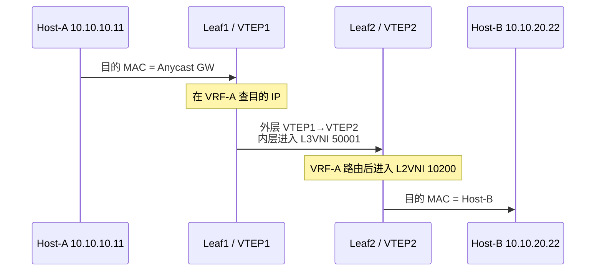

# EVPN 网关、BUM 与多归属

前一篇解决了“远端 MAC/IP 如何被控制面发现”。本篇继续回答三个生产问题：

1. 不同子网之间怎样跨 VTEP 路由？
2. 广播、未知单播和组播怎样送到其他 VTEP？
3. 一台服务器双归属两个 Leaf 时怎样避免环路并快速收敛？

## 1. L2VNI 与 L3VNI

| 对象 | 作用 | 类比 |
|---|---|---|
| L2VNI | 标识一个二层广播域 | VLAN 的跨 Fabric 延伸 |
| L3VNI | 标识一个租户 VRF 的三层传输域 | 租户专属的三层骨干 |
| SVI | VLAN 的三层网关接口 | 默认网关 |
| Anycast Gateway | 每个接入 Leaf 使用相同网关 IP/MAC | 网关跟随主机就近存在 |

示例：

```text
Tenant-A / VRF-A / L3VNI 50001
├── VLAN 100 / L2VNI 10100 / 10.10.10.0/24
└── VLAN 200 / L2VNI 10200 / 10.10.20.0/24
```

在这个分布式网关模型中，承载该子网的 Leaf 使用一致的网关 IP 和虚拟 MAC。主机迁移到同一服务的另一个接入 Leaf 后，可以继续使用原网关身份；若采用集中网关或其他服务模型，第一跳位置则不同。

### 1.1 主机先决定把帧交给谁

普通主机先根据自己的路由表决定目的是否在本地链路上。同子网通信通常解析目的主机 MAC；跨子网通信通常解析默认网关 MAC。VTEP 并不会因为支持 EVPN，就让主机跳过这一步。

因此，主机 A 到远端主机 B 的首帧可能有两种完全不同的目的 MAC：

```text
同子网桥接：A-MAC → B-MAC
跨子网路由：A-MAC → 网关 MAC
```

若主机掩码或本地路由错误，它可能对本应经过网关的地址持续 ARP。此时先判断主机把目标放在哪个范围，而不是直接检查 L3VNI。

### 1.2 Anycast MAC 与 Router MAC 不要混为一谈

Anycast Gateway MAC 面向接入主机，提供一致的第一跳身份。对称 IRB 的跨 VTEP 三层交付还需要相应 Router MAC（路由器 MAC），让远端知道内层帧应进入路由处理，而不是当作普通客户 MAC 桥接。

两种角色的实际数值由实现和配置决定，可能具有复用关系，但不能因此在分析中删除角色区分。尤其不能把“主机已经学到 Anycast MAC”当成“入口已获知远端 Router MAC 和封装信息”。

## 2. 对称 IRB 的数据包路径

主机 A 位于 Leaf1 的 VLAN 100，主机 B 位于 Leaf2 的 VLAN 200：



这叫 **对称 IRB**：入口和出口 VTEP 都参与三层转发，中间使用 L3VNI。入口不必为了每个远端目的子网都实例化其 L2VNI，但仍需相应的租户路由、下一跳及业务依赖；不能误解为 Leaf 完全不保存远端状态。

非对称 IRB 通常让入口 VTEP完成全部三层路由，然后直接进入目标 L2VNI；结果是每个可能作为入口的 Leaf都需要实例化所有目标二层广播域。小规模可用，但大规模扩展和运维更困难。

### 2.1 排查对称 IRB 必看的表 {/* #排查对称-irb-必看的表 */}

```text
入口：本地 ARP/FDB → VRF 路由表 → EVPN Type 2/5 → L3VNI
Underlay：远端 VTEP loopback 路由 → ECMP → MTU
出口：L3VNI → 目标 L2VNI → 本地 ARP/FDB → 接口
```

### 2.2 对称 IRB：跟踪一次 MAC、VNI 和 TTL 变化

仍以 A=`10.10.10.11`、B=`10.10.20.22` 为例，假设 A 发包时内层 IPv4 TTL 为 64。以下采用普通对称 IRB 模型，无 NAT，也不引入额外业务链：

| 观察位置 | 内层以太网角色 | VNI 与查找上下文 | 内层 IP |
| --- | --- | --- | --- |
| A 发往 Leaf1 | A-MAC → 本地 Anycast 网关 MAC | 接入 VLAN 100/L2VNI 10100 | A→B，TTL 64 |
| Leaf1 封装后 | 入口 Router MAC → 出口 Router MAC | VXLAN 使用 L3VNI 50001 | A→B，TTL 63 |
| Underlay 中间 | 不按客户内层 MAC 转发 | 路由外层目的 VTEP IP | 不因纯承载转发再减内层 TTL |
| Leaf2 解封装并路由后 | 出口子网网关 MAC → B-MAC | VRF-A 查找后交付 VLAN 200 | A→B，TTL 62 |

这里有两次客户三层转发，所以入口与出口分别递减一次 TTL/Hop Limit；纯桥接及非对称 IRB 的行为不同。标准处理见 [RFC 9135](https://www.rfc-editor.org/rfc/rfc9135.html)。

关键是：**内层目的 IP 一直是 B，内层目的 MAC 却会从网关变为远端路由器，再变为 B。**MAC 表达当前链路交付角色，不要求始终等于最终客户 MAC。

### 2.3 L3VNI 不是在 L2VNI 上再套一个普通 VXLAN 头

在本例中，入口选择 L3VNI 50001 来承载租户路由后的报文，出口把它映射回 IP-VRF，再查到目标本地子网。不是标准动作中先压入 VNI 10100，再像 MPLS 栈一样压入 VNI 50001。

VXLAN 基础头中只有一个 VNI 字段。产品可以构建额外隧道或嵌套业务，但那是另一种明确设计，不能从“L2VNI 与 L3VNI 同时存在”推导出“两层 VNI 堆叠”。具体对象映射可对照 [FRR 的对称 IRB 模型](https://docs.frrouting.org/en/latest/evpn.html#evpn-concepts)。

### 2.4 非对称 IRB 改变了谁必须知道目的主机

同样是 A 到 B，非对称 IRB 的入口先完成路由和目的主机二层解析，再通过**目的 L2VNI 10200**把帧送到远端。出口按二层交付，不再为这段路径执行同样的一次客户 IP 路由。

| 比较项 | 对称 IRB 的本例 | 非对称 IRB 的本例 |
| --- | --- | --- |
| Fabric 中使用的 VNI | 租户 L3VNI | 目的子网 L2VNI |
| 入口跨网交付的内层目的 MAC | 出口 Router MAC | 目的主机 B-MAC |
| 入口是否要实例化远端目的 L2VNI | 不因这次路由而必须 | 需要相应目的二层上下文 |
| 出口处理 | 租户路由后交付本地子网 | 在目的广播域桥接 |

“对称”指处理模型两端都参与路由，不保证请求和回复经过相同 Spine，也不是把网络路径强行做成镜像。

### 2.5 三种规模问题不能只算一个路由条数

需要分别考虑本地/远端 MAC 与邻居状态、租户 IP 路由规模、VNI/VRF 对象，以及硬件共享表容量。把远端主机改为前缀通告可改变状态粒度，但也引入汇总覆盖、路由递归和移动性取舍。

Type 5 接入外部前缀时，还可能依赖 Overlay Index；因此“所有远端 MAC 都删掉，只保留 Type 5”不是通用优化。不同前缀表示与依赖见 [RFC 9136](https://www.rfc-editor.org/rfc/rfc9136.html)。

Anycast Gateway 也不自动同步防火墙、NAT 或应用会话。相同网关 IP/MAC 解决主机第一跳身份，不保证有状态服务迁移后无中断。

## 3. BUM 流量

BUM 包括：

- Broadcast：例如 ARP Request；
- Unknown Unicast：FDB 没有目的 MAC；
- Multicast：二层组播。

常见承载方式：

### 3.1 Ingress Replication

入口 VTEP 根据 Type 3 IMET 路由维护远端 VTEP 列表，并为每个远端复制一份。

优点是 Underlay 不要求部署组播；缺点是同一个广播包要复制多次。设一个 VNI 有 `N` 个远端 VTEP，入口复制开销近似为 `N` 份。

### 3.2 Underlay Multicast

VNI 映射到 Underlay 组播组，由网络复制。它能减少入口 VTEP负担，但引入 PIM、IGMP、组播状态和更多排障面。

选择依据不是“哪个更先进”，而是 VTEP 数量、BUM 比例、硬件能力和团队对组播的运维能力。

在简单入口复制模型中，若一个 VNI 有 8 个 VTEP，单个入口发起的 1 Gbit/s BUM 流量需要向其余 7 个成员复制，入口承载方向可能接近 7 Gbit/s，再计封装和实现开销。这个算例不是所有拓扑的最终线速，但足以说明“客户只发 1 Gbit/s”不代表 Fabric 只承受 1 Gbit/s。

### 3.3 为什么必须抑制不必要的 BUM

- 用 EVPN Type 2 的 MAC-IP 绑定做 ARP/ND Suppression；
- 对未知单播谨慎启用抑制或丢弃；
- 限制单个租户的广播速率；
- 优先用三层边界，避免无限扩大二层故障域。

## 4. EVPN Multihoming

服务器通过 LACP 双归属 Leaf1 和 Leaf2 时，EVPN 使用 ESI 标识这段共同以太网连接。

```text
                +-- Leaf1 / VTEP1 --+
Server -- LAG --|                    |-- Fabric
                +-- Leaf2 / VTEP2 --+
                       同一 ESI
```

关键机制：

| 机制 | 作用 |
|---|---|
| Type 4 ES Route | 发现同一 ESI 的其他 PE/VTEP |
| Type 1 A-D Route | 别名转发、标签通告和快速批量撤销 |
| DF Election | 决定相应 ES/服务的指定转发者；在 All-Active 场景重点约束向接入段的 BUM |
| Split Horizon | 从该 ES 收到的流量不再发回同一 ES |
| Aliasing | 远端可把流量负载到同一 ES 的多个可用 VTEP |
| Mass Withdrawal | 借助成组依赖撤除故障成员作为下一跳，不必逐 MAC 等待老化 |

### 4.1 All-Active 与 Single-Active

- All-Active：多个 Leaf同时转发单播，常与 LACP 配合，带宽利用率高。
- Single-Active：只有一个 Leaf对该 ES 转发，适用于无法多活或需要单活语义的设备。

在 All-Active 模型中，DF 主要约束从 Fabric 向多归属以太网段发送 BUM 的方向，非 DF 仍可参与相应已知单播。Single-Active 的转发资格更严格，不能把前一句推广到全部模式。

### 4.2 DF 不是整台 Leaf 的全局主备角色

选举需要结合 Ethernet Segment 与相应服务粒度。Leaf1 可以负责一个服务的指定交付，Leaf2 负责另一个；不能看到某处显示 Non-DF，就把整台设备排除出所有转发。

不同算法、能力协商和成员集合影响选举结果。HRW（最高随机权重）用于改善映射稳定性等特征，但它不是产生共识仲裁的“第三票”；相关扩展见 [RFC 8584](https://www.rfc-editor.org/rfc/rfc8584.html)。

两端看到的候选不同、接入资格变化未传播或控制面短暂分区，都需要考虑重复交付与中断风险。EVPN 不等于不再存在分布式状态不一致窗口。

### 4.3 Split Horizon 与 DF 分别挡住什么

假设服务器所在 ES 同时连接 Leaf1、Leaf2。服务器广播先进入 Leaf1，并通过 Fabric 到达 Leaf2；Leaf2 必须知道它来自自己也连接的那个接入段，避免再送回服务器形成回灌。

这与“一个远端广播同时到达 Leaf1、Leaf2，谁负责向服务器交付”是两个问题：前者属于来源防回送，后者需要指定转发者来避免重复。不能用一项机制替代另一项。

EVPN MPLS 与 EVPN VXLAN 的具体实现也不同：不能把 MPLS 的 ESI Label 直接当作普通 VXLAN 头中的字段。VXLAN 的经典模型利用来源 VTEP、共享 ES 关系和 Local Bias 等规则；后续还存在新的能力扩展。基础区别见 [RFC 8365](https://datatracker.ietf.org/doc/html/rfc8365)，扩展边界见 [RFC 9746](https://www.rfc-editor.org/rfc/rfc9746.html)。

### 4.4 Aliasing 为什么不要求每个成员都先从数据面学到每个 MAC

远端看到某个 MAC 归属一个多归属 ES，再结合相应服务级 A-D 信息，可以识别该 ES 上其他合格成员作为交付路径。这不是捏造一份主机路由，而是把“MAC 所在段”与“哪些成员能到这个段”的两种信息组合。

成员必须仍具有有效接入与相应服务状态。只配置相同 ESI 不会自动复制所有转发表，也不能让没有接入能力的 Leaf 成为有效下一跳。相关多归属信息模型见 [RFC 7432](https://datatracker.ietf.org/doc/html/rfc7432)。

### 4.5 批量撤销不等于删除这个 ES 的所有主机

若 Leaf1 到服务器的接入链路失效，但 Leaf2 仍可交付，远端应尽快移除经 Leaf1 的相关下一跳，让原有 MAC 继续经 Leaf2 到达。

```text
故障成员发现接入失败
→ 相关 A-D 可达关系撤销
→ 远端更新 ES/服务依赖的下一跳集合
→ 已知 MAC 不再指向故障成员
→ 剩余接入和实际数据面继续交付
```

具体使用 Per-ES 还是 Per-EVI 的成组依赖、跨 AS 如何处理，取决于承载与拓扑。Batch/Mass Withdrawal 不是“发一条撤销就能瞬间完成全网硬件更新”，也不需要把仍在存活成员上的全部 MAC 都等到重新学习。

## 5. 两个典型故障

### 5.1 故障一：单播正常，ARP 偶发重复 {/* #故障一单播正常arp-偶发重复 */}

检查顺序：

1. Type 3 IMET 远端列表是否重复或残留；
2. 同一 ESI 的 DF 结果是否一致；
3. 对应承载的 Split Horizon 行为是否正确，是否误把 MPLS ESI 标签模型套到 VXLAN；
4. 是否同时存在传统 MLAG 泛洪与 EVPN 多归属泛洪；
5. 主机 Bond/LACP 状态是否一致。

### 5.2 故障二：一条接入链路断开后大量主机长时间中断 {/* #故障二一条接入链路断开后大量主机长时间中断 */}

检查：

- 故障是否被本地快速感知；
- 相应 Type 1 Per-ES/Per-EVI A-D 状态是否撤销或更新；
- 远端是否执行 Mass Withdrawal；
- Type 2 是否被错误地逐条等待老化；
- 剩余 Leaf是否有到服务器 LAG 的有效成员。

## 6. 验证清单

```bash
# Linux 接入和 VXLAN 状态
ip -d link show
bridge link show
bridge vlan show
bridge fdb show
ip neigh show

# FRR 控制面，具体命令随版本可能略有差异
vtysh -c 'show bgp l2vpn evpn route type multicast'
vtysh -c 'show bgp l2vpn evpn route type es'
vtysh -c 'show bgp l2vpn evpn route type prefix'
vtysh -c 'show evpn es'
vtysh -c 'show evpn vni'
```

抓包时同时解读：

1. 外层源/目的 VTEP；
2. UDP 目的端口 4789；
3. VXLAN VNI；
4. 内层源/目的 MAC；
5. 内层源/目的 IP；
6. 是否为 BUM 的多份复制。

## 7. 实验与掌握标准

搭建双 Leaf、一个 L2VNI、一个 L3VNI：

1. 验证同子网二层通信；
2. 增加第二子网，验证对称 IRB；
3. 清空 ARP/FDB，观察 Type 2、Type 3 和 BUM；
4. 将一台 Linux 主机以 Bond 双归属；
5. 断开一条成员链路，记录丢包数和控制面收敛证据；
6. 故意制造 VNI、RT、Anycast MAC 之一不一致并定位。

掌握不是会背术语，而是能从“主机 A 发出的第一帧”开始，解释入口路由、VNI 切换、远端解封装和出口二层转发，并说明多归属为什么不产生环路。

## 8. 思考与解答

**对称 IRB 中，跨 VTEP 帧的内层目的 MAC 为什么不直接用 B-MAC？**

入口先把它交给远端路由角色，通过 L3VNI 恢复租户 VRF；出口路由后才解析并交付 B。应区分路由器 MAC 与最终主机 MAC。

**L2VNI 10100、L3VNI 50001 是否同时压进一个基础 VXLAN 头？**

不是。这里选择 L3VNI 承载路由后的包，基础 VXLAN 头只有一个 VNI 字段。嵌套封装需要另行说明。

**Anycast Gateway 地址一致，是否保证 NAT 会话也一致？**

不保证。第一跳身份与状态同步不是同一机制，NAT、防火墙和业务会话各有状态连续性要求。

**All-Active 中 Non-DF 是否不能转发已知单播？**

不能这样判断。DF 主要解决相应向接入段的 BUM 指定交付，合格成员仍可承担已知单播；Single-Active 要另行分析。

**批量撤销意味着把整段服务器路由全部删除吗？**

不是。主要目的是快速撤除故障成员的相关可达路径；存活成员仍能承载原主机的有效通信。

**对称 IRB 就是请求与回复路径相同吗？**

不是。它描述入口和出口的路由处理方式。实际 Underlay 的 ECMP、故障和方向策略仍可能造成路径不对称。

## 9. 参考资料 {/* #参考资料 */}

- [RFC 7432：EVPN 与多归属机制](https://www.rfc-editor.org/rfc/rfc7432)
- [RFC 8365：EVPN Overlay](https://www.rfc-editor.org/rfc/rfc8365)
- [RFC 9135：Integrated Routing and Bridging in EVPN](https://www.rfc-editor.org/rfc/rfc9135)
- [RFC 9136：EVPN IP Prefix Advertisement](https://www.rfc-editor.org/rfc/rfc9136)
