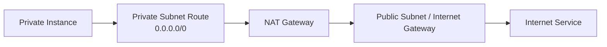

# 云 VPC 网络与全链路分析

公有云隐藏了交换机和路由器的 CLI，却没有改变转发的基本规律。排障时仍然要回答：

```text
名字解析成什么地址？
源端怎样选路？
中间是否发生 NAT 或负载均衡？
每个方向的安全策略是否允许？
返回流量怎样走？
```

## 1. 把云产品映射为通用网络对象

| 云概念 | 通用网络含义 | 排障关注点 |
|---|---|---|
| VPC/VNet | 逻辑隔离的租户三层网络 | 地址规划、路由域、互联边界 |
| Subnet | 地址段和实例接入范围 | 可用区、关联路由表、剩余地址 |
| ENI/NIC | 虚拟网卡 | 私网 IP、辅助 IP、安全组、源/目的检查 |
| Route Table | 分布式路由策略 | 最长前缀、下一跳、黑洞路由 |
| Security Group | 通常为有状态的实例/网卡防火墙 | 方向、协议、端口、引用对象 |
| Network ACL | 通常为子网边界的无状态过滤 | 入站和出站都要显式允许 |
| Internet Gateway | VPC 与公网的逻辑边界 | 公网地址、路由、策略 |
| NAT Gateway | 私网实例主动访问公网时做源 NAT | 路由、端口容量、可用区、回程 |
| Load Balancer | VIP、健康检查、连接分发 | 四层/七层、后端健康、源地址变化 |
| Peering/Transit | VPC 间或中心化互联 | 路由传播、非传递性、重叠网段 |
| Private Endpoint | 私网访问云服务 | DNS、端点策略、路由和安全组 |

厂商行为存在差异，使用时必须查对应产品文档。但上表提供了一套不依赖厂商名称的分析框架。

### 1.1 不能把 AWS 对象直接当成所有云的规则

本文涉及 Internet Gateway、公网 NAT Gateway、子网 Network ACL 的具体路径，以 AWS 常见 IPv4 模型为例。AWS 子网具有可用区范围，Security Group 常采用有状态允许规则，Network ACL 则按规则序号进行无状态允许／拒绝匹配。

Azure 的 NSG 同样有状态，但支持优先级、允许／拒绝和默认规则，并不等价于 AWS Security Group。子网、可用区、隐式路由与端点也不能逐字映射。跨云分析应先复用“路由、策略、转换、回程”的问题，再查目标产品的处理方式。见 [AWS 安全组](https://docs.aws.amazon.com/vpc/latest/userguide/vpc-security-groups.html) 与 [Azure NSG](https://learn.microsoft.com/azure/virtual-network/network-security-groups-overview)。

## 2. 最长前缀匹配仍然是第一原则

假设路由表为：

```text
10.0.0.0/16   local
10.20.0.0/16  transit-gateway
0.0.0.0/0     nat-gateway
```

- 访问 `10.0.2.10` 使用 local；
- 访问 `10.20.8.8` 使用 transit-gateway；
- 访问公网地址使用 NAT Gateway。

不能因为存在默认路由，就认为所有地址都会走默认路由。先用最长前缀选中路由，再检查下一跳和策略。

对于同一前缀，还需遵循平台规定的静态／传播路由优先级；更具体的 blackhole 路由也不能一概理解成会自动回落默认路由。AWS 的具体规则见 [路由优先级](https://docs.aws.amazon.com/vpc/latest/userguide/route-tables-priority.html)。

## 3. 四条必须能独立分析的路径

### 3.1 同一 VPC 东西向

```text
App-ENI
→ 源安全组出站
→ VPC local route
→ 子网/网络 ACL
→ 目标安全组入站
→ Server-ENI
→ 返回方向
```

同一 VPC 不代表自动放行。路由可达和安全允许是两个条件。

### 3.2 私网实例访问公网



常见断点：

- 私网子网默认路由未指向 NAT；
- NAT Gateway 所在子网没有正确公网出口；
- 网络 ACL 未允许临时端口回包；
- DNS 解析失败，被误判为网络不通；
- NAT 端口耗尽或单可用区故障；
- 目标服务限制了 NAT 的公网源地址。

### 3.3 公网访问负载均衡后的服务

```text
Client
→ 公网 DNS
→ Internet Gateway
→ Public Load Balancer
→ LB Security Policy
→ Health Check / Listener
→ Target Group
→ Backend Security Group
→ Application
```

需要区分三条连接：

1. 客户端到负载均衡器；
2. 负载均衡器到后端；
3. 健康检查器到后端。

“后端能 curl 自己”不能证明监听器、健康检查和安全组链路正确。

### 3.4 跨 VPC 访问

同时检查：

- 两端 CIDR 是否重叠；
- 两端路由表是否都有去程和回程；
- Peering 是否不支持期望的传递路径；
- Transit 路由表是否做了正确关联和传播；
- 中间防火墙是否有状态并要求对称路径；
- DNS 返回的是公网地址还是私网地址。

## 4. 有状态安全组与无状态 ACL

有状态策略通常跟踪连接：允许请求后，对应返回流量自动允许。无状态 ACL 独立判断每个方向，所以必须为请求和返回分别放行。

以客户端访问 TCP 443 为例：

```text
入站到服务端：目的端口 443
返回到客户端：目的端口是客户端临时端口
```

不要把“临时端口范围”写死为一个跨所有系统和产品的数值，应根据操作系统、负载均衡器和云产品文档确认。

## 5. NAT 与源地址认知

经过 NAT、代理或负载均衡后，后端看到的源地址可能不是原客户端地址：

- 四层直通型负载均衡可能保留客户端 IP；
- 代理型负载均衡可能使用自身地址连接后端；
- 七层代理通常通过 `X-Forwarded-For` 等头传递客户端信息；
- NAT Gateway 会把私网源地址转换为公网地址。

因此安全策略、访问日志和审计系统必须使用同一套“源身份”定义。

### 5.1 把 NAT 前后端点写出来

AWS 公网 NAT Gateway 的示例逻辑路径如下，地址均为文档或私网地址：

| 位置 | 源端点 | 目的端点 |
| --- | --- | --- |
| 私网实例发出 | `10.0.1.10:51000` | `203.0.113.80:443` |
| NAT Gateway 内侧转换后 | NAT 私网地址及映射端口 | `203.0.113.80:443` |
| 经 IGW 的公网侧 | NAT 关联公网地址及对应端口 | `203.0.113.80:443` |
| 返回并完成逆向转换后 | `203.0.113.80:443` | `10.0.1.10:51000` |

每次过滤需要说明看到哪一层地址。NACL 的回包目标是临时端口，不是服务器 443；有状态规则的自动回包许可也不取消其他独立策略层。公网／私网 NAT 差异见 [AWS NAT Gateway](https://docs.aws.amazon.com/vpc/latest/userguide/vpc-nat-gateway.html)。

七层 LB 通常是两条独立连接，健康检查是第三类流；四层 LB 是否保留客户端 IP则取决于产品、目标类型和模式。Flow Logs 中的 ACCEPT 只能说明记录范围内的处理结果，不能证明应用返回成功。入口日志、后端日志和实际五元组应共同关联。

## 6. 云网络排障模板

### 6.1 第一步：固定五元组和时间 {/* #第一步固定五元组和时间 */}

```text
源 IP:
目的 IP:
协议:
源/目的端口:
故障时间:
期望路径:
```

### 6.2 第二步：从两端同时证明 {/* #第二步从两端同时证明 */}

- 源端 DNS、路由、连接尝试；
- 目标端监听、应用日志、抓包；
- 云侧 Flow Logs、LB Access Logs、NAT 指标；
- 中间路由表和策略的配置快照。

### 6.3 第三步：按层定位 {/* #第三步按层定位 */}

| 现象 | 优先检查 |
|---|---|
| 域名无法解析 | Resolver、Private DNS Zone、端点 DNS |
| 直接 IP 可达但域名不可达 | DNS 与应用证书/SNI |
| SYN 发出无 SYN-ACK | 路由、安全策略、监听、回程 |
| LB 返回 503 | 后端健康、端口、健康检查路径 |
| 小流量正常高并发失败 | NAT 端口、连接跟踪、LB 配额 |
| 单可用区失败 | 子网、路由、NAT、后端注册和健康 |

## 7. 设计练习

设计一个三层应用：

```text
Internet → Public LB → Web Subnet → App Subnet → DB Subnet
                           ↓
                    NAT Gateway → Internet
```

交付物必须包含：

- CIDR 和子网规划；
- 每个子网的路由表；
- 每层安全组的最小权限矩阵；
- 网络 ACL 是否使用及理由；
- NAT 和 LB 的多可用区设计；
- DNS 公私视图；
- 五条测试流和五条明确禁止流；
- Flow Logs、LB 日志和告警指标。

验收时不仅证明“该通的通”，还要证明“不该通的确实被拒绝”。

### 7.1 设计题参考答案与边界

以下是概念方案，不是可直接部署的全量配置。选用双可用区 AWS IPv4 模型：VPC `10.0.0.0/16`，每区分别划分公网入口、Web、App、DB 子网，子网使用不重叠 `/24`；另一可用区分配另一组 `/24`。

- 公网子网具备 IGW 路由；需要公网出站的 Web/App 私网子网经所在可用区 NAT；DB 只保留必要内部路径，不默认开放互联网出口。
- LB 放行授权公网 HTTPS 来源；Web 业务端口仅允许 LB 安全组；App 仅允许 Web；DB 仅允许 App 指定数据库端口。运维通过独立受控入口，不让租户网直接到管理端口。
- 健康检查端口和路径必须纳入后端策略；备份、解析、时间同步及私网端点等依赖另列规则，不能为省事全放行。
- NACL 若用于额外子网隔离，要同时列请求与回包；若不承担细粒度策略，应明确由安全组承担，而不是重复写一套容易冲突的规则。
- 多可用区部署减少单区依赖，但连接状态和数据库 HA 不由网络自动复制；私有 DNS 视图须与实际入口和解析网络一致。

五条应允许流可取：客户端→LB 443、LB→Web 业务端口、Web→App API、App→DB 数据库端口、App→批准外部服务。五条应拒绝流可取：公网→DB、公网→App、Web→DB、DB→任意公网、未授权租户→管理网。判定依据是每条流的路由与策略矩阵，不能只用一条 ping 代表全部。

### 7.2 思考与解答

**同 VPC 有 local 路由就应互通吗？**

不应。安全组、ACL、主机防火墙与监听仍是独立条件。

**Flow Logs 显示 ACCEPT，能证明数据库查询成功吗？**

不能，它不验证认证、SQL 执行和应用响应，需要目标端与应用层证据。

**两个 Peering 经第三个 VPC 自动传递吗？**

在 AWS VPC Peering 模型下不能把 A↔B、B↔C 推导为 A↔C 中转，需明确支持转接的架构。见 [VPC Peering 边界](https://docs.aws.amazon.com/vpc/latest/peering/vpc-peering-basics.html)。

**健康检查通过但客户端失败，优先补什么证据？**

客户端→入口、入口→后端、健康检查→后端三类流的协议、Host/SNI、端口和策略。它们可能根本不是同一连接条件。

## 8. 参考资料 {/* #参考资料 */}

- [AWS VPC 路由表文档](https://docs.aws.amazon.com/vpc/latest/userguide/VPC_Route_Tables.html)
- [AWS Security Groups 文档](https://docs.aws.amazon.com/vpc/latest/userguide/vpc-security-groups.html)
- [AWS Network ACL 文档](https://docs.aws.amazon.com/vpc/latest/userguide/vpc-network-acls.html)
- [Azure Network Security Groups 文档](https://learn.microsoft.com/azure/virtual-network/network-security-groups-overview)
