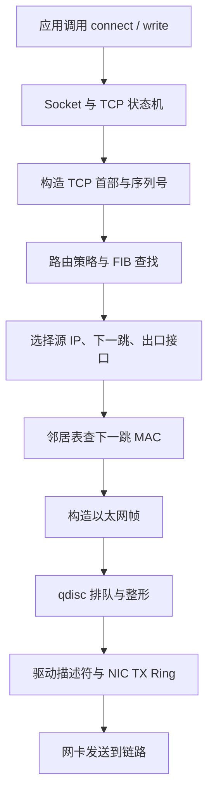

# 从应用到网卡：一个数据包的完整生命周期

## 1. 学习目标 {/* #学习目标 */}

学完后能够：

- 区分应用数据、TCP Segment、IP Packet 和 Ethernet Frame。
- 解释 Socket、路由表、邻居表、队列规则和网卡各自负责什么。
- 判断同网段与跨网段通信在二层目的 MAC 上有什么不同。
- 使用 `ss`、`ip route`、`ip neigh`、`tcpdump` 验证一次真实连接。

## 2. 分层不是背诵题 {/* #1-分层不是背诵题 */}

常见的五层模型可以这样理解：

| 层 | 核心对象 | 关键标识 | 解决的问题 |
| --- | --- | --- | --- |
| 应用层 | Message | URL、域名、方法、业务字段 | 应用要表达什么 |
| 传输层 | Segment/Datagram | 源/目的端口 | 交给哪一个进程，是否可靠 |
| 网络层 | Packet | 源/目的 IP | 跨多个网络到哪台主机 |
| 链路层 | Frame | 源/目的 MAC、VLAN | 在当前二层链路交给谁 |
| 物理层 | Bit/Symbol | 电/光信号 | 如何在介质上传输 |

真实实现不会严格地“一层只能调用下一层”，但分层仍是定位问题最有效的模型。

## 3. 发送路径 {/* #2-发送路径 */}

假设应用向 `10.20.0.8:443` 建立 TCP 连接。



### 3.1 Socket {/* #21-socket */}

Socket 是进程访问内核网络栈的接口。一个 TCP 连接通常由五元组标识：

```text
源 IP、源端口、目的 IP、目的端口、协议
```

查看本机连接：

```bash
ss -ntp
ss -lntp
ss -ti dst 10.20.0.8
```

`LISTEN` 只证明本机存在监听 Socket，不证明防火墙、路由和对端访问正常。

### 3.2 路由与源地址选择 {/* #22-路由与源地址选择 */}

内核根据目的地址查询转发表：

```bash
ip route get 10.20.0.8
```

典型输出会告诉你：

```text
10.20.0.8 via 10.10.0.1 dev eth0 src 10.10.0.10
```

这行已经回答了四个问题：下一跳、出口接口、源地址和匹配结果。

### 3.3 邻居解析 {/* #23-邻居解析 */}

IP 路由确定“下一跳 IP”，但以太网发送还需要“下一跳 MAC”：

```bash
ip neigh show dev eth0
```

同网段通信解析目标主机的 MAC；跨网段通信解析默认网关的 MAC。以太网帧的
目的 MAC 每经过一个三层跳点都会变化，IP 目的地址通常保持不变，除非发生 NAT。

### 3.4 排队与网卡 {/* #24-排队与网卡 */}

数据包经过 qdisc 后进入驱动和网卡发送队列：

```bash
tc -s qdisc show dev eth0
ip -s link show dev eth0
ethtool -S eth0
```

应用慢不一定是“网络带宽不够”。也可能是 Socket 缓冲区、qdisc 丢包、NIC Ring、
软中断或对端窗口限制。

## 4. 接收路径 {/* #3-接收路径 */}

接收方向大致相反：

```text
NIC RX Ring
→ 驱动/NAPI
→ 二层处理
→ IP 路由与 Netfilter
→ TCP/UDP
→ 按五元组找到 Socket
→ 唤醒应用读取
```

关键区别是：网卡收到帧并不等于应用一定收到数据。数据可能因为 VLAN、目的 MAC、
路由、反向路径过滤、防火墙、连接状态、端口未监听或应用缓冲区而被丢弃。

## 5. 同网段与跨网段 {/* #4-同网段与跨网段 */}

主机用“目的 IP 与本机接口前缀按位比较”判断目的是否直连。

### 5.1 同网段 {/* #同网段 */}

```text
源 IP：10.10.0.10/24
目的 IP：10.10.0.20
二层目的：10.10.0.20 的 MAC
```

### 5.2 跨网段 {/* #跨网段 */}

```text
源 IP：10.10.0.10/24
目的 IP：10.20.0.8
默认网关：10.10.0.1
二层目的：10.10.0.1 的 MAC
```

“目的 IP 在远端”并不意味着以太网帧直接写远端主机 MAC。

## 6. 最小实验 {/* #5-最小实验 */}

在隔离 Linux 实验机执行。以下命令创建两个 namespace 和一对 veth：

```bash
sudo ip netns add h1
sudo ip netns add h2
sudo ip link add h1-eth type veth peer name h2-eth
sudo ip link set h1-eth netns h1
sudo ip link set h2-eth netns h2

sudo ip -n h1 addr add 10.0.0.1/24 dev h1-eth
sudo ip -n h2 addr add 10.0.0.2/24 dev h2-eth
sudo ip -n h1 link set lo up
sudo ip -n h2 link set lo up
sudo ip -n h1 link set h1-eth up
sudo ip -n h2 link set h2-eth up
```

先观察初始状态：

```bash
sudo ip -n h1 route
sudo ip -n h1 neigh
```

一边抓包，一边发起通信：

```bash
sudo ip netns exec h1 tcpdump -eni h1-eth 'arp or icmp'
sudo ip netns exec h1 ping -c 2 10.0.0.2
```

再次查看邻居表：

```bash
sudo ip -n h1 neigh
```

应该先看到 ARP Request/Reply，再看到 ICMP Echo Request/Reply。

实验完成后清理：

```bash
sudo ip netns del h1
sudo ip netns del h2
```

删除 namespace 会删除其中的临时接口，仅在专用实验环境执行。

## 7. 诊断顺序 {/* #6-诊断顺序 */}

当“访问不通”时，不要直接抓全流量：

1. `ss -lntp`：服务是否监听正确地址和端口。
2. `ip addr`：源/目的地址是否存在且状态正常。
3. `ip route get <dst>`：实际选择了什么路径。
4. `ip neigh`：下一跳是否解析，状态是否反复 FAILED。
5. `nft list ruleset`：本机策略是否丢弃。
6. `tcpdump -ni <if>`：请求是否离开、响应是否返回。
7. `ip -s link`、`ethtool -S`：接口和网卡是否丢包。

## 8. 常见误区 {/* #7-常见误区 */}

- **Ping 通就代表服务正常**：ICMP 与 TCP 端口、应用协议完全不同。
- **路由表有路由就一定转发**：还要考虑策略路由、邻居、ACL、MTU 和返回路径。
- **抓不到包就是对端没发**：可能抓错接口、被硬件卸载或在更早阶段丢弃。
- **重启网络解决了就是偶发问题**：重启可能清理邻居、连接跟踪和队列，同时删除证据。

## 9. 复习题 {/* #8-复习题 */}

1. 跨网段访问时，目的 IP 和目的 MAC 分别是谁？
2. `ip route get` 比只看 `ip route` 多解决了什么问题？
3. 网卡 RX 计数增加但应用没有收到数据，下一步检查哪些层？
4. 为什么对称五元组相同的两个方向仍可能走不同路径？

## 10. 参考资料 {/* #参考资料 */}

- [RFC 1122: Requirements for Internet Hosts—Communication Layers](https://www.rfc-editor.org/rfc/rfc1122)
- [Linux Kernel Networking Documentation](https://docs.kernel.org/networking/)
- [iproute2 manual pages](https://man7.org/linux/man-pages/man8/ip.8.html)

[下一篇：IPv4、子网划分与路由表 →](./03-IPv4子网划分与路由表.md)
