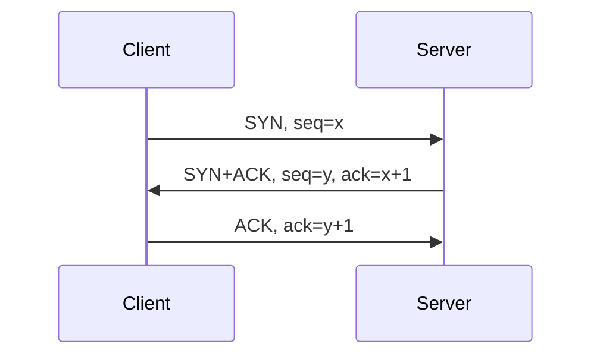

# ICMP、UDP、TCP、DNS 与连接诊断

## 1. “网络通”至少有四种含义

```text
三层可达
≠ 目标端口可达
≠ 应用协议正确
≠ 用户请求满足 SLO
```

`ping` 成功只证明某类 ICMP 往返成功。TCP 端口可能被防火墙拒绝，TLS 可能失败，
HTTP 也可能返回 500。

## 2. ICMP

ICMP 用于报告 IP 转发和诊断信息，常见消息包括：

- Echo Request/Reply：`ping` 使用。
- Destination Unreachable：网络、主机、协议或端口不可达。
- Time Exceeded：TTL 归零，`traceroute` 利用它识别中间跳点。
- Packet Too Big / Fragmentation Needed：路径 MTU 发现的重要反馈。

### traceroute 的本质

发送 TTL 从 1 递增的探测包：

```text
TTL=1 → 第一跳返回 Time Exceeded
TTL=2 → 第二跳返回 Time Exceeded
...
到达目的 → 返回终止响应
```

某一跳不响应不等于它不转发。设备可能转发业务流量但限制或过滤 ICMP 响应。

### PMTUD

路径 MTU 发现依赖 ICMP 反馈。若中间设备丢弃必要 ICMP，可能出现：

- 小包正常，大包失败。
- TCP 握手成功，传输数据时卡住。
- TLS ClientHello 或大响应超时。

验证：

```bash
tracepath <destination>
ping -M do -s 1472 <destination>
```

`1472 + 20 字节 IPv4 头 + 8 字节 ICMP 头 = 1500`。隧道环境需为额外封装留空间。

## 3. UDP

UDP 提供无连接的数据报传输：

- 无三次握手。
- 协议本身不保证到达、顺序和重传。
- 应用需要自行处理超时、重试、去重和拥塞。
- 一个方向能发送不代表返回路径或应用端口正常。

UDP 常用于 DNS、NTP、遥测和实时媒体。QUIC 运行在 UDP 之上，但自己实现可靠性、
拥塞控制和加密连接管理。

查看 UDP Socket：

```bash
ss -lunp
```

UDP 没有 TCP 的 ESTABLISHED 状态，诊断更依赖应用日志、计数器和双向抓包。

## 4. TCP 连接生命周期

### 三次握手



它用于确认双向可达并同步初始序列号。常见现象：

| 抓包 | 推断 |
| --- | --- |
| SYN 发出，无响应 | 去程丢弃、对端未收到、回程丢弃 |
| SYN 后立即 RST | 端口未监听或策略主动拒绝 |
| SYN/SYN-ACK 重复 | 最后 ACK 丢失或状态设备不一致 |
| 握手成功后超时 | 应用、TLS、MTU、窗口或中间状态问题 |

### 可靠性机制

- 序列号与 ACK：确认字节流位置。
- 重传：超时或重复 ACK/SACK 触发。
- 接收窗口：接收方通告可用缓冲区。
- 拥塞窗口：发送方根据网络反馈控制在途数据。
- MSS：单个 TCP Segment 的最大载荷，通常基于接口 MTU。

查看连接内部指标：

```bash
ss -ti
nstat -az | grep -E 'TcpRetransSegs|TcpExtTCPTimeouts'
```

重传是结果，不是根因。链路丢包、拥塞、MTU、接收端过载和乱序都可能造成重传。

### 关闭与 TIME_WAIT

TCP 是全双工连接，两个方向需要分别关闭。主动关闭方通常进入 TIME_WAIT，以避免旧
报文污染后续相同四元组连接，并允许重发最后 ACK。

大量 TIME_WAIT 不应直接通过缩短内核参数“优化”。先判断是否存在短连接风暴、
连接池缺失、上游重试或负载均衡行为。

## 5. DNS 是访问链路的一部分

典型解析：

```text
应用
→ libc / 本地缓存
→ 递归解析器
→ 根、顶级域、权威服务器
→ 缓存结果
```

排查命令：

```bash
getent hosts example.com
dig example.com A
dig example.com AAAA
dig +trace example.com
resolvectl status
```

必须区分：

- 应用实际使用的解析库与 `dig` 是否相同。
- A 与 AAAA 是否都正常。
- 搜索域、`ndots` 和超时重试是否放大延迟。
- 权威记录正确但递归缓存是否仍持有旧 TTL。
- DNS 返回地址后，后续 TCP/TLS/HTTP 是否成功。

## 6. 最小连接实验

服务端：

```bash
python3 -m http.server 8080 --bind 127.0.0.1
```

另一个终端：

```bash
ss -lntp 'sport = :8080'
curl -v --connect-timeout 2 http://127.0.0.1:8080/
tcpdump -ni lo 'tcp port 8080'
```

观察握手、HTTP 数据和关闭。然后访问未监听端口：

```bash
curl -v --connect-timeout 2 http://127.0.0.1:8081/
```

本机通常返回 RST，因此表现为“Connection refused”；如果防火墙静默丢弃，表现更像
连接超时。这两种现象的排障方向不同。

## 7. 连接诊断决策表

| 阶段 | 检查 | 工具 |
| --- | --- | --- |
| 名称解析 | 域名得到哪些 A/AAAA 地址 | `getent`、`dig` |
| 路由 | 实际源地址、下一跳和接口 | `ip route get` |
| 邻居 | 下一跳 MAC 是否解析 | `ip neigh` |
| 监听 | 端口绑定在哪个地址 | `ss -lntup` |
| 策略 | 主机和中间设备是否允许 | `nft`、ACL 日志 |
| TCP | SYN、SYN-ACK、RST、重传 | `tcpdump`、`ss -ti` |
| TLS | SNI、证书、协议版本 | `openssl s_client` |
| HTTP | 状态码、Header、代理链 | `curl -v` |
| 业务 | 错误率、延迟、依赖服务 | 指标、日志、Trace |

## 8. 常见误区

- `telnet` 能连端口就证明业务正常：它最多证明 TCP 握手。
- 丢包一定发生在网络：应用和内核队列也会丢弃。
- UDP 没有连接所以防火墙不维护状态：状态防火墙仍可维护伪会话。
- DNS TTL 到期后所有客户端立即更新：本地、递归、应用和代理可能各有缓存。
- 调大所有缓冲区能消除延迟：过大队列会产生 Bufferbloat。

## 9. 参考资料

- [RFC 9293: Transmission Control Protocol](https://www.rfc-editor.org/rfc/rfc9293)
- [RFC 768: User Datagram Protocol](https://www.rfc-editor.org/rfc/rfc768)
- [RFC 792: Internet Control Message Protocol](https://www.rfc-editor.org/rfc/rfc792)
- [RFC 1034: Domain Names—Concepts and Facilities](https://www.rfc-editor.org/rfc/rfc1034)

[下一篇：OSPF、ECMP 与 BFD →](../routing-switching/06-OSPF-ECMP与BFD.md)
