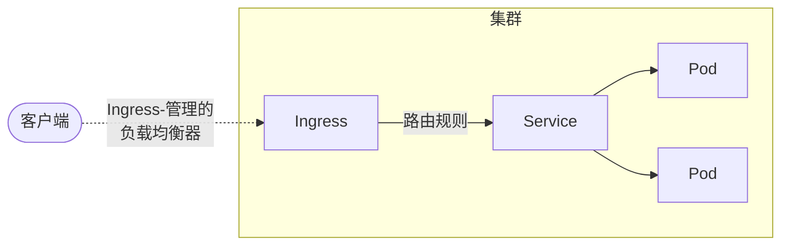

# Ingress

> Ingress 是 Kubernetes 集群中实现 HTTP/HTTPS 流量智能路由和安全暴露的核心机制，合理配置可实现灵活的服务访问与流量管理。

## 1. 概述 {/* #概述 */}

Ingress 是 Kubernetes 的资源对象，用于管理集群外部到集群内服务的 HTTP 和 HTTPS 访问。它充当智能路由器，根据定义的规则将外部流量路由到集群内的不同服务。

Ingress 在 Kubernetes 1.9 正式发布，目前仍被广泛使用。但对于新项目，建议考虑使用更现代的 [Gateway API](./05-Gateway-API.md) 作为替代方案，它提供更强大和灵活的流量管理能力。

## 2. Ingress 架构与核心功能 {/* #ingress-架构与核心功能 */}

Ingress 的工作原理如下图所示，展示了客户端流量如何通过 Ingress 控制器路由到后端服务和 Pod。




Ingress 提供以下核心功能：

- 外部 URL 访问：为集群内服务提供外部可访问的 URL
- 负载均衡：在多个 Pod 实例之间分发流量
- SSL/TLS 终结：处理 HTTPS 证书和加密
- 基于名称的虚拟主机：根据主机名路由到不同服务
- 路径路由：根据 URL 路径将请求路由到不同服务

## 3. 前置条件 {/* #前置条件 */}

在使用 Ingress 前，需要满足以下条件：

- 部署 Ingress 控制器（如 NGINX、Traefik、HAProxy 等）
- 配置 IngressClass，指定使用的控制器
- 准备好后端 Service 和 Pod

仅创建 Ingress 资源本身不会产生任何效果，必须配合 [Ingress 控制器](../../../cloud-native/kubernetes/controllers/08-Ingress控制器.md) 一起使用。

## 4. 基本配置与路径类型 {/* #基本配置与路径类型 */}

Ingress 支持多种路径类型和灵活的路由规则，适用于不同访问场景。

### 4.1 最简单的 Ingress 配置 {/* #最简单的-ingress-配置 */}

以下为典型的 Ingress 配置示例：

```yaml
apiVersion: networking.k8s.io/v1
kind: Ingress
metadata:
  name: simple-ingress
  annotations:
    nginx.ingress.kubernetes.io/rewrite-target: /
spec:
  ingressClassName: nginx
  rules:
  - host: example.com
    http:
      paths:
      - path: /
        pathType: Prefix
        backend:
          service:
            name: web-service
            port:
              number: 80
```

### 4.2 路径类型说明 {/* #路径类型说明 */}

Kubernetes 支持三种路径类型：

- `Exact`：精确匹配 URL 路径（区分大小写）
- `Prefix`：基于 URL 路径前缀匹配，按 `/` 分隔
- `ImplementationSpecific`：匹配方法由 IngressClass 决定

## 5. IngressClass 详解 {/* #ingressclass-详解 */}

IngressClass 用于定义 Ingress 的实现类别，支持集群范围和命名空间范围参数配置。

### 5.1 基本 IngressClass 配置 {/* #基本-ingressclass-配置 */}

下面的 `k8s.io/ingress-nginx` 只用于帮助读懂已有集群，它对应已经退役的社区 ingress-nginx Controller。新集群应填写所选且仍受支持的 Controller 标识，不能把示例值当成 Kubernetes 通用默认值。

```yaml
apiVersion: networking.k8s.io/v1
kind: IngressClass
metadata:
  name: nginx
spec:
  controller: k8s.io/ingress-nginx
```

### 5.2 设置默认 IngressClass {/* #设置默认-ingressclass */}

```yaml
apiVersion: networking.k8s.io/v1
kind: IngressClass
metadata:
  name: nginx
  annotations:
    ingressclass.kubernetes.io/is-default-class: "true"
spec:
  controller: k8s.io/ingress-nginx
```

### 5.3 参数化配置示例 {/* #参数化配置示例 */}

#### 5.3.1 集群范围参数 {/* #集群范围参数 */}

```yaml
apiVersion: networking.k8s.io/v1
kind: IngressClass
metadata:
  name: external-lb
spec:
  controller: example.com/ingress-controller
  parameters:
    scope: Cluster
    apiGroup: k8s.example.net
    kind: ClusterIngressParameter
    name: external-config
```

#### 5.3.2 命名空间范围参数 {/* #命名空间范围参数 */}

```yaml
apiVersion: networking.k8s.io/v1
kind: IngressClass
metadata:
  name: internal-lb
spec:
  controller: example.com/ingress-controller
  parameters:
    scope: Namespace
    apiGroup: k8s.example.com
    kind: IngressParameter
    namespace: ingress-config
    name: internal-config
```

## 6. 常见使用场景 {/* #常见使用场景 */}

Ingress 支持多种典型场景，满足不同业务需求。

### 6.1 单服务暴露 {/* #单服务暴露 */}

```yaml
apiVersion: networking.k8s.io/v1
kind: Ingress
metadata:
  name: single-service
spec:
  ingressClassName: nginx
  defaultBackend:
    service:
      name: web-service
      port:
        number: 80
```

### 6.2 路径扇出 {/* #路径扇出 */}

```yaml
apiVersion: networking.k8s.io/v1
kind: Ingress
metadata:
  name: path-fanout
spec:
  ingressClassName: nginx
  rules:
  - host: api.example.com
    http:
      paths:
      - path: /v1
        pathType: Prefix
        backend:
          service:
            name: api-v1-service
            port:
              number: 80
      - path: /v2
        pathType: Prefix
        backend:
          service:
            name: api-v2-service
            port:
              number: 80
```

### 6.3 基于主机名的虚拟主机 {/* #基于主机名的虚拟主机 */}

```yaml
apiVersion: networking.k8s.io/v1
kind: Ingress
metadata:
  name: virtual-host
spec:
  ingressClassName: nginx
  rules:
  - host: blog.example.com
    http:
      paths:
      - path: /
        pathType: Prefix
        backend:
          service:
            name: blog-service
            port:
              number: 80
  - host: shop.example.com
    http:
      paths:
      - path: /
        pathType: Prefix
        backend:
          service:
            name: shop-service
            port:
              number: 80
```

## 7. TLS/SSL 配置 {/* #tlsssl-配置 */}

Ingress 支持多种 TLS 配置，保障数据安全传输。

### 7.1 单域名 TLS {/* #单域名-tls */}

```yaml
apiVersion: networking.k8s.io/v1
kind: Ingress
metadata:
  name: tls-example
spec:
  ingressClassName: nginx
  tls:
  - hosts:
    - secure.example.com
    secretName: tls-secret
  rules:
  - host: secure.example.com
    http:
      paths:
      - path: /
        pathType: Prefix
        backend:
          service:
            name: secure-service
            port:
              number: 443
```

### 7.2 多域名 TLS {/* #多域名-tls */}

```yaml
apiVersion: networking.k8s.io/v1
kind: Ingress
metadata:
  name: multi-tls
spec:
  ingressClassName: nginx
  tls:
  - hosts:
    - api.example.com
    - admin.example.com
    secretName: wildcard-tls-secret
  rules:
  - host: api.example.com
    http:
      paths:
      - path: /
        pathType: Prefix
        backend:
          service:
            name: api-service
            port:
              number: 80
  - host: admin.example.com
    http:
      paths:
      - path: /
        pathType: Prefix
        backend:
          service:
            name: admin-service
            port:
              number: 80
```

### 7.3 创建 TLS Secret {/* #创建-tls-secret */}

```bash
kubectl create secret tls tls-secret \
  --cert=path/to/tls.cert \
  --key=path/to/tls.key
```

## 8. 高级功能与注解 {/* #高级功能与注解 */}

Ingress API 只定义主机、路径、后端和 TLS 等通用字段。重写、限流、CORS、源地址限制和流量镜像通常由控制器通过注解扩展，因此注解并不是 Kubernetes 的跨实现标准。

下面以社区 `ingress-nginx` 曾使用的注解命名空间说明语义。云厂商托管控制器、F5 NGINX Ingress Controller、NGINX Gateway Fabric 和其他 Nginx 实现可能使用不同字段；使用前必须核对实际 Controller 名称、镜像和对应版本文档。

```yaml
apiVersion: networking.k8s.io/v1
kind: Ingress
metadata:
  name: advanced-ingress
  annotations:
    nginx.ingress.kubernetes.io/use-regex: "true"
    nginx.ingress.kubernetes.io/rewrite-target: /$2
    nginx.ingress.kubernetes.io/ssl-redirect: "true"
    nginx.ingress.kubernetes.io/proxy-connect-timeout: "5"
    nginx.ingress.kubernetes.io/proxy-read-timeout: "60"
    nginx.ingress.kubernetes.io/proxy-body-size: "10m"
    nginx.ingress.kubernetes.io/limit-rps: "20"
    nginx.ingress.kubernetes.io/limit-connections: "10"
    nginx.ingress.kubernetes.io/enable-cors: "true"
    nginx.ingress.kubernetes.io/cors-allow-origin: "https://console.example.com"
spec:
  ingressClassName: nginx
  rules:
  - host: api.example.com
    http:
      paths:
      - path: /api(/|$)(.*)
        pathType: ImplementationSpecific
        backend:
          service:
            name: api-service
            port:
              number: 80
```

这份示例有两个容易忽略的条件：

1. 路径包含捕获组，需要显式开启正则并使用实现相关的 `ImplementationSpecific`；不能把正则字符串当作标准 `Prefix` 路径。
2. `limit-rps` 是单个控制器的扩展语义，不等于所有副本共享一个精确的全局限流器。控制器副本数、客户端 IP 识别和前置代理都会影响结果。

### 8.1 常见注解按职责分类

| 目标 | 常见注解示例 | 主要风险 |
| --- | --- | --- |
| HTTPS 跳转 | `ssl-redirect`、`force-ssl-redirect` | 前置 LB 已终止 TLS 时可能形成循环 |
| 后端协议 | `backend-protocol` | 把 HTTPS/gRPC 后端误当 HTTP 会出现 502 |
| 超时 | `proxy-connect/read/send-timeout` | 流式接口和普通 API 所需时间不同 |
| 请求体 | `proxy-body-size` | 过大增加内存、磁盘和攻击面 |
| 重写/正则 | `rewrite-target`、`use-regex` | 路径语义改变、规则互相影响 |
| 源地址控制 | `whitelist-source-range`、`denylist-source-range` | 必须先确认真实客户端 IP 信任链 |
| 限流限连 | `limit-rps`、`limit-connections` | 多副本下不一定是全局精确值 |
| 灰度 | `canary`、`canary-weight`、header/cookie 条件 | 会话一致性和多规则优先级 |
| 流量镜像 | `mirror-target` | 镜像仍可能产生写副作用和敏感数据泄漏 |
| CORS | `enable-cors`、`cors-allow-origin` | `*` 与凭据组合不安全且可能无效 |

对生产环境应建立“允许使用的注解清单”。`configuration-snippet`、`server-snippet` 等能注入原生 Nginx 配置的能力权限很大，可能突破 namespace 边界，不应默认向所有租户开放。

### 8.2 默认后端 {/* #默认后端 */}

为未匹配任何规则的请求提供默认处理：

```yaml
apiVersion: networking.k8s.io/v1
kind: Ingress
metadata:
  name: default-backend
spec:
  ingressClassName: nginx
  defaultBackend:
    service:
      name: default-service
      port:
        number: 80
  rules:
  - host: example.com
    http:
      paths:
      - path: /app
        pathType: Prefix
        backend:
          service:
            name: app-service
            port:
              number: 80
```

## 9. 管理与维护 {/* #管理与维护 */}

日常管理和维护 Ingress 资源时，可参考以下命令和流程。

### 9.1 更新 Ingress 配置 {/* #更新-ingress-配置 */}

```bash
# 编辑现有 Ingress
kubectl edit ingress my-ingress

# 应用新配置
kubectl apply -f ingress.yaml

# 查看 Ingress 状态
kubectl get ingress
kubectl describe ingress my-ingress
```

### 9.2 故障排查 {/* #故障排查 */}

```bash
# 检查 Ingress 控制器日志
kubectl logs -n ingress-nginx deployment/ingress-nginx-controller

# 检查 Ingress 事件
kubectl get events --field-selector involvedObject.kind=Ingress

# 验证后端服务
kubectl get svc
kubectl get endpoints
```

## 10. 迁移与替代方案 {/* #迁移与替代方案 */}

### 10.1 先区分 Ingress API 与 ingress-nginx

Ingress 是 Kubernetes API；Ingress Controller 是读取该 API 并配置代理或云负载均衡器的实现。二者生命周期不同。

Kubernetes 社区的 `kubernetes/ingress-nginx` 控制器已在 **2026 年 3 月**停止维护。已有 Deployment 和镜像不会因此自动停止运行，但此后没有新版本、缺陷修复和安全更新。退役不代表 Ingress API 被删除，也不代表所有厂商的 Nginx 控制器同时退役。

先识别集群实际运行的实现：

```bash
kubectl get pods -A -l app.kubernetes.io/name=ingress-nginx -o wide
kubectl get ingressclass -o custom-columns=NAME:.metadata.name,CONTROLLER:.spec.controller,DEFAULT:.metadata.annotations.ingressclass\\.kubernetes\\.io/is-default-class
kubectl get deploy -A -o jsonpath='{range .items[*]}{.metadata.namespace}{"\t"}{.metadata.name}{"\t"}{range .spec.template.spec.containers[*]}{.image}{" "}{end}{"\n"}{end}' \
  | grep -Ei 'ingress|gateway|nginx|traefik|contour|kong|apisix'
```

若使用云厂商插件，还要确认镜像由谁维护、支持到何时、注解与社区版本是否兼容，不能仅根据名称中含 `nginx` 推断生命周期。

### 10.2 从 class 注解到 IngressClass {/* #从注解到-ingressclass */}

Kubernetes 1.18 之前的 `kubernetes.io/ingress.class` 注解已废弃，推荐使用 `ingressClassName` 字段。

```yaml
# 旧方式（已废弃）
metadata:
  annotations:
    kubernetes.io/ingress.class: nginx

# 新方式（推荐）
spec:
  ingressClassName: nginx
```

### 10.3 从注解迁移到 Gateway API

迁移不是把 YAML 的 `kind` 改名。应先建立功能清单：

```text
Ingress/注解
→ 域名和路径
→ TLS 终止与证书来源
→ 重写、跳转、超时、重试
→ 鉴权、限流、WAF
→ 灰度、镜像、会话一致性
→ 真实客户端 IP 和访问日志
→ Gateway API 标准字段或实现扩展
```

标准的 `Gateway`、`HTTPRoute` 能表达监听器、路由、Header 匹配、权重后端等能力；控制器特有功能可能仍需 Policy CRD 或扩展 Filter。迁移后要做响应码、Header、TLS、长连接、客户端 IP、超时和流量比例的回归，而不是只确认资源 `Accepted=True`。

详见[迁移到 Gateway API](./07-迁移到Gateway-API.md)。

### 10.4 替代方案对比 {/* #替代方案对比 */}

| 方案 | 适用场景 | 边界 |
| --- | --- | --- |
| 仍受支持的 Ingress Controller | 已有 Ingress 资产、功能简单 | 注解高度依赖实现，先确认维护生命周期 |
| Gateway API 实现 | 新建平台、角色分离、复杂流量治理 | 需验证实现的 Conformance 和扩展 Policy |
| API Gateway | 鉴权、配额、消费者、插件和 API 生命周期 | 不等同于通用 East-West 服务网格 |
| Service Mesh Gateway | 已使用 Mesh、需要统一 mTLS/流量策略 | 控制面和运维复杂度更高 |
| 云 Load Balancer Controller | 深度使用云网络和托管 LB | 受云平台能力、配额和成本约束 |

## 11. 最佳实践 {/* #最佳实践 */}

- 明确指定 `ingressClassName`，避免多个控制器同时接管或无人接管。
- 记录 Controller 名称、镜像、版本、维护方和配置来源。
- 生产环境启用 HTTPS，验证证书续期、SNI 和后端协议。
- 对注解建立允许清单，限制 snippet 类配置的使用权限。
- 为超时、请求体、限流和 CORS 设置符合业务语义的值，而不是复制模板。
- 监控配置 reload 失败、5xx、上游连接、证书和控制器资源。
- 迁移时使用流量回放或 canary 比较旧、新入口行为。

## 12. 总结 {/* #总结 */}

Ingress 资源只描述路由意图，实际能力和风险由 Controller 决定。阅读一条注解时，应同时知道它由哪个实现解析、生成什么代理配置、对数据面有什么影响以及如何迁移。新平台优先评估 Gateway API；存量 Ingress 则先完成资产盘点和行为测试，再迁移。

## 13. 参考资料 {/* #参考文献 */}

- [Ingress - Kubernetes 官方文档](https://kubernetes.io/docs/concepts/services-networking/ingress/)
- [Ingress Controllers - Kubernetes 官方文档](https://kubernetes.io/docs/concepts/services-networking/ingress-controllers/)
- [Gateway API - Kubernetes SIG Network](https://gateway-api.sigs.k8s.io/)
- [Ingress NGINX Retirement](https://kubernetes.io/blog/2025/11/11/ingress-nginx-retirement/)
- [CCE Nginx Ingress 注解配置案例](https://support.huaweicloud.com/usermanual-cce/cce_10_0699.html)
