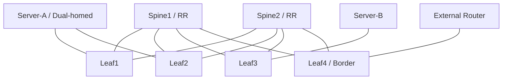

# 数据中心 Fabric 综合项目

这个项目用于验收第二阶段。目标不是复制一份配置，而是独立完成需求分析、设计、实施、验证和故障复盘。

## 1. 业务需求

建设一个小型数据中心 Fabric：

- 2 台 Spine、4 台 Leaf；
- Leaf1/Leaf2 为一个接入对，Leaf3/Leaf4 为另一个接入对；
- 3 个租户，地址和路由相互隔离；
- Tenant-A 有 Web 和 App 两个子网，需要跨子网访问；
- Tenant-B 只做同子网二层延伸；
- Tenant-C 通过 Border Leaf 访问外部网络；
- 服务器双归属时单链路或单 Leaf故障不中断已有业务；
- Underlay 单链路故障应通过 ECMP 快速绕行。

## 2. 参考拓扑



可使用 containerlab + FRRouting、Linux bridge/VXLAN，或者支持 EVPN 的虚拟网络设备。实验能力比厂商命令一致性更重要。

## 3. 必须自行完成的设计

### 3.1 地址表

至少包含：

| 对象 | 地址/编号 | 用途 |
|---|---|---|
| Spine/Leaf Loopback | 自行规划 /32 | Router ID、VTEP |
| P2P Link | `/31` 或无编号 | Underlay |
| Underlay ASN | 自行规划 | eBGP 或 iBGP/IGP 方案 |
| L2VNI | 每子网唯一 | 二层广播域 |
| L3VNI | 每租户唯一 | 对称 IRB |
| RD/RT | 规则化生成 | 唯一性和导入导出 |
| Anycast GW | 每子网一个 | 分布式网关 |
| ESI | 接入对唯一 | EVPN 多归属 |

### 3.2 策略表

- Underlay 只承载基础设施前缀；
- Overlay 邻居只激活 EVPN 地址族；
- 不同租户 RT 不得互相导入；
- Border Leaf只向 Tenant-C 发布允许的外部前缀；
- 设置最大前缀和 BGP 邻居保护；
- 管理平面不得与租户数据面混用。

## 4. 实施顺序

### 阶段 A：先让 Underlay 完全可用

验收：

```text
所有 Leaf 均有到所有远端 VTEP Loopback 的路由
每个目的存在预期 ECMP 下一跳
任意单条 Spine-Leaf 链路断开后仍可达
大包 MTU 测试通过
无意外默认路由
```

### 阶段 B：建立 EVPN 控制面

验收：

- RR 与所有 Leaf的 EVPN 邻居正常；
- 邻居地址族、Update Source、Next-Hop 行为正确；
- 空业务时不应出现未知租户路由；
- 每个 VNI 的 RD/RT 符合设计表。

### 阶段 C：接入租户

按 Tenant-B 二层、Tenant-A 三层、Tenant-C 外部路由的顺序逐个增加复杂度。

每增加一个对象都验证：

```text
本地 MAC/IP
→ EVPN 路由
→ 远端导入
→ FDB/ARP/VRF
→ 实际数据包
```

### 阶段 D：多归属

为 Server-A 配置 Bond/LACP 和同一 ESI，验证：

- 正常时单播可利用两个 Leaf；
- BUM 只有 DF 向服务器段转发；
- 断开单成员、单 Leaf时收敛；
- 恢复后无长时间 MAC 抖动。

## 5. 测试矩阵

| 编号 | 流量 | 期望 |
|---|---|---|
| T01 | Tenant-B 同子网跨 Leaf | 成功 |
| T02 | Tenant-A Web → App | 成功，经对称 IRB |
| T03 | Tenant-A → Tenant-B | 失败，租户隔离 |
| T04 | Tenant-C → 允许外部前缀 | 成功，经 Border Leaf |
| T05 | Tenant-C → 未允许外部前缀 | 失败 |
| T06 | 单 Spine-Leaf 链路断开 | 业务快速恢复 |
| T07 | 单接入 Leaf断开 | 双归属服务器继续通信 |
| T08 | 最大尺寸业务包 | 成功，无 MTU 黑洞 |

对每个测试保留：

- 流量五元组；
- 关键表项；
- 抓包或计数器；
- 结果与时间；
- 失败时的修复记录。

## 6. 故障注入

必须主动制造并独立定位：

1. 一个 Leaf缺少远端 VTEP 的 Underlay 路由；
2. 一个租户 import RT 错误；
3. 一个 VLAN 映射到错误 L2VNI；
4. 一个 Leaf的 Anycast Gateway MAC 不一致；
5. Fabric 某链路 MTU 过小；
6. Border Leaf错误发布默认路由；
7. 多归属 ESI 不一致；
8. RR 邻居正常但 EVPN 地址族未激活。

每个故障写一页复盘：

```text
用户症状
影响范围
第一条有效证据
根因所在平面
修复动作
恢复证据
如何通过检查或监控提前发现
```

## 7. 项目交付物

```text
fabric-lab/
├── README.md
├── topology.clab.yml
├── addressing.md
├── intent/
│   ├── tenants.yml
│   └── policies.yml
├── configs/
├── tests/
│   ├── reachability.md
│   └── failure-drills.md
├── captures/
└── postmortems/
```

配置文件只是交付物的一部分。真正能证明掌握的是：设计约束、验证脚本、故障证据和复盘。

## 8. 最终验收

你应能脱离教程完成：

- 从需求推导 Clos 端口、地址、ASN、VNI、RD/RT 和 VRF；
- 解释任意测试流的外层与内层报文；
- 从五层证据定位错误；
- 量化单链路、单 Leaf故障的丢包和收敛；
- 清楚说明哪些状态来自意图、哪些来自控制面、哪些已下发到数据面。

完成后进入第三阶段，把这套手工设计变成可审计、可验证、可回滚的自动化系统。
