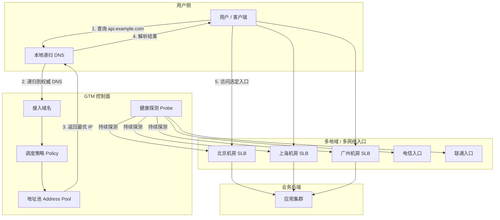
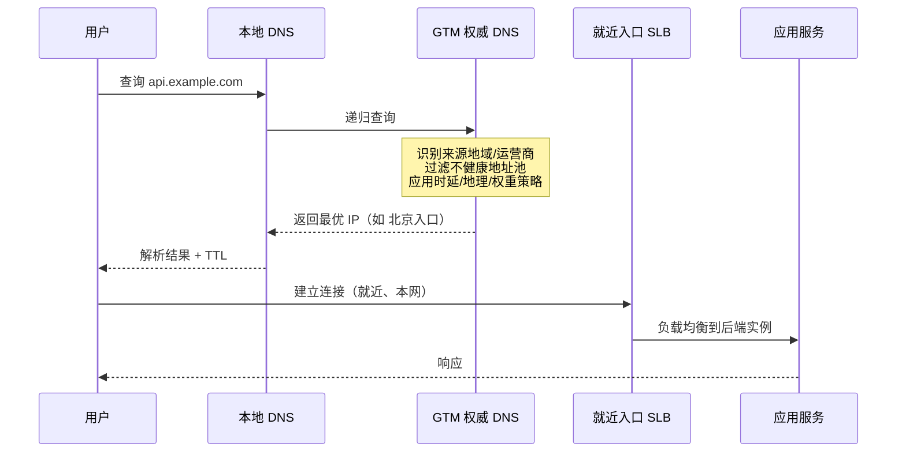
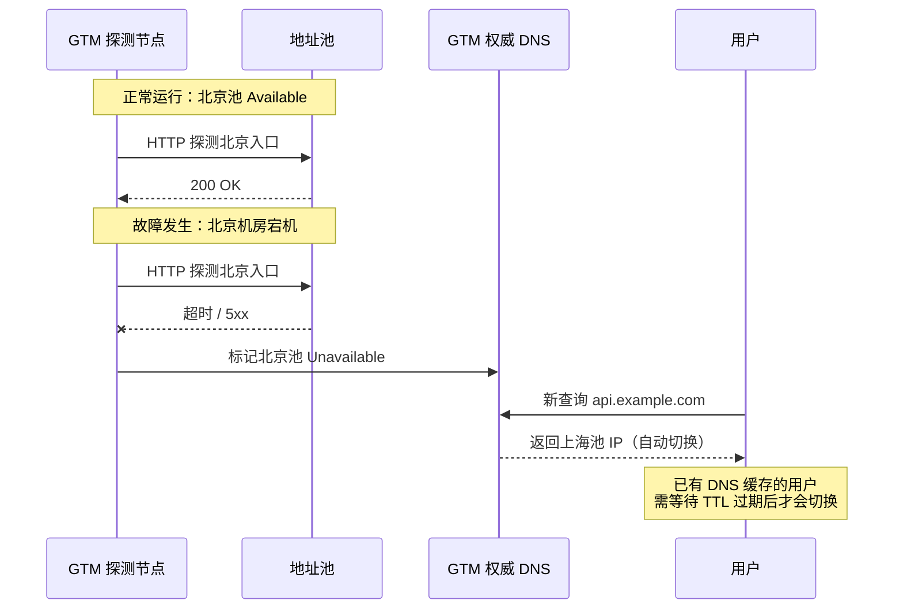

# GTM 实现跨网访问加速与故障切换

## 1. 摘要 {/* #摘要 */}

当业务部署在多个数据中心、多个云厂商或多个运营商网络时，用户「跨网」访问往往面临两个问题：**访问慢**（绕路、跨地域时延高）和**不够稳**（单点机房故障导致大面积不可用）。

**GTM**（Global Traffic Manager，全局流量管理）通过在 DNS 解析层做智能调度，把用户引导到**最近、最快、最健康**的接入点，并在故障时自动切换。本文从实现原理出发，说明 GTM 如何实现跨网访问加速与故障切换，以及落地时需要注意的关键细节。

## 2. 为什么需要 GTM {/* #1-为什么需要-gtm */}

### 2.1 典型场景 {/* #11-典型场景 */}

| 场景 | 痛点 | GTM 能做什么 |
|------|------|--------------|
| 多机房 / 多地域部署 | 用户固定解析到远端机房，时延高 | 按地理位置或时延，解析到就近机房 |
| 跨运营商访问 | 电信用户访问联通机房，绕路严重 | 按来源运营商，解析到本网最优入口 |
| 混合云 / 多云 | 云上云下各有一套入口，故障时无法自动切换 | 统一域名，健康检查 + 自动摘除故障池 |
| 大促 / 容灾演练 | 需要手动改 DNS 或切流量，窗口长、风险大 | 策略化切换，秒级到分钟级生效 |

### 2.2 和「普通负载均衡」的区别 {/* #12-和普通负载均衡的区别 */}

很多人把 GTM 和 SLB / ALB / Nginx 负载均衡混为一谈。核心差异在于**调度发生的位置**：

```text
GTM：在 DNS 层调度 → 决定用户「去哪个入口 IP」
SLB/ALB：在连接层调度 → 决定请求「落到哪台后端实例」
```

GTM 管的是**全局入口选择**；机房内的实例分担，仍由本地负载均衡完成。两者是互补关系，不是替代关系。

## 3. GTM 是什么 {/* #2-gtm-是什么 */}

**GTM**（Global Traffic Manager）是一种基于 DNS 的**全局流量调度**能力，也常被称为 **GSLB**（Global Server Load Balancing，全局服务器负载均衡）。

工作原理可以概括为一句话：

> 用户查询域名时，GTM 根据**来源位置、链路质量、策略权重、目标健康状态**，返回最合适的 A/AAAA/CNAME 记录。

常见产品形态包括：

- 云厂商 GTM（如阿里云 GTM、腾讯云 DNSPod 负载均衡、AWS Route 53 多值/延迟路由）
- 硬件/软件 GSLB（如 F5 BIG-IP DNS、Citrix ADC GSLB）
- 专业 DNS 服务商（NS1、Cloudflare Load Balancing 等）

无论产品形态如何，底层原理都围绕 **权威 DNS + 智能解析策略 + 健康探测** 这三件事展开。

## 4. 整体架构 {/* #3-整体架构 */}



### 4.1 四个核心组件 {/* #31-四个核心组件 */}

| 组件 | 作用 |
|------|------|
| **接入域名** | 对用户暴露的统一访问域名，如 `api.example.com` |
| **地址池** | 一组可被选中的入口（IP 或 CNAME），通常按地域、机房、运营商划分 |
| **健康探测** | 周期性检测地址池中每个入口是否可用 |
| **调度策略** | 在「可用」的地址中，按地理位置、时延、权重等规则选出最终应答 |

## 5. 跨网访问加速的实现原理 {/* #4-跨网访问加速的实现原理 */}

GTM 的「加速」并不是在链路上做数据压缩或协议优化，而是通过**让用户从正确的门进来**，减少绕路和跨网损耗。

### 5.1 就近接入（地理调度） {/* #41-就近接入地理调度 */}

GTM 权威 DNS 能识别请求来源的大致位置（通常基于**递归 DNS 的出口 IP** 做 GeoIP 映射），然后返回同地域或同运营商的入口地址。

```text
北京用户 → 解析到北京机房入口
上海用户 → 解析到上海机房入口
```

这样用户访问路径更短，RTT 更低，也减少了跨省、跨运营商的骨干网绕行。

### 5.2 时延优先（Latency-based Routing） {/* #42-时延优先latency-based-routing */}

部分 GTM 会在多个候选入口上维护**探测时延矩阵**：从各 DNS 解析节点到各地址池入口的 RTT，动态选择时延最低的池。

这比纯地理映射更精细——例如地理上「最近」的机房，可能因链路拥塞反而比次近机房更慢，时延优先策略能规避这类情况。

### 5.3 分运营商 / 分线路调度 {/* #43-分运营商--分线路调度 */}

在「跨网」场景中，同一城市可能存在电信、联通、移动多条出口。GTM 可为不同来源运营商配置不同地址池：

```text
来源 ASN = 电信 → 返回电信线路入口
来源 ASN = 联通 → 返回联通线路入口
```

用户全程走本网线路，避免跨网结算和跨网质量劣化，这是国内多线机房场景里非常常见的加速手段。

### 5.4 请求全链路（加速视角） {/* #44-请求全链路加速视角 */}



### 5.5 加速效果的边界 {/* #45-加速效果的边界 */}

需要明确：GTM 解决的是**入口选择**问题，不解决以下问题：

- 机房内部应用性能瓶颈
- 数据库跨地域同步延迟
- 入口之后的长连接已建立、DNS 缓存未过期时的「粘滞」

因此 GTM 通常与 **CDN**（静态资源边缘缓存）、**本地 SLB**（机房内分担）、**应用层多活** 配合使用。

## 6. 故障切换的实现原理 {/* #5-故障切换的实现原理 */}

### 6.1 健康探测（Health Probe） {/* #51-健康探测health-probe */}

GTM 控制面会按配置周期，对地址池中每个入口发起探测。常见探测方式：

| 探测类型 | 方式 | 适用场景 |
|----------|------|----------|
| Ping 探测 | ICMP 可达性 | 粗粒度网络连通性 |
| TCP 探测 | 指定端口握手 | 四层服务可用性 |
| HTTP(S) 探测 | 请求 URL，校验状态码/响应体 | 七层业务可用性 |
| DNS 探测 | 查询指定记录 | DNS 服务本身 |

探测结果会标记每个地址为 **Available** 或 **Unavailable**。不可用地址从调度候选集中移除，不再被返回给用户。

### 6.2 地址池与优先级 {/* #52-地址池与优先级 */}

地址池通常支持多层结构：

```text
主地址池（北京、上海）  ← 正常时优先
备用地址池（广州）      ← 主池全部不可用时启用
```

常见策略：

- **主备模式（Active-Standby）**：主池健康则只返回主池；主池全部故障后切到备池
- **多活模式（Active-Active）**：多个池同时服务，按权重或时延分配
- **混合模式**：同地域多活 + 跨地域主备

### 6.3 故障切换时序 {/* #53-故障切换时序 */}



### 6.4 切换速度：TTL 是关键 {/* #54-切换速度ttl-是关键 */}

GTM 故障切换的生效时间，受两个因素影响：

1. **探测间隔 + 失败阈值**：例如每 10 秒探测一次，连续 3 次失败才判定不可用 → 最快约 30 秒发现故障
2. **DNS TTL**：用户本地 DNS 和操作系统会缓存解析结果。TTL=300 时，最坏情况下用户可能 5 分钟内仍访问旧 IP

生产环境常见做法：

- 业务入口 TTL 设为 **30～60 秒**（平衡切换速度与 DNS 查询压力）
- 核心系统配合 **连接层重试** 或 **客户端 DNS 刷新**，缩短感知切换时间
- 重要故障场景预留 **手动降 TTL** 或 **主动刷新缓存** 的应急预案

### 6.5 切换风暴与抖动 {/* #55-切换风暴与抖动 */}

如果探测过于敏感，入口短暂抖动会导致地址池频繁上下线，引发「切换风暴」。常见防护：

- 设置**连续失败次数阈值**和**恢复成功次数阈值**（滞后比较器思想）
- 配置**探测间隔**与**超时时间**的合理比例
- 启用**最小可用地址数**告警，避免所有池同时被误摘

## 7. 调度策略详解 {/* #6-调度策略详解 */}

### 7.1 常见策略类型 {/* #61-常见策略类型 */}

| 策略 | 原理 | 典型用途 |
|------|------|----------|
| 地理就近 | 按来源地域映射到指定池 | 多地域部署，降低 RTT |
| 时延优先 | 选择 RTT 最低的可用池 | 链路质量动态变化 |
| 加权轮询 | 按权重比例分配流量 | 灰度发布、异构机房容量不均 |
| 主备容灾 | 主池可用时只走主池 | 两地三中心容灾 |
| 分运营商 | 按来源 ISP 返回不同池 | 国内多线接入 |
| 会话保持 | 同一来源在一定时间内固定到同一池 | 有状态业务（慎用，与故障切换有冲突） |

### 7.2 策略执行顺序（逻辑模型） {/* #62-策略执行顺序逻辑模型 */}

不同产品实现细节不同，但逻辑上通常遵循：

```text
1. 健康检查过滤 → 剔除不可用地址
2. 地理 / 运营商匹配 → 缩小候选范围
3. 时延 / 权重计算 → 在候选池中选出最终应答
4. 写入 DNS 响应 → 附带 TTL 返回给递归 DNS
```

## 8. 与相关技术的对比 {/* #7-与相关技术的对比 */}

| 技术 | 工作层级 | 加速方式 | 故障切换方式 | 适用边界 |
|------|----------|----------|--------------|----------|
| **GTM / GSLB** | DNS 层 | 就近解析、分线路 | 探测摘除 + 备池切换 | 全局入口调度 |
| **CDN** | 边缘缓存层 | 静态内容边缘命中 | 多源站回源切换 | 静态资源、可缓存内容 |
| **SLB / ALB** | 四层 / 七层 | 机房内连接分发 | 后端健康检查摘除 | 单地域入口内 |
| **Anycast** | 网络层 | 路由协议牵引到最近节点 | BGP 收敛 | 需要 IP 层 Anycast 能力 |
| **SD-WAN** | 广域网传输层 | 选路优化、链路聚合 | 链路故障切换 | 分支到总部 / 多云互联 |

实践中常见组合：

```text
GTM（选入口） → CDN（静态加速） → SLB（机房内负载） → 应用
```

## 9. 落地实现要点 {/* #8-落地实现要点 */}

### 9.1 域名与 DNS 托管 {/* #81-域名与-dns-托管 */}

1. 将业务域名的 **NS 记录** 托管到支持 GTM 的 DNS 服务
2. 创建 **接入域名**（如 `api.example.com`）
3. 为每个地域 / 线路创建 **地址池**，填入 SLB 公网 IP 或 CNAME
4. 配置 **探测任务**（建议与真实业务路径一致，用 HTTPS 探测业务 URL）
5. 绑定 **调度策略**，设置 TTL

### 9.2 地址池设计建议 {/* #82-地址池设计建议 */}

```text
pool-beijing-telecom    → 北京机房电信入口
pool-beijing-unicom     → 北京机房联通入口
pool-shanghai-telecom   → 上海机房电信入口
pool-shanghai-unicom    → 上海机房联通入口
pool-backup-guangzhou   → 灾备入口（主备模式备用）
```

原则：

- **按地域 + 运营商拆分**，而非把所有 IP 扔进一个池
- **入口对齐真实链路**，探测点尽量覆盖用户真实访问路径
- **主备池分离**，避免容灾池在正常时被误命中

### 9.3 探测配置参考 {/* #83-探测配置参考 */}

| 参数 | 建议值 | 说明 |
|------|--------|------|
| 探测间隔 | 10～30 秒 | 过短增加入口压力，过长拖慢发现 |
| 超时时间 | 3～5 秒 | 与业务容忍时延对齐 |
| 失败阈值 | 连续 3 次 | 防止瞬时抖动误摘 |
| 恢复阈值 | 连续 2～3 次成功 | 防止频繁上下线 |
| 探测 URL | 健康检查接口 | 如 `/healthz`，轻量且能代表业务 |

### 9.4 TTL 与缓存 {/* #84-ttl-与缓存 */}

| 场景 | TTL 建议 |
|------|----------|
| 生产稳态 | 60 秒 |
| 容灾演练前 | 提前 24h 降到 30 秒 |
| 紧急故障切换 | 10～30 秒（短期，事后恢复） |

## 10. 典型故障场景分析 {/* #9-典型故障场景分析 */}

### 10.1 「GTM 已切换，但用户仍访问故障机房」 {/* #91-gtm-已切换但用户仍访问故障机房 */}

**原因**：本地 DNS 或操作系统缓存了旧解析结果，TTL 未过期。

**处理**：

- 检查当前 TTL 配置
- 确认是否所有地址池都已正确摘除
- 必要时配合入口层连接拒绝，加速客户端失败重试

### 10.2 「探测正常，但用户访问失败」 {/* #92-探测正常但用户访问失败 */}

**原因**：探测 URL 与真实业务路径不一致。例如探测的是 SLB 健康检查端口，但业务 443 证书或 WAF 策略拦截了真实用户请求。

**处理**：探测路径应尽可能模拟真实用户访问链（协议、Host、路径一致）。

### 10.3 「切换后部分地域仍慢」 {/* #93-切换后部分地域仍慢 */}

**原因**：地理映射粒度不足，或递归 DNS 出口与用户实际网络不一致（如全国统一的公共 DNS 出口不在用户本省）。

**处理**：结合时延探测策略；对关键地域使用分线路池；评估分省 DNS 或 HTTPDNS 等补充手段。

### 10.4 「双活池流量不均衡」 {/* #94-双活池流量不均衡 */}

**原因**：权重配置不当、来源地域分布不均、或某池时延探测结果长期占优。

**处理**：审视权重与策略优先级；确认各池容量匹配流量分配比例。

## 11. 完整请求路径回顾 {/* #10-完整请求路径回顾 */}

把加速和故障切换放在一起，一次完整的用户访问路径如下：


**加速**发生在 `G` 步骤：选择最近、最快、最匹配线路的入口。
**故障切换**发生在 `F` 步骤：故障入口被摘除，流量自动落到备选池。

## 12. 总结 {/* #11-总结 */}

GTM 的核心价值，是在 DNS 层完成**全局视角的流量编排**：

1. **跨网加速**：通过地理就近、分运营商调度、时延优先，让用户从最优入口进入，减少绕路和跨网损耗。
2. **故障切换**：通过持续健康探测和地址池优先级，在入口故障时自动摘除并切换，配合合理 TTL 控制切换生效时间。
3. **与本地 LB 分工明确**：GTM 选「去哪个机房」，SLB 选「去哪台机器」。

落地时需要重点关注三件事：

- **地址池按地域和线路合理拆分**，而不是「一个大池打天下」
- **探测路径与真实业务一致**，避免「探测假活」
- **TTL 与故障发现时间联动设计**，平衡切换速度与 DNS 负载

GTM 不是银弹，但在多机房、多线路、跨云部署的场景下，它是实现「用户无感就近接入、故障自动转移」性价比最高的一层能力。

## 13. 相关概念速查 {/* #12-相关概念速查 */}

| 概念 | 说明 |
|------|------|
| GTM | Global Traffic Manager，全局流量管理，DNS 层智能调度 |
| GSLB | Global Server Load Balancing，全局服务器负载均衡，与 GTM 常混用 |
| 地址池 | 一组可被 DNS 返回的入口地址集合 |
| 权威 DNS | 对域名拥有最终解析答复权的 DNS 服务器 |
| 递归 DNS | 替用户向权威 DNS 逐级查询的 DNS（如 8.8.8.8、运营商 DNS） |
| TTL | Time To Live，DNS 记录在客户端的缓存存活时间 |
| GeoDNS | 基于请求来源地理位置返回不同解析结果的 DNS 策略 |
| Active-Standby | 主备模式，主池故障时切换到备池 |
| Active-Active | 多活模式，多个地址池同时承载流量 |
