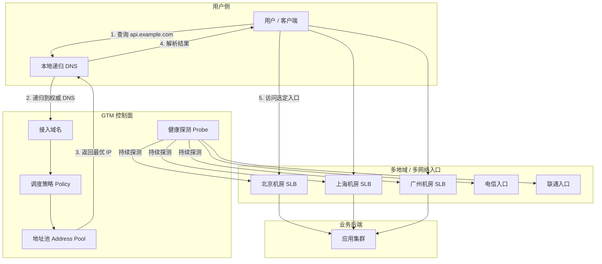
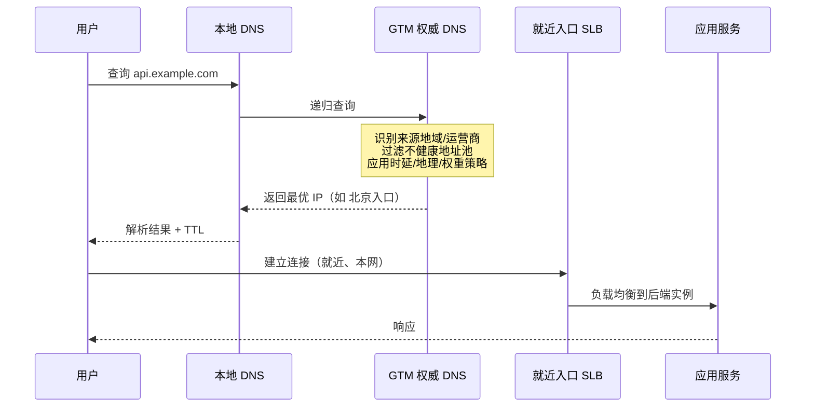
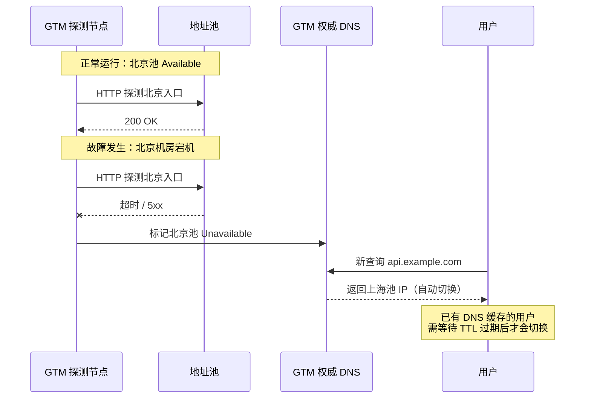

# GTM 实现跨网访问加速与故障切换

## 1. 摘要 {/* #摘要 */}

当业务部署在多个数据中心、多个云厂商或多个运营商网络时，用户「跨网」访问往往面临两个问题：**访问慢**（绕路、跨地域时延高）和**不够稳**（单点机房故障导致大面积不可用）。

本文讨论 DNS 型 **GTM**（Global Traffic Manager，全局流量管理）：依据来源、健康检查和策略选择服务入口。它能改善入口选择，却不能保证每个用户都获得最低时延，也不会把已经建立的连接自动搬到另一机房。

## 2. 为什么需要 GTM {/* #1-为什么需要-gtm */}

### 2.1 典型场景 {/* #11-典型场景 */}

| 场景 | 痛点 | GTM 能做什么 |
|------|------|--------------|
| 多机房 / 多地域部署 | 用户固定解析到远端机房，时延高 | 按地理位置或时延，解析到就近机房 |
| 跨运营商访问 | 电信用户访问联通机房，绕路严重 | 按来源运营商，解析到本网最优入口 |
| 混合云 / 多云 | 云上云下各有一套入口，故障时无法自动切换 | 统一域名，健康检查 + 自动摘除故障池 |
| 大促 / 容灾演练 | 需要修改入口，影响范围难判断 | 策略化选择新解析答案，生效还受探测、缓存和连接生命周期影响 |

### 2.2 和「普通负载均衡」的区别 {/* #12-和普通负载均衡的区别 */}

很多人把 GTM 和 SLB / ALB / Nginx 负载均衡混为一谈。核心差异在于**调度发生的位置**：

```text
GTM：在 DNS 层调度 → 决定用户「去哪个入口 IP」
SLB/ALB：在四层连接或七层请求上调度 → 决定后端实例
```

GTM 管的是**全局入口选择**；机房内的实例分担，仍由本地负载均衡完成。两者是互补关系，不是替代关系。

## 3. GTM 是什么 {/* #2-gtm-是什么 */}

GTM/GSLB 常用于描述全局入口分配。不同产品也可能结合代理或任播能力；本文只解释其中的 DNS 调度模型，不将所有全局负载均衡产品限定为同一种实现。

工作原理可以概括为一句话：

> 用户查询域名时，GTM 根据**来源位置、链路质量、策略权重、目标健康状态**，返回最合适的 A/AAAA/CNAME 记录。

常见产品形态包括：

- 云厂商 GTM（如阿里云 GTM、腾讯云 DNSPod 负载均衡、AWS Route 53 多值/延迟路由）
- 硬件/软件 GSLB（如 F5 BIG-IP DNS、Citrix ADC GSLB）
- 专业 DNS 服务商（NS1、Cloudflare Load Balancing 等）

本文模型围绕 **权威 DNS + 解析策略 + 健康探测** 展开。产品是否支持某种记录类型、策略组合或失败回退，要以对应版本文档为准。

## 4. 整体架构 {/* #3-整体架构 */}



### 4.1 四个核心组件 {/* #31-四个核心组件 */}

| 组件 | 作用 |
|------|------|
| **接入域名** | 对用户暴露的统一访问域名，如 `api.example.com` |
| **地址池** | 一组可被选中的入口（IP 或 CNAME），通常按地域、机房、运营商划分 |
| **健康探测** | 周期性检测地址池中每个入口是否可用 |
| **调度策略** | 在「可用」的地址中，按地理位置、时延、权重等规则选出最终应答 |

## 5. 跨网访问加速的实现原理 {/* #4-跨网访问加速的实现原理 */}

GTM 的「加速」并不是在链路上做数据压缩或协议优化，而是通过**让用户从正确的门进来**，减少绕路和跨网损耗。

### 5.1 就近接入（地理调度） {/* #41-就近接入地理调度 */}

GTM 权威 DNS 能识别请求来源的大致位置（通常基于**递归 DNS 的出口 IP** 做 GeoIP 映射），然后返回同地域或同运营商的入口地址。

```text
北京用户 → 解析到北京机房入口
上海用户 → 解析到上海机房入口
```

这样可能减少绕行，但递归器位置不一定等于用户位置，地理距离也不等于实际路由时延。公共 DNS、VPN 和企业集中出口都会改变来源视角。

### 5.2 时延优先（Latency-based Routing） {/* #42-时延优先latency-based-routing */}

时延调度需要先说明测量来源：探测节点 RTT、用户真实测量或服务商维护的网络时延数据，代表的路径不同，不能统一描述为“每个递归器实时测到所有入口”。例如 Route 53 使用其维护的区域时延数据，见 [延迟路由](https://docs.aws.amazon.com/Route53/latest/DeveloperGuide/routing-policy-latency.html)。

健康探测时延较低只证明探测路径较快，不保证用户链路或应用下游也快。地理、来源网络和业务指标需要交叉验证。

### 5.3 分运营商 / 分线路调度 {/* #43-分运营商--分线路调度 */}

在「跨网」场景中，同一城市可能存在电信、联通、移动多条出口。GTM 可为不同来源运营商配置不同地址池：

```text
来源 ASN = 电信 → 返回电信线路入口
来源 ASN = 联通 → 返回联通线路入口
```

这能增加选择同运营商入口的机会，但不保证全程同网、不存在绕路或无需跨网费用；实际取决于接入、BGP 路由与入口后的回源路径。

### 5.4 请求全链路（加速视角） {/* #44-请求全链路加速视角 */}



### 5.5 加速效果的边界 {/* #45-加速效果的边界 */}

需要明确：GTM 解决的是**入口选择**问题，不解决以下问题：

- 机房内部应用性能瓶颈
- 数据库跨地域同步延迟
- 入口之后的长连接已建立、DNS 缓存未过期时的「粘滞」

因此可与 CDN 的缓存／回源优化、本地 SLB 和应用多活配合，但这几层没有一条所有产品都固定遵循的串接顺序。

## 6. 故障切换的实现原理 {/* #5-故障切换的实现原理 */}

### 6.1 健康探测（Health Probe） {/* #51-健康探测health-probe */}

GTM 控制面会按配置周期，对地址池中每个入口发起探测。常见探测方式：

| 探测类型 | 方式 | 适用场景 |
|----------|------|----------|
| Ping 探测 | ICMP 可达性 | 粗粒度网络连通性 |
| TCP 探测 | 指定端口握手 | 四层服务可用性 |
| HTTP(S) 探测 | 请求 URL，校验状态码/响应体 | 七层业务可用性 |
| DNS 探测 | 查询指定记录 | DNS 服务本身 |

探测结果按阈值和汇总策略形成可用性判断。不健康入口通常从正常候选中排除，但“全部不健康”时可能启用备用池、返回失败或执行 fail-open；必须查产品规则。Route 53 对某些记录组全部不健康有回退行为，因此不能统一承诺绝不返回不健康地址。见 [健康检查与答案选择](https://docs.aws.amazon.com/Route53/latest/DeveloperGuide/health-checks-how-route-53-chooses-records.html)。

### 6.2 地址池与优先级 {/* #52-地址池与优先级 */}

地址池通常支持多层结构：

```text
主地址池（北京、上海）  ← 正常时优先
备用地址池（广州）      ← 主池全部不可用时启用
```

常见策略：

- **主备模式（Active-Standby）**：主池健康则只返回主池；主池全部故障后切到备池
- **多活模式（Active-Active）**：多个池同时服务，按权重或时延分配
- **混合模式**：同地域多活 + 跨地域主备

### 6.3 故障切换时序 {/* #53-故障切换时序 */}



### 6.4 切换速度：TTL 是关键 {/* #54-切换速度ttl-是关键 */}

切换至少有三个阶段：探测确认、DNS 答案／缓存更新、客户端建立新连接。

假设单探测器严格每 10 秒开始一次检查，3 秒超时，连续三次失败，且检查不相互阻塞：故障恰好在下一检查前发生，约 23 秒可确认；故障刚错过一次健康检查，则接近 33 秒。即 `等待下一次检查 + 2×10 + 3`，不是“最快 30 秒”。多探测器法定数量、汇总和平台传播会增加其他条件。

若 DNS 在确认故障前一刻还返回旧地址，递归器可从那次取回答案起继续缓存其 TTL。一次旧记录的剩余 TTL 不是各层 TTL 简单相加；CNAME 链的不同 RRset 又各自计时。已有连接、应用自行缓存和 serve-stale 等行为还会扩大实际差异。

降低权威 TTL 只影响后续获取的答案，不能召回已经缓存的旧 TTL；DNS 也不能关闭远端客户端的旧 Socket。应将 TTL、解析负载、客户端重新解析与受控重试联合设计，不能承诺故障时临时降 TTL 就立即恢复。缓存原理见 [DNS 缓存与 TTL](../services/dns/02-DNS-TTL负缓存与服务切换.md)。

### 6.5 切换风暴与抖动 {/* #55-切换风暴与抖动 */}

如果探测过于敏感，入口短暂抖动会导致地址池频繁上下线，引发「切换风暴」。常见防护：

- 设置**连续失败次数阈值**和**恢复成功次数阈值**（滞后比较器思想）
- 配置**探测间隔**与**超时时间**的合理比例
- 启用**最小可用地址数**告警，避免所有池同时被误摘

## 7. 调度策略详解 {/* #6-调度策略详解 */}

### 7.1 常见策略类型 {/* #61-常见策略类型 */}

| 策略 | 原理 | 典型用途 |
|------|------|----------|
| 地理就近 | 按来源地域映射到指定池 | 多地域部署，降低 RTT |
| 时延优先 | 选择 RTT 最低的可用池 | 链路质量动态变化 |
| 加权选择 | 在相应候选范围内按权重选择解析答案 | 灰度发布、容量不同的入口；不保证请求量同比例 |
| 主备容灾 | 主池可用时只走主池 | 两地三中心容灾 |
| 分运营商 | 按来源 ISP 返回不同池 | 国内多线接入 |
| 来源稳定选择 | 按来源等保持较稳定的 DNS 答案，具体能力看产品 | 不等价于代理基于 Cookie 的应用会话保持 |

### 7.2 策略执行顺序（逻辑模型） {/* #62-策略执行顺序逻辑模型 */}

不同产品实现细节不同，但逻辑上通常遵循：

```text
1. 健康检查过滤 → 剔除不可用地址
2. 地理 / 运营商匹配 → 缩小候选范围
3. 时延 / 权重计算 → 在候选池中选出最终应答
4. 写入 DNS 响应 → 附带 TTL 返回给递归 DNS
```

### 7.3 候选为空与权重失真要单独分析

某地域的首选池无健康成员时，必须定义是转向其他地域、进入兜底池还是返回失败。备用池仍须具备证书、容量、业务数据和可达依赖。把 DNS 引过去不等于灾备数据库获得写入资格，也不防止跨地域双写冲突。

DNS 50:50 权重只可能约束符合条件的答案选择概率。一个递归器缓存答案后可供上千用户复用，另一个只服务一个用户；再加上连接池和请求量差异，入口收到的请求或字节不一定接近 50:50。

EDNS Client Subnet（ECS）可把部分客户端网段传给权威侧，改善某些来源判断，但有隐私、缓存范围与服务商支持成本。没有 ECS 时不能假装权威已知道精确终端位置；有 ECS 也不等于逐用户实时链路测量。见 [RFC 7871](https://www.rfc-editor.org/rfc/rfc7871.html)。

### 7.4 双栈与健康依赖

同一域名 A 正常、AAAA 指向坏入口时，部分客户端可能通过回退成功，另一些却明显变慢。IPv4 探针成功不能代替 IPv6 健康验证。

HTTPS 探测还应带正确 Host/SNI，并明确是否验证证书、响应内容及关键依赖。过浅探针可能假活；把所有非核心依赖都纳入探针又可能导致跨地域同时摘除。探针需要回答入口是否有资格承接该类请求，而不是仅显示某个进程在线。

## 8. 与相关技术的对比 {/* #7-与相关技术的对比 */}

| 技术 | 工作层级 | 加速方式 | 故障切换方式 | 适用边界 |
|------|----------|----------|--------------|----------|
| **GTM / GSLB** | DNS 层 | 就近解析、分线路 | 探测摘除 + 备池切换 | 全局入口调度 |
| **CDN** | 通常为七层边缘服务 | 缓存、连接和回源优化，能力依产品 | 节点与回源切换 | 不只静态内容；不可缓存请求仍依赖回源路径 |
| **SLB / ALB** | 四层 / 七层 | 机房内连接分发 | 后端健康检查摘除 | 单地域入口内 |
| **Anycast** | 网络层 | 路由协议牵引到最近节点 | BGP 收敛 | 需要 IP 层 Anycast 能力 |
| **SD-WAN** | 广域网 Overlay 与选路策略 | 按策略选择承载路径 | 链路故障或质量退化后选路 | 分支到总部 / 多云互联，不是 OSI 传输层协议 |

实践中常见组合：

```text
GTM（选入口） → CDN（静态加速） → SLB（机房内负载） → 应用
```

## 9. 落地实现要点 {/* #8-落地实现要点 */}

### 9.1 域名与 DNS 托管 {/* #81-域名与-dns-托管 */}

1. 按产品要求委派区域／子域到 GTM，或通过 CNAME 等方式接入；不一定要迁移整个域名的 NS
2. 创建 **接入域名**（如 `api.example.com`）
3. 为每个地域 / 线路创建 **地址池**，填入 SLB 公网 IP 或 CNAME
4. 配置 **探测任务**（建议与真实业务路径一致，用 HTTPS 探测业务 URL）
5. 绑定 **调度策略**，设置 TTL

### 9.2 地址池设计建议 {/* #82-地址池设计建议 */}

```text
pool-beijing-telecom    → 北京机房电信入口
pool-beijing-unicom     → 北京机房联通入口
pool-shanghai-telecom   → 上海机房电信入口
pool-shanghai-unicom    → 上海机房联通入口
pool-backup-guangzhou   → 灾备入口（主备模式备用）
```

原则：

- **按地域 + 运营商拆分**，而非把所有 IP 扔进一个池
- **入口对齐真实链路**，探测点尽量覆盖用户真实访问路径
- **主备池分离**，避免容灾池在正常时被误命中

### 9.3 探测配置参考 {/* #83-探测配置参考 */}

| 参数 | 示例值（不是通用推荐） | 说明 |
|------|--------|------|
| 探测间隔 | 10～30 秒 | 过短增加入口压力，过长拖慢发现 |
| 超时时间 | 3～5 秒 | 与业务容忍时延对齐 |
| 失败阈值 | 连续 3 次 | 防止瞬时抖动误摘 |
| 恢复阈值 | 连续 2～3 次成功 | 防止频繁上下线 |
| 探测 URL | 健康检查接口 | 如 `/healthz`，轻量且能代表业务 |

### 9.4 TTL 与缓存 {/* #84-ttl-与缓存 */}

| 场景 | TTL 设计原则 |
|------|----------|
| 生产稳态 | 根据恢复预算、DNS 查询容量与客户端行为选取，并实测 |
| 容灾演练前 | 提前下调并等待旧 TTL 充分过期，而非固定必须提前 24 小时 |
| 紧急故障切换 | 新 TTL 不能撤销已缓存答案，还要处理重试、连接与可用备用入口 |

## 10. 典型故障场景分析 {/* #9-典型故障场景分析 */}

### 10.1 「GTM 已切换，但用户仍访问故障机房」 {/* #91-gtm-已切换但用户仍访问故障机房 */}

**可能原因**：递归／本地缓存、应用缓存、旧连接复用、CNAME 链或全池不健康回退；不能只归因于操作系统 TTL。

**处理**：

- 区分权威新答案、递归剩余 TTL、应用使用端点和连接建立时间
- 确认摘除及备用规则，核对 IPv4/IPv6 两条路径
- 如需连接排空或重试，先确认容量与请求幂等；强行拒绝旧连接会造成真实中断

### 10.2 「探测正常，但用户访问失败」 {/* #92-探测正常但用户访问失败 */}

**原因**：探测 URL 与真实业务路径不一致。例如探测的是 SLB 健康检查端口，但业务 443 证书或 WAF 策略拦截了真实用户请求。

**处理**：探测路径应尽可能模拟真实用户访问链（协议、Host、路径一致）。

### 10.3 「切换后部分地域仍慢」 {/* #93-切换后部分地域仍慢 */}

**原因**：地理映射粒度不足，或递归 DNS 出口与用户实际网络不一致（如全国统一的公共 DNS 出口不在用户本省）。

**处理**：结合时延探测策略；对关键地域使用分线路池；评估分省 DNS 或 HTTPDNS 等补充手段。

### 10.4 「双活池流量不均衡」 {/* #94-双活池流量不均衡 */}

**原因**：权重配置不当、来源地域分布不均、或某池时延探测结果长期占优。

**处理**：审视权重与策略优先级；确认各池容量匹配流量分配比例。

## 11. 完整请求路径回顾 {/* #10-完整请求路径回顾 */}

把加速和故障切换放在一起，一次完整的用户访问路径如下：


入口优化发生在 `G`：根据可获得的证据和策略选候选。
故障摘除发生在 `F`，但只有重新查询并采用新答案、建立新连接的客户端，才实际进入相应新路径。

## 12. 总结 {/* #11-总结 */}

GTM 的核心价值，是在 DNS 层完成**全局视角的流量编排**：

1. **跨网加速**：通过地理就近、分运营商调度、时延优先，让用户从最优入口进入，减少绕路和跨网损耗。
2. **故障切换**：通过持续健康探测和地址池优先级，在入口故障时自动摘除并切换，配合合理 TTL 控制切换生效时间。
3. **与本地 LB 分工明确**：GTM 选「去哪个机房」，SLB 选「去哪台机器」。

落地时需要重点关注三件事：

- **地址池按地域和线路合理拆分**，而不是「一个大池打天下」
- **探测路径与真实业务一致**，避免「探测假活」
- **TTL 与故障发现时间联动设计**，平衡切换速度与 DNS 负载

GTM 改变入口选择，不复制连接和业务数据。评价方案时，应分别测量权威答案切换、客户端新连接恢复与完整业务恢复，避免把控制面切换等同于用户无感。

## 13. 相关概念速查 {/* #12-相关概念速查 */}

| 概念 | 说明 |
|------|------|
| GTM | Global Traffic Manager，全局流量管理，DNS 层智能调度 |
| GSLB | Global Server Load Balancing，全局服务器负载均衡，与 GTM 常混用 |
| 地址池 | 一组可被 DNS 返回的入口地址集合 |
| 权威 DNS | 对域名拥有最终解析答复权的 DNS 服务器 |
| 递归 DNS | 替用户向权威 DNS 逐级查询的 DNS（如 8.8.8.8、运营商 DNS） |
| TTL | Time To Live，DNS 记录在客户端的缓存存活时间 |
| GeoDNS | 基于请求来源地理位置返回不同解析结果的 DNS 策略 |
| Active-Standby | 主备模式，主池故障时切换到备池 |
| Active-Active | 多活模式，多个地址池同时承载流量 |

## 14. 思考与解答

**每 10 秒探测、连续三次失败，发现时间必然 30 秒吗？**

不是。还取决于故障相位、单次超时和多点汇总。本文固定 3 秒超时的单探测器模型约为 23～33 秒，不包含后续传播。

**故障时把 TTL 从 300 改为 10，旧用户十秒就会更新吗？**

不会。旧缓存仍可能使用原先取得的 TTL，应用也可能复用连接。权威端不能召回远端旧状态。

**两个池权重各半，为什么请求量 9:1？**

DNS 答案的采样单位不是每次业务请求。递归器覆盖人数、缓存、连接复用、来源策略和用户负载都会改变比例。

**所有池不健康时必然没有 DNS 答案吗？**

不必然，取决于 fail-open、备用池和记录类型等产品规则。要同时确认答案行为与备用业务真实可用性。

## 15. 参考资料

- [Route 53 健康检查与记录选择](https://docs.aws.amazon.com/Route53/latest/DeveloperGuide/health-checks-how-route-53-chooses-records.html)
- [Route 53 加权路由](https://docs.aws.amazon.com/Route53/latest/DeveloperGuide/routing-policy-weighted.html)
- [RFC 7871：EDNS Client Subnet](https://www.rfc-editor.org/rfc/rfc7871.html)
