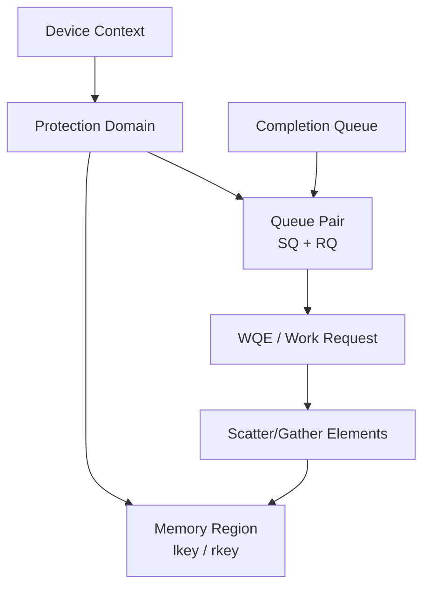

# RDMA 对象、队列与数据路径

RDMA 绕过远端 CPU 数据搬运和传统内核协议栈，但应用仍要创建资源、注册内存、建立连接、
提交 Work Request 并处理完成事件。

## 1. 对象关系



| 对象 | 作用 |
|---|---|
| Device Context | 打开 RDMA 设备 |
| PD | 隔离一组 QP、MR 等资源 |
| MR | 注册可被设备 DMA 的内存 |
| lkey | 本地访问 MR 的权限 Key |
| rkey | 授权远端 Read/Write 的 Key |
| CQ | 保存 Work Completion |
| QP | Send Queue + Receive Queue |
| WR/WQE | 一次待执行操作 |
| SGE | 描述地址、长度和 lkey |

## 2. 为什么要注册内存

网卡 DMA 需要稳定的地址映射和访问权限。注册内存通常涉及：

- 固定/映射内存页；
- 建立虚拟地址到 DMA 地址映射；
- 把权限与 PD、lkey/rkey 绑定；
- 在 HCA 中建立可访问的 Memory Translation。

注册开销可能很高，应用通常复用 MR。注册整个无限大地址空间会增加资源和安全风险。

## 3. QP 状态机

常见 RC QP 状态：

```text
RESET → INIT → RTR (Ready to Receive) → RTS (Ready to Send)
```

建立时双方交换：

- QP Number；
- LID 或 GID；
- Packet Sequence Number；
- MTU、重试、超时等参数；
- 远端内存地址和 rkey（单边操作需要）。

RDMA CM 可以帮助解析地址和建立连接，但数据操作最终仍落到 QP。

## 4. 两边操作：Send/Receive

接收端必须提前 Post Receive：

```text
Receiver: Post Receive WQE
Sender:   Post Send WQE
NIC:      读取 Sender Buffer
Fabric:   传输
NIC:      写入 Receiver 已发布 Buffer
CQ:       两端产生 Completion
```

如果接收端没有足够 Receive WQE，可能出现 RNR（Receiver Not Ready）和重试。

Send/Receive 的接收端知道消息到来，适合消息语义；每次接收需要管理 Buffer。

## 5. 单边操作：RDMA Write

发送端持有远端地址和 rkey：

```text
Sender CPU 提交 RDMA Write
→ Sender NIC 读取本地 MR
→ Fabric
→ Receiver NIC 直接写入远端 MR
→ Receiver CPU 不必参与数据搬运
```

普通 Write 不会自动通知远端应用新数据已经可用。应用需要协议、Write with Immediate、
门铃或其他同步机制防止读取未完成数据。

## 6. 单边操作：RDMA Read

发起端请求读取远端 MR，远端 NIC 返回数据。远端 CPU同样无需处理每个请求。

Read/Write 的“零拷贝”不代表没有拷贝或 DMA，而是避免应用缓冲区与内核 Socket Buffer
之间的传统 CPU Copy 路径。

## 7. Reliable Connection

RC 提供有序、可靠的连接语义，通过 PSN、ACK、重试等机制处理丢包。RoCEv2 运行在
UDP/IP 上，但可靠性由 RDMA Transport 实现，不依赖 TCP。

常见 Transport：

| 类型 | 特征 |
|---|---|
| RC | 可靠、连接型，支持 Send/Recv、Read、Write、Atomic |
| UC | 不可靠连接，能力受限 |
| UD | 不可靠数据报，连接状态较少 |

训练通信最常见的是 RC，但应以库和设备实际状态为准。

## 8. Completion

应用可以：

- Poll CQ：低延迟但消耗 CPU；
- Event Notification：降低空转但增加唤醒路径；
- CQ Moderation：减少 Completion 频率，提高吞吐但可能增加延迟。

成功 Completion 只说明本地 Work Request 按语义完成，不一定证明上层 Collective 或业务成功。

## 9. 一次 Work Request 的主机路径

```text
用户进程准备 Buffer
→ 注册/复用 MR
→ 构造 SGE 和 WR
→ Post 到 QP Send Queue
→ Doorbell 通知 NIC
→ NIC DMA 读取 WQE/数据
→ 分片为 RDMA Packet
→ Fabric 转发
→ 远端 NIC 校验并写入目标
→ 产生 CQE
→ 应用 Poll/处理完成
```

GPU MR 时，目标 Buffer 位于 GPU Memory，映射和 Peer Memory/DMA-BUF 路径进一步影响数据面。

## 10. 关键命令

```bash
rdma link show
rdma dev show
ibv_devices
ibv_devinfo -v
ibstat
show_gids
ls -l /sys/class/infiniband
```

确认：

- 设备、端口和 Link Layer；
- Active MTU 与 Speed/Width；
- GID 表与 Netdev 映射；
- 驱动、固件和 PCIe 地址；
- 计数器是否在测试期间增长。

## 11. 常见错误

| 错误 | 可能原因 |
|---|---|
| MR 注册失败 | 锁页限制、IOMMU、驱动、GPU Peer Memory |
| RNR Retry Exceeded | 对端 Receive WQE 不足 |
| Retry Counter Exceeded | 路径丢包、远端不可达、QP 参数 |
| Local Protection Error | 地址、长度、lkey 或权限错误 |
| Remote Access Error | rkey、远端地址或权限错误 |
| CQ 没有完成 | QP 状态、Doorbell、路径、应用 Poll |

## 12. 实验

1. 用 `ibv_devinfo` 记录端口能力。
2. 运行 `ib_send_bw`，观察两边 Receive Queue 语义。
3. 运行 `ib_write_bw`，对比单边 Write。
4. 改变消息大小、QP 数和 Queue Depth。
5. 在隔离环境故意使用错误 GID/端口，记录错误。
6. 对比 Poll 与 Event 模式的 CPU 和延迟。
7. 保存测试前后 RDMA/NIC 计数增量。

## 13. 掌握标准

能从应用 Buffer 开始，逐个说明 MR、SGE、WQE、QP、CQE 的作用；能解释 Send/Receive
为何需要预投递、Write 为何需要额外同步，以及 RC 在 UDP/IP 之上如何提供可靠传输。

## 参考资料

- [RDMA Core Userspace API](https://github.com/linux-rdma/rdma-core)
- [linux-rdma/perftest](https://github.com/linux-rdma/perftest)
