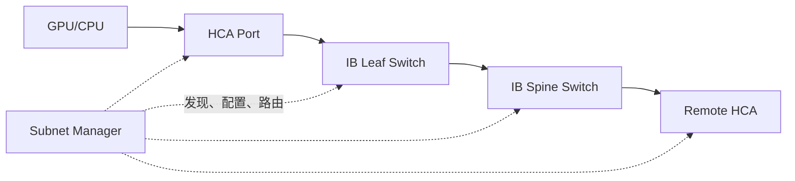

# InfiniBand Fabric 原理

InfiniBand 是独立的 Fabric 架构，不是“没有 IP 的高速以太网”。它有自己的链路层、
寻址、子网管理、路由、分区、服务等级与流控体系。

## 1. 组件



| 组件 | 作用 |
|---|---|
| HCA | 主机通道适配器，提供 RDMA QP 和端口 |
| Switch | 按 Local Route Header 等信息转发 |
| CA Port | Fabric 端口，具有 GUID、LID 等状态 |
| Subnet Manager | 发现拓扑、分配 LID、计算路由、配置分区/QoS |
| Subnet Administrator | 提供 Path Record、Service Record 等管理服务 |

生产 Fabric 通常部署主备 SM，并通过 Priority 选举 Master。要监控切换和拓扑收敛。

## 2. GUID、LID 与 GID

### 2.1 GUID {/* #guid */}

全局唯一标识 Node、Port 或 System Image，类似硬件身份，不直接等同于转发表地址。

### 2.2 LID {/* #lid */}

Local Identifier，由 SM 在 IB Subnet 内分配，交换机依据 LID 路由。端口必须进入 Active 并获得
有效 LID 才能进行常规数据通信。

### 2.3 GID {/* #gid */}

128 位 Global Identifier，用于全局/跨子网语义，也被 RDMA 地址体系使用。IB GID 与
RoCE GID 表的来源和 Link Layer 不同，排障时不能只看字符串形式。

## 3. 端口状态

常见状态：

```text
Down → Initialize → Armed → Active
```

- Physical State 表示物理训练/链路情况；
- Logical State 表示 Fabric 管理状态；
- Link Up 但停在 Init/Armed，通常说明 SM、路由或管理配置未完成。

检查：

```bash
ibstat
ibstatus
ibv_devinfo
```

关键字段：

- State / Physical State；
- Rate、Link Width；
- Base LID；
- SM LID；
- Active MTU；
- Port GUID。

## 4. Subnet Manager 做什么

SM 周期性发现 Fabric，并处理：

- 拓扑和端口发现；
- LID 分配；
- 线性转发表下发；
- PKey Partition；
- SL/VL 和 QoS 参数；
- Path Record；
- 拓扑变化后的重计算。

没有 Master SM 时，物理 Link 可能存在，但端口通常不能进入完整 Active 状态。

检查：

```bash
sminfo
ibdiagnet
ibnetdiscover
```

大型 Fabric 的路由算法、Adaptive Routing 和 Congestion Control 能力取决于 SM 实现与交换平台。

## 5. PKey Partition

PKey 提供 IB Fabric 内的逻辑分区。成员关系可限制不同主机/租户通信。

注意：

- PKey 是 Fabric 隔离机制，不替代主机、Kubernetes 和数据安全策略；
- 默认 Partition 配置错误可能意外扩大可达范围；
- 双端 HCA、交换路径和管理配置必须一致；
- 变更 Partition 可能影响大量 QP。

## 6. Service Level 与 Virtual Lane

SL 是报文服务等级，交换端口把 SL 映射到 VL。VL 提供独立的流控/缓冲资源。

```text
应用/Path Record 选择 SL
→ 每一跳 SL-to-VL 映射
→ 对应 VL 缓冲与仲裁
```

错误映射会导致优先级失效、共享缓冲争用或死锁风险。需要检查端到端，而不是只看一台交换机。

IB 链路采用基于 Credit 的流控。Credit 耗尽时上游停止发送，因此拥塞仍可能向上游扩散。

## 7. 路由

SM 根据拓扑生成 LID 路由。常见目标：

- Fat-Tree 中均匀使用上行；
- 避免确定性热点；
- 在链路故障后重新收敛；
- 配合 Adaptive Routing 按拥塞状态选择路径；
- 保持故障域和 Rail 设计。

静态等价路径存在不代表流量天然均匀。路径选择粒度、通信矩阵和 Rank 映射都可能形成热点。

## 8. IPoIB 与原生 RDMA

IPoIB 在 IB 上提供 IP 接口，方便 SSH、管理或普通 IP 应用。NCCL/RDMA 数据面可直接使用
IB Verbs，不等同于通过 IPoIB Socket。

排障时区分：

```text
IPoIB ping 正常
≠ RDMA QP、路径、MR 和大流量一定正常
```

应同时执行 Verbs/perftest。

## 9. 健康检查

```bash
ibstat
sminfo
ibnetdiscover
iblinkinfo
ibdiagnet
perfquery
ibqueryerrors
```

生产命令和权限随发行版变化。重点关注增量：

- Symbol Error；
- Link Error Recovery；
- Link Downed；
- Receive/Transmit Error；
- Constraint Error；
- VL15 Dropped；
- Congestion/等待相关计数；
- 端口速率或宽度降级。

累计历史错误不等于当前故障。测试前记录基线，测试后比较增量。

## 10. 三个典型故障

### 10.1 物理 Up 但 State 不是 Active {/* #物理-up-但-state-不是-active */}

检查 Master SM、SM LID、Partition、路由和端口管理状态。

### 10.2 带宽只有预期的一部分 {/* #带宽只有预期的一部分 */}

检查 Link Width/Speed 是否降级、PCIe 宽度、单/多端口、消息大小、QP 数、NUMA 和路径热点。

### 10.3 部分节点互通失败 {/* #部分节点互通失败 */}

检查 PKey、LID 路由、HCA Port、重复 GUID、线缆映射和 SM 拓扑视图。

## 11. 实验

1. 导出 `ibnetdiscover` 拓扑并标注 HCA/Switch GUID。
2. 从两台节点获取 LID、GID、SM LID、Rate 和 MTU。
3. 运行 `ib_write_bw` 建立基线。
4. 停止备用而非 Master SM，验证无影响。
5. 在隔离环境切换 Master SM，测收敛和业务抖动。
6. 断开一条等价链路，观察路由和带宽。
7. 制造错误 PKey，证明链路 Active 但业务不可达。

## 12. 掌握标准

能够解释为什么“网卡灯亮”不代表 IB Fabric 可用；能从 SM、LID、PKey、SL/VL、路由和
端口计数器建立完整证据链。

## 13. 参考资料 {/* #参考资料 */}

- [NVIDIA Subnet Manager Documentation](https://docs.nvidia.com/networking/display/NVIDIAMLNXOSUserManualv3122002/subnet-manager.pdf)
- [OpenSM Documentation](https://github.com/linux-rdma/opensm)
