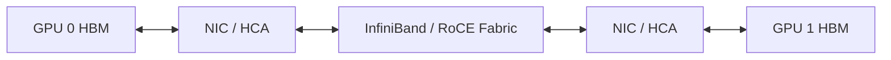

# GPUDirect RDMA 原理与实践：网卡如何直接访问 GPU 显存

RDMA 解决了远端内存访问中的 CPU 和内核协议栈开销，但普通 RDMA 的目标内存仍可能是 CPU 系统内存。

多节点 GPU 训练真正关心的是：

> 网卡能否直接把数据写入远端 GPU HBM，而不是先写入 CPU 内存再复制一次？

这就是 GPUDirect RDMA 要解决的问题。

← [GPU、PCIe、NIC 与 NUMA 亲和](./06-GPU-NIC拓扑与NUMA亲和.md) |
[IB、RoCE 与 GPU 集群检查 →](./08-IB-RoCE与GPU集群检查.md)

## 1. 学习目标

完成本文后，你应该能够：

- 区分 TCP、普通 RDMA 和 GPUDirect RDMA
- 画出普通 GPU 跨节点通信与 GDR 路径
- 理解 BAR1、GPU Memory Pin 和 Peer Memory
- 说明 `nvidia-peermem` 的作用
- 判断 GPU 与 NIC 的 PCIe 距离
- 使用底层 RDMA 测试和 `nccl-tests` 分层验证
- 从 NCCL 日志判断是否使用 GDR
- 排查拓扑、ACS、IOMMU、驱动和容器权限问题

## 2. 三种跨节点路径

### 2.1 TCP Socket

```text
GPU 0 HBM
→ D2H
→ CPU Memory
→ Kernel Socket Buffer
→ NIC
→ Ethernet
→ 对端 NIC
→ Kernel Socket Buffer
→ CPU Memory
→ H2D
→ GPU 1 HBM
```

优点：

- 通用
- 部署简单
- 普通以太网即可工作

代价：

- 内核协议栈
- 多次内存复制
- CPU 消耗
- 更高延迟

### 2.2 普通 RDMA

```text
GPU 0 HBM
→ CPU Pinned Memory
→ RDMA NIC
→ IB/RoCE
→ 对端 RDMA NIC
→ CPU Pinned Memory
→ GPU 1 HBM
```

RDMA 绕过了大部分内核数据路径，但 GPU 与 CPU 内存之间仍有复制。

### 2.3 GPUDirect RDMA



数据面目标：

```text
GPU 0 HBM
→ PCIe Peer DMA
→ NIC
→ Fabric
→ NIC
→ PCIe Peer DMA
→ GPU 1 HBM
```

CPU 仍负责控制面、内存注册、Queue Pair 和命令提交，但不再作为数据 bounce buffer。

## 3. GPUDirect 家族不要混淆

| 技术 | 主要路径 |
| --- | --- |
| GPUDirect P2P | GPU ↔ GPU |
| GPUDirect RDMA | GPU ↔ NIC/HCA ↔ 网络 |
| GPUDirect Storage | GPU ↔ NVMe/存储 NIC ↔ 存储 |
| CUDA IPC | 进程间共享 GPU Memory Handle |

它们都可能利用 PCIe Peer Access，但解决的场景不同。

## 4. BAR 与 BAR1

PCIe 设备通过 Base Address Register 暴露可访问的地址窗口。

GPU BAR1 允许其他 PCIe Peer 在受控条件下访问映射的 GPU Memory。

查看：

```bash
nvidia-smi -q | grep -A 4 "BAR1 Memory Usage"
```

示例字段：

```text
BAR1 Memory Usage
    Total
    Reserved
    Used
    Free
```

要点：

- BAR1 大小因 GPU、固件和平台而异
- 驱动会保留部分空间
- 映射使用固定粒度
- BAR1 不是 GPU 总显存容量
- BAR1 使用量不能单独证明 GDR 正常

## 5. GPU Memory Pin

NIC DMA 需要稳定的 GPU 物理页面映射。

简化过程：

1. 应用分配 GPU Buffer
2. 通信库请求注册这段 GPU Memory
3. NVIDIA 驱动固定相关页面
4. 建立 BAR 映射和 Scatter-Gather 信息
5. RDMA 栈把映射交给 HCA
6. HCA 对 GPU Memory 执行 DMA

Pin/Unpin 代价不低。高性能通信库通常会缓存注册信息，而不是每个小消息都重新注册。

## 6. `nvidia-peermem`

`nvidia-peermem` 是 NVIDIA 驱动提供的 Peer Memory 内核模块之一，用于让 RDMA 子系统访问 GPU Memory。

检查：

```bash
lsmod | grep nvidia_peermem
modinfo nvidia-peermem
```

加载：

```bash
sudo modprobe nvidia-peermem
```

生产前必须核对：

- NVIDIA Driver
- 内核
- Inbox RDMA 或 OFED
- HCA 驱动
- CUDA/NCCL
- GPU Operator/Network Operator

不同安装顺序和版本组合可能影响模块是否正确编译和加载。不要看到模块名称存在就忽略兼容矩阵。

### 6.1 DMA-BUF 路径 {/* #dma-buf-路径 */}

较新的 CUDA、内核、驱动和 NCCL 组合也可能使用 DMA-BUF 路径。是否支持和默认选择会持续演进。

学习时应掌握不变的判断方法：

1. 平台声明支持哪种 Peer Memory 机制
2. 内核模块和驱动是否就绪
3. NCCL 日志实际选择什么路径
4. 性能基线是否符合预期

不要把某一版本的环境变量写成永久真理。

## 7. GPU 与 NIC 的 PCIe 亲和

GDR 并不意味着拓扑不重要。

理想路径：

```text
GPU
→ 同一个 PCIe Switch
→ NIC
```

较远路径：

```text
GPU
→ PCIe Root
→ CPU Interconnect
→ 另一个 PCIe Root
→ NIC
```

查看：

```bash
nvidia-smi topo -m
lspci -tv
ibdev2netdev
```

`nvidia-smi topo -m` 通常会同时列出 GPU 和 NIC 亲和信息。优先让 GPU Rank 使用就近 HCA。

## 8. ACS 与 IOMMU

Access Control Services 可能把原本可直接 P2P 的 PCIe 流量重定向到 Root Complex，影响 GDR 性能或可用性。

检查：

```bash
sudo lspci -vvv | grep -i -A 2 ACSCtl
```

不能看到 `SrcValid+` 就盲目关闭 ACS：

- ACS 也参与隔离和安全
- 虚拟化可能依赖它
- 修改 BIOS/PCIe 配置可能影响整机

应结合厂商拓扑、裸机/虚拟化模式和安全要求评估。

IOMMU 同样会影响 DMA 地址转换。不要复制互联网上的“统一关闭 IOMMU”建议，应使用目标平台官方部署方案。

## 9. InfiniBand 与 RoCE 的前置验证

先证明网络本身健康，再证明 GDR。

### 9.1 设备

```bash
ibv_devices
ibv_devinfo
ibstat
ibdev2netdev
```

### 9.2 Link

确认：

- Port Active
- 速率和宽度符合预期
- InfiniBand 有 Subnet Manager
- RoCE 的 VLAN、MTU、PFC/ECN 设计正确

### 9.3 CPU Memory RDMA 基线

两端使用 `ib_write_bw`：

```bash
# Server
ib_write_bw -d <device>

# Client
ib_write_bw -d <device> <server-ip>
```

命令参数随 perftest 版本变化，先执行：

```bash
ib_write_bw --help
```

如果 CPU Memory RDMA 都不稳定，不应直接调 NCCL。

## 10. GPU Memory RDMA 测试

支持 CUDA Buffer 的 perftest 构建可能提供类似选项：

```bash
ib_write_bw --use_cuda=<gpu-index> ...
```

是否存在、参数名称和编译条件取决于 perftest 版本。通过：

```bash
ib_write_bw --help | grep -i cuda
```

确认。

测试矩阵：

| 测试 | 目的 |
| --- | --- |
| CPU Memory + RDMA | Fabric/HCA 基线 |
| GPU Memory + RDMA | GDR 数据路径 |
| 不同 GPU/HCA 组合 | PCIe 亲和 |
| 单向/双向 | 链路方向和拥塞 |
| 小/大消息 | 延迟和带宽 |

## 11. NCCL 验证

### 11.1 日志

```bash
export NCCL_DEBUG=INFO
export NCCL_DEBUG_SUBSYS=INIT,NET,GRAPH
```

观察：

- 选中了哪张 HCA
- 使用 `NET/IB` 还是 `NET/Socket`
- GPU Direct RDMA 是否启用
- GPU 与 NIC 的距离
- Channel/Ring/Tree
- 是否出现 Peer Memory、DMA-BUF 或注册错误

日志格式会随 NCCL 版本变化，不要只依赖某个固定字符串。

### 11.2 nccl-tests

两节点示例需要 MPI 或集群启动器：

```bash
mpirun -np 2 -H node1:1,node2:1 \
  ./build/all_reduce_perf -b 8 -e 8G -f 2 -g 8
```

实际参数必须根据：

- 每节点 GPU 数
- MPI 绑定
- HCA
- 网卡接口
- 容器运行方式

调整。

### 11.3 受控对比

在测试环境中，可以对比禁用 GDR 或禁用 IB 后的结果。具体变量以当前 NCCL 文档为准。

对比目标：

```text
正常自动选择
vs 禁用 GDR
vs 禁用 IB，仅 Socket
```

记录：

- `algbw`
- `busbw`
- GPU/CPU 利用率
- HCA 吞吐
- 小消息延迟
- 错误和重传

诊断变量测试后立即清理。

## 12. Multi-Rail

一台服务器可能有多张 HCA：

```text
GPU 0～3 → HCA 0
GPU 4～7 → HCA 1
```

合理的 Rank/HCA 映射可以：

- 减少跨 Socket
- 聚合带宽
- 降低单 HCA 热点

错误映射可能导致：

- GPU 0 的数据跨 CPU 到 HCA 1
- 两条 Rail 负载不均
- 某张 HCA 满载，另一张空闲
- NCCL 性能波动

不要仅看网卡总数，要看 GPU、HCA、CPU 和交换 Fabric 的对应关系。

## 13. Kubernetes 中的 GDR

需要同时解决：

- GPU 设备暴露
- RDMA 设备暴露
- Peer Memory 内核模块
- 容器权限
- Host Network 或 RDMA CNI
- GPU/NIC 拓扑调度

常见组件：

- NVIDIA GPU Operator
- NVIDIA Network Operator
- RDMA Shared Device Plugin
- SR-IOV Device Plugin/CNI
- Multus
- Volcano/Kueue

Pod 同时申请 GPU 和 RDMA 资源并不自动保证它们拓扑就近。还需要：

- 节点标签
- ResourceFlavor 或节点池
- DRA/设备属性
- 拓扑感知调度
- 应用 Rank 与 HCA 绑定

## 14. 常见故障

### 14.1 NCCL 退回 Socket {/* #nccl-退回-socket */}

检查：

- HCA 是否暴露进容器
- `ibv_devinfo`
- 网络接口选择
- NCCL Net Plugin
- 防火墙
- RDMA Device Plugin

### 14.2 使用 IB 但没有 GDR {/* #使用-ib-但没有-gdr */}

检查：

- Peer Memory/DMA-BUF 支持
- `nvidia-peermem`
- GPU 型号
- HCA 和驱动
- PCIe 拓扑
- 容器权限
- NCCL 版本

### 14.3 GDR 工作但性能低 {/* #gdr-工作但性能低 */}

检查：

- GPU/HCA 是否跨 NUMA
- PCIe Link Width/Speed
- ACS
- 消息大小
- HCA 端口速度
- RoCE 丢包/PFC/ECN
- Rank/HCA 绑定

### 14.4 `nvidia-peermem` 无法加载 {/* #nvidia-peermem-无法加载 */}

检查：

- 模块是否为当前内核构建
- Driver/OFED 安装顺序
- Secure Boot
- `dmesg`
- 旧 `nv_peer_mem` 冲突

不要在生产节点直接卸载关键模块进行试错。先隔离节点并准备回退。

### 14.5 NCCL Timeout {/* #nccl-timeout */}

GDR 只是一个可能层次。还要检查：

- Rank 代码路径是否一致
- 某个进程是否 OOM/退出
- GPU Xid
- Fabric 丢包
- 防火墙
- Collective 参数不一致

见：

→ [NCCL Timeout 排查流程](../../../gpu/cluster/troubleshooting/07-NCCL%20Timeout%20排查流程.md)

## 15. 分层排查顺序

```text
GPU 正常
→ PCIe 拓扑正常
→ HCA Link 正常
→ CPU Memory RDMA 正常
→ GPU Memory RDMA 正常
→ NCCL 单节点正常
→ NCCL 跨节点正常
→ 训练/推理框架正常
```

每一层都保存：

- 版本
- 命令
- 原始输出
- 拓扑
- 测试参数
- 预期基线

## 16. 它与其他模块的关系

### 16.1 上游 {/* #上游 */}

- NCCL 或通信框架产生跨节点数据
- 数据位于 GPU HBM
- NVLink/NVSwitch 已完成机内路径

### 16.2 本层 {/* #本层 */}

- GPU Memory 被注册给 RDMA
- NIC 通过 PCIe Peer DMA 访问显存
- IB/RoCE Fabric 传输数据

### 16.3 下游 {/* #下游 */}

- 对端 GPU 继续执行计算
- 存储也可能通过远端 NIC 使用 GDS
- 调度器需要保证 GPU/NIC 就近和整组资源可用

## 17. 常见误区

### 17.1 RDMA 就等于 GPUDirect RDMA {/* #rdma-就等于-gpudirect-rdma */}

RDMA 可能只访问 CPU Memory。

### 17.2 模块已加载就证明 GDR 生效 {/* #模块已加载就证明-gdr-生效 */}

必须结合日志和性能对比。

### 17.3 GDR 可以修复拥塞网络 {/* #gdr-可以修复拥塞网络 */}

它减少 Host staging，不能消除丢包、拥塞和错误配置。

### 17.4 GPU 与 NIC 在同一节点就足够 {/* #gpu-与-nic-在同一节点就足够 */}

跨 NUMA 和 PCIe Root 仍可能显著影响性能。

### 17.5 设置更多 NCCL 变量总能加速 {/* #设置更多-nccl-变量总能加速 */}

错误变量可能禁用自动拓扑优化，应先测量和读日志。

## 18. 本篇总结

```text
普通 RDMA：GPU ↔ CPU Pinned Memory ↔ NIC
GPUDirect RDMA：GPU HBM ↔ NIC
关键条件：Peer Memory + PCIe P2P + 健康 RDMA Fabric
验证顺序：硬件 → RDMA → GPU RDMA → NCCL → 业务
```

下一步进入存储：模型和数据集从本地 NVMe、NFS、CephFS 或对象存储进入计算节点时，会形成另一条 IO 路径。

→ [大模型文件在 Kubernetes 中的存储方案](../../../storage/ai-workloads/06-大模型文件在%20Kubernetes%20中的存储方案.md)

## 19. 课后练习

1. 普通 RDMA 和 GPUDirect RDMA 的数据路径有什么区别？
2. BAR1 与 GPU 总显存有什么区别？
3. `nvidia-peermem` 解决什么问题？
4. 为什么 GDR 仍然受到 NUMA 和 PCIe 拓扑影响？
5. 分别运行 CPU Memory 和 GPU Memory RDMA 测试。
6. 使用 NCCL Debug 日志确认实际网络路径。
7. 设计一个双节点八卡训练的 GPU/HCA 映射表。

### 19.1 参考答案 {/* #参考答案 */}

1. 普通RDMA通常在GPU与主机Pinned Memory之间复制，再由HCA DMA；GDR允许HCA直接DMA访问已注册的GPU显存，减少CPU参与和主机内存中转。
2. GPU总显存是权重、激活等数据的存储容量；BAR1是CPU/PCIe设备映射GPU显存窗口的地址资源，容量和映射方式不等于整块显存容量。
3. `nvidia-peermem` 为NVIDIA GPU显存与第三方RDMA设备建立Peer Memory注册/映射支持，使HCA能够对GPU内存执行RDMA DMA；新内核/驱动栈也可能使用DMA-BUF路径，需按实际版本确认。
4. GDR数据仍经过GPU、PCIe Switch/Root Complex与HCA。跨Root或跨NUMA会多走互连、降低带宽并增加抖动，因此直连不代表拓扑无关。
5. CPU Memory基线可用`ib_write_bw/ib_read_bw`；GPU Memory基线按工具版本使用支持CUDA Buffer的perftest或`gdrcopy`/通信基准。两组必须固定链路、MTU、队列深度和消息大小，并记录是否真正启用GPU Buffer。
6. 设置`NCCL_DEBUG=INFO`和`NCCL_DEBUG_SUBSYS=INIT,NET,GRAPH`，确认日志选择`NET/IB`而非`NET/Socket`，并检查HCA、GDR/DMA-BUF、GPU Direct RDMA级别及每个Channel的GPU-HCA路径。
7. 每节点4卡示例应优先把GPU0/1映射到同一PCIe根下的HCA0、GPU2/3映射到HCA1；两节点保持对称。表中至少包含Rank、GPU BDF、NUMA、HCA端口、网卡名、GID和交换网络，最后用Pair测试验证。

## 20. 参考与致谢 {/* #参考与致谢 */}

- [GPUDirect RDMA Documentation](https://docs.nvidia.com/cuda/gpudirect-rdma/)
- [NCCL Documentation](https://docs.nvidia.com/deeplearning/nccl/)
- [NCCL Troubleshooting](https://docs.nvidia.com/deeplearning/nccl/user-guide/docs/troubleshooting.html)
- [NVIDIA Network Operator](https://docs.nvidia.com/networking/display/cokan10/network+operator)
