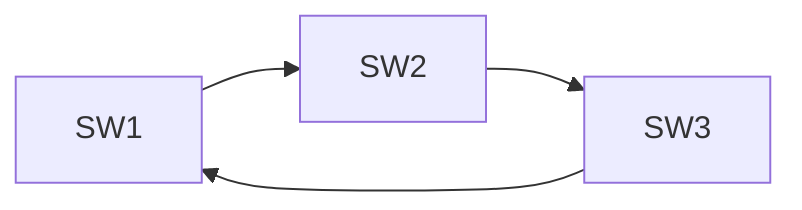

# 二层环路、STP、MLAG 与链路聚合

二层冗余包含三种不同问题：拓扑怎样保持无环，多条链路怎样成为一个逻辑接口，两台设备怎样协同呈现这个接口。STP、LACP 和 MLAG 分别参与解决这些问题，不能把它们都简化为“多接一条线”。

## 1. 为什么二层环路会放大故障

以太网帧没有类似 IP TTL 的逐跳寿命字段。广播或未知单播进入环路后可以持续复制：



典型后果：

- 广播风暴占满链路和交换芯片。
- 同一个源 MAC 从多个端口反复出现，形成 MAC Flapping。
- 重复帧到达主机，CPU 和协议栈被拖垮。
- 控制面 BPDU、路由协议和管理流量也无法正常处理。

“增加一条冗余链路”如果没有配套环路控制，提升的不是可靠性，而是故障概率。

### 1.1 为什么 IP 包有 TTL，仍救不了普通二层环路

IP TTL 由三层转发节点处理。一个广播域中的交换机反复转发承载 IP 的以太网帧，并不会因为每次二层转发就递减内层 IP TTL。

交换机又按帧的源 MAC 学习入口。相同帧绕圈回来时，原源 MAC 会被反复学习到不同端口；这既污染已知单播的交付，也让未知目的继续洪泛。环路因此会同时损害带宽、MAC 表稳定性和控制消息交付。

## 2. STP 的目标

Spanning Tree Protocol 通过阻塞部分冗余端口，在逻辑上形成一棵无环树。当活动链路
故障时，再重新选择端口恢复连通。

核心步骤：

1. 选举 Root Bridge：比较 Bridge ID，值小者优先。
2. 每台非根交换机选择到根代价最小的 Root Port。
3. 每个二层网段选择一个 Designated Port。
4. 其余冗余端口处于丢弃/阻塞状态。

### 2.1 Bridge ID {/* #bridge-id */}

Bridge ID 由优先级相关字段和 MAC 地址构成；带扩展系统 ID 的实现还会将 VLAN／实例上下文编码到相应字段。它不是用户数据的目的 MAC，也不是 Router ID。

同一生成树实例比较 Bridge ID，较小者更优。设置不同优先级能让根角色符合拓扑设计；当优先级条件相同，MAC 等后续字段才成为仲裁依据。

### 2.2 路径代价 {/* #路径代价 */}

端口速率映射为 STP Cost。链路聚合、速率变化或手工 Cost 会影响根路径选择。

### 2.3 BPDU 不是一份整网拓扑图

BPDU（桥协议数据单元）传递当前认为的根身份、根路径代价、发送桥和端口身份及计时等信息。交换机据此比较谁提供更优根路径，并重新通告自己的结果，而不是先同步全网 LSDB 再运行 OSPF 的 SPF。

一个简化的比较顺序是：更优根 ID → 更低根路径代价 → 更优发送桥 ID → 更优发送端口 ID；在相应平局场景下还需要本地接收端口仲裁。各字段依次比较，不是把它们相加为一个分数。

对 Root Port 选择，需要计入本地接收端口的路径代价；对共享网段 Designated Port 的竞争，则比较谁能向该网段提供更优根路径信息。根桥不是“所有端口都要阻塞”，它通常在相连网段提供指定端口。

### 2.4 用三台交换机推导一次结果

假设 A 的 Bridge ID 最小，B 次之，C 再次，三条链路的代价都为 10：

```text
        A（根桥）
       /         \
     10           10
     /             \
    B ─────10────── C
```

1. B、C 直达 A 的端口分别成为自己的 Root Port，因为代价 10 小于绕另一台的代价 20。
2. A 朝向 B、C 的端口是对应链路的 Designated Port。
3. B—C 链路两端到根的代价都是 10，继续比较桥 ID，B 更优。
4. B 的这一侧成为 Designated Port，C 这一侧作为冗余路径不转发用户流量。

若 A—C 断开，C 可重新经 B 到达 A，但何时允许转发取决于状态转换和对安全拓扑的确认。不能将“逻辑上算出了备路”当成“端口已立即转发”。

## 3. RSTP 状态与角色

RSTP 将端口状态简化为：

- Discarding：不转发用户帧。
- Learning：学习源 MAC，但不转发用户帧。
- Forwarding：学习并转发。

常见角色：

- Root Port：本设备到根桥的最佳端口。
- Designated Port：当前网段到根桥的最佳出口。
- Alternate Port：Root Port 的备选。
- Backup Port：同一设备连接到同一共享网段时的备份。

RSTP 通过 Proposal/Agreement、边缘端口等机制比经典 STP 更快收敛，但“快速”仍取决于
拓扑、设备实现和错误保护配置。

### 3.1 角色与状态是两个维度

Root、Designated、Alternate 等是拓扑职责；Discarding、Learning、Forwarding 是用户数据处理状态。处于 Discarding 的端口仍需按协议收发或处理必要 BPDU，否则无法知道什么时候可以安全启用。

Learning 阶段只学习源 MAC 而不转发普通用户帧，用于避免刚进入转发就大量未知单播。经典 STP 的 Listening/Learning 和基于计时的等待，与 RSTP 的快速转换条件不能简单等同。

### 3.2 Proposal/Agreement 为什么能缩短等待

在适用的点到点链路上，一端提出新的指定端口信息，另一端在接受新的根方向后，先同步相关其他端口，确保不会同时保留造成环路的转发路径，再发出 Agreement。对端据此获得更快进入转发的条件。

关键是“确认其他相关路径已处于安全状态”，不是只把 Forward Delay 调小。共享链路、旧 STP 邻居或无法完成同步的情况，会限制快速转换；边缘端口则基于“后面没有交换拓扑”的假设处理。过程见 [Cisco RSTP 机制说明](https://www.cisco.com/c/en/us/support/docs/lan-switching/spanning-tree-protocol/24062-146.html)。

### 3.3 拓扑变化为什么还要更新 MAC 学习

无环拓扑改变后，原 MAC→端口记录可能指向已不能交付的位置。拓扑变化通知与相应清理／老化机制帮助交换网络更快重新学习，减少旧 FDB 项导致的黑洞。

这不意味着每次端口事件都会在全网无差别清空全部 MAC。经典 STP、RSTP、实例划分和实现的传播范围不同。边缘端口的正常终端上下线也不应被当作每次都重构整棵树。

### 3.4 MSTP 怎样让不同 VLAN 使用不同树

一棵公共树很简单，但不同 VLAN 可能无法分别利用冗余路径；每 VLAN 一棵树又会增加协议状态。MSTP 将多个 VLAN 映射到少量 MST Instance，在状态规模与路径灵活性之间折中。

同一区域要求配置名称、修订值和 VLAN→实例映射等区域标识一致。修订值不是“更大者自动覆盖其他设备”的版本发布机制；映射不一致可能让相邻设备落在不同 MST 区域。

区域内有 IST 和相应 MSTI，区域之间通过公共树关系衔接。一个物理端口可以在某实例转发、在另一实例丢弃，所以观察生成树时要带上 VLAN／实例上下文。区域关系见 [Juniper MSTP 说明](https://www.juniper.net/documentation/us/en/software/junos/stp-l2/topics/topic-map/spanning-tree-configuring-mstp.html)。

## 4. 边缘端口和保护机制

连接服务器的端口通常不应等待 STP 收敛，可配置为 Edge/PortFast；但它不等于
“关闭 STP”。

生产常用保护：

| 机制 | 目的 |
| --- | --- |
| BPDU Guard | 边缘端口收到 BPDU 时关闭端口，防止私接交换机 |
| Root Guard | 防止下游设备成为根桥 |
| Loop Guard | 防止单向链路导致阻塞端口错误转发 |
| Storm Control | 限制广播、未知单播或多播速率 |
| UDLD/链路检测 | 识别物理单向链路 |

保护动作必须配套告警和恢复流程，否则“安全地关闭端口”仍会变成难以解释的业务中断。

这些机制的信任边界和误用后果，另见 [生成树保护、风暴控制与端口隔离](../security/layer2-security/02-生成树保护风暴控制与端口隔离.md)。

## 5. LACP 解决什么问题

链路聚合把多条物理链路组成一个逻辑接口：

- 提供成员链路故障后的冗余。
- 允许多个流分布到不同成员链路。
- 对 STP 和三层协议呈现一个逻辑端口，减少拓扑复杂度。

LACP 负责协商哪些成员可以加入聚合组。成员必须符合相应聚合资格，并且对端身份与伙伴视图保持一致；速率、双工和其他兼容条件还受实现限制。Individual、Suspended、Standby 等显示名称不能脱离设备文档解释。

### 5.1 Actor、Partner 和 Key

Actor 是本端，Partner 是本端记录的对端。LACPDU 带来两边的系统身份、端口身份、Key 和状态，使设备可以判断“我认为的伙伴”和“伙伴认为的我”是否一致。

同一端想把几条成员捆绑到一个聚合器，必须有兼容的本地 Key，并看到一致的相应伙伴系统与伙伴 Key。**A 的本地 Key 不要求在数值上等于 B 的本地 Key，聚合接口编号也不要求两端相同。**重要的是每端对成员分组及伙伴信息的认识一致。

System ID 也不是要求两台独立设备使用相同地址；普通链路两端各有自己的系统身份。MLAG 对服务器呈现一致伙伴身份，则是另一层协同机制。

### 5.2 有成员不等于正在转发

选择进入聚合器、与伙伴同步、允许 Collecting（接收）和 Distributing（发送）是相关但不同的状态。物理端口 Up、收到 LACPDU，也不等于它已被允许承载业务。

Active／Passive 表示谁主动发起 LACP 交互，不是数据的主链路／备链路。通常至少一端需要主动发起；双方都 Passive 不能依靠彼此被动等待完成正常初始协商。

快速和慢速周期影响 LACP 消息与超时检测，不提高业务发送速率。物理载波检测、LACP 超时、最低成员数约束也属于不同机制；`min-links` 等约束可以使剩余带宽不足时整个逻辑接口不再保持可用。Linux 实现边界见 [Bonding 驱动文档](https://docs.kernel.org/networking/bonding.html)。

### 5.3 LACP 不检查全部业务配置

VLAN 允许列表、Native VLAN、部分 MTU 和安全策略错误，未必阻止 LACP 形成聚合。于是可能只有某些 VLAN、尺寸或哈希到特定成员的流失败。

正确判断应是“成员协商是否成功”和“这些成员是否能一致交付同样的业务”都成立。不能因为一条聚合口显示 Up 就跳过业务一致性。

## 6. 聚合不是“单流带宽叠加”

多数设备按哈希选择成员链路：

```text
hash(源/目的 MAC、源/目的 IP、L4 端口) → 某个成员
```

因此：

- 一个 TCP 流通常只走一条成员链路。
- 多流量才能更充分使用总带宽。
- 哈希字段不合适会造成热点。
- 成员数改变时，部分流会重新映射并可能发生短暂乱序。

看到四条 100G 成员不能直接得出“单个训练流有 400G”。

## 7. Linux Bonding

查看内核支持的 Bond 状态：

```bash
cat /proc/net/bonding/bond0
ip -d link show bond0
ip -s link show bond0
```

常见模式：

- `active-backup`：只有一条活动链路，简单可靠。
- `802.3ad`：使用 LACP，要求对端交换机配置匹配的聚合组。
- `balance-xor`：按哈希选择成员，不运行 LACP。

示例仅用于实验：

```bash
sudo ip link add bond0 type bond mode 802.3ad miimon 100
sudo ip link set eth1 master bond0
sudo ip link set eth2 master bond0
sudo ip link set eth1 up
sudo ip link set eth2 up
sudo ip link set bond0 up
```

如果对端不是同一逻辑交换系统，普通 LACP 聚合可能形成环路或黑洞。

## 8. MLAG 为什么存在

传统 LACP 要求成员连接到同一台逻辑设备。MLAG 让两台物理交换机对服务器呈现一个
聚合系统，从而同时获得：

- 链路级冗余。
- ToR 设备级冗余。
- 两条上联都可转发，不依赖 STP 阻塞一半带宽。

MLAG 通常包含：

- Peer Link：同步 MAC、ARP、状态并转发部分跨设备流量。
- Keepalive／对等控制消息：辅助判断伙伴存活，承载路径是否独立取决于实现。
- 双主保护：避免 Peer Link 与 Keepalive 同时异常导致 Split Brain。
- 一致性检查：VLAN、聚合参数、MTU 等必须匹配。

MLAG 是厂商实现，不应把某厂商命令当作通用协议。后续 EVPN Multihoming 提供了
基于标准控制平面的另一种多归属方案。

### 8.1 哪些数据可能经过 Peer Link

服务器经一侧进入的帧，若目标只能从另一侧交付，可能需要跨 Peer Link；部分广播、未知单播和组播复制也受跨设备转发与防重复交付规则影响。

因此 Peer Link 不只是低带宽“心跳线”。数据是否优先本地转发、是否允许从 Peer Link 再进入聚合成员，以及例外转发规则，都关系到环路与重复包控制。具体模型可参考 [Arista MLAG 说明](https://www.arista.com/en/um-eos/eos-multi-chassis-link-aggregation)。

### 8.2 分区时不存在脱离实现的统一安全结论

| 状态 | 需要解决的问题 |
| --- | --- |
| 一条服务器成员故障 | 剩余聚合成员与带宽是否足够 |
| 一台交换机失效 | 伙伴是否撤除错误状态，存活一侧能否独立转发 |
| Peer Link 失败但能确认对端仍活着 | 如何避免两边保留互相冲突的转发行为 |
| 对等状态与辅助检测同时失去 | 怎样区分设备死亡与网络分区，哪一侧应限制哪些端口 |

双主保护是产品明确实现的决策，不是 LACP 协议自带的多数派共识。不同产品可能使用不同检测路径、角色和端口关闭策略，应关注失去协调后还保留了什么状态。

Orphan Port（单归属端口）只连其中一台设备，不会因为旁边存在 MLAG 自动获得第二条物理路径。MLAG 也不会自动同步所有路由协议、NAT 或应用会话；网关角色与状态连续性可对照 [VRRP](./vrrp/02-VRRP收敛双主与会话连续性.md)。

## 9. 故障分析

### 9.1 MAC Flapping

```text
同一 MAC 在端口 A/B 之间快速移动
```

可能原因：

- 真正的二层环路。
- 服务器 Bond/Team 配置与交换机不匹配。
- MLAG Peer Link 或一致性异常。
- 虚拟机迁移；应只发生有限次数，而非持续抖动。

### 9.2 LACP 只有一条成员工作

检查顺序：

1. 两端物理接口状态、速率、FEC、错误计数。
2. 本端成员分组与 LACP 模式；两端逻辑接口编号本身不必相同。
3. Actor/Partner System ID、Key 与成员状态。
4. VLAN/Trunk、MTU 和哈希算法。
5. 单流测试是否被误认为总带宽测试。

### 9.3 上联故障后恢复慢

分别测量：

```text
物理故障检测
→ LACP/STP 状态变化
→ MAC/ARP 更新
→ 路由或应用重试
```

不要把端到端恢复时间全部归因于 STP。

## 10. 实验与验收

至少完成：

1. 在三交换节点模拟拓扑中启用 RSTP，确认一个冗余端口处于 Discarding。
2. 关闭当前 Root Port，记录端口切换和丢包时间。
3. 故意把服务器两端分别配置为 LACP 与静态聚合，观察成员状态。
4. 使用 1 个流和 16 个并发流测试链路聚合，解释吞吐差异。
5. 制造 Native VLAN/允许 VLAN 不一致，并从 FDB、抓包和端口计数定位。

验收输出应包含拓扑图、Root Bridge、端口角色、聚合成员状态、故障时间线和恢复证据。

## 11. 思考与解答

**根桥的所有用户数据都会由它集中转发吗？**

不会。根用于生成树计算，不是强制的中心转发点。通信沿当前树上的实际路径交付，不一定经过根桥。

**阻塞端口不转发数据，为什么仍能恢复成活动路径？**

它仍参与相应控制消息处理。用户数据状态与协议控制处理不同，收到新信息后可以按状态机改变角色和状态。

**两边聚合组编号分别是 10 和 20，是否一定协商失败？**

不是。编号和本地 Key 不要求跨设备数值相同；应检查本端成员是否属于兼容聚合，以及各成员的伙伴信息是否一致。

**LACP 全部同步，但只有一个 VLAN 断续异常，可能是什么原因？**

成员上的业务承载策略可能不一致。LACP 不保证完整检查 VLAN/MTU/ACL；不同流命中不同成员时，异常可能显得偶发。

**MLAG 能否保证 Peer Link 与检测路径都中断时永远无双主？**

不能作这种通用保证。必须分析具体产品的分区保护、角色选择和端口处理，单靠 LACP 不能获得共识系统的唯一活动者保证。

## 12. 参考资料 {/* #参考资料 */}

- [IEEE 802.1 Working Group](https://1.ieee802.org/)
- [Linux Ethernet Bonding Driver HOWTO](https://docs.kernel.org/networking/bonding.html)
- [Linux Ethernet Bridging](https://docs.kernel.org/networking/bridge.html)

[下一篇：ICMP、UDP、TCP 与 DNS →](../fundamentals/04-ICMP-UDP-TCP与DNS.md)
