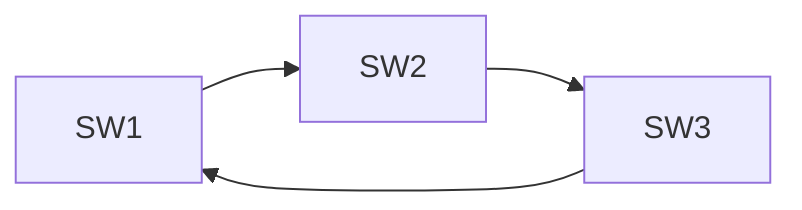

# 二层环路、STP、MLAG 与链路聚合

## 1. 为什么二层环路会放大故障

以太网帧没有类似 IP TTL 的逐跳寿命字段。广播或未知单播进入环路后可以持续复制：



典型后果：

- 广播风暴占满链路和交换芯片。
- 同一个源 MAC 从多个端口反复出现，形成 MAC Flapping。
- 重复帧到达主机，CPU 和协议栈被拖垮。
- 控制面 BPDU、路由协议和管理流量也无法正常处理。

“增加一条冗余链路”如果没有配套环路控制，提升的不是可靠性，而是故障概率。

## 2. STP 的目标

Spanning Tree Protocol 通过阻塞部分冗余端口，在逻辑上形成一棵无环树。当活动链路
故障时，再重新选择端口恢复连通。

核心步骤：

1. 选举 Root Bridge：比较 Bridge ID，值小者优先。
2. 每台非根交换机选择到根代价最小的 Root Port。
3. 每个二层网段选择一个 Designated Port。
4. 其余冗余端口进入丢弃/阻塞角色。

### Bridge ID

通常由优先级和 MAC 地址组成。生产环境应显式设置根桥和备根桥，不要把根桥归属
交给“谁的 MAC 最小”。

### 路径代价

端口速率映射为 STP Cost。链路聚合、速率变化或手工 Cost 会影响根路径选择。

## 3. RSTP 状态与角色

RSTP 将端口状态简化为：

- Discarding：不转发用户帧。
- Learning：学习源 MAC，但不转发用户帧。
- Forwarding：学习并转发。

常见角色：

- Root Port：本设备到根桥的最佳端口。
- Designated Port：当前网段到根桥的最佳出口。
- Alternate Port：Root Port 的备选。
- Backup Port：同一设备连接到同一共享网段时的备份。

RSTP 通过 Proposal/Agreement、边缘端口等机制比经典 STP 更快收敛，但“快速”仍取决于
拓扑、设备实现和错误保护配置。

## 4. 边缘端口和保护机制

连接服务器的端口通常不应等待 STP 收敛，可配置为 Edge/PortFast；但它不等于
“关闭 STP”。

生产常用保护：

| 机制 | 目的 |
| --- | --- |
| BPDU Guard | 边缘端口收到 BPDU 时关闭端口，防止私接交换机 |
| Root Guard | 防止下游设备成为根桥 |
| Loop Guard | 防止单向链路导致阻塞端口错误转发 |
| Storm Control | 限制广播、未知单播或多播速率 |
| UDLD/链路检测 | 识别物理单向链路 |

保护动作必须配套告警和恢复流程，否则“安全地关闭端口”仍会变成难以解释的业务中断。

## 5. LACP 解决什么问题

链路聚合把多条物理链路组成一个逻辑接口：

- 提供成员链路故障后的冗余。
- 允许多个流分布到不同成员链路。
- 对 STP 和三层协议呈现一个逻辑端口，减少拓扑复杂度。

LACP 负责协商哪些成员可以加入聚合组。两端系统 ID、Key、速率、双工、聚合组配置
不一致时，成员可能处于 Individual、Suspended 或 Standby。

## 6. 聚合不是“单流带宽叠加”

多数设备按哈希选择成员链路：

```text
hash(源/目的 MAC、源/目的 IP、L4 端口) → 某个成员
```

因此：

- 一个 TCP 流通常只走一条成员链路。
- 多流量才能更充分使用总带宽。
- 哈希字段不合适会造成热点。
- 成员数改变时，部分流会重新映射并可能发生短暂乱序。

看到四条 100G 成员不能直接得出“单个训练流有 400G”。

## 7. Linux Bonding

查看内核支持的 Bond 状态：

```bash
cat /proc/net/bonding/bond0
ip -d link show bond0
ip -s link show bond0
```

常见模式：

- `active-backup`：只有一条活动链路，简单可靠。
- `802.3ad`：使用 LACP，要求对端交换机配置匹配的聚合组。
- `balance-xor`：按哈希选择成员，不运行 LACP。

示例仅用于实验：

```bash
sudo ip link add bond0 type bond mode 802.3ad miimon 100
sudo ip link set eth1 master bond0
sudo ip link set eth2 master bond0
sudo ip link set eth1 up
sudo ip link set eth2 up
sudo ip link set bond0 up
```

如果对端不是同一逻辑交换系统，普通 LACP 聚合可能形成环路或黑洞。

## 8. MLAG 为什么存在

传统 LACP 要求成员连接到同一台逻辑设备。MLAG 让两台物理交换机对服务器呈现一个
聚合系统，从而同时获得：

- 链路级冗余。
- ToR 设备级冗余。
- 两条上联都可转发，不依赖 STP 阻塞一半带宽。

MLAG 通常包含：

- Peer Link：同步 MAC、ARP、状态并转发部分跨设备流量。
- Keepalive：判断对端控制面存活。
- 双主保护：避免 Peer Link 与 Keepalive 同时异常导致 Split Brain。
- 一致性检查：VLAN、聚合参数、MTU 等必须匹配。

MLAG 是厂商实现，不应把某厂商命令当作通用协议。后续 EVPN Multihoming 提供了
基于标准控制平面的另一种多归属方案。

## 9. 故障分析

### 9.1 MAC Flapping

```text
同一 MAC 在端口 A/B 之间快速移动
```

可能原因：

- 真正的二层环路。
- 服务器 Bond/Team 配置与交换机不匹配。
- MLAG Peer Link 或一致性异常。
- 虚拟机迁移；应只发生有限次数，而非持续抖动。

### 9.2 LACP 只有一条成员工作

检查顺序：

1. 两端物理接口状态、速率、FEC、错误计数。
2. 聚合组编号和 LACP 模式。
3. Actor/Partner System ID、Key 与成员状态。
4. VLAN/Trunk、MTU 和哈希算法。
5. 单流测试是否被误认为总带宽测试。

### 9.3 上联故障后恢复慢

分别测量：

```text
物理故障检测
→ LACP/STP 状态变化
→ MAC/ARP 更新
→ 路由或应用重试
```

不要把端到端恢复时间全部归因于 STP。

## 10. 实验与验收

至少完成：

1. 在三交换节点模拟拓扑中启用 RSTP，确认一个冗余端口处于 Discarding。
2. 关闭当前 Root Port，记录端口切换和丢包时间。
3. 故意把服务器两端分别配置为 LACP 与静态聚合，观察成员状态。
4. 使用 1 个流和 16 个并发流测试链路聚合，解释吞吐差异。
5. 制造 Native VLAN/允许 VLAN 不一致，并从 FDB、抓包和端口计数定位。

验收输出应包含拓扑图、Root Bridge、端口角色、聚合成员状态、故障时间线和恢复证据。

## 参考资料

- [IEEE 802.1 Working Group](https://1.ieee802.org/)
- [Linux Ethernet Bonding Driver HOWTO](https://docs.kernel.org/networking/bonding.html)
- [Linux Ethernet Bridging](https://docs.kernel.org/networking/bridge.html)

[下一篇：ICMP、UDP、TCP 与 DNS →](../fundamentals/05-ICMP-UDP-TCP与DNS.md)
