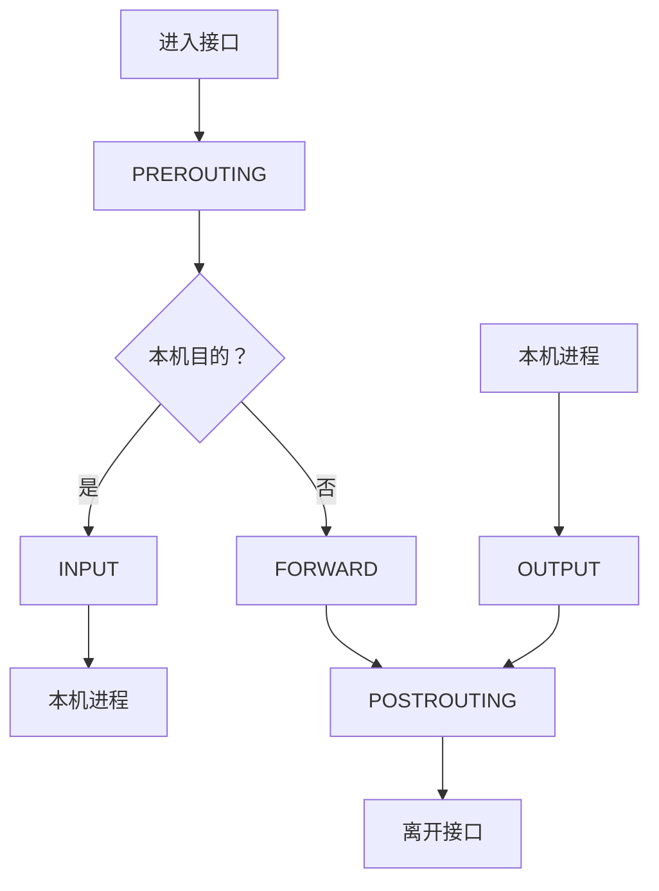

# NAT、ACL、状态防火墙与连接跟踪

## 1. 四个容易混淆的概念

| 能力 | 依据 | 是否理解会话 | 是否改写报文 |
| --- | --- | --- | --- |
| ACL | 地址、协议、端口、方向 | 通常否 | 否 |
| 状态防火墙 | 五元组、方向、连接状态 | 是 | 通常不必 |
| NAT | 地址和端口映射 | 常见有状态 NAT 维护映射，也存在无状态转换 | 是 |
| 路由 | 目的前缀、策略 | 否 | 通常不改地址 |

它们可能位于同一设备，但处理目的不同。排障必须明确包在哪一步被路由、过滤或改写。

## 2. ACL 的匹配模型

典型 ACL：

```text
按序号从小到大匹配
→ 第一条命中后停止
→ 没有命中则执行隐式默认动作
```

设计时记录：

- 应用方向：入接口还是出接口。
- 匹配的是 NAT 前还是 NAT 后地址。
- 是否允许返回流量。
- 规则顺序、对象组展开和默认策略。
- 命中计数和日志是否开启。

“规则看起来允许”不等于实际命中。一定要看计数器。

## 3. 状态防火墙

状态防火墙跟踪连接并允许已建立连接的返回方向。以 TCP 为例，它不只看 ACK 位，
还会维护五元组、方向和状态转换。

常见连接状态：

- `NEW`：当前尚未形成已识别的双向跟踪状态，不等于只会匹配一个首包；重传 SYN 也可能属于 NEW。
- `ESTABLISHED`：已观察到双向通信。
- `RELATED`：与已有连接相关的流或错误报文，例如关联到原流的 ICMP 错误；相关数据连接可能依赖显式 helper/expectation，不是任意“同一应用”都会自动关联。
- `INVALID`：无法归入有效状态。

非对称路由可能使防火墙只看到单方向，导致合法响应被当作无状态或非法流量。

### 3.1 三种“状态”不要混用

TCP 协议内部有 SYN_SENT、ESTABLISHED 等状态；nftables 的 `ct state` 是当前包与跟踪连接的关系；`ct status` 则包含 seen-reply、assured、snat 等连接属性标志。UDP 没有 TCP 握手，仍可被 conntrack 归入双向通信状态。

跟踪器不是通信两端，也不保证观察到全部报文。宽松拾取、非对称流量和超时会影响分类。不能把某条规则匹配 `established` 当作应用已经完成认证，也不能把 `assured` 理解为业务永不失败。见 [conntrack 元数据](https://wiki.nftables.org/wiki-nftables/index.php/Matching_connection_tracking_stateful_metainformation)。

## 4. Linux Netfilter 路径



常见 NAT 位置：

- DNAT：通常在 PREROUTING 或本机 OUTPUT，先改目的，再做后续路由。
- SNAT/MASQUERADE：通常在 POSTROUTING，路由选出出口后改源。

真实顺序还涉及 Conntrack、路由重查和内核实现。诊断时用 Hook 与报文方向建立模型。

### 4.1 Hook 是位置，priority 决定同位置的顺序

Linux 常见 IPv4/IPv6 路径中，相关优先级包括 defrag -400、raw -300、conntrack -200、mangle -150、dstnat -100、filter 0、srcnat 100；它们并非全部作用于每个 Hook。数字较小的处理通常更早，不能仅以表名推断完整时序。

因此 DNAT 后的 FORWARD 过滤通常看到已改写目的地址；若需检查用户原本访问的 VIP，可以使用合适的 original tuple 字段。`notrack` 需要在连接跟踪之前生效，它不是“免状态但保留所有有状态 NAT 能力”的性能开关。见 [Netfilter Hooks](https://wiki.iptables.org/wiki-nftables/index.php/Netfilter_hooks) 与 [nftables 手册](https://netfilter.org/projects/nftables/manpage.html)。

## 5. Conntrack

查看连接跟踪：

```bash
sudo conntrack -L
sudo conntrack -S
```

典型 NAT 会话包含原始方向和回复方向：

```text
original: 10.0.0.10:53000 → 203.0.113.20:443
reply:    203.0.113.20:443 → 198.51.100.10:40001
```

NAT 通常只在首包创建映射，后续包根据 Conntrack 快速应用同一转换。因此修改 NAT
规则后，旧连接可能继续使用旧映射，直到超时或被清理。

不要在生产环境随意清空整个 Conntrack 表；它会中断大量现有连接。

### 5.1 original、reply 和线上方向怎样对应

沿用上面的 SNAT 例子：

| 观察位置 | 当前包端点 |
| --- | --- |
| 内网请求，转换前 | `10.0.0.10:53000 → 203.0.113.20:443` |
| 公网请求，SNAT 后 | `198.51.100.10:40001 → 203.0.113.20:443` |
| 公网响应，逆向转换前 | `203.0.113.20:443 → 198.51.100.10:40001` |
| 内网响应，逆向转换后 | `203.0.113.20:443 → 10.0.0.10:53000` |

reply tuple 记录的是如何识别返回流量，不是把 original 字符串简单反转。返回包的目的还原由已有 SNAT 状态驱动，不需要为每个连接额外写一条静态 DNAT 规则。首包 NAT 规则命中、连接确认和后续数据通行也不是同一时刻，NAT 计数不能直接当作全部业务包数量。见 [有状态 NAT](https://wiki.nftables.org/wiki-nftables/index.php/Performing_Network_Address_Translation_(NAT))。

相同五元组若出现在隔离的网络命名空间或不同 conntrack zone，可以属于不同跟踪上下文。zone 不是 VLAN，必须在跟踪查找之前正确选择；回程落入错误上下文也会失配。

## 6. SNAT、DNAT 和端口转换

### 6.1 SNAT {/* #snat */}

改变源地址，常用于私网访问公网：

```text
10.0.0.10:53000
→ 198.51.100.10:40001
```

### 6.2 DNAT {/* #dnat */}

改变目的地址，常用于把公网地址发布到内网服务：

```text
203.0.113.20:443
→ 10.0.1.20:8443
```

### 6.3 PAT/NAPT {/* #patnapt */}

多个内部连接共享一个公网 IP，通过端口区分映射。容量取决于可用公网地址、端口范围、
五元组复用规则、连接生命周期和目标分布。

## 7. NAT 端口耗尽

症状：

- 新连接间歇失败，旧连接正常。
- 高峰期失败率上升，低峰恢复。
- NAT 设备端口分配失败或 Conntrack 接近上限。

容量估算不能只用 `65535`：

```text
所需映射数 ≈ 峰值新建连接速率 × 平均映射存活时间 × 安全系数
```

还要扣除保留端口，考虑同一目的限制、TIME_WAIT、UDP Timeout 和多公网 IP。

观测项：

```text
活动映射数
新建/删除速率
分配失败数
Conntrack 使用率
每源/每目的连接分布
TCP 状态与超时
```

### 7.1 表容量与端口容量是两种约束

conntrack 表满表示无法继续容纳所需跟踪对象；端口耗尽表示 NAT 无法为某一分配范围找到可用映射。前者不要求公网端口都用完，后者也可在跟踪表尚有余量时发生。应分开看表占用、分配失败、目标分布与映射存活时间。

例如新建 2000 条/秒，平均映射存活 30 秒，稳态约为 60000 条。若存活时间变成 120 秒，约为 240000 条，即使带宽不变也可能耗尽状态资源。这是稳定到达率与平均寿命的估算，不直接等于某一个公网 IP 的可用连接数。

端口能否跨不同远端复用、是否按客户端预留块、目的集中时的限制，都取决于实现。缩短 established 超时还会影响空闲但仍有效的长连接，不能统一把超时调小当作根治。

## 8. nftables 最小实验

拓扑：

```text
client 10.0.0.2 ── router ── 192.0.2.2 server
```

在 router namespace 开启转发后，可建立实验规则：

```bash
sudo nft add table inet lab
sudo nft 'add chain inet lab forward { type filter hook forward priority 0; policy drop; }'
sudo nft add rule inet lab forward ct state established,related accept
sudo nft add rule inet lab forward ip saddr 10.0.0.0/24 tcp dport 8080 accept

sudo nft add table ip labnat
sudo nft 'add chain ip labnat postrouting { type nat hook postrouting priority 100; }'
sudo nft add rule ip labnat postrouting ip saddr 10.0.0.0/24 oifname "wan0" masquerade
```

查看规则与计数：

```bash
sudo nft -a list ruleset
sudo conntrack -L
```

实验完成后只删除专用实验表：

```bash
sudo nft delete table inet lab
sudo nft delete table ip labnat
```

不要在共享或生产主机照抄清理命令。

## 9. Hairpin NAT

内网客户端使用服务公网地址访问同一内网服务时，流量可能需要同时 DNAT 和 SNAT：

```text
client 10.0.0.10
→ public 203.0.113.20
→ DNAT server 10.0.0.20
→ SNAT router 10.0.0.1
```

若只做 DNAT，服务端可能直接回复客户端，返回包绕过 NAT 设备，客户端看到的源地址
与请求目标不一致，连接失败。

更简单的替代方案是 Split-Horizon DNS，让内网直接解析私网地址，但它也增加内外
DNS 视图管理成本。

## 10. NAT 与负载均衡

四层负载均衡可能使用：

- Full NAT：请求同时改写源与目的，响应按映射执行逆向转换；通常要求设备处理双向流量。
- DR/DSR：请求经负载均衡，响应由后端直接返回，性能高但地址和路由要求复杂。
- Tunnel 模式：使用 IPIP/VXLAN 等封装送往后端。

排障前必须先确认模式，否则会把“返回包不经过负载均衡”误判为异常。

## 11. 分层排障

1. `ip route get`：NAT 前后地址分别如何路由。
2. ACL/规则计数：首包是否命中预期规则。
3. Conntrack：是否创建会话、原始/回复方向是否正确。
4. 双侧抓包：地址和端口在哪个点发生变化。
5. 返回路径：是否经过同一状态设备。
6. 资源：端口、Conntrack、CPU、队列是否耗尽。
7. 应用：是否把代理/NAT 后的源地址当作身份或权限依据。

## 12. 常见误区

- NAT 等于安全：地址隐藏不能替代显式最小权限策略。
- 配置已修改所以新旧连接都立即生效：旧 Conntrack 仍可能保留旧映射。
- 防火墙只需放行入方向：无状态 ACL 需要显式考虑返回流量。
- 非对称路由只影响抓包：它会直接破坏状态防火墙和 NAT。
- MASQUERADE 适用于所有场景：固定公网地址通常更适合显式 SNAT。

### 12.1 思考与解答

**修改 NAT 规则后旧连接仍走旧地址，为什么？**

旧连接持有已有映射，通常不重新逐包选 NAT 规则；需区分新连接验证与旧会话生命周期，不应因此清空整张表。

**首包命中 NAT 规则，是否代表后端已收到？**

不是，后续路由、过滤、邻居和链路交付仍可能失败，连接对象也有后续确认过程。

**只调大 nf_conntrack_max 能解决全部新建失败吗？**

不能，可能是 NAT 端口、CPU、目的侧限制或队列瓶颈，还要评估增加表容量的内存与查找成本。

**Hairpin 只做 DNAT 为什么可能失败？**

同子网服务器直接把响应发给客户端，绕过逆向转换，客户端看到服务器私网地址而非请求 VIP。合适的 Hairpin SNAT 可把回包引回转换器，但会改变后端源身份；分域 DNS 是不同的替代架构。

## 13. 参考资料 {/* #参考资料 */}

- [Linux Netfilter Documentation](https://www.netfilter.org/documentation/)
- [nftables Wiki](https://wiki.nftables.org/)
- [RFC 3022: Traditional IP Network Address Translator](https://www.rfc-editor.org/rfc/rfc3022)

[继续阅读：MPLS、VRF 与 L3VPN →](../../routing-switching/09-MPLS-VRF与L3VPN.md)
