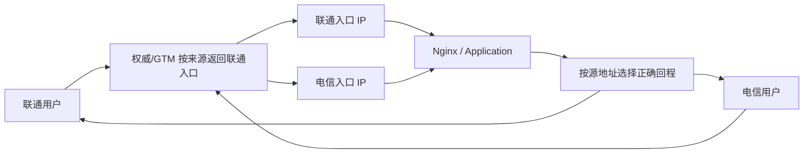

# 跨运营商访问延迟升至 300ms：从用户侧证据到互联边界定位

## 1. 故障现象

某电商管理后台此前交互正常，某日下午开始出现页面和 API 等待数秒。源站位于单运营商机房，运维从管理网络 SSH 登录正常，服务器 CPU、内存和负载也没有异常。

原始信息只能形成两个结论：

```text
源站没有明显的资源饱和
管理人员使用的那条路径没有明显异常
```

它不能证明：

- 所有运营商用户到源站的路径正常。
- 公网入口、TLS、反向代理和动态 API 正常。
- 返回路径与管理路径相同。
- 服务器没有 TCP 重传、网卡丢弃或队列拥塞。

“我能快速 SSH 登录”不是端到端服务 SLO。

## 2. 先把“慢”写成可验证事件

建议先建立事件坐标：

| 维度 | 本案例 |
| --- | --- |
| 首次异常 | 约 15:00 |
| 最近正常 | 当日稍早，需从监控或用户记录确认 |
| 目的 | 管理后台公网域名、HTTPS/443 |
| 主要表现 | 页面等待数秒、跨网 RTT 和丢包上升 |
| 影响范围 | 联通、移动方向明显，电信方向基本正常 |
| 源站 | 电信单线入口 |
| 未知项 | DNS、IPv6、TCP/TLS、返回路径、具体影响比例 |

建立一条失败样本：

```text
源探针：城市 + 运营商 + 出口 IP
目的：域名、解析 IP、端口、IPv4/IPv6
时间：带时区的开始与结束时间
请求：方法、路径、响应码、请求 ID
结果：DNS/TCP/TLS/TTFB/Total、重传和错误
```

没有这些坐标，后续不同人的测试可能根本不是同一条路径或同一种请求。

## 3. 第一阶段：证明源站服务链没有明显瓶颈

### 3.1 主机与网络基线

```bash
uptime
top -b -n 1 | head -20
vmstat 1 5
iostat -xz 1 5
ip -s link
ss -s
nstat -az
```

关注的不只是平均 CPU：

- CPU Steal、软中断、运行队列和上下文切换。
- 内存回收、Swap、OOM 和文件描述符。
- 磁盘队列、Await 和高分位延迟。
- 网卡 Drop/Error、Qdisc Drop 和驱动计数器。
- TCP RetransSegs、ListenDrops、连接状态和端口耗尽。

### 3.2 本机请求应该保留域名语义

简单请求 `http://localhost/` 只能证明某个本地监听路径响应。HTTPS 服务还涉及 Host、SNI、证书、虚拟主机和反向代理路由。可在源站使用：

```bash
curl --silent --show-error --output /dev/null \
  --resolve admin.example.com:443:127.0.0.1 \
  --write-out 'code=%{http_code} connect=%{time_connect} tls=%{time_appconnect} ttfb=%{time_starttransfer} total=%{time_total}\n' \
  https://admin.example.com/healthz
```

再从同机访问公网入口 IP，比较是否经过 NAT/LB 后出现差异。不要为了测试使用 `-k` 隐藏证书错误。

### 3.3 这一阶段的正确结论

如果本机和同运营商探针稳定，只能写：

> 截至测量时刻，源站资源、应用本地路径和本运营商入口没有复现故障；问题范围更可能与特定外部来源或路径相关。

不能写“服务器正常，网络一定有问题”。

## 4. 第二阶段：从用户侧建立运营商矩阵

使用自建探针、云上多运营商节点或受控拨测平台。第三方网页探针可快速提供线索，但其出口、负载、探测协议和数据保留不完全受控，不应成为唯一证据。

匿名化结果示例：

| 来源 | RTT | 目标丢包 | HTTPS | 结论 |
| --- | ---: | ---: | ---: | --- |
| 北京电信 | 8ms | 0% | 正常 | 同运营商路径正常 |
| 上海电信 | 7ms | 0% | 正常 | 同运营商路径正常 |
| 北京联通 | 286ms | 9% | 慢/重传 | 跨运营商异常 |
| 上海联通 | 305ms | 12% | 慢/重传 | 跨运营商异常 |
| 广州移动 | 176ms | 6% | 慢 | 另一跨网方向异常 |

矩阵要避免混淆：

- IPv4 与 IPv6 分开。
- 域名与固定 IP 分开，先记录 DNS 答案和 TTL。
- ICMP、TCP/443 和完整 HTTPS 分开。
- 短请求与长连接/上传分开。
- 同一时间窗口比较，不能拿历史不同负载时段混合。

这一步把范围从“所有用户都慢”缩小为“部分运营商访问某入口异常”。

## 5. 第三阶段：分解 DNS、TCP、TLS、TTFB

从受影响的联通/移动探针执行：

```bash
curl --silent --show-error --output /dev/null \
  --connect-timeout 5 --max-time 20 \
  --write-out 'remote=%{remote_ip} dns=%{time_namelookup} connect=%{time_connect} tls=%{time_appconnect} ttfb=%{time_starttransfer} total=%{time_total}\n' \
  https://admin.example.com/healthz
```

解释时使用阶段差值：

```text
DNS         = time_namelookup
TCP         = time_connect - time_namelookup
TLS         = time_appconnect - time_connect
服务至首字节 = time_starttransfer - time_appconnect
下载        = time_total - time_starttransfer
```

如果 TCP 和 TLS 同时随 RTT、重传恶化，而源站处理到首字节的增量没有明显异常，路径拥塞假设更强。如果只有 TTFB 变长，则还要继续查反向代理、应用、数据库和依赖服务。

## 6. 第四阶段：Traceroute 只用于提出路径假设

从受影响运营商探针执行与业务更接近的 TCP/443 探测：

```bash
sudo traceroute -4 -n -T -p 443 -q 5 -w 2 <service-ip>
```

匿名化输出：

```text
 1  192.0.2.1       0.6 ms
 2  198.51.100.1    2.3 ms
 3  198.51.100.9    8.7 ms
 4  198.51.100.17  16.1 ms
 5  * * *
 6  203.0.113.33  241.8 ms
 7  203.0.113.41  257.2 ms
 8  <service-ip>   286.0 ms
```

### 6.1 Traceroute 实际测到什么

它逐步增加 TTL，让中间路由器返回 ICMP Time Exceeded。显示的 RTT 包含：

```text
源 → 当前 hop 的去程
+ hop 生成响应的排队/控制面时间
+ 当前 hop → 源的回程
```

因此第 6 跳从 16ms 变为 240ms，不能单独证明“第 6 台路由器转发故障”。可能是：

- 第 5 到第 6 跳之间或此前某处拥塞。
- 第 6 跳返回探针响应的回程异常。
- 控制面 ICMP 限速/低优先级。
- ECMP 让不同 TTL 的 Probe 进入不同路径。
- MPLS/隧道隐藏了真实转发节点。

Traceroute 的正确产物是“异常开始出现的路径区间”，不是设备定责结论。详细原理见[`traceroute` 命令详解](../commands/11-traceroute命令详解.md)。

## 7. 第五阶段：MTR 观察持续性，但仍不能单向定责

分别使用 ICMP 和 TCP/443：

```bash
mtr -4 -n -r -w -c 200 -i 1 <service-ip>
sudo mtr -4 -n -r -w -T -P 443 -c 200 -i 1 <service-ip>
```

匿名化 TCP 报告：

| Hop | Loss | Avg | Best | Worst | StDev |
| --- | ---: | ---: | ---: | ---: | ---: |
| 接入网关 | 0% | 0.5ms | 0.3ms | 1.1ms | 0.1ms |
| 本地运营商骨干 | 0% | 9.4ms | 7.7ms | 16.0ms | 1.6ms |
| 跨网前一跳 | 0% | 16.8ms | 14.2ms | 27.1ms | 2.4ms |
| 互联边界区域 | 11% | 238ms | 211ms | 319ms | 24ms |
| 目标前一跳 | 8% | 253ms | 227ms | 332ms | 22ms |
| 目标 | 8% | 251ms | 226ms | 329ms | 21ms |

### 7.1 中间 Hop 限速与真实端到端丢包

判断思路：

```text
中间 hop 显示高 Loss，后续 hop 和目标恢复正常
→ 更像该 hop 对探针响应限速，不能推断转发丢包

某个区间开始出现高 RTT/抖动，目标也持续出现相近丢包和高 RTT
→ 支持真实端到端路径受损，但仍不能仅靠单向 MTR 指定具体设备
```

MTR 每个 Hop 的 Loss 是该 Hop 对探针的响应统计，不是严格的链路累计丢包计数。目标端丢包、TCP 重传和业务失败才是用户影响的关键证据。详细字段和误判见[`mtr` 命令详解](../commands/12-mtr命令详解.md)。

### 7.2 使用 TCP 仍不等于 HTTPS

TCP/443 探测更接近防火墙和路径策略，但不会完成 TLS、HTTP、认证和应用处理。必须与 Curl 分段计时和真实业务请求组合。

## 8. 第六阶段：用双向、多源和业务流量交叉验证

一次单向 MTR 只能形成强线索。根因确认至少增加三类证据。

### 8.1 多源验证

从不同城市、不同联通/移动出口同时测试：

```text
是否都在相近 AS/互联边界后恶化？
是否只有某省/某出口？
是否所有五元组都受影响，还是部分 ECMP 路径？
```

如果只有一个源异常，可能是本地接入、某条城域出口或某个 ECMP 分支，不应升级为全国跨网故障。

### 8.2 反向验证

从目标侧或同机房受控探针访问受影响运营商探针：

```bash
sudo traceroute -4 -n -T -p <probe-port> <affected-probe-ip>
mtr -4 -n -r -w -T -P <probe-port> -c 200 <affected-probe-ip>
```

互联网去程与回程常常不对称。反向异常的位置和程度可能不同，这正是不能用单向 RTT 给某台路由器定责的原因。

### 8.3 TCP 证据

在合法授权且限定过滤器的前提下，从端点观察重传：

```bash
ss -ti dst <peer-ip>
nstat -az | grep -E 'TcpRetransSegs|TcpTimeouts|TcpExtTCPFastRetrans'
sudo tcpdump -ni <interface> -s 128 -w incident.pcap \
  'host <peer-ip> and tcp port 443'
```

抓包应限制时间和大小并保护业务数据。TCP Dup ACK、重传和 RTO 能证明业务流受影响，但单端抓包仍不能直接确定丢包发生的物理位置。

## 9. 第七阶段：确认路由归属与运营商事件

跳点 IP 只能辅助判断网络归属。使用：

```bash
whois <hop-ip>
dig -x <hop-ip>
traceroute -A -n <service-ip>
```

WHOIS、PTR 和 AS 标注可能陈旧、缺失或反映地址所有者而非当前运维责任。最终应由机房/NOC 提供：

- 受影响互联或电路。
- BGP/流量工程变化。
- 维护、割接或故障开始时间。
- 影响区域和预计恢复时间。
- 事件编号及恢复确认。

本案例中，多源探测在运营商互联边界区域后同时恶化，目标端也持续丢包；运营商随后确认互联扩容割接，并且维护结束后路径指标恢复。这三条证据共同支持根因，而不是仅凭某个 `202.x` 跳点名称。

## 10. 根因写法

建议写成：

> 受影响时段内，联通/移动来源访问电信单线入口时出现端到端丢包、RTT 和 TCP 建连时间同步上升。多源 TCP MTR 将异常起始区间收敛到跨运营商互联边界附近，反向/同类测试排除了单一客户端出口；运营商事件通知确认该互联区域正在执行扩容割接。割接结束后，目标丢包和应用分段延迟恢复至基线。

避免写：

> 第 5 跳丢包 12%，所以第 5 台设备坏了，不是我们的责任。

服务方仍然需要对单线入口、缺少跨运营商探针和无预置切流路径等促成因素负责。

## 11. 应急方案不能只执行 `ip addr add`

案例选择了新增联通入口并通过智能 DNS 引导联通用户。这个方向可以快速降低跨网依赖，但实施前必须解决完整数据路径：



### 11.1 网络前置条件

- 地址由运营商/机房正式分配并在正确二层/三层网络中可用。
- 对应接口、前缀、网关、VLAN 和 ARP/ND 正确。
- 防火墙、ACL、NAT、DDoS 清洗和监控覆盖新地址。
- 回包使用与入口匹配的源地址和出口，避免状态防火墙、运营商反欺骗或 `rp_filter` 丢弃。
- 配置通过 NetworkManager/networkd/发行版网络系统持久化，不只存在于运行时。

诊断命令：

```bash
ip -br addr
ip rule
ip route show table all
ip route get <client-ip> from <isp-service-ip>
sysctl net.ipv4.conf.all.rp_filter
ss -lntp '( sport = :443 )'
```

多出口通常需要基于源地址的策略路由。具体路由表、优先级和网关必须由现场地址规划生成，不能复制一条通用命令直接上生产。

### 11.2 TLS 与反向代理

```nginx
server {
    listen <isp-service-ip>:443 ssl;
    server_name admin.example.com;

    ssl_certificate     /etc/nginx/tls/fullchain.pem;
    ssl_certificate_key /etc/nginx/tls/private.key;

    location / {
        proxy_pass http://application_backend;
    }
}
```

上线前执行：

```bash
nginx -t
curl --resolve admin.example.com:443:<isp-service-ip> \
  https://admin.example.com/healthz
```

同一域名切换不同 IP 时证书仍按域名校验；直接用 IP 访问或只改 HTTP `Host` 不能自动解决 HTTPS SNI 与证书校验。

### 11.3 智能 DNS 的边界

```text
联通递归 DNS 来源 → 联通地址池
电信递归 DNS 来源 → 电信地址池
其他/未知来源     → 默认健康地址池
```

注意：

- 权威 DNS 看到的通常是递归 Resolver，不一定是最终用户。
- EDNS Client Subnet 是否携带取决于 Resolver 和隐私策略。
- TTL 降低只影响后续缓存，旧记录在过期前仍可能存在。
- DNS 切换不迁移现有 TCP/TLS 会话。
- 两个地址池必须分别做运营商内健康探测，不能只从一个监控点判断。

## 12. 应急方案选择矩阵

| 方案 | 能解决什么 | 不能解决什么 | 上线前提 |
| --- | --- | --- | --- |
| 静态 CDN | JS/CSS/图片下载和源站请求量 | 动态后台 API、长连接、登录链路 | 缓存键、失效、鉴权和回源策略 |
| 动态加速/边缘代理 | 通过优化入口和骨干回源改善动态请求 | 源站自身慢、所有供应商同时故障 | TLS、回源安全、真实业务压测 |
| 多运营商 IP + GTM | 让用户进入同运营商入口 | DNS 缓存、错误归属、回程不对称 | 双入口、策略路由、健康探测 |
| IDC 多线 BGP | 一个或少量入口由上游选择运营商路径 | 应用故障和单 IDC 故障 | 供应商路由质量、容量和 SLA |
| 多地域/多云入口 | 同时减少地域和机房故障影响 | 数据一致性和状态同步复杂度 | 全局流量、数据复制、演练 |
| App HTTPDNS | App 可选择多个已验证入口 | Web 浏览器、没有备选路径的单入口 | HTTPS SNI、SDK、安全和降级 |

HTTPDNS 本身不会把拥塞链路变快；只有返回了另一个可用入口并让连接走不同路径时才可能改善。静态 CDN 的收益也必须由日志和字节/请求分布测量，不能套用固定百分比。

GTM 的完整设计见[GTM 实现跨网访问加速与故障切换](../load-balancing-proxy/08-GTM实现跨网访问加速与故障切换.md)，BGP 机制见[BGP 原理、策略与双出口实验](../routing-switching/07-BGP原理策略与双出口实验.md)。

## 13. 长期监控：从“有人反馈慢”升级为主动发现

至少布置电信、联通、移动和关键地域探针：

```text
DNS：答案、TTL、解析失败和漂移
ICMP：RTT、抖动、目标丢包（只作基础信号）
TCP：443 建连时间和错误
TLS：握手时间、证书与协议错误
HTTP：状态码、TTFB、Total、响应内容断言
Path：定期低频 TCP MTR/Traceroute 快照
BGP：前缀可见性、Origin/AS Path 和路由变化
```

告警按用户影响触发：

- 某运营商多个探针同时超过基线。
- 目标丢包和 TCP/HTTP 错误同时上升。
- 单运营商入口健康但跨网入口异常。
- DNS 返回异常地址池或健康检查与解析不一致。

不要对每个中间 Hop 的 ICMP Loss 单独告警，否则会被控制面限速淹没。

## 14. 可执行 Runbook

```text
1. 记录事件时间、域名、解析 IP、协议和失败请求
2. 检查源站资源、网卡、TCP、应用和同运营商入口
3. 从各运营商探针采集 DNS/TCP/TLS/HTTP 分段计时
4. 用 TCP traceroute/MTR 收敛异常路径区间
5. 比较 ICMP/TCP、IPv4/IPv6、多源与反向结果
6. 用端点重传/抓包证明业务流是否真实受损
7. 联系机房/NOC，关联 BGP/割接/链路事件
8. 选择已演练的切流方案并设置停止/回滚条件
9. 从每个运营商验证新入口、回程、TLS 和业务
10. 观察旧 TTL 窗口和现有会话，持续监测容量
11. 恢复后保留对照数据，完成根因与促成因素复盘
```

## 15. 本案例时间线的改进版

| 时间 | 动作 | 产物 |
| --- | --- | --- |
| 15:00 | 用户报告后台慢 | 事件建立，待补失败样本 |
| 15:02 | 检查源站资源和本地应用 | 未发现主机/本地处理瓶颈 |
| 15:08 | 多运营商拨测 | 范围缩小到联通/移动跨网方向 |
| 15:15 | TCP Traceroute | 异常区间位于跨网路径附近 |
| 15:25 | ICMP/TCP MTR 与 Curl 分段 | 目标真实丢包、建连和 TLS 同步恶化 |
| 15:30 | 多源/反向验证 | 排除单一客户端或单一探针 |
| 15:35 | 机房/NOC 事件关联 | 互联扩容割接得到确认 |
| 15:50 | 启动已审批的联通入口方案 | 地址、路由、TLS、DNS 和回滚清单 |
| 16:30 | Canary 切流 | 联通探针 RTT/HTTPS 恢复 |
| 16:40 | 扩大并观察 | 用户确认，继续监控旧 DNS TTL |

“定位 35 分钟”只有在时间、探针、命令原始结果和运营商事件编号都保存时才可复盘。

## 16. 最重要的技术结论

1. **源站绿不等于端到端健康**：管理路径、本地回环和用户路径是不同观测点。
2. **先按运营商、地域、协议和 IP 版本切分影响面**，再进入逐跳工具。
3. **Traceroute/MTR 显示的是探测 RTT 和响应统计**，持续到目标的异常支持真实路径受损，但单向结果不能精确定责某台设备。
4. **用 TCP/TLS/HTTP 和端点重传证明业务影响**，ICMP 只是辅助信号。
5. **临时多线入口是完整路由工程**：地址、回程、`rp_filter`、防火墙、TLS、DNS、健康检查和持久化缺一不可。
6. **CDN、HTTPDNS、GTM 与 BGP 解决的问题不同**，应按流量类型、用户分布、状态和成本选择。
7. **长期改进首先是多运营商主动拨测和已演练切流**，而不是故障时临时寻找测试节点。

## 17. 复盘验收清单

- [ ] 有受影响和未受影响用户的对照样本。
- [ ] DNS、IPv4/IPv6、TCP、TLS、TTFB 已分段测量。
- [ ] MTR 同时包含目标 Loss/RTT，不只引用中间 Hop。
- [ ] 使用多源和反向证据描述路径不对称。
- [ ] 根因有运营商/NOC 或控制面事件佐证。
- [ ] 应急切流验证了回程、TLS、业务和容量。
- [ ] DNS TTL、缓存和回滚窗口写入操作计划。
- [ ] 长期监控覆盖电信、联通、移动和真实 HTTPS。
- [ ] 复盘区分直接根因、促成因素和改进负责人。
