# 模型文件从存储加载到 GPU 显存的完整路径

模型位于 Ceph、NFS 或对象存储中，GPU 不能因为 Kubernetes 挂载了目录就直接计算。文件还要经过读取、解析、Tensor 创建、设备内存分配和数据搬运。

本篇追踪一个权重分片从持久存储到 HBM，解释每一段可能出现的性能瓶颈。

## 1. 学习目标

完成本文后，你应该能够：

- 画出普通 POSIX、对象下载和 GDS 三种模型加载路径。
- 区分“文件已下载”“CPU Tensor 已创建”“权重已进入 HBM”。
- 理解 Page Cache、pinned memory、DMA、PCIe 和 HBM 的作用。
- 分解冷启动耗时和估算理论下限。
- 用系统、存储和 GPU 指标定位慢在哪一段。

## 2. 一条权重分片的普通路径

```mermaid
flowchart LR
    A["CephFS / NFS / 本地 NVMe"] --> B["文件系统与块层"]
    B --> C["Linux Page Cache"]
    C --> D["用户态读取缓冲区"]
    D --> E["解析/反序列化"]
    E --> F["CPU Tensor"]
    F --> G["Pinned Host Memory"]
    G --> H["PCIe DMA / H2D"]
    H --> I["GPU HBM"]
    I --> J["CUDA Kernel / Tensor Core"]
```



不同框架可能使用 `read()`、`pread()`、`mmap()` 或直接 IO，具体缓冲次数不同，但分析时仍可拆成：

```text
存储读取 → CPU 处理 → H2D → GPU 初始化
```

## 3. “挂载完成”只建立了名字空间

CSI 把 PVC 挂到 `/models`，只是让容器能通过路径访问数据：

```text
/models/model-a/model-00001.safetensors
```

挂载并不代表：

- 文件已经读进节点内存。
- 文件已经被框架解析。
- GPU 已分配同等容量 HBM。
- 模型已经可以推理。

因此 CSI 挂载时间和模型加载时间必须分开观测。

## 4. 第一段：存储到节点

### 4.1 本地 NVMe

```text
NVMe → PCIe → 主机内存/Page Cache
```

路径短、延迟低，适合热模型缓存，但数据与节点绑定。

### 4.2 NFS / CephFS

```text
服务端/OSD
→ 存储网络
→ 节点网卡
→ TCP/RDMA 或客户端协议
→ 文件系统客户端
→ Page Cache/用户缓冲区
```

多个 Pod 同时加载时会竞争共享网络与后端。

### 4.3 RBD

```text
OSD → 存储网络 → RBD Client → 块设备 → ext4/XFS → Page Cache
```

Pod 看见普通文件系统，底层实际是网络块设备。

### 4.4 对象存储

对象存储通常先由下载器落盘：

```text
S3/RGW → HTTP GET → 下载进程 → staging 目录
→ checksum → revision 目录 → 模型进程读取
```

这比共享文件系统多一个显式分发阶段，但可以把权威仓库与节点热缓存解耦。

## 5. Page Cache 为什么让第二次更快

普通 buffered IO 会利用 Linux Page Cache：

```text
第一次：远端/磁盘 → Page Cache → 应用
第二次：Page Cache → 应用
```

因此第二次模型加载可能明显更快。

但要区分：

- 客户端 Page Cache。
- NFS/Ceph 服务端缓存。
- 对象下载器缓存。
- 框架自身缓存。
- GPU HBM 中仍驻留的权重。

测试报告必须注明冷缓存还是热缓存。不能在生产节点随意清空全局 Page Cache 来做实验。

## 6. mmap 不等于数据已经在内存

`mmap()` 建立文件到虚拟地址空间的映射，物理页常在首次访问时按需调入。

可能出现：

```text
mmap 很快
→ 之后访问每个权重页时产生缺页
→ 真正 IO 延迟分散到后续阶段
```

所以只测 `mmap()` 调用耗时会低估加载成本。应结合 major page faults、磁盘读取和应用时间线判断。

## 7. 第二段：解析与 CPU Tensor

存储读完后，框架还可能执行：

- 读取索引和配置。
- 解析 safetensors、PyTorch checkpoint 等格式。
- 创建 Tensor 元数据。
- 解压或反序列化。
- 数据类型转换。
- 权重重排或量化处理。
- 多分片合并或按 rank 选择分片。

这段可能被 CPU、内存带宽、单线程解析和大量小文件限制。

现象：

```text
存储带宽不高
GPU 也空闲
某个 CPU 核心很忙
```

这时继续升级存储未必有效。

## 8. 第三段：分配 GPU HBM

框架需要为权重和运行时状态分配显存：

```text
模型权重
+ KV Cache
+ 激活
+ 通信 Buffer
+ Workspace
+ CUDA Context
+ 内存分配器预留
```

文件大小不能直接等于最终显存占用。例如：

- 磁盘文件可能压缩。
- 加载后数据类型改变。
- Tensor Parallel 只让每个 rank 保存部分权重。
- 框架可能临时保留 CPU/GPU 两份。
- 加载时峰值可能高于稳定态。

应同时记录：

```bash
nvidia-smi --query-compute-apps=pid,used_memory --format=csv
nvidia-smi dmon -s pucm
```

以及框架的内存统计。

## 9. 第四段：CPU 到 GPU 的 H2D

普通 H2D：

```text
Pageable Host Memory
→ 驱动可能先复制到 Pinned Staging Buffer
→ DMA
→ PCIe
→ HBM
```

使用 pinned memory：

```text
Pinned Host Memory
→ DMA
→ PCIe
→ HBM
```

pinned memory 有助于异步传输和与计算重叠，但它是有限系统资源。大量锁页会挤压主机内存，不应无限增加。

PyTorch 示例：

```python
import time
import torch

size = 1024 * 1024 * 1024
x = torch.empty(size // 4, dtype=torch.float32, pin_memory=True)

torch.cuda.synchronize()
t0 = time.perf_counter()
y = x.to("cuda", non_blocking=True)
torch.cuda.synchronize()
dt = time.perf_counter() - t0

print(f"H2D GiB/s: {size / dt / 1024**3:.2f}")
```

`non_blocking=True` 只是允许异步机会；是否真正重叠还取决于 pinned memory、Stream、依赖关系和硬件 copy engine。

## 10. PCIe 和 NUMA 的影响

如果负责读取和 H2D 的 CPU 内存位于远端 NUMA：

```text
远端 NUMA 内存
→ CPU 互联
→ GPU 所在 PCIe Root
→ HBM
```

比本地 NUMA 多一段跨 Socket 路径。

检查：

```bash
nvidia-smi topo -m
numactl -H
lspci -tv
cat /sys/bus/pci/devices/<BDF>/numa_node
```

优化时要让：

- 数据加载 CPU。
- 主机内存。
- GPU。
- 本地 NVMe 或存储网卡。

尽量位于合理拓扑范围内。

## 11. GDS 路径

在硬件、驱动、文件系统和应用都受支持时，GPUDirect Storage 可以减少 CPU 主存中转：

```text
本地 NVMe / 远端兼容存储
→ DMA Agent
→ PCIe / RDMA
→ GPU HBM
```

但要注意：

- Control Path 仍由 CPU 和应用管理。
- 模型格式解析不一定消失。
- Compatibility Mode 可能仍走 CPU staging。
- 小 IO、未对齐 IO 和不受支持文件系统可能无法获益。
- GDS 不是 CSI 的替代品。

应该用 `gdscheck`、`gdsio` 和真实应用分阶段验证，而不是只确认 `libcufile` 存在。

## 12. 权重分片与并行加载

假设模型有 8 个分片：

```text
model-00001-of-00008
...
model-00008-of-00008
```

合理并发可以：

- 提高存储队列深度。
- 跑满多条网络连接。
- 让解析与传输流水化。

过度并发会：

- 打满 NFS/Ceph/RGW。
- 抢占 CPU 和内存带宽。
- 让多个 H2D 互相竞争。
- 增加 pinned memory。
- 形成冷启动风暴。

并发度应通过“单 Pod × 多 Pod × 多节点”矩阵测试。

## 13. Tensor Parallel 加载

以 8 卡 TP 为例，每个 rank 最终只持有部分权重，但加载方式取决于框架：

### 13.1 低效方式 {/* #低效方式 */}

```text
每个 rank 都读取完整模型
→ CPU 内存放大 8 倍
→ 再丢弃不属于自己的部分
```

### 13.2 更优方式 {/* #更优方式 */}

```text
按 rank 读取对应 shard
→ 只解析所需权重
→ H2D 到对应 GPU
```

还要确认文件分片方式与 TP 切分维度是否匹配，否则会发生额外的跨 GPU 重分发。

## 14. 理论下限估算

模型大小为 `M`，有效存储带宽 `Bs`，CPU 解析吞吐 `Bc`，H2D 带宽 `Bh`。

完全串行下限：

```text
T ≥ M/Bs + M/Bc + M/Bh
```

充分流水化时近似受最慢阶段限制：

```text
T ≥ max(M/Bs, M/Bc, M/Bh)
```

真实时间还包括：

- 打开和元数据。
- 内存分配。
- 校验。
- 同步。
- GPU 初始化。
- NCCL 建链。
- 预热。

这套估算用于判断数量级，不应冒充精确预测。

## 15. 一次 200 GiB 模型加载怎样分析

记录：

| 阶段 | 开始 | 结束 | 耗时 |
|------|------|------|------|
| CSI 挂载 | T0 | T1 | 2 s |
| 文件读取 | T1 | T2 | 80 s |
| 解析/创建 Tensor | T2 | T3 | 40 s |
| H2D | T3 | T4 | 18 s |
| NCCL/重排 | T4 | T5 | 12 s |
| 预热 | T5 | T6 | 15 s |

如果只看总计 167 秒，很难优化；拆开后可以看到存储读取和 CPU 解析占主要部分。

## 16. 分层观测

### 16.1 存储 {/* #存储 */}

```bash
iostat -x 1
pidstat -d 1
nfsiostat 1
```

Ceph 继续看 OSD/MDS/RGW 指标。

### 16.2 网络 {/* #网络 */}

```bash
sar -n DEV 1
ethtool -S <interface>
```

### 16.3 CPU 与内存 {/* #cpu-与内存 */}

```bash
pidstat -u -r 1
numastat -p <pid>
vmstat 1
```

### 16.4 GPU {/* #gpu */}

```bash
nvidia-smi dmon -s pucm
nsys profile <application>
```

解释：

- 存储和网络满，GPU 空闲：读取受限。
- CPU 满，存储和 GPU 不满：解析受限。
- PCIe RX 高、GPU Compute 低：正在 H2D。
- HBM 已占用但 GPU Util 低：权重已驻留，业务可能还没开始或在等待。

## 17. 常见故障

### 17.1 文件存在但加载报错 {/* #文件存在但加载报错 */}

检查 revision、manifest、分片数量、大小、checksum、索引和权限。

### 17.2 CPU OOM {/* #cpu-oom */}

加载时可能同时存在：

- Page Cache。
- 用户缓冲区。
- CPU Tensor。
- pinned staging。
- 多进程重复副本。

不要只按最终 GPU 权重大小配置主机内存。

### 17.3 CUDA OOM 出现在加载阶段 {/* #cuda-oom-出现在加载阶段 */}

可能是：

- 精度与预期不符。
- 临时完整权重后再切分。
- 多 rank 映射到同一 GPU。
- KV Cache 预分配。
- 显存碎片或其他进程占用。

### 17.4 多 Pod 同时启动越来越慢 {/* #多-pod-同时启动越来越慢 */}

检查共享存储带宽、对象网关、节点缓存命中、下载并发和 H2D 是否共同竞争 PCIe。

### 17.5 GDS 已安装但没有变快 {/* #gds-已安装但没有变快 */}

确认：

- 不是 Compatibility Mode。
- 文件系统和设备受支持。
- IO 大小/对齐合理。
- GPU 与 NVMe/NIC 拓扑。
- 原瓶颈确实在 CPU staging。

## 18. 推荐优化顺序

```text
先校验模型组织和 revision
→ 测单节点存储读取
→ 测 H2D
→ 拆 CPU 解析时间
→ 测多 Pod 并发
→ 加本地缓存
→ 调整分片与并行加载
→ 最后评估 GDS
```

不要在没有时间线和基线时直接修改十几个挂载参数、NCCL 变量或 CUDA 配置。

## 19. 本篇总结

模型从存储到计算的完整路径：

```text
权威存储
→ CSI/下载器建立可访问路径
→ 文件系统与缓存
→ 解析成 CPU Tensor
→ 分配 HBM
→ pinned memory + DMA + PCIe H2D
→ GPU Tensor
→ NCCL 分片/通信
→ Kernel 预热
→ 开始计算
```

上一篇：[一个 GPU Pod 从提交到开始计算经历了什么](./01-一个GPU-Pod从提交到开始计算经历了什么.md)。下一篇：[单机八卡训练的完整数据与通信路径](./03-单机八卡训练的完整路径.md)。

## 20. 课后练习

1. CSI 挂载完成为什么不等于模型已进入显存？
2. Page Cache、CPU Tensor 和 pinned memory 有什么区别？
3. `mmap()` 返回很快为什么不能代表 IO 已完成？
4. 测量一个模型的文件读取、CPU 解析、H2D 和预热耗时。
5. 比较冷缓存与热缓存加载。
6. 比较 pageable 和 pinned memory 的 H2D。
7. 计算 200 GiB 模型在 8 GiB/s 存储和 24 GiB/s H2D 下的串行理论下限。

## 21. 参考与致谢 {/* #参考与致谢 */}

- [CUDA Programming Guide](https://docs.nvidia.com/cuda/cuda-programming-guide/)
- [CUDA Best Practices Guide — Data Transfer](https://docs.nvidia.com/cuda/cuda-c-best-practices-guide/)
- [PyTorch CUDA Semantics](https://docs.pytorch.org/docs/stable/notes/cuda.html)
- [PyTorch Tutorial — non_blocking and pin_memory](https://docs.pytorch.org/tutorials/intermediate/pinmem_nonblock.html)
- [NVIDIA GPUDirect Storage](https://docs.nvidia.com/gpudirect-storage/)

本文按普通 POSIX 路径、对象分发和 GDS 路径建立统一分析模型；具体框架可能采用不同加载优化。
