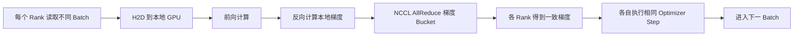

# 单机八卡训练的完整数据与通信路径

“一台服务器有 8 张 GPU”只描述数量，没有说明 GPU 怎样连接。8 卡 PCIe 服务器、NVLink Bridge 服务器和 NVSwitch 服务器的通信能力可能完全不同。

本篇以单机 8 GPU 训练为例，把数据加载、HBM、计算、NVLink、NCCL 和 Kubernetes 放置串起来。

---

## 1. 学习目标

完成本文后，你应该能够：

- 区分 8 卡 PCIe、部分 NVLink 和 NVSwitch 拓扑。
- 解释“一进程一卡”的 DDP 执行过程。
- 追踪前向、反向、AllReduce 和参数更新。
- 理解 DDP 与 Tensor Parallel 对 NVLink 的不同依赖。
- 使用拓扑工具和 nccl-tests 建立单机基线。
- 排查某一张卡慢导致全任务慢的问题。

---

## 2. 先画物理拓扑

典型 8 卡服务器可能是：

### 2.1 PCIe 双 Root

```text
CPU0 ─ PCIe Switch ─ GPU0 GPU1 GPU2 GPU3
  │
  └── CPU Interconnect ── CPU1 ─ PCIe Switch ─ GPU4 GPU5 GPU6 GPU7
```

同一 PCIe Switch 下的 GPU 通信通常比跨 CPU Socket 更有利。

### 2.2 分组 NVLink

```text
GPU0 ⇄ GPU1
GPU2 ⇄ GPU3
GPU4 ⇄ GPU5
GPU6 ⇄ GPU7
```

只有部分 GPU 对有高速直连，8 卡任务仍可能跨 PCIe。

### 2.3 NVSwitch

```text
GPU0 ─┐
GPU1 ─┤
...   ├─ NVSwitch Fabric
GPU7 ─┘
```

NVSwitch 为多 GPU 提供高带宽交换结构，但仍要确认 Fabric、驱动和 NCCL 实际识别正常。

查看：

```bash
nvidia-smi topo -m
nvidia-smi topo -p2p p
nvidia-smi topo -p2p n
nvidia-smi nvlink --status
```

---

## 3. 软件进程模型

单机 8 卡 DDP 常采用：

```text
Rank 0 → GPU0
Rank 1 → GPU1
...
Rank 7 → GPU7
```

每个进程：

- 拥有独立 Python 解释器。
- 建立自己的 CUDA Context。
- 持有一份模型副本。
- 读取不同数据样本。
- 计算本地梯度。
- 通过 NCCL 同步梯度。

启动示意：

```bash
torchrun --standalone --nproc-per-node=8 train.py
```

应用必须显式把当前进程绑定到对应 GPU：

```python
import os
import torch
import torch.distributed as dist

local_rank = int(os.environ["LOCAL_RANK"])
torch.cuda.set_device(local_rank)
dist.init_process_group(backend="nccl")
```

如果多个 rank 错误地落到同一 GPU，会出现显存异常、性能下降或初始化失败。

---

## 4. 训练数据进入每张 GPU

```text
训练存储
→ CPU DataLoader
→ 每个 rank 的样本
→ pinned memory
→ H2D
→ 对应 GPU HBM
```

使用 DistributedSampler 时，各 rank 读取不同样本：

```text
全局 Batch
  ├─ Rank0 Local Batch
  ├─ Rank1 Local Batch
  └─ ...
```

如果每个 rank 都扫描全部小文件、开过多 DataLoader Worker，存储和 CPU 压力会放大 8 倍。

需要同时规划：

- 每 rank 的 `num_workers`。
- CPU 核心和 NUMA 绑定。
- pinned memory 总量。
- 本地 NVMe/共享存储吞吐。
- H2D 与计算重叠。

---

## 5. 一步 DDP 训练发生什么



DDP 一般不需要把模型参数集中回 Rank 0。每个 rank 在同步梯度后执行相同更新，模型副本继续保持一致。

---

## 6. 梯度同步怎样与反向重叠

DDP 会把参数梯度组织成 Bucket。反向计算过程中，某个 Bucket 的梯度准备完成后，就可以开始 AllReduce，而后面的层仍在计算。

```text
时间 →
GPU Compute: [Backward Layer N][Backward Layer N-1][...]
NCCL Comm:                 [Bucket A AllReduce][Bucket B...]
```

良好情况：通信被反向计算部分隐藏。

差的情况：

```text
Backward 全结束
→ 长时间等待 AllReduce
→ Optimizer
```

影响因素：

- Bucket 大小。
- 模型层次和梯度就绪顺序。
- NVLink/PCIe 带宽。
- 某 rank 计算变慢。
- CUDA Stream 依赖。

---

## 7. NCCL 在机内怎样选路

NCCL 会根据拓扑和可用能力选择传输方式：

```text
优先 GPU P2P
  ├─ NVLink / NVSwitch
  └─ PCIe P2P
否则可能走共享主机内存中转
```

路径示意：

### NVLink

```text
GPU0 HBM → NVLink/NVSwitch → GPU1 HBM
```

### PCIe P2P

```text
GPU0 HBM → PCIe Switch → GPU1 HBM
```

### 主机内存中转

```text
GPU0 HBM → CPU Memory → GPU1 HBM
```

最后一种路径通常更慢，也会增加 PCIe 和主机内存压力。

查看 NCCL 选择：

```bash
NCCL_DEBUG=INFO \
NCCL_DEBUG_SUBSYS=INIT,GRAPH,P2P \
torchrun --standalone --nproc-per-node=8 train.py
```

不要长期在生产开启大量 DEBUG 日志。

---

## 8. Ring AllReduce 的直觉

8 个 rank 的 Ring 可以理解为：

1. Reduce-Scatter：梯度分块沿 Ring 传递并归约。
2. AllGather：把归约后的分块传播给所有 rank。

每个 rank 不需要把全部梯度发给一个中心节点，从而更好利用链路。

真实 NCCL 还可能选择 Tree、分层算法、多个 Channel 和特定协议。不要把 Ring 当成唯一实现。

---

## 9. Tensor Parallel 的路径不同

DDP：

```text
每张 GPU 有完整模型副本
不同数据
主要同步梯度
```

Tensor Parallel：

```text
一个模型层切到多张 GPU
同一次前向/反向内部就频繁通信
```

TP 常见通信：

- AllReduce。
- AllGather。
- Reduce-Scatter。
- 点对点激活传输。

因此 TP 对低延迟、高带宽 NVLink/NVSwitch 更敏感。把一个 TP 组跨越慢速 PCIe Root，性能可能显著下降。

---

## 10. HBM 容量怎样变化

### DDP

每张 GPU 通常保存：

- 完整参数。
- 完整梯度。
- 优化器状态的一份。
- 本 rank 激活。

### Tensor Parallel

部分参数和计算按 GPU 切分，但会增加通信 Buffer，并非显存简单除以卡数。

### ZeRO

可进一步切分参数、梯度或优化器状态，但会引入额外通信。

所以：

```text
显存优化
↔ 通信量
↔ NVLink/PCIe 压力
```

三者必须一起评估。

---

## 11. Kubernetes 中单 Pod 八卡

```yaml
resources:
  limits:
    nvidia.com/gpu: 8
```

优点：

- 8 张 GPU 必然来自同一节点。
- 进程间共享 IPC 和主机网络更直接。
- `torchrun --nproc-per-node=8` 简单。

限制：

- 默认调度只保证同节点有 8 张可分配 GPU。
- 未必能表达具体 GPU 对之间的 NVLink 拓扑。
- 一个 Pod 内 CPU、内存、共享内存和 pinned memory 都要按 8 rank 规划。

建议同时设置：

- CPU 和内存 requests/limits。
- 足够的 `/dev/shm`。
- 节点型号/拓扑标签。
- GPU 节点污点容忍。
- 模型和数据卷。

---

## 12. 单机基准测试

### 12.1 拓扑

```bash
nvidia-smi topo -m
nvidia-smi topo -p2p p
nvidia-smi topo -p2p n
```

### 12.2 CUDA P2P

运行 CUDA Samples 中的 P2P 带宽/延迟测试，检查 GPU 对之间的直接访问能力。

### 12.3 NCCL

```bash
./build/all_reduce_perf -b 8M -e 8G -f 2 -g 8
```

记录：

- `algbw`。
- `busbw`。
- 不同消息大小。
- 8 卡完整结果。
- 重复运行稳定性。

### 12.4 真实训练

微基准通过后仍需记录：

- 每 step 时间。
- samples/s 或 tokens/s。
- DataLoader wait。
- Forward、Backward、Optimizer、Communication 时间。
- 每张 GPU 利用率与功耗。

---

## 13. 慢 Rank 效应

AllReduce 是同步集合通信。7 个 rank 很快、1 个 rank 很慢，其他 rank 也要等待。

慢 rank 可能来自：

- GPU 降频、温度或 Xid。
- CPU/NUMA 远端。
- DataLoader 数据倾斜。
- 某条 NVLink 故障或退化。
- HBM ECC 问题。
- 与其他任务争用 GPU、CPU、PCIe 或存储。

因此平均 GPU Util 会掩盖单卡异常，应比较 8 张 GPU 的时间序列。

---

## 14. 常见故障

### 只有部分 GPU 可见

检查 Pod 请求、Device Plugin Allocate、`CUDA_VISIBLE_DEVICES`、容器设备和实际 rank 数。

### P2P 被禁用

检查：

- `nvidia-smi topo -p2p`。
- IOMMU/ACS。
- 虚拟化限制。
- 驱动和平台支持。
- 容器 `/sys` 拓扑可见性。

### NVLink 存在但 NCCL 走慢路径

检查 NCCL GRAPH/P2P 日志、Fabric Manager、链路状态和拓扑文件。

### 8 卡比 4 卡更慢

可能跨越了 PCIe Root/CPU Socket，或数据与 CPU 资源未随 rank 数扩展。分别测试 1、2、4、8 卡。

### GPU 周期性掉到零

检查 DataLoader、共享存储、Checkpoint 和同步等待，不要只调 NCCL。

---

## 15. 建立性能基线

建议保存：

```text
服务器型号与 BIOS
GPU 型号/驱动
拓扑矩阵
P2P 矩阵
NCCL 版本
1/2/4/8 卡 all_reduce_perf
真实模型 1/2/4/8 卡吞吐
每卡 HBM、功耗、温度、时钟
```

升级驱动、NCCL、固件、内核或容器镜像后重新对比。

---

## 16. 本篇总结

单机八卡训练不是“八张卡各算各的”，而是：

```text
存储/CPU 准备 8 份不同 Batch
→ H2D 到 8 张 GPU
→ 各自前向和反向
→ 梯度 Bucket 通过 NVLink/NVSwitch/PCIe 做 AllReduce
→ 各 rank 更新参数
→ 同步进入下一步
```

DDP 的计算可扩展性取决于最慢 rank、通信/计算重叠和数据供给；TP 则更依赖机内高速互联。

上一篇：[模型文件从存储加载到 GPU 显存](./02-模型文件从存储加载到GPU显存的完整路径.md)。下一篇：[多机训练的完整数据与通信路径](./04-多机训练的完整路径.md)。

---

## 17. 课后练习

1. DDP 为什么通常采用一进程一卡？
2. DDP 与 TP 分别在哪些阶段通信？
3. NVLink 不可用时 NCCL 可能选择哪些路径？
4. 对一台 8 卡机器运行 1/2/4/8 卡 NCCL 测试并画图。
5. 对比 `nvidia-smi topo -m` 和 NCCL GRAPH 日志。
6. 故意让一个 rank 睡眠，观察所有 rank 的 step 时间。
7. 计算不同 DataLoader Worker 数对 8 卡吞吐的影响。

---

## 参考与致谢

- [NCCL Documentation](https://docs.nvidia.com/deeplearning/nccl/)
- [NCCL GPU Troubleshooting](https://docs.nvidia.com/deeplearning/nccl/user-guide/docs/troubleshooting/gpu_troubleshooting.html)
- [PyTorch DistributedDataParallel](https://docs.pytorch.org/docs/stable/generated/torch.nn.parallel.DistributedDataParallel.html)
- [PyTorch Distributed Communication](https://docs.pytorch.org/docs/stable/distributed.html)
- [NVIDIA nccl-tests](https://github.com/NVIDIA/nccl-tests)

本文把 DDP/TP 软件步骤映射到 GPU、HBM 和机内互联，实际 NCCL 算法与协议由版本、拓扑和消息大小共同决定。
