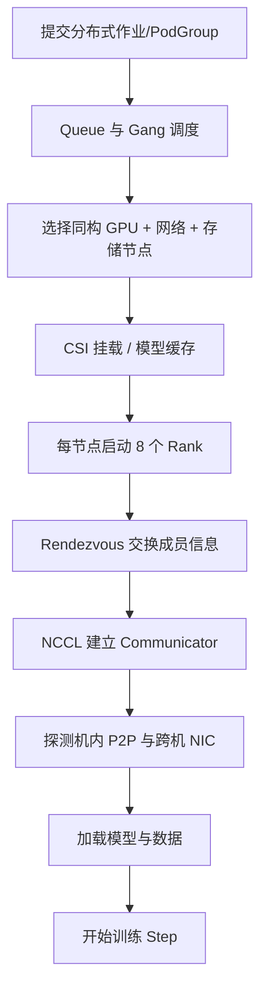

# 多机训练的完整数据与通信路径：从 NVLink 到 RDMA 网卡

多机训练在单机路径上增加了调度、Rendezvous、交换网络和远端 GPU。任何一个 rank、网卡、链路或存储客户端变慢，都可能拖慢整个训练任务。

本篇以 2 节点、每节点 8 GPU 的 DDP 为例，追踪一个梯度分块如何从 GPU0 到达远端 GPU。

---

## 1. 学习目标

完成本文后，你应该能够：

- 解释 Node Rank、Local Rank、Global Rank 和 World Size。
- 画出 NVLink、PCIe、RDMA HCA 和交换机的完整路径。
- 区分普通 Socket、RDMA 和 GPUDirect RDMA。
- 理解 NCCL 怎样组合机内与跨机通信。
- 判断训练慢来自计算、机内通信、跨机网络还是存储。
- 设计多机训练的基线测试与故障演练。

---

## 2. 示例拓扑

```text
Node 0                                      Node 1
┌──────────────────────┐                   ┌──────────────────────┐
│ GPU0..GPU7           │                   │ GPU0..GPU7           │
│   ↕ NVLink/NVSwitch  │                   │   ↕ NVLink/NVSwitch  │
│ PCIe Root / Switch   │                   │ PCIe Root / Switch   │
│   ↕                  │                   │   ↕                  │
│ RDMA HCA 0 / HCA 1   │═══IB/RoCE Fabric═│ RDMA HCA 0 / HCA 1   │
└──────────────────────┘                   └──────────────────────┘
        │                                         │
        └────────── Shared Storage Network ───────┘
```

训练网络和存储网络可以物理或逻辑隔离。若共用链路，Checkpoint 和数据加载可能与 NCCL 竞争带宽。

---

## 3. Rank 映射

2 节点 × 8 GPU：

```text
World Size = 16

Node 0: Global Rank 0..7  / Local Rank 0..7
Node 1: Global Rank 8..15 / Local Rank 0..7
```

概念：

- Global Rank：整个作业中的唯一编号。
- Local Rank：节点内进程编号，通常映射本地 GPU。
- Node Rank：节点编号。
- World Size：总进程数。

所有进程必须对这些值达成一致，否则会在 Rendezvous 或 Collective 阶段卡住。

---

## 4. 调度必须先满足整组资源

分布式训练通常需要：

```text
2 个节点同时各有 8 GPU
+ CPU/内存
+ 训练网络
+ 存储访问
+ 相同驱动与运行环境
```

如果先启动一个节点的 Worker，另一个节点长时间 Pending，已启动进程会等待 Rendezvous 或超时。

Gang Scheduling 的目标是：

```text
整组资源足够 → 一起运行
整组资源不足 → 都等待
```

这减少半组任务占着 GPU 空等，但不能自动保证选中的节点网络拓扑最优。

---

## 5. 作业启动链路



“所有 Pod Running”仍不代表 NCCL 已经完成建链。

---

## 6. 普通 Socket 路径

没有 RDMA 或 NCCL 未选中 RDMA 时，跨节点可能走 Socket：

```text
GPU HBM
→ PCIe D2H
→ 主机内存
→ CPU/内核网络栈
→ Ethernet NIC
→ 交换机
→ 远端 NIC/内核
→ 远端主机内存
→ PCIe H2D
→ 远端 GPU HBM
```

这条路径可用，但增加 CPU、主机内存和复制开销。

NCCL 日志出现 `NET/Socket` 并不一定是错误；它表示当前使用 Socket Transport，需要判断是否符合设计预期。

---

## 7. RDMA 路径

RDMA 允许网卡直接访问注册过的主机内存：

```text
GPU HBM
→ 主机注册内存
→ RDMA HCA
→ IB/RoCE Fabric
→ 远端 HCA
→ 远端注册内存
→ GPU HBM
```

相比普通 Socket，数据面减少 CPU 参与，但如果 GPU 数据仍要在主机内存 staging，就还不是 GPUDirect RDMA。

---

## 8. GPUDirect RDMA 路径

拓扑和软件支持时：

```text
GPU0 HBM
→ PCIe P2P
→ 本地 RDMA HCA
→ IB/RoCE Switch
→ 远端 RDMA HCA
→ PCIe P2P
→ 远端 GPU HBM
```

CPU 仍负责控制面、提交通信和协议管理；“Direct”主要指数据面不必经过普通 CPU staging buffer。

需要：

- GPU、HCA 和平台支持 P2P。
- 正确驱动与内核能力。
- `nvidia-peermem` 或受支持的 DMA-BUF 路径。
- IOMMU/ACS/虚拟化配置符合要求。
- 容器能访问 RDMA 设备及拓扑。
- NCCL 实际启用 GDR。

---

## 9. NCCL 怎样组合机内和跨机

NCCL 不会把所有 GPU 都用同一种物理链路连接。

可能的分层过程：

```text
节点内：
GPU → NVLink/NVSwitch → 负责跨机发送的 GPU

节点间：
GPU → GPUDirect RDMA → HCA → Fabric → 远端 HCA → GPU

远端节点内：
接收 GPU → NVLink/NVSwitch → 其他 GPU
```

多张 HCA 时，NCCL 还可能根据 GPU/NIC 亲和性使用多 Rail，让靠近不同 PCIe Root 的 GPU 走对应网卡。

---

## 10. 一次 AllReduce 的分层直觉

对于 16 rank：

1. 每个 rank 计算本地梯度。
2. 节点内通过 NVLink/NVSwitch 交换或归约部分数据。
3. 节点间通过 RDMA 网络交换归约结果。
4. 远端节点内再次分发。
5. 所有 rank 获得一致结果。

实际 NCCL 会根据拓扑、消息大小、算法和协议构造多个 Channel。分析时不用假定每次一定严格按上述三段执行，但这套分层模型有助于定位瓶颈。

---

## 11. InfiniBand 与 RoCE 的差异点

### InfiniBand

- 专用 IB Fabric。
- Subnet Manager 管理网络。
- 使用 HCA、LID/GID 等概念。

### RoCE

- RDMA over Converged Ethernet。
- 依赖以太网交换结构。
- 更需要关注 PFC、ECN、队列、MTU、拥塞与丢包。

二者都能承载 RDMA，故障检查和交换机配置并不相同。

---

## 12. Kubernetes 中网卡怎样交给 Pod

根据方案，Pod 可能使用：

- Host Network。
- 节点默认网络接口。
- Multus 第二网络。
- SR-IOV VF。
- RDMA Shared Device Plugin 暴露的资源。

应明确：

```text
Pod IP 走哪张网卡？
NCCL 自动选择哪张网卡？
RDMA 设备是否在容器内？
训练网络是否与业务/存储网络隔离？
```

检查：

```bash
ip addr
ip route
rdma link
ibdev2netdev
ls -l /dev/infiniband
```

设置 `NCCL_SOCKET_IFNAME` 或 HCA 相关选择前，先根据 NCCL 版本官方说明和实际日志确认，避免用环境变量掩盖底层错误。

---

## 13. 存储怎样影响跨机训练

每个节点除了 NCCL，还可能同时：

- 读取训练数据。
- 拉取模型。
- 写 Checkpoint。
- 读取其他 rank 写出的元数据。

如果训练与存储共用 100/200/400 Gb 网络：

```text
NCCL AllReduce
       ↕ 竞争
Dataset Read / Checkpoint Write
```

现象：

- 平时 step 稳定，Checkpoint 时 GPU Util 同时下降。
- 扩容/重启时模型下载导致其他训练通信变慢。
- Ceph recovery 期间 NCCL 带宽下降。

解决方向是隔离网络、限速/错峰、分层缓存和容量规划，不只是增加 NCCL Timeout。

---

## 14. 建立四层基线

### 14.1 GPU P2P

每台节点分别测试：

```bash
nvidia-smi topo -m
nvidia-smi topo -p2p p
nvidia-smi topo -p2p n
```

### 14.2 RDMA 网络

主机内存：

```bash
ib_write_bw <peer>
```

支持环境再测试 GPU Buffer：

```bash
ib_write_bw --use_cuda=<gpu-index> <peer>
```

参数以本机 perftest 版本为准。

### 14.3 NCCL

```bash
mpirun ... ./all_reduce_perf -b 8M -e 8G -f 2 -g 8
```

先单机，再双机、多机。

### 14.4 真实训练

记录：

- step time。
- 通信占比。
- tokens/s。
- 每 rank DataLoader wait。
- Checkpoint 时间。

---

## 15. NCCL 日志应回答什么

```bash
NCCL_DEBUG=INFO
NCCL_DEBUG_SUBSYS=INIT,NET,GRAPH
```

关注：

- 每个 rank 识别的节点、GPU 和总 rank 数。
- 选择 `NET/IB` 还是 `NET/Socket`。
- 使用哪些 HCA/接口。
- GPU 与 NIC 拓扑距离。
- 是否启用 GDR。
- Channel/Graph 是否在异常节点不同。

日志较多，生产环境应按需短时采集。

---

## 16. 常见故障

### Rendezvous 超时

先查：

- Master 地址和端口。
- DNS/Service。
- NetworkPolicy/防火墙。
- Rank/World Size。
- 是否有 Pod 未调度或崩溃。

这时还没进入 NCCL 数据面，不要先查 NVLink。

### NCCL 走 Socket 而不是 IB/RoCE

检查 RDMA 设备、容器权限、驱动模块、接口状态、NCCL 构建与日志。

### RDMA 正常，GDR 未生效

主机内存 `ib_write_bw` 通过只证明 RDMA 基础路径。继续检查 GPU Buffer 测试、GPU/NIC 拓扑、peer memory/DMA-BUF 和 ACS/IOMMU。

### 某节点带宽明显低

逐层比较：

```text
单机 NCCL
→ 节点对 RDMA
→ GPU Buffer RDMA
→ 多机 NCCL
→ 真实训练
```

### RoCE 偶发超时

检查交换机 PFC/ECN、网卡队列、丢包、拥塞、MTU 和 DSCP/Traffic Class，不能只增大 Timeout。

### Checkpoint 时 NCCL Timeout

可能是存储 IO 让某些 rank 长时间未进入 Collective。结合训练日志和存储指标确认是否所有 rank 的执行进度一致。

---

## 17. 性能分解

单步可近似：

```text
Tstep
= Tdata
+ Tcompute_not_overlapped
+ Tcommunication_not_overlapped
+ Toptimizer
+ Tcheckpoint_amortized
+ Tstraggler
```

优化目标不是让每一项单独为零，而是：

- 数据供给与计算重叠。
- 梯度通信与反向重叠。
- Checkpoint 错峰或异步化。
- 消除异常慢 rank。

---

## 18. 生产验收

上线前至少完成：

- 每节点 8 卡 P2P/NCCL。
- 每对节点 RDMA 基线。
- 每对节点 GPU Buffer RDMA。
- 双机、多机 NCCL。
- 多机真实模型训练。
- 同时写 Checkpoint 的干扰测试。
- 网卡/交换端口故障演练。
- 一个 Worker 重启后的恢复。
- 监控 GPU、NIC、交换机和存储时间线。

---

## 19. 本篇总结

多机训练路径：

```text
存储 → 每节点 CPU/本地缓存 → H2D → HBM → GPU 计算
→ 机内 NVLink/NVSwitch
→ PCIe → RDMA HCA → IB/RoCE Fabric
→ 远端 HCA → 远端 GPU
→ NCCL 完成集合通信
→ 下一训练步骤
→ Checkpoint 写回存储
```

任何一层退化，最终都可能表现为“GPU 利用率下降”或“NCCL Timeout”。

上一篇：[单机八卡训练的完整路径](./03-单机八卡训练的完整路径.md)。下一篇：[GPU、网卡、存储联合拓扑调度](./05-GPU网卡存储联合拓扑调度.md)。

---

## 20. 课后练习

1. RDMA 和 GPUDirect RDMA 的数据路径有什么区别？
2. 为什么单机 NCCL 正常不能证明多机 GDR 正常？
3. 训练网络和存储网络共用时会产生什么干扰？
4. 画出两节点 16 GPU 的 rank、GPU 和 HCA 映射。
5. 对比 `NET/Socket` 和 `NET/IB` 的 NCCL 日志与带宽。
6. 制造一个 Worker 延迟进入 AllReduce，观察其他 rank。
7. 设计从主机内存 RDMA 到真实训练的四层验收表。

---

## 参考与致谢

- [NCCL Documentation](https://docs.nvidia.com/deeplearning/nccl/)
- [NCCL Networking Troubleshooting](https://docs.nvidia.com/deeplearning/nccl/user-guide/docs/troubleshooting/networking_troubleshooting.html)
- [NCCL GPU Troubleshooting](https://docs.nvidia.com/deeplearning/nccl/user-guide/docs/troubleshooting/gpu_troubleshooting.html)
- [NVIDIA GPUDirect RDMA](https://docs.nvidia.com/cuda/gpudirect-rdma/)
- [PyTorch Distributed Communication](https://docs.pytorch.org/docs/stable/distributed.html)

本文以两节点 DDP 建立统一路径。真实 NCCL 会根据硬件、网络、消息大小和版本选择算法、协议与多 Rail 策略。
