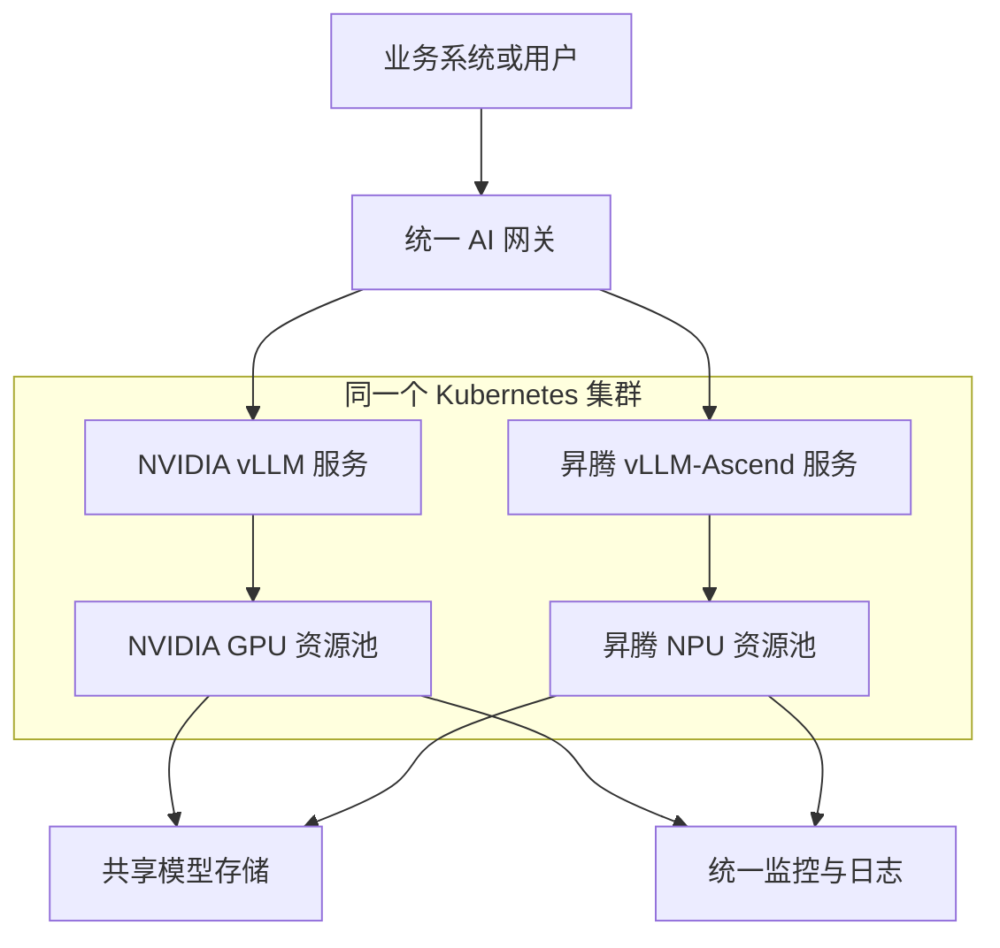

# 一张图看懂 NVIDIA＋昇腾双资源池 AI 推理集群

:::info 系列与定位
**系列**：《NVIDIA＋昇腾双资源池 AI 推理集群：从 0 到部署、运维与故障排查》
**阶段**：第一阶段——小白基础
**本文定位**：系列门户篇
:::

:::tip 系列约定
资源池 A = **NVIDIA GPU**（vLLM）· 资源池 B = **华为昇腾 NPU**（vLLM-Ascend）· 同一 Kubernetes · 共享存储/网关/监控 · **禁止**跨池组成同一分布式模型实例。
:::

很多人第一次接触 AI 集群时，会同时看到 GPU、NPU、CUDA、CANN、Kubernetes、vLLM、Ceph、NFS、网关和 Prometheus。每个名词似乎都很重要，却不知道它们为什么会出现在同一套系统里。

本文暂时不讲安装命令，而是先建立一张完整地图。读完以后，你应该能够回答三个问题：

1. 一个模型请求会经过哪些组件？
2. NVIDIA 与昇腾为什么能放进同一个 Kubernetes 集群？
3. 哪些能力可以共用，哪些必须分开建设？

## 1. 我们最终要搭建什么 {/* #一我们最终要搭建什么 */}

这套系统的目标不是简单地「让一台机器跑起一个模型」，而是建设一套能够长期运行的模型服务平台：

- 同一个 Kubernetes 集群管理两类计算节点
- NVIDIA 节点组成 GPU 资源池
- 昇腾节点组成 NPU 资源池
- 两边分别部署适合自己的推理服务
- 通过统一网关对外提供 OpenAI 兼容接口
- 模型权重由 NFS、CephFS 或对象存储统一管理
- Prometheus、Grafana 和日志系统统一观察两个资源池
- 某个资源池故障时，可以在服务层进行降级或切流

整体架构如下：



这张图可以先记成一句话：

**统一控制面管理两个异构计算池，两个计算池分别运行模型，网关统一提供接口，存储和监控提供公共能力。**

## 2. 先认识系统中的六个层次 {/* #二先认识系统中的六个层次 */}

为了避免把所有组件混在一起，可以把整套系统分成六层。

### 2.1 硬件层 {/* #1-硬件层 */}

硬件层是系统真正执行计算和保存数据的地方，主要包括：

- CPU、内存和主板
- NVIDIA GPU
- 昇腾 NPU
- 本地 SSD 或 NVMe
- 业务网卡、管理网卡和 RoCE 网卡
- PCIe、NVLink、HCCS 等设备互联

GPU/NPU 负责模型计算，CPU 负责数据准备和系统调度，内存保存进程与缓存，磁盘保存镜像和模型文件，网络负责节点间通信。

### 2.2 节点运行环境层 {/* #2-节点运行环境层 */}

操作系统不能直接让容器使用加速器，中间还需要一套硬件运行环境。

**NVIDIA 节点**主要包括：

```text
GPU 驱动 → NVIDIA Container Toolkit → CUDA / PyTorch → vLLM
```

**昇腾节点**主要包括：

```text
驱动和固件 → CANN → 容器运行环境 → torch_npu → vLLM-Ascend
```

这两套环境不能简单混用。因此，生产环境至少需要两条镜像构建链和两套兼容矩阵。

### 2.3 Kubernetes 管理层 {/* #3-kubernetes-管理层 */}

Kubernetes 负责把许多服务器组织成一个集群，并完成：

- 节点注册
- Pod 调度
- GPU/NPU 资源申请
- 服务发现
- 配置和密钥管理
- 存储挂载
- 健康检查
- 副本扩缩容
- 故障后重新调度

Kubernetes 本身不执行模型计算，它负责决定「哪个工作负载应该去哪台机器运行」。

### 2.4 模型推理层 {/* #4-模型推理层 */}

推理框架把模型权重加载到加速器中，并对外提供接口：

- NVIDIA 资源池主要运行原生 vLLM
- 昇腾资源池主要运行 vLLM-Ascend
- 两边都可以向上提供 OpenAI 风格的 API
- 同一个模型可以分别在两个资源池部署为两个独立服务

:::caution 关键边界
一个分布式模型实例**不能**把 NVIDIA GPU 和昇腾 NPU 混合成一个并行组。双池统一发生在**管理和服务层**，不发生在单个模型实例内部。
:::

### 2.5 公共平台层 {/* #5-公共平台层 */}

公共平台为两个资源池提供共享能力：

- NFS、CephFS、对象存储
- Harbor 镜像仓库
- Higress 或 Nginx 网关
- Prometheus 和 Grafana
- 日志平台
- 告警通知系统

「共享」不代表所有文件都完全相同。例如原始模型权重通常可以共用，但昇腾转换产物、后端编译缓存和特定量化文件可能需要分别保存。

### 2.6 业务服务层 {/* #6-业务服务层 */}

业务系统不应该直接连接某一台 GPU/NPU 服务器，而应该调用统一入口，例如：

```http
POST /v1/chat/completions
```

网关在这一层完成：

- API Key 认证
- 模型名称路由
- 租户识别
- 请求限流
- 超时控制
- 访问日志
- 灰度发布
- 双池权重分流
- 故障切换

## 3. 一次模型请求经历了什么 {/* #三一次模型请求经历了什么 */}

假设业务系统请求模型 `qwen-service`，完整过程可以分成九步：

1. 业务系统把请求发送到统一 AI 网关
2. 网关完成认证、限流和模型名称解析
3. 网关根据路由规则选择 NVIDIA 服务或昇腾服务
4. Kubernetes Service 将请求转发到一个健康的模型 Pod
5. vLLM 或 vLLM-Ascend 对请求进行排队和批处理
6. 模型执行 Prefill 和 Decode，持续生成 Token
7. 推理服务以流式或非流式方式返回结果
8. 网关记录状态码、耗时、Token 数量和 Trace ID
9. Prometheus、日志系统和告警平台记录整个过程的运行状态

这条链路中的任何一层异常，都可能表现为业务侧的「模型无法访问」：

| 表面现象 | 可能故障层次 |
|----------|--------------|
| 连接超时 | 网关、Service、网络、模型未就绪 |
| HTTP 401/403 | API Key、鉴权或租户策略 |
| HTTP 404 | 路由、模型名称或接口地址 |
| HTTP 504 | 推理过慢、排队、上游超时 |
| Pod Pending | GPU/NPU 不足、标签或污点不匹配 |
| 模型启动失败 | 权重、显存/HBM、运行环境不兼容 |

后续故障排查的核心，就是先判断问题属于哪一层，再进入对应层检查，而不是一上来就重启全部服务。

## 4. 哪些能力共用，哪些能力分开 {/* #四哪些能力共用哪些能力分开 */}

| 能力 | 是否共用 | 说明 |
|------|----------|------|
| Kubernetes 控制面 | 共用 | 统一管理两类工作节点 |
| CNI 集群网络 | 通常共用 | 需要验证两类节点操作系统和 CPU 架构兼容性 |
| NFS/Ceph 模型存储 | 通常共用 | 两类节点都要具备客户端与 CSI 支持 |
| Harbor 镜像仓库 | 共用 | 但 NVIDIA 和昇腾使用不同镜像 |
| AI 网关 | 共用 | 对外提供统一 API |
| Prometheus / Grafana | 共用 | 底层 Exporter 和指标名称可能不同 |
| 模型原始权重 | 通常可共用 | 转换、量化或编译产物不一定共用 |
| 驱动与运行时 | 不共用 | NVIDIA 和昇腾是两套技术栈 |
| 推理镜像 | 不共用 | vLLM 与 vLLM-Ascend 依赖不同 |
| 多卡通信库 | 不共用 | NVIDIA 使用 NCCL，昇腾使用 HCCL |
| 单个分布式实例 | 不能跨池 | 不把 GPU 和 NPU 混合组成一个并行组 |

## 5. 为什么不直接部署成两个独立集群 {/* #五为什么不直接部署成两个独立集群 */}

两个独立集群当然可以实现，但统一集群通常具备以下优势：

- 统一使用 Namespace、权限、配额和审计策略
- 统一接入存储、网关、监控和日志
- 统一展示资源容量和服务状态
- 模型发布流程更容易标准化
- 业务系统只需要一个服务入口

同时，统一集群也增加了复杂度：

- 节点可能同时存在 x86_64 和 aarch64
- 两类 Device Plugin 需要共存
- 镜像与依赖必须严格区分
- 调度策略必须避免跨池误调度
- 监控指标需要做统一映射
- 升级时必须分别评估两个资源池

所以真正的目标不是「强行统一所有东西」，而是：

**统一能够统一的管理能力，隔离必须隔离的硬件运行环境。**

## 6. 学习时应该建立的三个视角 {/* #六学习时应该建立的三个视角 */}

**架构视角**
知道每个组件在什么位置，以及上下游是谁。

**请求视角**
能够从用户请求开始，一直追踪到网关、Service、Pod、推理框架和加速器。

**运维视角**
发生故障时，按照「服务器 → 驱动 → 容器运行时 → Device Plugin → Pod → 模型服务 → 网关」逐层排查。

后面的 31 篇文章，实际上都在填充这三张地图。

## 7. 本篇练习 {/* #七本篇练习 */}

即使现在没有真实集群，也可以先完成下面的设计练习。

### 7.1 练习 1：画出你自己的目标架构 {/* #练习-1画出你自己的目标架构 */}

至少标出：

- 控制节点
- NVIDIA 节点
- 昇腾节点
- 存储
- 镜像仓库
- 网关
- 监控系统
- 业务入口

### 7.2 练习 2：填写共享与独立清单 {/* #练习-2填写共享与独立清单 */}

把现有环境中的组件分成：

```text
公共能力：
NVIDIA 专用能力：
昇腾专用能力：
```

### 7.3 练习 3：描述一次请求 {/* #练习-3描述一次请求 */}

尝试不用本文原句，独立描述一个请求从网关到模型再返回的过程。如果能够说清楚每一步，说明已经建立了系统全貌。

## 8. 本篇小结 {/* #八本篇小结 */}

本文最重要的不是记住所有组件名称，而是理解四条原则：

1. Kubernetes 负责统一管理，不直接执行模型计算。
2. NVIDIA 和昇腾分别运行各自的驱动、运行时和推理框架。
3. 存储、网关、监控等公共能力可以统一建设。
4. 双池容灾是服务层的路由和切流，不是 GPU 与 NPU 混合计算。

## 9. 相关链接 {/* #相关链接 */}

- [专栏目录](./00-专栏目录.md)
- GPU 侧深化（可选）：[生产级 Kubernetes GPU 集群架构设计](../production-gpu-cluster/01-生产级%20Kubernetes%20GPU%20集群架构设计.md)
- K8s 基础（可选）：[Kubernetes 学习路线](../../cloud-native/kubernetes/00-Kubernetes学习路线.md)

← [专栏目录](./00-专栏目录.md) · → [第 2 篇：大模型推理到底发生了什么](./02-大模型推理到底发生了什么.md)
