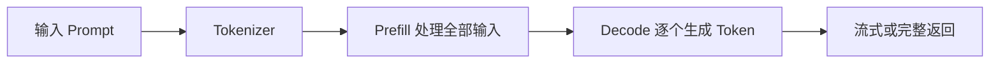

# 大模型推理到底发生了什么

:::info 系列与定位
**系列**：《NVIDIA＋昇腾双资源池 AI 推理集群：从 0 到部署、运维与故障排查》
**阶段**：第一阶段——小白基础
**本文定位**：推理原理入门篇
:::

:::tip 系列约定
资源池 A = **NVIDIA GPU**（vLLM）· 资源池 B = **华为昇腾 NPU**（vLLM-Ascend）· 同一 Kubernetes · 共享存储/网关/监控 · **禁止**跨池组成同一分布式模型实例。
:::

部署模型之前，至少要理解模型收到请求后在做什么。否则遇到显存不足、首字慢、生成慢、并发低或者 HTTP 504 时，很容易只会反复重启服务。

本文不推导复杂数学公式，而是从运维和部署的角度，解释一次大模型推理请求的完整过程。

读完以后，你应该能够回答：

1. Prompt 为什么需要转换成 Token？
2. Prefill 和 Decode 有什么区别？
3. KV Cache 为什么会随并发和上下文增长？
4. TTFT、TPOT、吞吐量分别代表什么？

## 1. 模型接收到的不是一句话，而是一组 Token {/* #一模型接收到的不是一句话而是一组-token */}

用户可能发送下面的内容：

> 请解释一下 Kubernetes 中的 Pod 是什么。

模型并不是直接以汉字、单词或句子为单位进行计算。推理框架会先通过 Tokenizer，把文本转换成模型能够处理的一组 Token ID。

可以把它理解成：

```text
用户文本
  ↓ Tokenizer
Token 序列
  ↓ 模型计算
下一个 Token 的概率
  ↓ 采样
输出 Token
  ↓ 反分词
返回文本
```

Token 不完全等于汉字，也不完全等于英文单词。不同模型使用不同 Tokenizer，同一句话在不同模型中可能得到不同数量的 Token。

这带来三个运维影响：

- Prompt 越长，输入 Token 越多
- 输出越长，Decode 执行次数越多
- 计费、限流、容量规划通常都与 Token 有关

## 2. 一次推理分成 Prefill 和 Decode 两个阶段 {/* #二一次推理分成-prefill-和-decode-两个阶段 */}

大模型生成回答时，最重要的两个阶段是 Prefill 和 Decode。



### 2.1 Prefill 阶段 {/* #1-prefill-阶段 */}

Prefill 负责一次性处理用户输入的全部 Token。

例如用户输入很长的文档、历史对话或检索结果，模型需要先理解这些内容，才能开始生成答案。

Prefill 具有以下特点：

- 输入 Token 可以并行计算
- 通常更依赖计算吞吐
- Prompt 越长，Prefill 时间通常越长
- 会为后续生成建立 KV Cache
- Prefill 完成之前，用户通常看不到第一个输出 Token

因此，用户感受到的「点发送以后等了很久才出现第一个字」，主要与 Prefill、排队和调度有关。

### 2.2 Decode 阶段 {/* #2-decode-阶段 */}

Decode 负责逐步生成输出 Token。

模型每生成一个 Token，都要基于：

- 用户输入
- 已经生成的 Token
- KV Cache
- 采样参数

预测下一个 Token，然后重复这个过程，直到满足停止条件。

Decode 具有以下特点：

- 通常一次生成一个 Token
- 前后步骤存在依赖
- 输出越长，Decode 执行次数越多
- 用户看到的「打字速度」主要受 Decode 影响
- 高并发时，多个请求需要共享加速器计算能力

## 3. 什么是 KV Cache {/* #三什么是-kv-cache */}

如果每生成一个新 Token，都重新计算整个历史上下文，推理速度会非常慢。

KV Cache 会保存注意力计算中可以复用的中间结果，使模型生成下一个 Token 时不必从头计算全部上下文。

可以把它类比为会议记录：

- **没有 KV Cache**：每说一句话前，都重新回放整场会议
- **使用 KV Cache**：保留已经整理好的记录，只处理新增加的内容

KV Cache 提高了生成速度，但会占用显存或 HBM，而且其占用会受到以下因素影响：

- 模型层数
- 隐藏维度
- KV Head 数量
- 数据精度
- 上下文长度
- 并发请求数量

因此，同一个模型可能出现下面的情况：

```text
模型权重能够加载成功
但并发一升高就显存不足
```

原因通常不是权重突然变大，而是更多并发请求和更长上下文消耗了更多 KV Cache。

## 4. 显存 / HBM 到底被谁占用了 {/* #四显存--hbm-到底被谁占用了 */}

模型服务运行时，加速器内存大致包含四部分：

```text
总占用 ≈ 模型权重 + KV Cache + 运行时工作空间 + 其他开销
```

### 4.1 模型权重 {/* #1-模型权重 */}

模型参数本身需要占用空间。相同参数量使用不同精度时，占用不同：

- FP32 占用较大
- FP16 / BF16 通常约为 FP32 的一半
- INT8 进一步降低
- INT4 可以继续降低，但要考虑硬件、模型和推理框架是否支持

这里只能用于初步估算，实际部署还需要考虑量化格式、分片方式和框架额外开销。

### 4.2 KV Cache {/* #2-kv-cache */}

它随上下文长度和并发增长，是在线推理容量规划的核心。

### 4.3 运行时工作空间 {/* #3-运行时工作空间 */}

包括算子执行、通信缓冲、图优化和临时张量使用的空间。

### 4.4 其他开销 {/* #4-其他开销 */}

包括框架进程、设备上下文、内存碎片和后端保留空间。

:::caution 常见误判
不能用「模型文件大小小于显存容量」直接判断模型一定能够运行。
:::

## 5. vLLM 在其中做了什么 {/* #五vllm-在其中做了什么 */}

vLLM 不是模型本身，而是模型推理和服务框架。它主要负责：

- 加载模型
- 管理设备内存
- 管理 KV Cache
- 对请求排队
- 把多个请求组合成批次
- 调度 Prefill 和 Decode
- 提供 OpenAI 兼容接口
- 输出运行指标

传统静态批处理要求同一批请求以相同步骤执行。在线请求的输入和输出长度不同，如果某些请求先结束，固定批次容易浪费计算资源。

推理服务会通过持续批处理等方式动态接收新请求、移除已完成请求，提高加速器利用率。对运维人员来说，这意味着：

- Pod 正在运行不代表没有排队
- GPU/NPU 利用率高不一定代表服务异常
- 提高批处理可能增加吞吐，但也可能增加单请求等待
- 参数调优必须在吞吐、延迟和显存之间平衡

## 6. 理解四个最重要的性能指标 {/* #六理解四个最重要的性能指标 */}

### 6.1 TTFT：首 Token 延迟 {/* #1-ttft首-token-延迟 */}

从用户发送请求，到收到第一个输出 Token 的时间。

它受到以下因素影响：

- 网关和网络耗时
- 请求排队
- Prompt 长度
- Prefill 性能
- 当前并发量
- 模型是否已经预热

### 6.2 TPOT：单个输出 Token 耗时 {/* #2-tpot单个输出-token-耗时 */}

模型进入 Decode 后，平均生成一个 Token 需要多长时间。

TPOT 越低，用户看到的流式输出通常越快。

### 6.3 吞吐量 {/* #3-吞吐量 */}

单位时间内系统处理的请求数或 Token 数，例如：

```text
requests/s
input tokens/s
output tokens/s
total tokens/s
```

吞吐高并不等于单个用户延迟低。系统可能通过更大的批次提高总体吞吐，但让部分请求等待更久。

### 6.4 并发量 {/* #4-并发量 */}

同一时间正在处理或等待处理的请求数量。

并发上升可能带来：

- KV Cache 占用增加
- 排队时间增加
- TTFT 上升
- 单请求生成速度下降
- 超时请求增多

## 7. 为什么模型接口会出现 504 {/* #七为什么模型接口会出现-504 */}

HTTP 504 通常表示网关等待上游服务超时。模型场景中常见链路是：

```text
用户 → 网关 → Kubernetes Service → 模型 Pod
```

可能原因包括：

- Prompt 过长导致 Prefill 时间过长
- 并发太高，请求长时间排队
- 模型 Pod 刚启动，尚未加载完成
- 网关超时时间小于模型实际处理时间
- GPU/NPU 利用率或 KV Cache 已经饱和
- 模型 Pod 发生 OOM 或进程异常
- 节点网络或存储抖动
- Service 仍把请求发送给未真正就绪的 Pod

因此不能看到 504 就直接认定是网关故障。正确方法是把网关日志、Pod 日志、推理指标和设备指标放在同一时间线上分析。

## 8. 流式输出为什么能改善体验 {/* #八流式输出为什么能改善体验 */}

非流式响应需要等整个回答生成完成后一次性返回：

```text
请求 → 等待完整生成 → 返回完整回答
```

流式响应在生成 Token 时持续返回：

```text
请求 → 首 Token → Token → Token → 完成
```

流式输出不会让模型计算凭空变快，但用户可以更早看到结果，因此更关注 TTFT 和连续生成速度。

运维时需要同时关注：

- 网关是否支持长连接和流式转发
- 代理缓冲是否影响实时返回
- 客户端是否主动断开
- 流式请求是否占用过多连接
- 超时策略是否适合长回答

## 9. 部署参数之间的关系 {/* #九部署参数之间的关系 */}

后面部署 vLLM 时会看到许多参数，现在先建立关系：

| 参数方向 | 调大后的常见影响 |
|----------|------------------|
| 最大上下文 | 支持更长输入，但 KV Cache 压力增加 |
| 最大并发 | 吞吐潜力增加，但显存和排队压力增加 |
| GPU/HBM 利用率上限 | 可分配更多缓存，但剩余安全空间减少 |
| Tensor Parallel 数量 | 权重分到更多卡，但增加卡间通信 |
| Pipeline Parallel 数量 | 支持跨阶段切分，但调度和通信更复杂 |
| 量化 | 降低内存占用，但需验证兼容性和精度 |

没有一个参数组合适合所有业务。在线聊天、批量摘要、长文档问答和代码生成的输入输出特征都不同，必须用真实流量或接近真实的压测数据调优。

## 10. 本篇练习 {/* #十本篇练习 */}

### 10.1 练习 1：拆解一次请求 {/* #练习-1拆解一次请求 */}

选择一个模型调用记录，写下：

- 输入 Token 数
- 输出 Token 数
- 首 Token 时间
- 总耗时
- 是否流式返回
- 是否发生排队

### 10.2 练习 2：分析两个场景 {/* #练习-2分析两个场景 */}

思考下面两个请求谁更依赖 Prefill、谁更依赖 Decode：

1. 输入一万字文档，只要求输出 100 字摘要
2. 输入一句简短问题，要求生成一篇很长的文章

第一个场景通常更强调长 Prompt 的 Prefill；第二个场景需要执行更多 Decode 步骤。

### 10.3 练习 3：解释显存不足 {/* #练习-3解释显存不足 */}

尝试解释为什么模型启动成功后，并发增加仍可能 OOM。答案应至少包含「KV Cache、上下文长度、并发量」三个关键词。

## 11. 本篇小结 {/* #十一本篇小结 */}

一次大模型推理可以概括为：

```text
文本 → Token → Prefill → KV Cache → Decode → 输出
```

部署和运维时要记住：

1. Prefill 影响首 Token 出现之前的等待时间。
2. Decode 影响流式生成速度和长回答耗时。
3. KV Cache 会随上下文和并发增长。
4. 模型权重能加载，不代表高并发时一定不会 OOM。
5. 性能优化必须同时观察 TTFT、TPOT、吞吐、并发和内存占用。

## 12. 相关链接 {/* #相关链接 */}

- [专栏目录](./00-专栏目录.md)
- 上一篇：[一张图看懂 NVIDIA＋昇腾双资源池 AI 推理集群](./01-一张图看懂AI算力集群全貌.md)
- 显存组成深化（可选）：[vLLM GPU 显存组成与容量规划](../../ai-systems/inference/serving/02-vLLM%20GPU%20显存组成与容量规划.md)
- 推理指标深化（可选）：[大模型推理服务性能指标设计](../../ai-systems/inference/serving/06-大模型推理服务性能指标设计.md)

← [第 1 篇](./01-一张图看懂AI算力集群全貌.md) · → [第 3 篇：GPU/NPU、显存/HBM、CUDA/CANN是什么](./03-GPU与NPU显存与HBM及CUDA与CANN.md)
