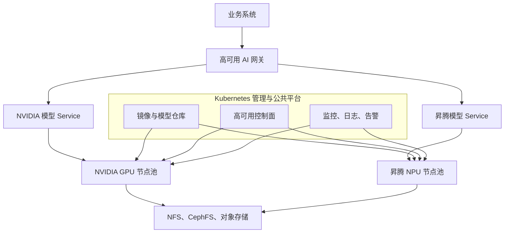

# NVIDIA＋昇腾双资源池总体架构设计

:::info 系列与定位
**系列**：《NVIDIA＋昇腾双资源池 AI 推理集群：从 0 到部署、运维与故障排查》
**阶段**：第二阶段——双资源池架构设计
**本文定位**：核心架构篇
:::

:::tip 系列约定
资源池 A = **NVIDIA GPU**（vLLM）· 资源池 B = **华为昇腾 NPU**（vLLM-Ascend）· 同一 Kubernetes · 共享存储/网关/监控 · **禁止**跨池组成同一分布式模型实例。
:::

上一篇解决了「为什么建设双资源池」，本文开始回答「具体要建设成什么样」。

一套生产架构不能只画两组服务器，还要同时描述：控制面如何部署；两类计算节点如何隔离；模型和镜像如何分发；请求如何进入模型；网络和存储如何规划；监控如何统一；哪些故障会影响整个集群；一个资源池异常时如何降级。

## 1. 总体设计原则 {/* #一总体设计原则 */}

**原则 1：统一控制面，分离计算栈**
Kubernetes、权限、网关、存储和监控尽量统一；NVIDIA 与昇腾的驱动、运行时、镜像和通信栈分别维护。

**原则 2：单个模型实例不跨资源池**
NVIDIA 模型副本只使用 NVIDIA 设备，昇腾模型副本只使用昇腾设备。跨池能力通过网关路由多个独立服务实现。

**原则 3：故障域要可识别**
每个节点都要标识机房、机柜、资源池、硬件型号和 CPU 架构。副本需要分散，不能全部落在同一台服务器或同一故障域。

**原则 4：先兼容，再统一**
不要为了统一版本强行使用未经厂商或实际测试验证的组合。CNI、CSI、监控 Agent 和安全 Agent 都要验证 x86_64 与 aarch64 支持情况。

**原则 5：架构必须可以验收**
每一层都需要明确检查项、性能基线和故障演练，不能以「Pod 已经 Running」作为唯一上线标准。

## 2. 推荐的总体架构 {/* #二推荐的总体架构 */}



这套架构可以分成五个平面：

1. 管理控制平面
2. 计算资源平面
3. 模型与存储平面
4. 服务访问平面
5. 可观测与运维平面

## 3. 管理控制平面 {/* #三管理控制平面 */}

管理控制平面主要包括：

- Kubernetes API Server
- etcd
- Scheduler
- Controller Manager
- 集群证书
- RBAC
- 准入控制与策略
- 集群管理入口

生产环境通常采用多个控制节点，并通过负载均衡或高可用地址访问 API Server。

### 3.1 为什么不建议把控制面放在加速器节点 {/* #为什么不建议把控制面放在加速器节点 */}

加速器节点可能因为驱动/固件升级、CANN 或 CUDA 变更、GPU/NPU 故障、大模型 OOM、多卡通信故障、硬件更换等原因重启或维护。

如果控制面和计算节点绑定，维护加速器可能同时影响集群管理能力。实验环境可以合并角色，但生产环境建议分离。

### 3.2 控制面高可用不等于整个系统高可用 {/* #控制面高可用不等于整个系统高可用 */}

控制面正常，只能说明 Kubernetes 还能管理集群。模型服务是否高可用，还取决于：模型是否有多个副本、副本是否分布在不同节点、存储是否高可用、网关是否高可用、备用资源池是否有容量、模型是否已经预热。

## 4. 计算资源平面 {/* #四计算资源平面 */}

### 4.1 NVIDIA 资源池 {/* #nvidia-资源池 */}

NVIDIA 节点内部主要运行：

```text
NVIDIA 驱动
NVIDIA Container Toolkit
NVIDIA Device Plugin 或 GPU Operator
PyTorch CUDA
vLLM 模型 Pod
DCGM Exporter
```

### 4.2 昇腾资源池 {/* #昇腾资源池 */}

昇腾节点内部主要运行：

```text
昇腾驱动和固件
CANN
昇腾容器运行环境
Ascend Device Plugin
torch_npu
vLLM-Ascend 模型 Pod
Ascend 监控组件
```

### 4.3 节点标签建议 {/* #节点标签建议 */}

标签应描述事实，避免使用含糊名称：

```text
accelerator.vendor=nvidia|ascend
accelerator.model=<实际型号>
accelerator.memory=<容量等级>
resource-pool=nvidia-pool|ascend-pool
kubernetes.io/arch=amd64|arm64
network.rdma=true|false
topology.kubernetes.io/zone=<故障域>
```

标签值应由资产清单和自动化检查生成，避免完全依赖人工填写。

### 4.4 污点建议 {/* #污点建议 */}

加速器节点可以设置资源池污点，防止普通业务 Pod 占用昂贵节点。只有声明相应 Toleration 并申请设备的模型工作负载才能进入。

## 5. 模型与存储平面 {/* #五模型与存储平面 */}

模型服务至少涉及三类制品：

### 5.1 容器镜像 {/* #1-容器镜像 */}

- `vllm-nvidia` 镜像
- `vllm-ascend` 镜像
- 网关镜像
- 监控与运维镜像

如果两类节点 CPU 架构不同，还要考虑 amd64 与 arm64 镜像。

### 5.2 模型权重和配置 {/* #2-模型权重和配置 */}

- 原始模型权重、Tokenizer、模型配置
- 量化文件、后端转换产物
- 版本清单与校验和

### 5.3 运行时缓存 {/* #3-运行时缓存 */}

- 节点本地模型缓存、编译缓存、算子缓存
- 临时下载目录、日志目录

推荐形成分层存储：

```text
对象存储或模型仓库：保存模型源文件和版本
共享文件存储：向多个 Pod 提供模型目录
节点本地 NVMe：保存热点模型缓存
设备显存/HBM：保存运行中的权重和 KV Cache
```

### 5.4 存储必须回答的问题 {/* #存储必须回答的问题 */}

- 是否需要多节点同时只读挂载
- 模型启动时需要多大吞吐
- 存储不可用时已运行模型是否继续服务
- 新 Pod 启动是否依赖共享存储
- 模型文件如何做校验
- 缓存如何淘汰
- 备份和恢复目标是什么

## 6. 服务访问平面 {/* #六服务访问平面 */}

服务访问平面负责把两类模型后端封装为统一入口。

推荐链路：

```text
业务系统
→ DNS/负载均衡
→ Higress 或 Nginx AI 网关
→ Kubernetes Service
→ vLLM 或 vLLM-Ascend Pod
```

网关至少承担：TLS 终止、API Key 认证、用户与租户识别、模型名称路由、限流和并发保护、超时和连接管理、请求日志、Trace ID、灰度和权重分流、后端健康检查、双池故障切换。

:::caution 为什么不能让业务直接访问 Pod
Pod IP 会变化；无法统一鉴权与限流；难以切换资源池；无法统一记录 Token 与请求日志；模型版本变化会影响业务地址。业务只应该依赖稳定的网关域名和模型标识。
:::

## 7. 可观测与运维平面 {/* #七可观测与运维平面 */}

统一监控不意味着只安装一套 Exporter，而是把不同来源的指标映射到同一观察体系。

| 层次 | 内容 |
|------|------|
| 公共层 | 主机 CPU/内存/磁盘/网络；K8s 节点与 Pod；CNI/CSI/DNS；网关与证书；NFS/Ceph/对象存储 |
| NVIDIA 层 | GPU 利用率、显存、温度功耗、Xid/ECC、NVLink、NCCL 相关故障 |
| 昇腾层 | NPU 利用率、HBM、温度功耗、设备健康、HCCL 相关故障 |
| 模型服务层 | QPS、TTFT、TPOT、Token 吞吐、并发与排队、KV Cache、错误率、模型加载时间 |

最终要实现从一条业务错误追踪到网关、Pod、节点和设备。

## 8. 网络应该怎样划分 {/* #八网络应该怎样划分 */}

| 网络 | 主要用途 |
|------|----------|
| 带外管理网 | BMC、远程开关机和硬件管理 |
| 节点管理网 | SSH、Kubernetes 管理、镜像拉取 |
| Pod/Service 网络 | Kubernetes 业务通信 |
| 存储网络 | NFS、Ceph、对象存储访问 |
| 高速计算网络 | NCCL/HCCL 多机通信、RDMA/RoCE |
| 业务访问网 | 网关对业务系统提供接口 |

小规模环境可能复用网卡和交换网络，但逻辑用途、带宽预算和故障影响仍应明确。

高速通信网络不能只看带宽，还要关注：MTU 一致性、RoCE 配置、PFC/ECN 等无损能力、网卡与加速器 NUMA 关系、路由和 VLAN、丢包拥塞时延、NCCL/HCCL 是否选择预期网卡。

## 9. 两条关键业务链路 {/* #九两条关键业务链路 */}

### 9.1 模型发布链路 {/* #模型发布链路 */}

```text
模型源文件
→ 安全与完整性检查
→ 模型仓库
→ 构建 NVIDIA/昇腾镜像与部署清单
→ 测试环境部署
→ 功能和性能验证
→ 生产灰度
→ 网关放量
→ 监控与回滚
```

### 9.2 在线请求链路 {/* #在线请求链路 */}

```text
用户请求
→ 网关鉴权和路由
→ Service 选择健康 Pod
→ 推理框架排队与批处理
→ GPU/NPU 执行
→ 流式返回
→ 日志、指标和 Trace 记录
```

架构评审时应分别检查这两条链路，不能只关注在线请求而忽略模型如何安全发布。

## 10. 高可用与故障域设计 {/* #十高可用与故障域设计 */}

| 平面 | 要点 |
|------|------|
| 控制面 | 多控制节点；etcd 备份；API 高可用入口；证书和恢复手册 |
| 网关 | 多副本；分散节点；外部负载均衡；配置备份与快速回滚 |
| 模型服务 | 多副本；Pod 反亲和；合理 PDB；就绪探针；模型预热；故障后容量 |
| 存储 | 服务端高可用；数据副本或备份；存储网络冗余；模型校验；缓存失效后重下 |
| 双资源池 | 同模型双边适配；接口能力验证；备用容量；网关切流；定期切换演练 |

## 11. 一个建议的逻辑命名规范 {/* #十一一个建议的逻辑命名规范 */}

示例：

```text
集群：ai-inference-prod
Namespace：ai-prod、ai-test、monitoring、gateway-system
资源池：nvidia-pool、ascend-pool
模型服务：qwen-nvidia、qwen-ascend
模型 Service：qwen-nvidia-svc、qwen-ascend-svc
存储 PVC：qwen-model-ro
网关模型名：qwen-service
```

命名需要体现环境、模型、资源池和用途，同时不要把容易变化的 IP 或具体节点名写进业务接口。

## 12. 架构设计最终应该产出什么 {/* #十二架构设计最终应该产出什么 */}

完成本篇设计后，不应只有一张拓扑图，还应该有：

- 系统总体架构图
- 节点角色表
- 资源池划分表
- 网络和 IP 规划
- 存储选型与容量
- 模型与镜像仓库规范
- Kubernetes 命名与标签规范
- 请求链路和发布链路
- 监控指标分层
- 高可用和故障域说明
- 权限与责任边界
- 上线验收清单
- 容灾切换方案

## 13. 本篇练习 {/* #十三本篇练习 */}

### 13.1 练习 1：画真实架构图 {/* #练习-1画真实架构图 */}

根据现有服务器数量画出控制面、普通节点、NVIDIA 节点、昇腾节点、存储、网关和监控。

### 13.2 练习 2：画两条链路 {/* #练习-2画两条链路 */}

分别画出模型发布链路和在线请求链路，并标记每一步的责任团队。

### 13.3 练习 3：模拟故障 {/* #练习-3模拟故障 */}

选择下面任意一种故障，判断影响范围：

- 一台 NVIDIA 节点宕机
- Ascend Device Plugin 异常
- NFS 无法访问
- 网关配置错误
- Kubernetes 控制面不可用
- NVIDIA 资源池整体维护

## 14. 本篇小结 {/* #十四本篇小结 */}

双资源池生产架构的核心不是把两类设备放在一起，而是形成清晰的分层和边界：

```text
统一控制面
+ 独立计算栈
+ 分层模型存储
+ 统一服务入口
+ 统一可观测平台
+ 可演练的故障切换
```

下一篇将开始收集真实服务器信息，建立 CPU、内存、GPU/NPU、拓扑、网卡、磁盘和 CPU 架构资产清单。没有准确资产数据，后面的兼容矩阵和容量规划都无法可靠完成。

## 15. 相关链接 {/* #相关链接 */}

- [专栏目录](./00-专栏目录.md)
- [第 5 篇：为什么要划分双算力池](./05-为什么一个集群要划分两个算力资源池.md)
- GPU 侧架构对照：[生产级 Kubernetes GPU 集群架构设计](../production-gpu-cluster/01-生产级%20Kubernetes%20GPU%20集群架构设计.md)

← [第 5 篇](./05-为什么一个集群要划分两个算力资源池.md) · → [第 7 篇：服务器与加速器资产盘点](./07-服务器与加速器资产盘点.md)
