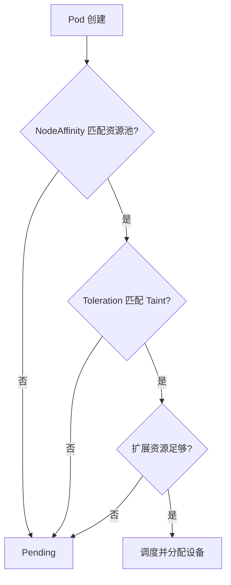

# 使用Label、Taint和Affinity隔离两个算力池

:::info 系列与定位
**系列**：《NVIDIA＋昇腾双资源池 AI 推理集群：从 0 到部署、运维与故障排查》  
**阶段**：第四阶段——统一调度  
**本文定位**：双资源池调度边界与基础隔离篇
:::

:::tip 系列约定
资源池 A = **NVIDIA GPU**（vLLM）· 资源池 B = **华为昇腾 NPU**（vLLM-Ascend）· 同一 Kubernetes · 共享存储/网关/监控 · **禁止**跨池组成同一分布式模型实例。
:::

第 11、12 篇已经让 Kubernetes 识别了 GPU 和 NPU，但「节点上有设备」不等于「业务一定会去正确的资源池」。

本篇解决三个问题：

1. 如何标记 NVIDIA 节点和昇腾节点  
2. 如何阻止普通 Pod 误占加速器节点  
3. 如何让模型 Pod 既能进入目标资源池，又不能进入另一资源池  

最终采用三层约束：

```text
Label / NodeAffinity：把 Pod 吸引到正确资源池
Taint / Toleration：阻止无关 Pod 进入加速器节点
扩展资源申请：真正申请 GPU 或 NPU 设备
```

三层必须同时存在。只做其中一层，都不能形成完整隔离。

本站对照：[GPU 节点标签与调度](../../gpu/cluster/scheduling/01-Kubernetes%20GPU%20节点标签与调度策略.md) · [Taint 与 Toleration](../../gpu/cluster/scheduling/02-GPU%20节点%20Taint%20与%20Toleration%20实践.md)。

---

## 一、先理解四个容易混淆的概念

| 概念 | 配置位置 | 解决的问题 | 是否会分配设备 |
|------|----------|------------|----------------|
| Label | Node 等对象 | 给对象添加可查询的身份信息 | 否 |
| nodeSelector / NodeAffinity | Pod | 指定 Pod 可以或倾向去哪些节点 | 否 |
| Taint | Node | 拒绝不具备相应 Toleration 的 Pod | 否 |
| Toleration | Pod | 允许 Pod 通过某个 Taint 检查 | 否 |
| 扩展资源 | Container resources | 申请实际 GPU/NPU 资源 | 是 |

最重要的一句话：

:::caution
**Toleration 只是「允许进入」，不是「必须进入」；Label 只是「标识」，不是安全边界。**
:::

官方文档：[Assigning Pods to Nodes](https://kubernetes.io/docs/concepts/scheduling-eviction/assign-pod-node/) · [Taints and Tolerations](https://kubernetes.io/docs/concepts/scheduling-eviction/taint-and-toleration/)。

---

## 二、设计统一的节点标签规范

本系列约定以下基础标签：

| Label | NVIDIA 节点 | 昇腾节点 | 用途 |
|-------|-------------|----------|------|
| `accelerator.vendor` | nvidia | ascend | 标识加速器厂商 |
| `resource-pool` | nvidia-pool | ascend-pool | 标识逻辑资源池 |
| `workload-type` | ai-inference | ai-inference | 标识主要工作负载 |
| `accelerator.mode` | full/mig/shared | full/vnpu/soft-share | 标识设备分配模式 |
| `environment` | prod/test | prod/test | 标识环境 |

还可以增加经过治理的资产标签：

```text
accelerator.model=<规范化型号>
accelerator.memory=<容量分组>
network.fabric=roce
storage.cache=nvme
```

不要随意把型号原文直接写进业务 YAML。更稳妥的做法是：设备插件保留厂商自动生成的原始标签；平台维护少量、稳定的业务标签；业务优先引用平台标签；只有确实依赖某型号时才引用厂商标签。

**标签命名原则**：键值全部小写并统一格式；一个含义只保留一个权威标签；不把会频繁变化的数据放进 Label；不把密码、序列号等敏感信息放进 Label；标签变更必须有审批和审计；自动发现标签与人工业务标签分开管理。

---

## 三、给两个资源池添加标签

假设节点如下：`gpu-node-01`、`gpu-node-02`、`npu-node-01`、`npu-node-02`。

```bash
kubectl label node gpu-node-01 \
  accelerator.vendor=nvidia \
  resource-pool=nvidia-pool \
  workload-type=ai-inference \
  accelerator.mode=full

kubectl label node gpu-node-02 \
  accelerator.vendor=nvidia \
  resource-pool=nvidia-pool \
  workload-type=ai-inference \
  accelerator.mode=full

kubectl label node npu-node-01 \
  accelerator.vendor=ascend \
  resource-pool=ascend-pool \
  workload-type=ai-inference \
  accelerator.mode=full

kubectl label node npu-node-02 \
  accelerator.vendor=ascend \
  resource-pool=ascend-pool \
  workload-type=ai-inference \
  accelerator.mode=full

kubectl get nodes \
  -L accelerator.vendor,resource-pool,workload-type,accelerator.mode
```

修改已有标签时需要明确使用 `--overwrite`：

```bash
kubectl label node gpu-node-01 accelerator.mode=mig --overwrite
```

生产环境不要用一条模糊的批量命令修改全部节点。先导出目标列表并人工确认：

```bash
kubectl get nodes -l accelerator.vendor=nvidia -o name
```

---

## 四、给两个资源池添加 Taint

本系列使用同一个 Taint 键、不同的值：

```text
accelerator=nvidia:NoSchedule
accelerator=ascend:NoSchedule
```

```bash
kubectl taint node gpu-node-01 accelerator=nvidia:NoSchedule
kubectl taint node gpu-node-02 accelerator=nvidia:NoSchedule
kubectl taint node npu-node-01 accelerator=ascend:NoSchedule
kubectl taint node npu-node-02 accelerator=ascend:NoSchedule

kubectl get nodes \
  -o custom-columns='NAME:.metadata.name,TAINTS:.spec.taints'
```

删除 Taint 的语法是在末尾加减号：

```bash
kubectl taint node gpu-node-01 accelerator=nvidia:NoSchedule-
```

| Effect | 对新 Pod | 对已运行 Pod | 适合场景 |
|--------|----------|--------------|----------|
| NoSchedule | 不再调度不容忍的 Pod | 不主动驱逐 | 资源池长期隔离，推荐基线 |
| PreferNoSchedule | 尽量不调度 | 不驱逐 | 软隔离，不能作为严格边界 |
| NoExecute | 不调度 | 可能驱逐不容忍的 Pod | 节点故障、维护等特殊场景 |

双资源池的长期隔离优先使用 **NoSchedule**。不要第一次实施就使用 NoExecute，否则可能把已有 Pod 立即驱逐。

---

## 五、为什么 Label 和 Taint 必须同时使用

**只有 Label，没有 Taint**  
模型 Pod 可以通过 nodeSelector 进入正确节点，但没有节点约束的普通 Pod 也可能落到加速器节点，浪费 CPU、内存、本地盘和网络。

**只有 Taint 和 Toleration**  
一个 Pod 如果同时容忍两个资源池的 Taint，却没有 NodeAffinity，它可能进入任意被容忍的节点。

**只有设备资源申请**  
请求 `nvidia.com/gpu` 通常会把 Pod 限制到上报该资源的节点，但没有显式资源池语义：无法区分生产池和测试池、整卡池和共享池，也无法表达特定网络或本地缓存要求；普通 Pod 仍可能进入加速器节点。

因此推荐结构是：



---

## 六、NVIDIA 模型 Pod 的完整约束示例

下面只展示调度骨架，镜像和启动参数在第 22、25 篇完善：

```yaml
apiVersion: v1
kind: Pod
metadata:
  name: nvidia-inference-demo
  namespace: ai-prod
spec:
  tolerations:
    - key: accelerator
      operator: Equal
      value: nvidia
      effect: NoSchedule
  affinity:
    nodeAffinity:
      requiredDuringSchedulingIgnoredDuringExecution:
        nodeSelectorTerms:
          - matchExpressions:
              - key: accelerator.vendor
                operator: In
                values: ["nvidia"]
              - key: resource-pool
                operator: In
                values: ["nvidia-pool"]
              - key: accelerator.mode
                operator: In
                values: ["full"]
  containers:
    - name: inference
      image: <内部NVIDIA推理镜像>
      resources:
        requests:
          cpu: "8"
          memory: 32Gi
          nvidia.com/gpu: "1"
        limits:
          cpu: "16"
          memory: 64Gi
          nvidia.com/gpu: "1"
```

这里同时完成：容忍 NVIDIA 节点 Taint；强制选择 NVIDIA 整卡资源池；申请一张 GPU；声明 CPU 和内存需求。

---

## 七、昇腾模型 Pod 的完整约束示例

昇腾资源键必须从目标节点 Allocatable 读取，不能照抄别人的型号：

```bash
kubectl get node npu-node-01 \
  -o jsonpath='{.status.allocatable}' | jq
```

```yaml
apiVersion: v1
kind: Pod
metadata:
  name: ascend-inference-demo
  namespace: ai-prod
spec:
  tolerations:
    - key: accelerator
      operator: Equal
      value: ascend
      effect: NoSchedule
  affinity:
    nodeAffinity:
      requiredDuringSchedulingIgnoredDuringExecution:
        nodeSelectorTerms:
          - matchExpressions:
              - key: accelerator.vendor
                operator: In
                values: ["ascend"]
              - key: resource-pool
                operator: In
                values: ["ascend-pool"]
              - key: accelerator.mode
                operator: In
                values: ["full"]
  containers:
    - name: inference
      image: <内部昇腾推理镜像>
      resources:
        requests:
          cpu: "8"
          memory: 32Gi
          <实际NPU资源键>: "1"
        limits:
          cpu: "16"
          memory: 64Gi
          <实际NPU资源键>: "1"
```

NVIDIA 镜像不能仅通过更换资源键就运行在昇腾节点；昇腾镜像也不能直接运行在 NVIDIA 节点。两套镜像、运行时和启动参数必须独立维护。

---

## 八、required 和 preferred 应该怎么选

**requiredDuringSchedulingIgnoredDuringExecution**  
硬约束：条件不满足，Pod 保持 Pending。双资源池的厂商、资源池和设备模式应使用 required。

**preferredDuringSchedulingIgnoredDuringExecution**  
软偏好：尽量满足，无法满足时仍可选择其他合格节点。适合表达：优先使用带 NVMe 缓存的节点；优先选择某个可用区；优先把同模型副本分散到不同机架；优先使用成本较低的节点。

不要用 preferred 表达「NVIDIA 与昇腾不能混用」这种硬边界。

**IgnoredDuringExecution 是什么意思**  
Pod 调度完成后，如果节点 Label 被修改，现有 Pod 通常不会因此自动迁移或驱逐。新规则主要影响后续调度。

```bash
kubectl get pods -A -o wide --field-selector spec.nodeName=<节点名>
```

必要时由运维人员按维护流程重建工作负载。

---

## 九、系统 DaemonSet 如何进入加速器节点

日志、监控、网络、存储以及设备插件 DaemonSet 通常需要进入加速器节点。

```yaml
tolerations:
  - key: accelerator
    operator: Equal
    value: nvidia
    effect: NoSchedule
```

如果同一个 DaemonSet 需要覆盖两池，可以列出两条：

```yaml
tolerations:
  - key: accelerator
    operator: Equal
    value: nvidia
    effect: NoSchedule
  - key: accelerator
    operator: Equal
    value: ascend
    effect: NoSchedule
```

谨慎使用 `operator: Exists` 这种过宽容忍——它可能让 Pod 容忍几乎所有 Taint。

| 组件 | 应进入的节点 |
|------|--------------|
| NVIDIA Device Plugin / GPU Operator Operand | NVIDIA 池 |
| DCGM Exporter | NVIDIA 池 |
| Ascend Device Plugin | 昇腾池 |
| NPU Exporter | 昇腾池 |
| CNI、CSI、节点日志代理 | 按平台设计覆盖需要的节点 |

每个 DaemonSet 都要同时检查 nodeSelector/affinity 和 tolerations。

---

## 十、不要使用 nodeName 固定生产 Pod

```yaml
spec:
  nodeName: gpu-node-01
```

问题包括：节点故障后无法自动选择其他节点；忽略资源池抽象；扩容后仍然绑定旧节点；容易把测试配置带入生产；不利于拓扑、负载和资源综合调度。

生产工作负载应该描述「我需要什么节点」，而不是「我必须去某台机器」。

---

## 十一、Namespace 不能替代节点隔离

Namespace 用于隔离 API 对象、RBAC 和 Quota，本身不会自动把 Pod 限制到某组节点。

例如 `ai-prod-nvidia`、`ai-prod-ascend`、`ai-batch`、`ai-dev` 仍需要在 Pod 模板中配置 Affinity、Toleration 和资源申请。

后续可以使用 ValidatingAdmissionPolicy、Kyverno、OPA Gatekeeper、自定义 Admission Webhook、平台侧固定 Deployment 模板等强制注入或校验规则。

入门阶段先把规则写清楚，再逐步自动化，避免一开始就把排错链路藏进大量策略控制器。

---

## 十二、正确的上线顺序

1. **盘点现有 Pod**：`kubectl get pods -A -o wide`，确认哪些系统组件必须运行在加速器节点  
2. **先加 Label**：添加后验证查询结果，不影响已有 Pod  
3. **修改工作负载模板**：先给 GPU/NPU 业务和必要 DaemonSet 添加 Affinity 与 Toleration  
4. **在一台测试节点添加 NoSchedule Taint**：观察设备插件、监控、日志、CSI、新模型 Pod、普通 Pod  
5. **逐台推广**：不要一次性污染全部加速器节点  

---

## 十三、必须进行的正向和反向测试

| 测试 | 预期结果 |
|------|----------|
| NVIDIA Pod 申请 GPU 并带完整规则 | 进入 NVIDIA 池并运行 |
| 昇腾 Pod 申请 NPU 并带完整规则 | 进入昇腾池并运行 |
| 普通 Pod 无 Toleration | 不进入两个加速器池 |
| NVIDIA Pod 去掉 Toleration | 因 Taint 保持 Pending |
| NVIDIA Pod 把 Affinity 改为昇腾池 | 因资源/约束不匹配而 Pending |
| 昇腾 Pod 申请不存在的资源键 | 因资源不足保持 Pending |
| 必要 DaemonSet | 两池目标节点均正常运行 |

```bash
kubectl describe pod <POD> -n <NAMESPACE>
kubectl get events -n <NAMESPACE> \
  --sort-by='.lastTimestamp' | tail -n 30
```

常见事件：

```text
node(s) didn't match Pod's node affinity/selector
node(s) had untolerated taint
Insufficient nvidia.com/gpu
Insufficient <NPU资源键>
```

---

## 十四、常见错误与排查

**1. Pod 容忍了 Taint，却去了普通节点**  
原因：Toleration 不负责吸引 Pod。处理：添加强制 NodeAffinity，并申请设备扩展资源。

**2. Pod 一直 Pending，提示 untolerated taint**

```bash
kubectl get node <NODE> -o jsonpath='{.spec.taints}' | jq
kubectl get pod <POD> -n <NS> -o jsonpath='{.spec.tolerations}' | jq
```

重点比较 key、value 和 effect。

**3. Label 看起来相同，但 Affinity 不匹配**  
常见原因：大小写不同；多了空格或连字符；In 的 values 写错；同一 term 中多个表达式必须全部满足；同时配置了 nodeSelector 和 Affinity，二者需要同时满足。

**4. 加 Taint 后 Device Plugin 消失**  
原因通常是 DaemonSet 没有对应 Toleration。

```bash
kubectl get ds -A
kubectl describe ds <DEVICE_PLUGIN_DS> -n <NS>
kubectl get pods -n <NS> -o wide
```

**5. 改了 Label，旧 Pod 仍在原节点**  
这是 IgnoredDuringExecution 的预期行为。需要按维护窗口重建 Pod。

**6. 运维临时删除 Taint 后忘记恢复**  
建立变更工单和自动巡检，定期对比期望状态。

---

## 十五、生产环境建议的最小规则

每个加速器工作负载至少具备：厂商 NodeAffinity；资源池 NodeAffinity；设备模式 NodeAffinity；对应 Taint 的精确 Toleration；实际扩展资源申请；CPU 和内存 requests/limits；工作负载、模型和团队 Label；禁止直接使用 nodeName。

每个加速器节点至少具备：统一厂商 Label；统一资源池 Label；统一设备模式 Label；精确 NoSchedule Taint；正确的 Device Plugin；对应监控和日志组件；期望状态巡检。

---

## 十六、本篇练习

1. 给一台 NVIDIA 测试节点和一台昇腾测试节点添加本篇标签  
2. 分别添加 NoSchedule Taint  
3. 创建两个只申请一张设备的测试 Pod  
4. 验证正向调度  
5. 故意删除 Toleration，观察事件  
6. 故意写错 resource-pool，观察事件  
7. 确认日志、监控、CNI、CSI 和 Device Plugin 仍正常  
8. 把最终 Label/Taint 规范写入运维手册  

---

## 十七、本篇小结

双资源池不是给节点贴两个名字就结束了。

稳定的隔离需要：

```text
Label 定义身份
+
NodeAffinity 选择正确资源池
+
Taint 阻挡无关 Pod
+
Toleration 允许目标 Pod 进入
+
扩展资源完成真实设备分配
```

完成本篇后，两个算力池已经有明确的调度边界。下一篇将继续解决：每个团队能申请多少 GPU/NPU、CPU 和内存，以及在线业务与离线任务谁先运行。

---

## 参考资料

- [Labels and Selectors](https://kubernetes.io/docs/concepts/overview/working-with-objects/labels/)
- [Assigning Pods to Nodes](https://kubernetes.io/docs/concepts/scheduling-eviction/assign-pod-node/)
- [Taints and Tolerations](https://kubernetes.io/docs/concepts/scheduling-eviction/taint-and-toleration/)
- [Resource Management for Pods and Containers](https://kubernetes.io/docs/concepts/configuration/manage-resources-containers/)

---

## 相关链接

- [专栏目录](./00-专栏目录.md)
- [第 11 篇](./11-部署NVIDIA-GPU资源池.md) · [第 12 篇](./12-部署昇腾NPU资源池.md)

---

← [第 12 篇](./12-部署昇腾NPU资源池.md) · → [第 14 篇：加速器资源申请、配额与优先级](./14-加速器资源申请配额与优先级.md)
