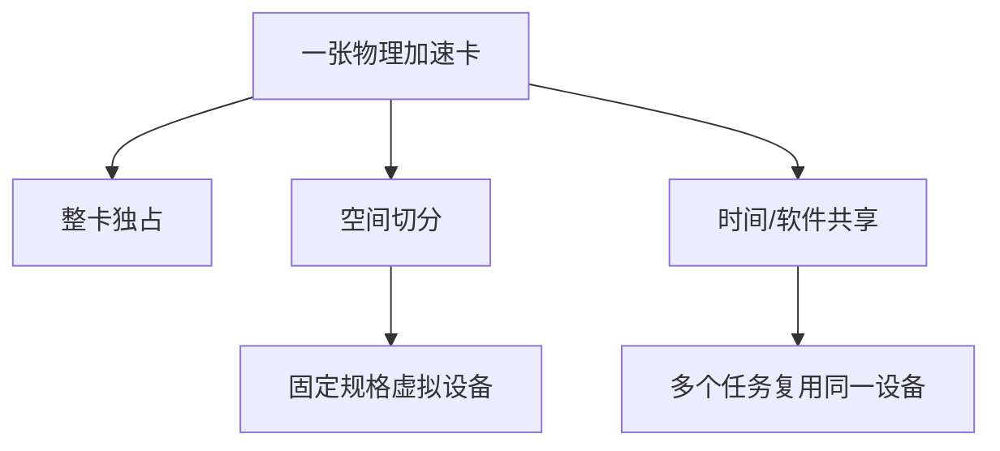

# 整卡、切分与共享——一张GPU或NPU如何分给多个工作负载

:::info 系列与定位
**系列**：《NVIDIA＋昇腾双资源池 AI 推理集群：从 0 到部署、运维与故障排查》  
**阶段**：第四阶段——统一调度  
**本文定位**：加速器分配模式、隔离能力与选型篇
:::

:::tip 系列约定
资源池 A = **NVIDIA GPU**（vLLM）· 资源池 B = **华为昇腾 NPU**（vLLM-Ascend）· 同一 Kubernetes · 共享存储/网关/监控 · **禁止**跨池组成同一分布式模型实例。
:::

默认情况下，Kubernetes Device Plugin 把一张 GPU 或 NPU 作为一个不可超卖的扩展资源分给一个 Pod。这种方式最容易理解，也最稳定，但小模型、开发测试和低负载服务可能无法充分使用整张卡。

于是会出现三个词：

- **整卡**：一个资源份额对应一张物理设备  
- **切分**：把物理设备划成多个有明确规格的虚拟设备  
- **共享**：多个工作负载在同一物理设备上复用算力  

这三者不是简单的「资源利用率从低到高」，而是性能、隔离、故障半径、监控和运维复杂度之间的取舍。

本篇不会给出适用于所有卡型的固定切分模板。设备型号、驱动、固件、GPU Operator、CANN 和 MindCluster 能力变化很快，必须根据 [第 8 篇](./08-软硬件兼容矩阵与容量规划.md) 兼容矩阵确认目标产品是否支持。

本站对照：[整卡/Time-Slicing/MIG 对比](../../gpu/cluster/sharing/07-GPU%20整卡独占、Time-Slicing、MPS%20与%20MIG%20对比.md) · [Time-Slicing 实践](../../gpu/cluster/sharing/08-Kubernetes%20GPU%20Time-Slicing%20配置实践.md) · [MIG 原理与配置](../../gpu/cluster/sharing/09-MIG%20原理与%20Kubernetes%20配置.md)。

---

## 一、先建立一张总对照表

| 厂商 | 方式 | 资源形态 | 隔离特点 | 典型场景 |
|------|------|----------|----------|----------|
| NVIDIA | 整卡 | nvidia.com/gpu | 最清晰，通常独占 | 大模型生产推理 |
| NVIDIA | MIG | 多种 MIG Profile 资源 | 有硬件级显存与故障隔离能力 | 小中型稳定服务、多租户 |
| NVIDIA | Time-Slicing | 多个共享访问份额 | 没有显存和故障隔离 | 开发、低负载、可信任务 |
| NVIDIA | MPS 等进程共享 | 多进程共享 GPU | 依赖具体实现和应用兼容性 | 专门优化的同构任务 |
| 昇腾 | 整卡 | 实际 NPU 扩展资源 | 最清晰，通常独占 | 大模型生产推理 |
| 昇腾 | 静态 vNPU | 预创建虚拟 NPU | 固定规格、显式运维 | 稳定的小型推理任务 |
| 昇腾 | 动态 vNPU | 调度时创建/回收 vNPU | 自动化更强，组件更多 | 资源需求变化的推理任务 |
| 昇腾 | 软切分 | 按 AICore/HBM 等配额共享 | 依赖 vCANN-RT 和调度组件 | 经验证的多租户小模型 |

不要只看「能不能切」。真正要比较的是：计算隔离；显存/HBM 隔离；故障隔离；性能可预测性；指标能否归属到 Pod；是否支持目标硬件和框架；切分调整是否需要停业务；运维人员能否可靠排障。

---

## 二、整卡模式为什么仍然是生产基线

```yaml
resources:
  requests:
    nvidia.com/gpu: "1"
  limits:
    nvidia.com/gpu: "1"
```

昇腾同理，但资源键使用实际 Allocatable 值。

**整卡的优点**：调度语义最简单；性能抖动较小；显存/HBM 容量容易计算；监控归属相对清楚；一个工作负载异常时影响范围较小；NCCL/HCCL、多卡拓扑更容易规划；驱动、框架和模型兼容性风险最低。

**整卡的缺点**：小模型可能浪费设备；低流量服务利用率较低；开发测试排队明显；多团队成本分摊粗糙；细粒度弹性能力有限。

**哪些任务优先使用整卡**：大模型在线推理；需要多卡 Tensor Parallel 的实例；长上下文或大 KV Cache 服务；有严格 P99 延迟 SLO 的业务；尚未完成共享模式压测的模型；跨卡、跨机通信任务；不可信或资源行为不确定的租户。

:::tip 原则
先用整卡跑稳、跑通、建立基线，再讨论切分和共享。
:::

---

## 三、切分与共享是两类完全不同的技术

**空间切分**  
把一张设备划分为多个有明确规格的虚拟设备，各份额拥有一定的计算和内存边界。典型：NVIDIA MIG；昇腾 vNPU。

**时间或软件共享**  
多个工作负载仍使用同一物理设备，通过时间复用、进程调度或软件配额共享。典型：NVIDIA Time-Slicing；CUDA MPS 等；昇腾 vCANN-RT 软切分。



空间切分通常提供更清晰的边界；共享通常提高密度，但性能和故障影响更难预测。

---

## 四、NVIDIA MIG 是什么

MIG 把支持该能力的 GPU 划分成若干 GPU Instance / Compute Instance，并向 Kubernetes 暴露对应 Profile 资源。

NVIDIA 官方说明，MIG 可把 Ampere 及后续部分支持型号划分为多个具有显存和故障隔离能力的实例；GPU Operator 可以通过 MIG Manager 管理配置。见 [GPU Operator with MIG](https://docs.nvidia.com/datacenter/cloud-native/gpu-operator/latest/gpu-operator-mig.html)。

**MIG 适合**：一个整卡可以稳定容纳多个小模型；每个模型需要明确的显存边界；希望比 Time-Slicing 更强的隔离；模型负载长期稳定；已验证推理框架支持目标 MIG 规格；能接受固定 Profile 带来的碎片。

启用 mixed 策略后，节点可能上报类似 `nvidia.com/mig-<profile>`。具体 Profile 名称必须从节点读取：

```bash
kubectl describe node <MIG_NODE> | \
  sed -n '/Capacity:/,/Allocatable:/p'

kubectl get node <MIG_NODE> -o json | \
  jq '.status.allocatable'
```

```yaml
resources:
  requests:
    nvidia.com/mig-<实际profile>: "1"
  limits:
    nvidia.com/mig-<实际profile>: "1"
```

| 策略 | 含义 | 管理特点 |
|------|------|----------|
| single | 一个节点上的 MIG 设备采用统一的暴露方式 | 业务模板简单 |
| mixed | 节点可以暴露不同 MIG Profile 资源 | 灵活，但调度和碎片更复杂 |

:::caution 修改 MIG 配置不是无损操作
配置 MIG 时 GPU 上不能有用户工作负载，某些环境还可能需要重启。
:::

正确维护流程：

```text
停止新流量 → cordon 节点 → 迁移/终止工作负载 → 确认 GPU 无进程
→ 修改 MIG 配置 → 验证资源上报 → 运行基准测试 → uncordon → 恢复流量
```

---

## 五、MIG 的碎片问题

即使多个小份额当前空闲，也不一定能直接组合成一个大份额。可能需要重构整张卡的 MIG 几何配置——这叫资源碎片。

降低碎片的方法：节点按固定 Profile 分组；不在每台节点上混合大量规格；为大规格保留专用节点；平台只开放少数标准 Profile；变更 Profile 通过维护窗口执行；统计各 Profile 的 Pending 和闲置量；模型准入时选择标准规格。

```text
accelerator.mode=mig
accelerator.partition-profile=<平台规格名>
```

---

## 六、NVIDIA Time-Slicing 是什么

Time-Slicing 让 Device Plugin 把一张 GPU 上报成多个共享访问份额，不同 Pod 中的进程在同一 GPU 上交替执行。

NVIDIA 官方明确说明：Time-Slicing 没有 MIG 提供的显存或故障隔离；申请多个共享份额不代表获得成比例的算力；DCGM Exporter 在 Time-Slicing 场景存在无法将指标关联到容器的限制。见 [Time-Slicing GPUs in Kubernetes](https://docs.nvidia.com/datacenter/cloud-native/gpu-operator/latest/gpu-sharing.html)。

```yaml
apiVersion: v1
kind: ConfigMap
metadata:
  name: time-slicing-config
  namespace: gpu-operator
data:
  shared-4: |-
    version: v1
    flags:
      migStrategy: none
    sharing:
      timeSlicing:
        renameByDefault: true
        failRequestsGreaterThanOne: true
        resources:
          - name: nvidia.com/gpu
            replicas: 4
```

`renameByDefault=true` 目的是让共享资源以不同资源名暴露，避免业务把共享份额误认为独占整卡。共享节点还应添加 `accelerator.mode=shared`。

:::caution Time-Slicing 不等于四分之一 GPU
一张 GPU 配置 4 个 replicas，不意味着每个 Pod 获得固定 25% 算力 + 固定 25% 显存。实际含义更接近：最多允许 4 个被调度的共享访问者。
:::

**适合**：开发测试；Jupyter 或短时实验；低占用工具任务；同一可信团队的小作业；对尾延迟不敏感的服务。  
**不适合**：大模型在线服务；高显存、长上下文模型；强 P99 延迟 SLO；不可信多租户；需要精确按 Pod 归属 GPU 指标的场景。

---

## 七、MPS 为什么不能简单等同于 Time-Slicing

CUDA Multi-Process Service（MPS）属于更接近进程级并发与 GPU 执行共享的能力。是否适合 Kubernetes 生产使用，要单独验证：GPU 和驱动支持；应用是否兼容；内存隔离方式；进程故障影响；MPS 控制进程生命周期；指标与计费归属；GPU Operator/Device Plugin 目标版本配置；与 MIG 组合时的限制。

本系列生产基线只把 MIG 和 Time-Slicing 作为主要教学对象。MPS 应作为专项优化。

---

## 八、昇腾 vNPU 是什么

MindCluster 文档将基于 HDK 的虚拟化分为：

- **静态虚拟化**：先创建固定大小和数量的 vNPU，再调度使用  
- **动态虚拟化**：调度时自动创建 vNPU，任务结束前完成回收  

静态方式通常需要 Ascend Docker Runtime 和 Ascend Device Plugin；动态方式还会引入 Volcano 等组件。

**静态 vNPU**：需求稳定、规格有限、希望变更可控；缺点是规格变化慢、易碎片、生命周期管理工作较多。

**动态 vNPU**：任务规格变化频繁、希望自动创建和回收；但排障链路更长：业务 YAML → Volcano → Ascend 调度组件 → Device Plugin → Runtime → 驱动/固件 → 物理 NPU。

---

## 九、昇腾软切分是什么

MindCluster 当前文档中的 vCANN-RT 软切分，会把 NPU 提供给多个容器，再通过配置的 AICore、HBM 和策略配额控制资源使用。

官方说明中通常包含：需要 Ascend Device Plugin、Volcano、Ascend Docker Runtime、Ascend Operator 和 ClusterD 等组件；只支持 Volcano 调度器；使用 AICore 比例、HBM 配额和固定/弹性/争抢策略等参数；不支持在一个任务中混用不同芯片。

| 策略 | 目标 | 风险 |
|------|------|------|
| fixed-share | 固定算力份额 | 利用率可能不高但更可预测 |
| elastic | 在边界内弹性使用 | 性能受同卡负载影响 |
| best-effort | 争抢剩余资源 | 尾延迟和吞吐最不稳定 |

不要把 best-effort 任务承诺为严格在线 SLO。

软切分上线前必须验证：目标产品明确支持；CANN/vCANN-RT 和 MindCluster 版本匹配；Volcano 调度链路稳定；每个任务的 AICore/HBM 配额生效；一个容器异常时其他容器的影响；指标能区分物理卡与虚拟份额；故障重调度和残留资源回收；节点重启后的状态一致性；vLLM-Ascend 目标版本与共享方式兼容。

---

## 十、NVIDIA 与昇腾切分能力不能一一翻译

容易犯的错误：`MIG = vNPU`、`Time-Slicing = 软切分`。

它们只能做概念层对照，不能认为实现、隔离和调度完全相同。应按支持矩阵、计算份额、显存/HBM、故障半径、资源键、调度器、监控、变更、框架、性能等维度逐项验收。

---

## 十一、不要在同一组节点随意混合所有模式

建议按模式划分节点组：

```text
NVIDIA：
  nvidia-full-pool
  nvidia-mig-pool
  nvidia-shared-pool

Ascend：
  ascend-full-pool
  ascend-vnpu-pool
  ascend-soft-share-pool
```

```text
accelerator.vendor=nvidia|ascend
resource-pool=<具体池名>
accelerator.mode=full|mig|shared|vnpu|soft-share
```

这样做的好处：工作负载不容易误用共享资源；监控和成本统计更清楚；变更某种共享模式不会影响全部节点；驱动、Device Plugin 和调度组件更容易管理；能单独设置 Quota 和优先级。

---

## 十二、如何选择：一套可执行的决策流程

1. **模型能否放进切分规格**：权重 + KV Cache + Runtime + 通信 Buffer + 安全余量 ≤ 切分实例可用显存/HBM  
2. **SLO 是否允许共享抖动**：严格 P99 时优先 整卡 > 硬件切分 > 软件/时间共享  
3. **故障边界是否可接受**：同物理卡上的工作负载仍共享设备级故障域  
4. **是否有运维能力**：无法定位共享干扰则不要用于关键生产  
5. **收益是否真实**：有效吞吐提升 − 尾延迟损失 − 故障影响 − 运维成本 − 碎片 = 实际收益  

---

## 十三、推荐场景矩阵

| 场景 | 首选 | 可选 | 不建议起点 |
|------|------|------|------------|
| 大模型在线推理 | 整卡/多卡 | 验证后的大规格切分 | Time-Slicing/争抢软切分 |
| 小模型稳定在线服务 | MIG 或 vNPU | 整卡、验证后的固定软份额 | 未隔离共享 |
| Embedding/Reranker | 切分实例 | 固定共享、整卡批处理 | 无限制多租户共享 |
| 开发测试 | Time-Slicing/软共享 | 小规格切分 | 长期占用整卡 |
| 离线评测 | 整卡低优先级或共享 | 切分实例 | 抢占高 SLO 在线服务 |
| 多卡多机推理 | 整卡 | 厂商明确支持的方案 | 跨模式拼卡 |
| 不可信多租户 | 整卡/强隔离切分 | 独立节点 | 无显存/故障隔离共享 |

---

## 十四、共享模式的容量不能只看「份额数量」

可调度份额数量、显存总量、模型同时加载数量、KV Cache 增长、CPU 与内存、PCIe/网络吞吐、共享干扰下的 SLO——真正的可用副本数是这些约束中的最小值。

不要让调度器「可以创建 8 个 Pod」的表象掩盖显存 OOM 风险。

---

## 十五、共享模式必须增加哪些监控

**物理设备层**：利用率、显存/HBM、温度功耗、ECC/XID/NPU 错误、设备复位、互联状态。  
**虚拟实例或共享层**：实例数量与规格、已分配与空闲、配额、创建回收失败、残留、配置与 Label 一致性。  
**业务层**：TTFT、TPOT、P95/P99、吞吐、排队、OOM、同卡邻居负载变化时的抖动。

当底层无法精确把 GPU 指标归属到 Time-Slicing 容器时，更要依赖应用指标和节点级关联分析。

---

## 十六、上线共享前的干扰实验

- **A 单实例基线**  
- **B 同构并发**  
- **C 异构干扰**  
- **D 故障实验**：过量显存、异常退出、高频重启、持续满载、强制终止  

通过标准必须预先定义：最大 P99 退化比例、最大错误率、最大启动时间、故障恢复时间、资源残留容忍度、运维人员可定位时间。

---

## 十七、切换模式的标准维护流程

```bash
kubectl cordon <NODE>
kubectl get pods -A -o wide --field-selector spec.nodeName=<NODE>
```

然后：从网关摘流 → 等待在途请求 → 缩容或迁移 → 确认设备无业务进程 → 备份配置 → 修改 MIG/vNPU/共享配置 → 验证驱动与 Device Plugin → 更新 Label → 最小计算和压力测试 → 恢复调度 → 小流量观察。

```bash
kubectl uncordon <NODE>
```

如果资源键、Capacity 或 Allocatable 与预期不一致，不得恢复生产流量。

---

## 十八、常见错误

1. 把 Time-Slicing 份额当成固定算力百分比  
2. 认为切分后物理卡故障不会影响其他实例  
3. 在一台节点上频繁切换整卡和 MIG  
4. 只验证 Pod 能 Running  
5. NVIDIA 和昇腾套用同一切分参数  
6. 共享模式没有显存/HBM 保护  
7. 共享节点仍标记为 `accelerator.mode=full`  

---

## 十九、选型记录模板

每次引入一种切分或共享模式，应记录：设备型号、OS/内核、驱动/固件、Operator 或 MindCluster 版本、方式、资源键、支持/禁止的模型、显存边界、计算/故障隔离、调度器、监控限制、单/多实例性能、故障实验结果、回滚步骤、责任人。

只有「官方说支持」不够，还要有本集群、本镜像、本模型的验证结果。

---

## 二十、上线验收清单

- [ ] 硬件明确支持目标模式  
- [ ] 驱动、固件、运行时和调度组件版本锁定  
- [ ] 节点按 `accelerator.mode` 分组  
- [ ] 资源键从真实 Allocatable 确认  
- [ ] 整卡与共享资源不会被业务模板混淆  
- [ ] 切分变更有 cordon、摘流和回滚流程  
- [ ] 单实例基线、同构/异构干扰、故障实验完成  
- [ ] 业务 SLO 在共享压力下仍达标  
- [ ] 指标和成本可以合理归属  
- [ ] 节点故障时有其他物理节点承接  
- [ ] 运维手册包含资源残留和 Device Plugin 排查  
- [ ] 共享配置纳入版本控制  

---

## 二十一、本篇练习

1. 查看测试节点当前扩展资源和 `accelerator.mode`  
2. 为本集群列出支持整卡、MIG/vNPU 和共享的设备型号  
3. 选择一个小模型测量独占基线  
4. 在非生产节点启用一种共享或切分模式  
5. 对比 1、2、4 个并发实例的 TTFT、TPOT 和吞吐  
6. 人为制造一个高显存任务，观察邻居影响  
7. 恢复原配置并确认资源键、Label 和业务状态  
8. 根据结果写出「允许使用」和「禁止使用」的场景表  

---

## 二十二、本篇小结

一张加速卡的利用方式可以概括为：

```text
整卡：简单、稳定、可预测
空间切分：密度与隔离的折中
时间/软件共享：密度更高，但干扰和运维风险更大
```

NVIDIA 的 MIG、Time-Slicing 与昇腾的 vNPU、软切分有相似目标，但不能直接视为等价实现。

选型顺序应当是：

```text
模型能否放下
→ SLO 是否允许
→ 隔离是否足够
→ 框架是否兼容
→ 运维是否可控
→ 收益是否经过压测证明
```

下一篇将把前三篇的调度能力组合起来，回答真正的架构问题：哪些模型放 NVIDIA 池，哪些放昇腾池；同一个模型是否要双池部署；在线、离线、开发和容灾任务应该如何分配。

---

## 参考资料

- [GPU Operator with MIG](https://docs.nvidia.com/datacenter/cloud-native/gpu-operator/latest/gpu-operator-mig.html)
- [Time-Slicing GPUs in Kubernetes](https://docs.nvidia.com/datacenter/cloud-native/gpu-operator/latest/gpu-sharing.html)
- Ascend mind-cluster：虚拟化实例特性 / 基于 HDK 的虚拟化实例 / 软切分调度（推理）——以目标版本官方文档为准

---

## 相关链接

- [专栏目录](./00-专栏目录.md)
- [第 14 篇](./14-加速器资源申请配额与优先级.md)

---

← [第 14 篇](./14-加速器资源申请配额与优先级.md) · → [第 16 篇：两个资源池如何分配模型和业务](./16-两个资源池如何分配模型和业务.md)
