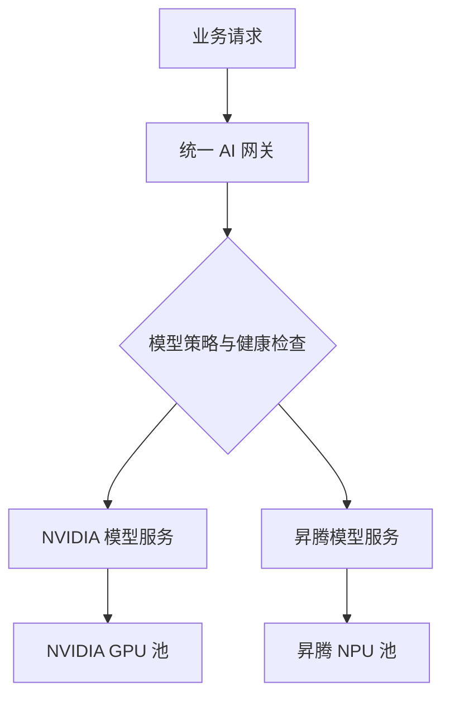
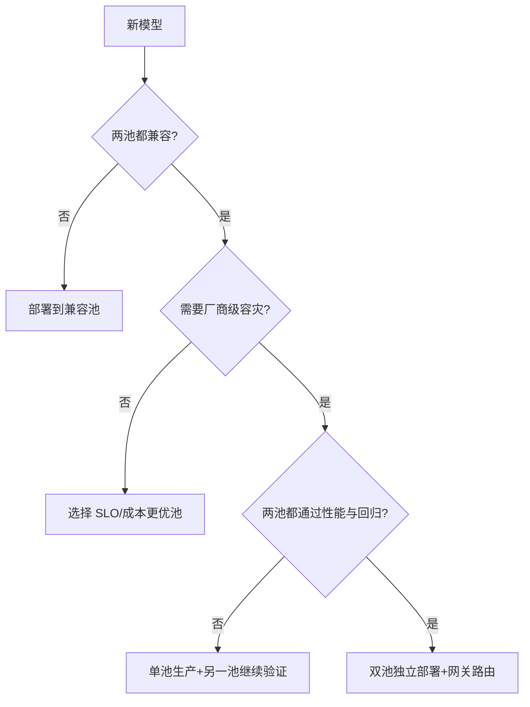

# 两个资源池如何分配模型与业务

:::info 系列与定位
**系列**：《NVIDIA＋昇腾双资源池 AI 推理集群：从 0 到部署、运维与故障排查》  
**阶段**：第四阶段——统一调度  
**本文定位**：模型放置、业务分级、双池路由与容量策略篇
:::

:::tip 系列约定
资源池 A = **NVIDIA GPU**（vLLM）· 资源池 B = **华为昇腾 NPU**（vLLM-Ascend）· 同一 Kubernetes · 共享存储/网关/监控 · **禁止**跨池组成同一分布式模型实例。
:::

到目前为止，我们已经具备：同一个 Kubernetes 集群；NVIDIA GPU 资源池；昇腾 NPU 资源池；Label、Taint 和 Affinity 隔离；ResourceQuota 和 PriorityClass；整卡、切分和共享的基础认识。

接下来不能简单地说「有空闲卡就往哪里放」。模型放置必须同时满足软件兼容、显存/HBM、性能 SLO、可用性、成本和运维能力。

本篇建立一套可执行的分配方法，让团队能够回答：哪些模型只放 NVIDIA 池；哪些模型只放昇腾池；哪些模型应该在两池各部署一套；在线、离线、开发和容灾任务如何分层；一个资源池故障后，流量怎样安全切换。

---

## 一、先明确最重要的架构原则

### 原则 1：集群统一，不代表计算实例混用

可以统一：Kubernetes 控制面；Namespace 与 RBAC；镜像仓库；模型仓库；网关与鉴权；监控日志告警；发布审批流程。

必须分开：NVIDIA 驱动/CUDA/NCCL；昇腾驱动/CANN/HCCL；推理镜像；Device Plugin；设备资源键；启动参数；性能基线；故障手册。

### 原则 2：一个分布式推理实例不能混合两种设备

一个模型实例的 Tensor Parallel 或 Pipeline Parallel 进程不能一部分使用 NVIDIA GPU、另一部分使用昇腾 NPU。

```text
同一个逻辑模型
├── NVIDIA 独立 Deployment/Service
└── 昇腾独立 Deployment/Service
```

然后由网关在「请求级」选择后端。

### 原则 3：不能把任何池默认当作另一池的无条件备份

只有模型、镜像、权重格式、Tokenizer、接口、性能和容量都经过验证时，才能配置跨池容灾。

---

## 二、双池模型服务的目标结构



网关看到的是一个逻辑模型名，例如：

```text
/v1/chat/completions
model: company-model-a
```

后端可以是：

```text
model-a-nvidia.ai-prod.svc
model-a-ascend.ai-prod.svc
```

网关不需要理解 CUDA 或 CANN，但必须知道：后端支持哪些模型能力；当前是否健康；是否有足够容量；路由权重和优先级；哪些租户允许使用哪个池；故障时是否允许切换。

---

## 三、模型进入资源池前的五道准入门槛

| 关卡 | 要点 |
|------|------|
| 软件兼容 | 框架/算子/量化/Tokenizer；镜像与驱动兼容；多卡通信栈 |
| 容量可行 | 权重+KV Cache+Runtime+通信+余量 ≤ 可用显存/HBM；卡数、上下文、并发、整卡/切分 |
| 性能达标 | TTFT、TPOT、P95/P99、吞吐、并发、错误率、稳定性 |
| 接口与结果可接受 | OpenAI 字段、流式、Tool Calling、结构化输出、业务回归集 |
| 运维可控 | 健康检查、日志指标、扩缩容、SOP、回滚、限流、责任人 |

五关全部通过后，模型才能成为正式池内能力。

---

## 四、建立模型兼容性登记表

| 字段 | 示例说明 |
|------|----------|
| 逻辑模型名 | 网关对外使用的稳定名称 |
| 模型来源与版本 | 仓库、Commit、发布日期 |
| 权重摘要 | 防止两池使用不同内容 |
| NVIDIA / 昇腾镜像 | 各自镜像摘要 |
| NVIDIA / 昇腾状态 | 未验证/测试通过/生产 |
| 精度/量化 | BF16、FP16、INT8 等 |
| 每实例设备数 | GPU 与 NPU 分别记录 |
| 上下文长度 | 实际验收值 |
| 性能基线 | 两池分别记录 |
| API 差异 | 流式、Tool Calling 等 |
| 路由策略 | 主池、权重、容灾 |
| 回归集版本 / Owner | 业务正确性依据与责任人 |

状态建议：`discovered` → `compatible` → `benchmark` → `staging` → `production` / `fallback` / `blocked`。

---

## 五、不要直接比较「卡快不快」

比较 NVIDIA 与昇腾时，要比较完整服务栈：

```text
硬件 + 驱动/固件 + CUDA 或 CANN + 推理框架
+ 模型精度/量化 + 启动参数 + 网络与存储 + 请求负载
= 最终服务表现
```

不公平的比较包括：不同量化、不同上下文、不同缓存开关、不同 Token 分布/并发、一边整卡一边共享、冷热启动混比、只看平均吞吐不看 P99。

---

## 六、统一的双池压测方法

固定输入条件：模型版本、Tokenizer、精度、Token 分布、并发阶梯、时长、冷/热启动分别测。

至少跑五类负载：短入短出、长入短出、短入长出、长入长出、真实业务回放。

记录同一套指标：QPS、Token/s、TTFT/TPOT 分位、端到端时延、错误率、显存/HBM、利用率、CPU/内存/网络、功耗。

---

## 七、把压测结果换算成副本数

假设单个副本在满足 SLO 时可持续 `C = 20 requests/s`，保留 25% 余量：

```text
C_usable = C × 0.75 = 15 requests/s
峰值 60 → N_capacity = ceil(60 / 15) = 4
容忍一副本故障 → N_final = 5
```

正式规划还要检查 Token 吞吐、最大并发、显存/HBM、单节点设备数、故障域、滚动发布并存、节点维护、冷启动。最终副本数取所有约束中的最大需求。

---

## 八、常见业务类型如何分配

| 业务类型 | 推荐资源模式 | 放置思路 |
|----------|--------------|----------|
| 核心在线大模型 | 整卡、多卡 | 选择最稳定且 SLO 达标的主池 |
| 普通在线小模型 | 整卡或强隔离切分 | 根据成本和 P99 决定 |
| Embedding/Reranker | 切分、小卡或批处理 | 重视吞吐与单位成本 |
| 离线评测 | 低优先级整卡/共享 | 可排队、可被抢占 |
| 批量生成 | 低峰时段的低优先级池 | 重视 Token 吞吐和成本 |
| 开发测试 | 共享池 | 限制运行时长与额度 |
| 紧急容灾 | 预热的另一资源池 | 必须提前完成兼容和容量验证 |

---

## 九、选择单池部署还是双池部署

**只部署在一个池**：另一池不支持；业务规模小；双套维护成本过高；同池节点级容灾已够；结果一致性要求高但双池未完成回归。

**两池都部署**：核心模型要求厂商级容灾；两池都完成兼容与性能验证；有足够容量；网关具备健康检查与路由；团队能维护两套镜像与 SOP。

:::caution
如果备用池从未压测、没有容量、启动要一小时，它并不是真正的容灾能力。
:::

---

## 十、四种常用路由模式

| 模式 | 说明 |
|------|------|
| A 固定主池 | 100% 某一池，最简单 |
| B 主备 | 主池 100%，备用热/温备，故障后切换新请求 |
| C 权重分流 | 如 NVIDIA 70% / Ascend 30%，持续验证备用池 |
| D 能力路由 | 按上下文、量化、成本等能力分流 |

---

## 十一、跨池切换只能安全处理「新请求」

流式生成请求的 KV Cache 与 Decode 状态位于当前实例。实例中途故障时，通常不能把正在生成的请求无缝迁移到另一池继续 Decode。

「跨池容灾」通常意味着：**快速恢复新请求能力**，而不是所有在途 Token 无损迁移。

---

## 十二、什么条件下允许自动故障切换

备用池 Ready；模型版本与权重摘要符合策略；API 兼容；业务回归通过；剩余容量达标；延迟吞吐满足降级 SLO；网关健康检查不是只测 TCP；有切换/回切防抖；告警通知值班；完成过故障演练。

若备用池只完成「Pod Running」，应配置为人工切换。

---

## 十三、健康检查要分四层

| 层级 | 检查内容 | 能发现什么 |
|------|----------|------------|
| 进程层 | 端口和进程存活 | 容器崩溃 |
| 模型层 | 模型已加载、服务 Ready | 权重加载失败 |
| 推理层 | 最小真实推理请求 | 算子、设备和运行时异常 |
| 业务层 | 真实业务合成请求 | 网关、模板、知识库等链路异常 |

网关路由至少依据模型层健康；核心业务应增加推理层或合成监控。高频真实生成健康检查会消耗设备资源，需设置专用小请求、超时和频率。

---

## 十四、双池结果一致性怎么理解

跨池回归应分层：协议一致性、功能一致性、质量一致性、性能一致性（不要求数值相同，但必须分别满足约定 SLO）。

---

## 十五、权重「共享」不代表文件一定完全相同

```text
models/company-model-a/
├── source/
├── tokenizer/
├── nvidia/
│   ├── weights-or-links/
│   └── manifest.json
├── ascend/
│   ├── weights-or-links/
│   └── manifest.json
└── validation/
    ├── compatibility.yaml
    └── regression-report.md
```

每个 Manifest 至少记录：源模型摘要、转换工具和版本、目标精度、生成时间、适用镜像、校验和、回归结果。第 17～20 篇会详细讲模型存储。

---

## 十六、在线和离线任务如何共用资源池

优先级：核心在线 > 普通在线 > 计划内批处理 > 开发测试。

实用布局：

```text
每个厂商资源池
├── online-full：在线整卡节点
├── online-partition：验证后的切分节点
├── batch：离线整卡/可抢占节点
└── dev-shared：开发共享节点
```

用 `resource-pool`、`accelerator.mode`、`environment`、PriorityClass、ResourceQuota 约束。不要让开发测试通过添加一个 Toleration 就进入核心在线节点。

---

## 十七、容量保留的三种方式

| 方式 | 说明 |
|------|------|
| 常驻备用副本 | 切换快，成本最高 |
| 保留空闲设备，模型温备 | 平衡成本与速度，仍有启动时间 |
| 离线任务占用，可被抢占 | 利用率高，恢复有延迟 |

核心业务通常组合：少量热备 + 部分空闲/温备 + 可抢占批任务。

---

## 十八、冷启动时间必须进入容灾计算

```text
故障检测 + 网关摘除 + Pod 调度 + 镜像拉取 + 权重读取
+ 模型初始化 + 图编译/缓存准备 + 健康检查 + 流量预热
= 实际恢复时间
```

容量策略必须与后续模型存储方案一起设计：镜像预拉取、权重本地缓存、存储吞吐、对象存储并行下载、节点 NVMe、分批预热、启动探针时间。

---

## 十九、模型放置决策树



---

## 二十、一个可落地的放置策略表

| 模型 | 主池 | 备池 | 模式 | 主池副本思路 | 备池 | 路由 | 备注 |
|------|------|------|------|--------------|------|------|------|
| 核心对话模型 | NVIDIA | 昇腾 | 整卡 | 按压测 | 按压测 | 80/20 | 两池已完成回归 |
| 内部问答模型 | 昇腾 | NVIDIA | 整卡 | 按压测 | 降级容量 | 主备 | 备池降级上下文 |
| Embedding | 昇腾 | 无 | vNPU | 按压测 | 0 | 固定 | 低时延压测通过 |
| 离线评测 | NVIDIA | 昇腾 | 低优先级整卡 | 按队列 | 按队列 | 调度队列 | 可抢占 |
| 开发模型 | 两池 | 无 | 共享 | 按 Quota | 按 Quota | 手工选择 | 禁止生产流量 |

---

## 二十一、用配置表达路由意图

平台内部策略示意（不是通用 CRD）：

```yaml
logicalModel: company-model-a
backends:
  - name: model-a-nvidia
    service: model-a-nvidia.ai-prod.svc
    vendor: nvidia
    weight: 70
    state: production
  - name: model-a-ascend
    service: model-a-ascend.ai-prod.svc
    vendor: ascend
    weight: 30
    state: production
failover:
  enabled: true
  newRequestsOnly: true
  requireHealthyCapacity: true
```

把策略版本化。第 26、28 篇会落到 Higress/Nginx 和双池容灾实现。

---

## 二十二、故障时的流量处理顺序

**单个 Pod 故障**：Readiness 失败 → Service 摘除 → 同池其他副本 → 重建。  
**单个节点故障**：告警 → 同池其他节点承接 → Pod 重建。  
**整个资源池异常**：确认不是网关/存储故障 → 停向故障池发新请求 → 检查备用容量 → 分级切换关键模型 → 非关键限流 → 观察 SLO。  
**公共层故障**：统一网关、共享存储、网络核心、K8s 控制面、镜像仓/DNS——切到另一算力池可能仍失败，需单独分析公共依赖。

---

## 二十三、回切比切换更容易出事故

主池恢复后：确认根因消除 → 最小推理 → 合成监控 → 检查版本与容量 → 先回切 1%～5% → 观察错误率与延迟 → 阶梯提高权重 → 保持备用池观察期 → 复盘。必须配置防抖和最短稳定时间。

---

## 二十四、常见错误

1. 哪个池空闲就自动迁移模型  
2. 认为同名模型两池输出一定完全相同  
3. 把同一个多卡实例跨两池拼接  
4. 备用池只有 Deployment YAML，没有常态验证  
5. 只看平均利用率进行成本比较  
6. 网关健康检查只测端口  
7. 主池恢复后瞬间全量回切  
8. 忽略共享存储和网关的共同故障  

---

## 二十五～二十六、准入评审与统一调度验收

准入评审至少覆盖：基本信息、两池兼容与性能、路由与降级、运维与演练。

验收：资源池标签/污点/容量；模型兼容登记与回归；在线离线开发分层；网关逻辑模型名、健康检查、切换回切与演练。

---

## 二十七、本篇练习

1. 填写一个模型的兼容性登记表  
2. 两池跑相同真实业务回放并对比指标  
3. 判断单池 / 主备 / 权重分流  
4. 计算峰值与单副本故障所需副本数  
5. 为在线、离线、开发填写资源模式与 PriorityClass  
6. 模拟主池不可用与阶梯回切  
7. 单独列出公共依赖故障  

---

## 二十八、本篇小结

双资源池模型分配不是「把一半模型放 GPU、一半放 NPU」，而是一套准入、压测、容量、路由和运维体系。

```text
兼容性验证
→ 显存/HBM 与拓扑可行
→ 同条件性能压测
→ API 和业务质量回归
→ 选择单池/主备/权重路由
→ 计算副本与故障余量
→ 上线监控
→ 定期演练
```

还要始终记住：同一个逻辑模型可以有 NVIDIA 版和昇腾版两个独立服务，但一个推理实例内部不能混合两种设备。

至此，**第四阶段「统一调度」完成**。下一阶段将进入模型存储：权重到底放在 NFS、CephFS、对象存储还是节点本地盘，以及双池如何分发、缓存和预热模型。

---

## 参考资料

- [Assigning Pods to Nodes](https://kubernetes.io/docs/concepts/scheduling-eviction/assign-pod-node/)
- [Resource Management for Pods and Containers](https://kubernetes.io/docs/concepts/configuration/manage-resources-containers/)
- [Resource Quotas](https://kubernetes.io/docs/concepts/policy/resource-quotas/)
- [Pod Priority and Preemption](https://kubernetes.io/docs/concepts/scheduling-eviction/pod-priority-preemption/)
- [Time-Slicing GPUs in Kubernetes](https://docs.nvidia.com/datacenter/cloud-native/gpu-operator/latest/gpu-sharing.html)

---

## 相关链接

- [专栏目录](./00-专栏目录.md)
- [第 13～15 篇](./13-使用Label-Taint与Affinity隔离两个资源池.md)

---

← [第 15 篇](./15-整卡设备切分和共享调度.md) · → [第 17 篇：模型文件到底存在哪里](./17-模型文件到底存在哪里.md)
